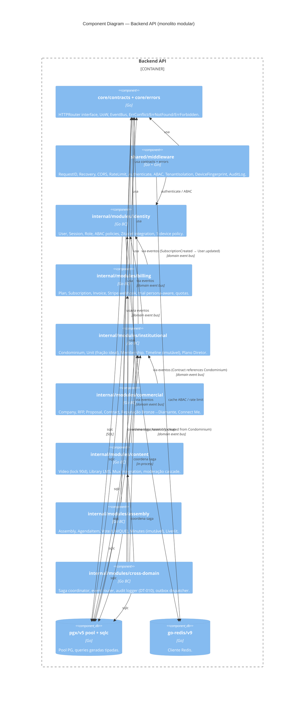

# C4 Nível 3 — Componentes por Bounded Context

Nível 3 do C4 detalha, por bounded context (BC), os componentes internos seguindo Clean Architecture: `domain → application → infrastructure`.

> Camadas canônicas em [[clean-arch-mapping]]. Padrões aplicados em [[patterns]]. Nível 2 em [[c4-containers]].

**Convenção de nomes**: arquivos `kebab-case.go`; componentes/packages EN; comentários PT-BR com `// EN: / // PT:` quando API pública.

---

## 1. Estrutura canônica de um BC (template)

```
internal/modules/<bc>/
├── domain/                      — núcleo sem framework
│   ├── aggregates/<aggr>.go     — entidade raiz + estado privado + invariantes
│   ├── valueobjects/<vo>.go     — VOs imutáveis (Money, CPF, FracaoIdeal, ...)
│   ├── events/<event>.go        — domain events (payload + metadata canônico)
│   ├── services/<svc>.go        — domain services (lógica cross-entity)
│   ├── specifications/<spec>.go — specifications pra queries complexas
│   ├── errors.go                — erros de domínio (ErrInvariantViolation, ...)
│   └── repositories.go          — interfaces de repositório (não impl)
├── application/                 — casos de uso
│   ├── commands/<act>_command.go  — command + handler (CQRS write)
│   ├── queries/<name>_query.go    — query + handler (CQRS read)
│   ├── dto/<name>_dto.go          — DTOs de entrada/saída
│   ├── ports/<port>.go            — interfaces para infra (IPaymentGateway etc)
│   └── sagas/<saga>_saga.go       — sagas inter-BC ou com provider externo
└── infrastructure/
    ├── database/
    │   ├── queries/<name>.sql     — sqlc queries tipadas
    │   ├── repositories/<aggr>_repo.go — impl repositories.go do domain
    │   └── mappers/<aggr>_mapper.go    — row ↔ entity
    ├── http/
    │   ├── handlers/<ep>_handler.go    — controllers REST
    │   ├── middleware/                  — middlewares específicos do BC
    │   ├── routes.go                    — wiring de rotas
    │   └── dtos/                        — request/response DTOs HTTP
    ├── providers/<provider>/            — Stripe/Mux/Livekit/Zitadel SDK isolado
    │   ├── <provider>_client.go
    │   └── <provider>_adapter.go        — implementa application/ports
    ├── jobs/<job>_job.go                — cron jobs / consumers NATS
    └── module.go                        — wire-up (DI do BC)
```

**Regra de dependência Clean Arch**:

```
http/  providers/  database/          (infrastructure)
           │
           ▼ implementa ports
        application/                  (use cases)
           │
           ▼ usa
        domain/                       (núcleo — zero import de framework)
```

Detalhes em [[clean-arch-mapping]].

---

## 2. Diagrama C4 — Componentes (API container)



---

## 3. BC-by-BC — componentes internos

### 3.1 `identity` — autenticação + sessão + ABAC

**Domain**:
- Aggregates: `User`, `Session`, `Device`, `Role`.
- VOs: `CPF`, `CNPJ`, `Email`, `DeviceFingerprint`, `MFAFactor`.
- Events: `UserRegistered`, `UserLoggedIn`, `SessionCreated`, `DeviceTrustChanged`, `RoleAssigned`.
- Services: `ABACPolicyEvaluator` (admin_bypass → role → action → tenant → scope), `TrustInferrer`.
- Errors: `ErrInvalidCredentials`, `ErrDeviceBlocked`, `ErrMFARequired`, `ErrStepUpRequired`.

**Application**:
- Commands: `RegisterUser`, `LoginUser`, `LogoutUser`, `InvalidateOtherDevices`, `AssignRole`, `StartStepUp`, `CompleteMFA`.
- Queries: `GetSession`, `ListDevices`, `ListRoles`, `EvaluateABAC` (cacheada 5min).
- Ports: `IOIDCProvider` (Zitadel), `IMFAProvider` (TOTP/WebAuthn).
- Sagas: —

**Infrastructure**:
- `providers/zitadel/` — OIDC client, introspect, actions webhook.
- `database/queries/` — `users.sql`, `sessions.sql`, `devices.sql`, `roles.sql`.
- `http/handlers/` — `POST /auth/register`, `/login`, `/logout`, `/me`, `/sessions`, `/devices`.
- `jobs/` — `session_cleanup_job.go` (expiradas), `device_trust_recompute_job.go`.

**Cross-BC**: publish `UserRegistered` (consumido por billing para criar trial).

### 3.2 `billing` — plano + subscription + trial + quota

**Domain**:
- Aggregates: `Plan`, `Subscription`, `Invoice`, `QuotaLedger`.
- VOs: `Money` (int64 centavos BRL), `BillingPeriod`, `TrialDays` (15/7/30 persona-aware), `Persona`.
- Events: `SubscriptionCreated`, `SubscriptionCanceled`, `InvoicePaid`, `QuotaConsumed`, `TrialExpired`.
- Services: `TrialCalculator`, `QuotaEnforcer`.
- Errors: `ErrQuotaExceeded`, `ErrTrialAlreadyUsed`, `ErrPlanNotFound`.

**Application**:
- Commands: `SubscribePlan`, `CancelSubscription`, `ProcessStripeWebhook`, `ConsumeQuota` (idempotente).
- Queries: `GetSubscription`, `ListInvoices`, `GetQuotaStatus`.
- Ports: `IPaymentGateway` (Stripe).

**Infrastructure**:
- `providers/stripe/` — client + webhook handler HMAC.
- `database/queries/` — `subscriptions.sql`, `invoices.sql`, `quota_ledger.sql`.
- `http/handlers/` — `POST /billing/subscribe`, `POST /webhook/stripe`.
- `jobs/` — `stripe_reconciliation_job.go` (diário), `trial_expiry_check_job.go`.

### 3.3 `institutional` — condomínio + governança

**Domain**:
- Aggregates: `Condominium`, `Unit`, `Membership`, `TimelineEntry`, `Announcement`, `PlanoDiretor`, `Poll`.
- VOs: `FracaoIdeal` (DECIMAL 4 casas; Σ ≤ 100%), `CondominiumType` (vertical/horizontal/misto), `MembershipRole` (síndico/subsíndico/conselho/morador).
- Events: `CondominiumCreated`, `UnitRegistered`, `MembershipActivated`, `TimelineEntryAdded` (nunca `Updated`), `AnnouncementPublished`.
- Services: `FracaoIdealValidator` (PBT), `MembershipUniquenessEnforcer`.
- Errors: `ErrFracaoIdealOverflow`, `ErrDuplicateMembership`, `ErrTimelineImmutable`.

**Application**:
- Commands: `CreateCondominium`, `RegisterUnit`, `ActivateMembership`, `AddTimelineEntry`, `PublishAnnouncement`, `CreatePlanoDiretor`.
- Queries: `GetCondominium`, `ListUnits`, `GetTimeline`, `ListAnnouncements`.

**Infrastructure**:
- `database/queries/` — inclui `timeline_entries.sql` INSERT-only.
- `http/handlers/` — `/api/v1/condominiums`, `/units`, `/timeline`, `/announcements`.
- `jobs/` — `opensearch_timeline_indexer_job.go`.

**Cross-BC**: publish `CondominiumCreated` (consumido por commercial, assembly, content).

### 3.4 `commercial` — Connect Me + reputação + contratos

**Domain**:
- Aggregates: `Company`, `RFP`, `Proposal`, `Contract`, `Milestone`, `Review`, `ReputationScore`.
- VOs: `CNPJ` (validado Receita), `ServiceCategory`, `ReputationTier` (Bronze/Prata/Ouro/Platina/Diamante), `QuotaRFPAnual`.
- Events: `CompanyVerified`, `RFPPublished`, `ProposalSubmitted`, `ContractSigned`, `MilestoneCompleted`, `ReviewSubmitted`, `ReputationRecomputed`.
- Services: `ReputationCalculator` (determinístico, função de métricas), `AntiFraudDetector` (device fingerprint + IP velocity — herança [[13-research/linkedin/_destilado]] §4), `ConnectMeRanker` (retrieval ≠ ranking).
- Specifications: `NearbyCompaniesInCategorySpec`, `TopReputationSpec`.
- Errors: `ErrQuotaRFPExceeded`, `ErrCompanyNotVerified`, `ErrSelfReview`.

**Application**:
- Commands: `RegisterCompany`, `VerifyCompany`, `OpenRFP`, `SubmitProposal`, `AcceptProposal`, `CompleteMilestone`, `SubmitReview`, `RecomputeReputation`.
- Queries: `SearchCompanies` (retrieval OS → re-rank determinístico), `GetReputation`, `ListRFPs`, `ListProposals`.
- Sagas: `ContractSaga` (RFP → Proposal → Contract → Milestones → Reviews; compensação em cada passo).

**Infrastructure**:
- `providers/receita/` — validação CNPJ (⚠️ PENDÊNCIA: provider real a definir).
- `database/queries/` — `companies.sql`, `rfps.sql`, `proposals.sql`, `reviews.sql`, `reputation_snapshots.sql`.
- `http/handlers/` — `/api/v1/marketplace/*`, `/companies/*`, `/rfps/*`.
- `jobs/` — `reputation_recompute_job.go` (diário), `opensearch_companies_indexer_job.go`.

### 3.5 `content` — vídeos + LMS + moderação

**Domain**:
- Aggregates: `Video` (lock 90d), `PlaybackSession`, `ModerationDecision`, `LibraryItem` (LMS), `Course`.
- VOs: `VideoStatus` (uploading/transcoding/pending_moderation/published/removed), `LockPeriod` (90d desde publish), `ModerationTier` (auto_ok/manual_review/auto_block).
- Events: `VideoUploaded`, `VideoTranscoded`, `VideoModerated`, `VideoPublished`, `VideoLockExpired`, `PlaybackStarted`.
- Services: `ModerationCascadeOrchestrator` (heurística → LLM → humano; [[13-research/tiktok/_destilado]] §3), `SignedPlaybackIssuer`.
- Errors: `ErrVideoLocked`, `ErrModerationPending`, `ErrPlaybackDenied`.

**Application**:
- Commands: `CreateDirectUpload`, `ProcessMuxWebhook`, `TriggerModeration`, `ApproveModeration`, `RejectModeration`, `IssuePlaybackURL`.
- Queries: `GetVideo`, `ListVideos`, `GetLibraryItem`, `ListCourses`.
- Ports: `IVideoProvider` (Mux), `IModerationProvider` (OpenAI Moderation + AWS Rekognition Video).
- Sagas: `VideoPublishSaga` (upload → transcode → moderação → publish; compensação apaga asset Mux).

**Infrastructure**:
- `providers/mux/` — client + webhook handler.
- `providers/openai-moderation/`, `providers/aws-rekognition/` (M2+).
- `database/queries/` — `videos.sql`, `moderation_decisions.sql`.
- `http/handlers/` — `/api/v1/videos/*`, `/webhook/mux`.

### 3.6 `assembly` — assembleia live + votação + ata

**Domain**:
- Aggregates: `Assembly`, `AgendaItem`, `Vote`, `Minutes` (imutável pós-publish), `SpeakingQueue`.
- VOs: `Quorum` (fracional; voto por fração ideal, Σ ≤ 100%), `AssemblyType` (ordinária/extraordinária), `VoteOption` (sim/não/abstenção/voto-em-branco).
- Events: `AssemblyScheduled`, `AssemblyStarted`, `VoteCast`, `AgendaItemClosed`, `AssemblyEnded`, `MinutesPublished`.
- Services: `QuorumCalculator` (soma fração ideal dos votantes ativos), `VoteUniquenessEnforcer` (UNIQUE (agenda_item_id, voter_id)).
- Errors: `ErrAssemblyNotStarted`, `ErrVoteDuplicate`, `ErrMinutesImmutable`, `ErrQuorumNotReached`.

**Application**:
- Commands: `ScheduleAssembly`, `StartAssembly`, `CastVote`, `CloseAgendaItem`, `EndAssembly`, `PublishMinutes`, `RequestSpeakingSlot`, `GrantPublishPermission`.
- Queries: `GetAssembly`, `GetQuorumLive`, `ListAgendaItems`, `GetMinutes`.
- Ports: `ILiveSFUProvider` (LiveKit), `IEgressProvider` (LiveKit Egress).
- Sagas: `AssemblySaga` (create room → broadcast JWT → record via Egress → upload MP4 S3 → gerar ata PDF → publicar timeline entry; compensação libera room + marca failed).

**Infrastructure**:
- `providers/livekit/` — Room create, JWT, Egress webhooks.
- `database/queries/` — `assemblies.sql`, `votes.sql` (UNIQUE constraint), `minutes.sql`.
- `http/handlers/` — `/api/v1/assemblies/*`, `/webhook/livekit`.
- `ws/` — `/ws/assemblies/:id/live` broadcast quórum em tempo real.

### 3.7 `cross-domain` — coordenação inter-BC

**Responsabilidade**: orquestração de sagas que cruzam 2+ BCs, roteamento de domain events, audit logger (DT-010), outbox dispatcher.

**Componentes**:
- `saga/` — `ContractFullSaga` (RFP + Video institucional + Assembly de aprovação), `TrialExpirySaga` (billing + identity + content).
- `eventbus/` — in-process publisher+subscriber (M1); NATS JetStream adapter (M2+).
- `outbox/` — poller que lê `outbox_events` pg e dispara efeitos (email, push, webhook out, OpenSearch, NATS).
- `audit/` — `IAuditLogger` grava em `lgpd_logs` append-only 5 anos.

---

## 4. Dependências permitidas e proibidas

| Camada origem | Pode importar | NÃO pode importar |
|---|---|---|
| `domain/` | stdlib, `pkg/`, `core/errors`, outros `domain/` do mesmo BC | framework (gin, pgx), SDK externo (stripe, mux), `application/`, `infrastructure/` |
| `application/` | `domain/` do mesmo BC, `core/contracts`, `application/ports`, `pkg/` | `infrastructure/`, domain de outro BC (comunicar via eventos) |
| `infrastructure/database/` | `domain/` do mesmo BC, `application/` do mesmo BC, pgx, sqlc-gen | domain de outro BC |
| `infrastructure/providers/` | `application/ports`, SDK externo | domain de nenhum BC |
| `infrastructure/http/` | `application/` (para invocar handlers), gin, dto próprio | domain direto (exceto VOs de identificação) |

Violações detectadas via `go-arch-lint` no CI ([[adr/0001-clean-architecture-ddd-cqrs]]).

---

## 5. ⚠️ Pendências

- **Receita Federal provider** para validação de CNPJ em Connect Me — fornecedor a decidir (Serpro, parceiro público, proxy via cartório digital). Registrar A-### quando definir.
- **Moderation provider stack** — AWS Rekognition Video ($0.10/min) confirmado para M2; OpenAI Moderation para transcript; custom classifier só M3+.
- **Admin Panel** — componentes dedicados só em M3+; até lá admin usa CLI + rotas `/admin/v1/*` protegidas via step-up MFA.

---

## 6. Vizinhos

- [[c4-context]] — Nível 1
- [[c4-containers]] — Nível 2
- [[clean-arch-mapping]] — regras de dependência detalhadas
- [[patterns]] — DDD, CQRS, Saga, Repository, Strategy
- [[event-driven]] — eventos de domínio + NATS
- [[topology-multitenant]] — tenant_id em todo aggregate
- [[adr/_moc]]
