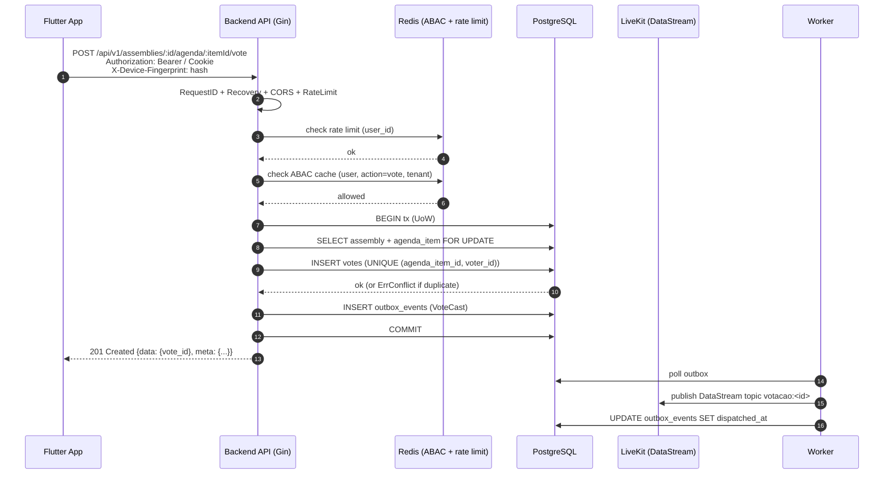

# C4 Nível 2 — Containers do Master Síndico

Nível 2 do C4: aplicações e datastores que compõem o sistema, tecnologia de cada um, protocolos de comunicação. Arquitetura **monolito modular Go** em M1 (decisão [[adr/0001-clean-architecture-ddd-cqrs]] + [[adr/0017-railway-initial-aws-m4]]).

> Nível 1 em [[c4-context]]. Nível 3 por módulo em [[c4-components]]. Princípio herdado: monolito-first, extrair só sob gatilho — [[13-research/netflix/_destilado]] §1 e [[13-research/instagram/_destilado]] §9.

---

## 1. Diagrama C4 — Containers

```mermaid
C4Container
  title Container Diagram — Master Síndico (M1/M2)

  Person(sindico, "Síndico / Morador / Empresa / Parceiro / Agência / Admin", "Usuários tipados por persona")

  System_Boundary(ms, "Master Síndico") {
    Container(web, "Web Portal", "SolidJS + TS + Rsbuild + UnoCSS + Kobalte + TanStack Router + Bun (D-119)", "Portal multi-app: auth + cms + lms + forum + assembly + lp. Bun workspaces, 6 apps + 2 packages.")
    Container(mobile, "Mobile App", "Flutter + Dart", "App morador/síndico iOS + Android. Votação em assembleia, vídeo-currículo, push.")
    Container(admin, "Admin Panel (M3+)", "SolidJS", "Moderação, suporte, auditoria reputação. Hoje ausente — CLI interna.")

    Container(api, "Backend API", "Go 1.26 + Gin abstraído (contracts.HTTPRouter) + pgx/v5 + sqlc + zerolog", "Monolito modular. 7 BCs: identity, billing, institutional, commercial, content, assembly, cross-domain. Expõe REST /api/v1, WebSocket /ws, Webhooks /webhook/*.")
    Container(worker, "Backend Worker", "Go 1.26 + robfig/cron + NATS consumer", "Consumer NATS JetStream (quando 3x3), outbox poller, crons (reindex OS, cleanup LGPD, recompute reputação, webhook Mux processing).")

    ContainerDb(pg, "PostgreSQL 18", "Managed (Railway → RDS M4+)", "Fonte de verdade. Row-based multi-tenant (tenant_id em PK composto). Outbox, timeline append-only, sessões, ABAC cache snapshot.")
    ContainerDb(redis, "Redis 7", "Managed", "ABAC cache 5min, rate limit token bucket, session lookup, hot ranking Connect Me.")
    ContainerDb(search, "Search Provider", "OpenSearch ou Meilisearch (D-120 — adapter inicial Sprint 10)", "Busca full-text real desde M1: Connect Me, Vizinhança, Banco Talentos, atas, condomínios. PG tsvector descartado.")
    ContainerQueue(nats, "NATS JetStream", "Self-host container", "Event bus inter-BC quando ≥ 3 produtores × 3 consumidores. Outbox pg precede.")
  }

  System_Ext(zitadel, "Zitadel", "OIDC IdP")
  System_Ext(stripe, "Stripe", "Billing + webhooks")
  System_Ext(mux, "Mux", "Video as a service")
  System_Ext(livekit, "LiveKit Cloud", "SFU WebRTC")
  System_Ext(twilio, "Twilio", "SMS")
  System_Ext(sesResend, "SES / Resend", "Email")
  System_Ext(fcm, "FCM", "Push")
  System_Ext(s3, "AWS S3 + CloudFront", "Object storage + CDN assets")
  System_Ext(obs, "Grafana Cloud + Sentry", "Observability")

  Rel(sindico, web, "HTTPS", "TLS 1.3")
  Rel(sindico, mobile, "HTTPS", "TLS 1.3")

  Rel(web, api, "REST /api/v1 + WebSocket /ws", "HTTPS + WSS")
  Rel(mobile, api, "REST /api/v1 + WebSocket /ws", "HTTPS + WSS")
  Rel(admin, api, "REST /admin/v1", "HTTPS")

  Rel(api, pg, "SQL via pgx/v5 + sqlc", "TLS")
  Rel(api, redis, "RESP3", "TLS")
  Rel(api, os, "REST", "HTTPS")
  Rel(api, nats, "Publish (via outbox)", "NATS TLS")

  Rel(worker, pg, "SQL via pgx", "TLS")
  Rel(worker, redis, "RESP3", "TLS")
  Rel(worker, os, "Bulk index", "HTTPS")
  Rel(worker, nats, "Consume", "NATS TLS")

  Rel(api, zitadel, "Authorization Code + PKCE + introspect", "HTTPS")
  Rel(api, stripe, "Charges + Subscriptions", "HTTPS")
  Rel(api, mux, "Direct Upload + signed URLs", "HTTPS")
  Rel(api, livekit, "Room create + JWT + Egress", "HTTPS")
  Rel(api, twilio, "SMS send", "HTTPS")
  Rel(api, sesResend, "Email send", "HTTPS")
  Rel(api, fcm, "Push send", "HTTPS")
  Rel(api, s3, "PUT/GET", "HTTPS")

  Rel(stripe, api, "Webhook POST (HMAC)", "HTTPS inbound /webhook/stripe")
  Rel(mux, api, "Webhook POST (HMAC)", "HTTPS inbound /webhook/mux")
  Rel(livekit, api, "Egress webhook (HMAC)", "HTTPS inbound /webhook/livekit")
  Rel(zitadel, api, "Actions webhook", "HTTPS inbound /webhook/zitadel")

  Rel(api, obs, "OTLP gRPC + Sentry SDK", "HTTPS")
  Rel(worker, obs, "OTLP gRPC + Sentry SDK", "HTTPS")

  UpdateLayoutConfig($c4ShapeInRow="3", $c4BoundaryInRow="1")
```

---

## 2. Containers — detalhamento

### 2.1 Web Portal (`web`)

- **Tech**: **SolidJS 1.9 + TypeScript 5 strict + Rsbuild (Rspack) + UnoCSS (presetWind4 + presetKobalte) + Kobalte primitives + TanStack Router/Query/Form + Axios + Zod + Biome + Bun 1.3 workspaces** (D-119).
- **Workspace**: 6 apps (auth · cms · lms · forum · assembly · lp) + 2 packages (ui · schemas).
- **Deploy**: Cloudflare Pages (D-117) — `app.mastersindico.com.br` por app.
- **Responsabilidades**:
  - Portal síndico (dashboard, assembleias, plano diretor, Connect Me RFP, reputação).
  - Back-office interno (M1 limitado; M3+ vira admin panel dedicado).
  - Área morador (timeline, votação, vídeo-currículo, convênios Vizinhança).
  - Fluxo cadastro empresa (Connect Me verificado).
- **Auth**: cookie httpOnly `.mastersindico.com.br` via Zitadel Authorization Code + PKCE.
- **I18n**: PT-BR only M1; EN opcional M3+.
- **Observability**: Sentry Browser SDK + Mux Data para vídeo embed.

### 2.2 Mobile App (`mobile`)

- **Tech**: Flutter + Dart. Plataformas iOS + Android.
- **Responsabilidades**:
  - App morador (timeline, votação em assembleia, upload vídeo-currículo, convênios).
  - App síndico lite (ver assembleia, aprovar RFP urgente).
- **Auth**: Bearer token fallback (PKCE via in-app browser); biometria local.
- **Device fingerprint**: inclui Play Integrity (Android) / DeviceCheck (iOS) — [[13-research/beyond-corp/_destilado]] §2.2.
- **Offline-first**: lista assembleias e timeline com cache local; upload queue para vídeos.

### 2.3 Admin Panel (`admin`) — M3+

- **Tech**: SolidJS dedicado.
- **Responsabilidades**: moderação de conteúdo (cascade heurística → LLM → humano), apuração de fraude (Connect Me + reputação), extensões de trial, auditoria ABAC.
- **⚠️ PENDÊNCIA**: até M3 admin opera via CLI autenticada + queries manuais — registrado como DT-010 candidato.

### 2.4 Backend API (`api`)

- **Tech**: Go 1.26 + Gin abstraído via `contracts.HTTPRouter` + pgx/v5 + sqlc + goose + zerolog.
- **Deploy**: container em Railway (M1) → AWS ECS Fargate (M4+), 1 replica inicial → N replicas com stateless session via Redis.
- **Estrutura interna** (monolito modular):
  ```
  cmd/api/main.go                  — DI wiring explícito
  internal/server/                 — GinAdapter, middleware chain
  internal/modules/identity/       — BC identity (domain + app + infra)
  internal/modules/billing/
  internal/modules/institutional/
  internal/modules/commercial/
  internal/modules/content/
  internal/modules/assembly/
  internal/modules/cross-domain/   — integrações inter-BC
  internal/core/contracts/         — interfaces core (HTTPRouter, UoW, EventBus)
  internal/core/errors/            — ErrConflict, ErrNotFound, ErrForbidden...
  pkg/                             — logger, money, pagination, safecast
  ```
- **Middleware chain obrigatório (ordem)**: RequestID → Recovery → CORS → RateLimit → Authenticate → ABAC → TenantIsolation → DeviceFingerprint → AuditLog.
- **Protocolos expostos**:
  - `REST /api/v1/...` — API pública, OpenAPI 3.1 contrato-first.
  - `WebSocket /ws/...` — live updates assembleia, feed Connect Me.
  - `/webhook/stripe|mux|livekit|zitadel` — inbound HMAC + idempotência.
  - `/admin/v1/...` — back-office; exige role admin + step-up MFA.
- **Decisão**: ver [[adr/0002-gin-abstracted-router]].

### 2.5 Backend Worker (`worker`)

- **Tech**: mesmo binário Go compilado com entrypoint diferente (`cmd/worker/main.go`). Robfig/cron + NATS consumer + outbox poller.
- **Responsabilidades**:
  - **Outbox poller** (M1): lê `outbox_events` pg a cada 1s, dispara efeitos colaterais (email, push, webhook out, OpenSearch indexer).
  - **NATS consumer** (M2+ quando 3x3): subscribe a streams por BC.
  - **Crons**: reindex OpenSearch full (diário 3h BRT), cleanup LGPD (diário), recompute reputação (diário), webhook Mux processing queue, Stripe reconciliation (diário), audit log archival (mensal).
  - **Long-running jobs**: transcode fallback (raro), Egress LiveKit Room Composite post-processing (download MP4 + upload S3 + assinar ata).
- **Scaling**: N replicas stateless; locks via `pg_advisory_lock` ou NATS queue group.

### 2.6 PostgreSQL 18 (`pg`)

- **Tech**: PostgreSQL 18 managed (Railway M1 → RDS M4+).
- **Responsabilidades**:
  - Fonte de verdade para todo estado transacional.
  - Outbox pattern (`outbox_events` tabela polled pelo worker).
  - Timeline append-only (`timeline_entries` sem `deleted_at`, sem UPDATE).
  - ABAC snapshot (cache invalidação via webhook).
  - Sessões (`sessions` tabela; Redis só para lookup rápido).
- **Multi-tenant**: row-based com PK composto `(tenant_id, ulid)` + RLS opcional (decisão [[adr/0021-multi-tenant-row-based]]).
- **Migrations**: goose particionadas por módulo (`migrations/identity/`, `migrations/billing/`, etc.) — [[adr/0007-goose-migrations-partitioned]].
- **Extensões**: `uuid-ossp`, `pgcrypto`, `pg_trgm` (busca), `citext`, `tsvector` (fallback dev de OpenSearch).

### 2.7 Redis 7 (`redis`)

- **Tech**: Redis 7 managed (Railway → ElastiCache M4+).
- **Uso**:
  - **ABAC cache** 5 min com invalidação via webhook (write-through) — [[13-research/instagram/_destilado]] §3.
  - **Rate limit**: token bucket por `user_id` e `ip`; `/auth/*` 20rpm + burst 5; `/api/v1/*` 60rpm + burst 10.
  - **Session lookup** — `sid → user_id`.
  - **Hot ranking Connect Me** (pré-computado pelo worker, refresh 15 min).
  - **Idempotency keys** para webhooks inbound (24h TTL).
- **NÃO usar para**: fonte de verdade. Redis é cache; Postgres é truth.

### 2.8 Search Provider (`search`) — D-120

- **Decisão D-120**: PG tsvector **descartado** (revoga D-067). Busca é vital pro produto desde M1 (não acessório), implementada via `ISearchProvider` real desde dia 1.
- **Adapter inicial**: **OpenSearch** ou **Meilisearch** — decisão Sprint 10 via dual-check ADR-0042.
  - **OpenSearch**: maduro, ecossistema rico (Bonsai/AWS), aggregations complexas, custo médio/alto, ops complexa.
  - **Meilisearch**: leve, Go-friendly, simples, escala satisfatória até ~1M docs, custo baixo.
- **Não-mockado**: M1 ship com adapter real funcional + índices populados + queries E2E testadas.
- **Multi-tenant search isolation**: query sempre filtra `tenant_id` no provider (campo indexado obrigatório); test cross-tenant em CI.
- **Índices M1**: `idx-empresas` (Connect Me), `idx-timeline` (governança), `idx-talentos` (Banco), `idx-condominios` (admin search), `idx-atas` (assembly).
- **Atualização**: outbox `domain_events` → indexer worker faz upsert incremental. Full reindex noturno.
- **Ranking**: separar retrieval (provider) de ranking (Go-side determinístico) — [[13-research/linkedin/_destilado]] §3.
- **Referências**: [[adr/0042-search-provider]] (proposed pending dual-check); [[../STATE#D-120]].

### 2.9 NATS JetStream (`nats`)

- **Tech**: NATS JetStream self-host (container Railway).
- **Critério para ativar** (herança [[13-research/linkedin/_destilado]] §1 + [[adr/0019-nats-jetstream-threshold]]):
  - (i) ≥ 3 módulos produtores, OU
  - (ii) ≥ 3 módulos consumidores do mesmo evento, OU
  - (iii) replay histórico (auditoria LGPD), OU
  - (iv) latência outbox-polling > p95 5s.
- **Até lá**: outbox pattern Postgres é o bus.
- **Streams candidatos M2**: `events.institutional`, `events.commercial`, `events.billing`, `events.content`.
- **DLQ**: stream `events.dlq` + alerta automático > 10 msgs.

---

## 3. Fluxo canônico de request (exemplo)

Exemplo: morador vota em item de pauta de assembleia ativa.



---

## 4. Protocolos de comunicação

| De → Para | Protocolo | Auth | Observações |
|---|---|---|---|
| Web/Mobile → API | HTTPS + WSS | Cookie httpOnly (web) / Bearer (mobile) | TLS 1.3, HSTS obrigatório |
| API → PG | TCP + TLS | IAM/password | sqlc queries tipadas, pgx pool |
| API → Redis | RESP3 + TLS | AUTH token | 1 pool por processo |
| API → OpenSearch | HTTPS REST | API key / IAM | Retry + CB |
| API → NATS | NATS proto + TLS | NKEY / JWT | JetStream persistent |
| API → Zitadel | HTTPS | OIDC client credentials | introspect cacheado 5min |
| API → Stripe/Mux/LiveKit | HTTPS | Bearer | Circuit breaker sony/gobreaker |
| Stripe/Mux/LiveKit → API | HTTPS inbound | HMAC verificado **antes** de parse | Idempotency key em Redis 24h |

---

## 5. Gatilhos para extrair micro-serviços (Netflix)

Herança [[13-research/netflix/_destilado]] §1 — ordem provável:

1. **Content / Vídeos** — stack diferente (Mux heavy, long-running jobs), scaling independente.
2. **Assembly** — picos de carga LiveKit burst.
3. **Commercial / Connect Me** — features ML M3+, time dedicado.

**Anti-padrão explícito**: começar com microservices em M1 vira distributed monolith. Start mono.

---

## 6. ⚠️ Pendências

- **Admin Panel** — M3+ confirmado; DT-010 candidato até lá.
- **NATS vs Redis Streams** — NATS decidido por capacidade de replay + JetStream. Redis Streams descartado (perde no replay histórico). Dual-check em spike [[13-research/google-arch/_destilado]] §11 PENDENTE.
- **SES vs Resend** — D-026 legado aberto.

---

## 7. Vizinhos

- [[c4-context]] — Nível 1
- [[c4-components]] — Nível 3 por módulo
- [[clean-arch-mapping]]
- [[topology-multitenant]]
- [[event-driven]]
- [[patterns]]
- [[research-inspirations]]
- [[adr/_moc]]
