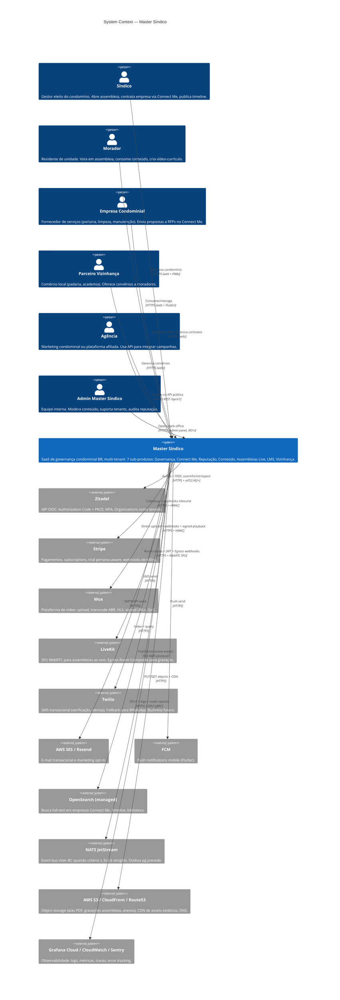

# C4 Nível 1 — Contexto do Master Síndico

Visão macro do sistema: quem usa (atores), o sistema central (Master Síndico) e com quem ele conversa (sistemas externos). Nível 1 do modelo C4 ([c4model.com](https://c4model.com)).

> Decisões de topologia detalhadas em [[c4-containers]] e [[c4-components]]. Princípios herdados do research estão mapeados em [[research-inspirations]].

---

## 1. Diagrama C4 — Contexto

---

## 2. Atores (PT-BR / EN identifier)

### 2.1 Síndico (`sindico`)

- **Perfil**: gestor eleito do condomínio (mandato típico 2 anos, CC art. 1.347-1.354). Pode ser morador-síndico ou síndico profissional.
- **Responsabilidades na plataforma**: cria assembleias, publica atas, aprova RFPs no Connect Me, publica vídeo institucional, gerencia plano diretor, aprova orçamento.
- **Planos**: trial 15 dias persona-aware; N1 básico / N2 padrão / N3 ilimitado.
- **Dispositivos**: web (SolidJS) prioritário + mobile Flutter.
- **Dores**: evidência documental contra contestação em MP, critério objetivo na contratação, continuidade entre gestões.

### 2.2 Morador (`morador`)

- **Perfil**: residente de unidade (proprietário, inquilino, dependente). Pode ser inquilino ou proprietário; voto segue fração ideal da unidade + procuração.
- **Responsabilidades**: vota em assembleias, consome timeline, denuncia problemas, cria vídeo-currículo (Banco de Talentos), interage com comércio local (Vizinhança).
- **Plano**: morador-base (gratuito, quotas reduzidas) / morador-pagante (quotas dobradas). Sem trial.
- **Dispositivos**: Flutter prioritário + web.

### 2.3 Empresa Condominial (`empresaCond`)

- **Perfil**: CNPJ ativo prestador de serviços condominiais (portaria, limpeza, manutenção, elétrica, hidráulica, etc.).
- **Responsabilidades**: cadastro verificado (CNPJ + Receita), vídeo institucional (90d lock), responder RFPs, gerenciar milestones de contrato, acumular reputação Bronze → Diamante.
- **Plano**: Basic / Plus / Pro (E→E marketplace só Pro abre, Plus responde).
- **Trial**: 7 dias.

### 2.4 Parceiro Vizinhança (`parceiroViz`)

- **Perfil**: comércio local (padaria, academia, pet shop) que oferece convênios a moradores de condomínios parceiros.
- **Responsabilidades**: cadastra convênio, gerencia QR code / cupom, mede redenção.
- **Trial**: 30 dias.
- **Diferença vs empresa condominial**: parceiros entregam **benefício**, não contratam obrigação formal.

### 2.5 Agência (`agencia`)

- **Perfil**: agência de marketing condominial, plataforma afiliada (ex: ferramentas de síndico profissional que querem ingerir/publicar via API).
- **Responsabilidades**: integração via API pública (`/api/v1/...`), OAuth Client Credentials (M2+).
- **Escopo**: leitura de dados públicos do condomínio conveniado + emissão de comunicados em nome do síndico (com consent).

### 2.6 Admin Master Síndico (`adminMS`)

- **Perfil**: equipe interna (ops, CS, moderação, financeiro).
- **Responsabilidades**: modera denúncias, apura conluio, suporta tenants, audita reputação, revisa trial extensions.
- **Dispositivo**: admin panel dedicado (M3+) + ferramentas CLI internas até lá.

---

## 3. Sistemas externos

### 3.1 Identidade & Segurança

- **Zitadel** — IdP OIDC self-host inicialmente, managed futuro. Authorization Code + PKCE, MFA TOTP/WebAuthn, Organizations mapeadas 1:1 para tenants de Master Síndico. `userinfo` + `introspect` cacheados 5 min no Redis com invalidação via webhook Zitadel Actions.
  - Herança: [[13-research/beyond-corp/_destilado]] (identidade como perímetro) + [[adr/0003-zitadel-oidc-provider]].

### 3.2 Billing

- **Stripe** — subscriptions, pricing tables, trial persona-aware, cupons. Webhooks inbound em `/webhook/stripe` com HMAC verificado antes de parse + idempotência via `stripe_event_id`.
  - Herança: [[13-research/netflix/_destilado]] (resilience em providers) + [[adr/0004-stripe-payment-gateway]].

### 3.3 Mídia

- **Mux** — terceirização total do pipeline de vídeo (YouTube-as-a-Service). Direct Upload tus.io, ABR 360p→1080p, signed playback JWT com TTL 5-15 min, Mux Data QoE.
  - Herança: [[13-research/youtube/_destilado]] (Mux resolve tudo até HLS) + [[adr/0010-mux-video-provider]].
- **LiveKit** — SFU WebRTC para assembleias. Room create via API server-side, JWT por participante com `canPublish` condicional, Egress Room Composite → MP4 em S3 para ata legal.
  - Herança: [[13-research/google-meet/_destilado]] (SFU confirmado, E2EE off, TURN via Cloud) + [[adr/0011-livekit-sfu]].

### 3.4 Notificação

- **Twilio** — SMS verificação/alertas; volume baixo em M1.
- **AWS SES / Resend** — e-mail transacional + marketing opt-in. Decisão final (SES vs Resend) em aberto — ⚠️ PENDÊNCIA D-026 do legado.
- **FCM** — push notifications Flutter.

### 3.5 Dados & Busca

- **`ISearchProvider` real** (OpenSearch managed ou Meilisearch — ADR-0042 `proposed pending dual-check`) — busca full-text Connect Me + timeline + biblioteca LMS desde M1 (D-120 Fase 14 revoga D-067 PG tsvector que era M1; tsvector vigente é stub temporário). Migração via outbox → indexer worker.
  - Herança: [[13-research/linkedin/_destilado]] (separar document fetching de ranking).
- **NATS JetStream** — event bus inter-BC quando critério ≥ 3 produtores × 3 consumidores é atingido. Outbox Postgres é o default até lá.
  - Herança: [[13-research/linkedin/_destilado]] §1 (critério objetivo Kafka/NATS) + [[adr/0019-nats-jetstream-threshold]].

### 3.6 Infra AWS

- **S3** — object storage para atas PDF assinadas, gravações assembleia MP4/MP3, anexos RFP, vídeos brutos (Mux ingere). Object Lock considerado para audit trail WORM em M2.
- **CloudFront** — CDN assets estáticos. Mux traz seu próprio CDN para vídeo.
- **Route53** — DNS com subdomain routing por tenant opcional (`<slug>.mastersindico.com.br`).

### 3.7 Observabilidade

- **Grafana Cloud** — métricas Prometheus + traces Tempo + logs Loki. Free tier em M1; Mimir/Thanos em M3.
- **CloudWatch** — somente se migrar para AWS ECS (M4+).
- **Sentry** — error tracking Go + SolidJS + Flutter.

---

## 4. Fronteiras do sistema

### 4.1 O que **é** Master Síndico

- Cadastro e governança de condomínios, unidades, memberships.
- Timeline imutável de decisões e eventos.
- Marketplace de contratação formal (Connect Me — unidirecional, não chat).
- Reputação determinística Bronze → Diamante.
- Plataforma de vídeos com lock 90 dias e assembleias live.
- LMS + Banco de Talentos morador.
- Rede de vizinhança com comércio local.

### 4.2 O que **não é** Master Síndico

- ❌ ERP condominial (cobrança de condômino, emissão fiscal) — integração futura com Superlógica/Condotech via API, nunca substituto.
- ❌ App de mensageria/chat — Connect Me é formulário estruturado, não thread.
- ❌ Sistema financeiro bancário — pagamentos só via Stripe (plano SaaS) ou repasse empresa ↔ síndico via boleto externo.
- ❌ Plataforma social aberta — identidades são validadas (CPF morador via síndico, CNPJ empresa via Receita).

---

## 5. Princípios de fronteira herdados do research

1. **Identidade centralizada em Zitadel, nunca duplicada** — [[13-research/beyond-corp/_destilado]] §2.
2. **Terceirizar 100% do pipeline de vídeo para Mux** — [[13-research/youtube/_destilado]] TL;DR.
3. **LiveKit Cloud em M1, self-host só M3+ sob gatilho de custo** — [[13-research/google-meet/_destilado]] §10.
4. **Webhooks externos sempre HMAC + idempotência antes de parse** — padrão destilado em [[13-research/netflix/_destilado]] + LinkedIn (Sigma/Haxl).
5. **Observability via OpenTelemetry padrão Dapper** — [[13-research/google-arch/_destilado]] §4.

---

## 6. ⚠️ Pendências

- **D-026** (herdado do legado): SES vs Resend — decidir antes de M1. [[../AUDIT]] recebe A-### se não bater bater até 2026-05-01.
- **Agência OAuth Client Credentials** — escopo exato do `agencia` ator só definido em M2; em M1 segue apenas tela de "Fale Conosco".
- **Admin Panel** — interface dedicada prevista M3+; até lá, admin usa CLI + queries manuais autenticadas.

---

## 7. Vizinhos

- [[_moc]] — MOC de 02-architecture
- [[c4-containers]] — Nível 2 C4
- [[c4-components]] — Nível 3 C4
- [[clean-arch-mapping]]
- [[topology-multitenant]]
- [[research-inspirations]]
- [[../CLAUDE]] — contrato do agente
- [[../STATE]] — decisões vivas
