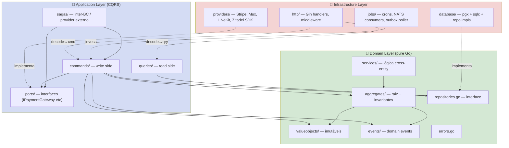

# Clean Architecture — mapeamento aplicado ao Master Síndico

Clean Architecture aplicada em Go 1.26 com ênfase em DDD tático + CQRS. **Regra de dependência canônica**: setas apontam **para dentro**; domínio não conhece infraestrutura.

> Decisão fundadora: [[adr/0001-clean-architecture-ddd-cqrs]]. Componentes por BC: [[c4-components]]. Padrões aplicados: [[patterns]].

---

## 1. As quatro camadas



---

## 2. Domain Layer (núcleo)

### 2.1 Responsabilidades

- **Aggregates** com estado **privado** (entidades não exportam campos mutáveis; acesso via getters).
- **Factories** (`NewX` com validação; `ReconstructX` sem validação, usado por repo mapper para hidratar do DB).
- **Value Objects** imutáveis (`Money`, `CPF`, `CNPJ`, `FracaoIdeal`, `Email`, `ULID`).
- **Domain events** (payload + metadata: `tenant_id`, `actor`, `timestamp`, `request_id`).
- **Domain services** quando a lógica é cross-aggregate dentro do mesmo BC (ex: `QuorumCalculator` no `assembly`).
- **Repository interfaces** (não impl; impl vive em `infrastructure/database/repositories`).
- **Specifications** para queries complexas (`TopReputationSpec`, `NearbyCompaniesSpec`).
- **Errors** tipados (`ErrInvariantViolation`, `ErrTimelineImmutable`, `ErrQuorumNotReached`).

### 2.2 Regras duras

1. **Zero import de framework** (`gin`, `pgx`, `go-redis`, SDKs externos, `stripe-go`, `mux-go`, `livekit-server-sdk-go`).
2. **Zero import de `application/` ou `infrastructure/`** — dependência aponta pra dentro.
3. **Campos privados** (lower-case) em aggregates; exposição via getters se necessário.
4. **Imutabilidade dos VOs** — sem setters; mudança gera novo VO.
5. **`ReconstructX` não valida** — mapper do repo confia no DB (evita rejeitar dado histórico legítimo).
6. **`NewX` valida invariantes** — usado em commands quando cria/atualiza estado.
7. **Erros de domínio** são tipos concretos, não `errors.New`; permitem `errors.Is(err, ErrXxx)`.

### 2.3 Exemplo — aggregate `Vote` (assembly BC)

```go
package domain

// internal/modules/assembly/domain/aggregates/vote.go
type Vote struct {
    id           ULID
    tenantID     ULID
    agendaItemID ULID
    voterID      ULID
    option       VoteOption    // VO: Sim|Não|Abstenção|Branco
    weight       FracaoIdeal   // VO: fração ideal da unidade
    castAt       time.Time
}

// EN: factory for new votes — validates invariants
// PT: factory pra votos novos — valida invariantes
func NewVote(tenantID, agendaItemID, voterID ULID, opt VoteOption, weight FracaoIdeal) (*Vote, error) {
    if weight.IsZero() {
        return nil, ErrZeroFracaoIdeal
    }
    if !opt.IsValid() {
        return nil, ErrInvalidVoteOption
    }
    return &Vote{
        id:           NewULID(),
        tenantID:     tenantID,
        agendaItemID: agendaItemID,
        voterID:      voterID,
        option:       opt,
        weight:       weight,
        castAt:       time.Now().UTC(),
    }, nil
}

// EN: reconstructs from DB without revalidation
// PT: reconstrói do DB sem revalidar
func ReconstructVote(id, tenantID, agendaItemID, voterID ULID, opt VoteOption, weight FracaoIdeal, castAt time.Time) *Vote {
    return &Vote{id, tenantID, agendaItemID, voterID, opt, weight, castAt}
}

func (v *Vote) ID() ULID                { return v.id }
func (v *Vote) TenantID() ULID          { return v.tenantID }
func (v *Vote) AgendaItemID() ULID      { return v.agendaItemID }
func (v *Vote) VoterID() ULID           { return v.voterID }
func (v *Vote) Option() VoteOption      { return v.option }
func (v *Vote) Weight() FracaoIdeal     { return v.weight }
func (v *Vote) CastAt() time.Time       { return v.castAt }
```

---

## 3. Application Layer (casos de uso / CQRS)

### 3.1 Responsabilidades

- **Commands** — write side. Um arquivo por comando (`cast_vote_command.go`). Handler recebe dependências via construtor.
- **Queries** — read side. Otimizadas para leitura; podem ler de view materializada, Redis ou OpenSearch diretamente.
- **Ports** — interfaces para infra: `IPaymentGateway`, `IVideoProvider`, `ILiveSFUProvider`, `IEmailProvider`, `ISMSProvider`, `IPushProvider`, `ISearchProvider`, `IOIDCProvider`, `IModerationProvider`.
- **DTOs** — shape de entrada/saída da use case (não é DTO HTTP).
- **Sagas** — orquestram passos com compensação quando cruzam BC ou provider externo.

### 3.2 Regras

1. **Command ≠ Query** — arquivos separados, handlers separados (CQRS leve, sem event sourcing separado em M1/M2).
2. **Usa UoW intra-BC**, Saga inter-BC ou com provider externo.
3. **Não importa `infrastructure/*`** — sempre via `ports/`.
4. **Retorna DTO**, não aggregate (evita vazar estado para handler HTTP).
5. **Erros de use case** envolvem erros de domínio + `core/errors` compartilhado (`ErrForbidden`, `ErrNotFound`).
6. **Transaction boundary é a use case**, não o handler HTTP. Handler apenas decodifica e invoca.

### 3.3 Exemplo — `CastVote` command

```go
package application

type CastVoteCommand struct {
    TenantID    ULID
    AssemblyID  ULID
    AgendaItemID ULID
    VoterID     ULID
    Option      string
}

type CastVoteHandler struct {
    uow       UnitOfWork
    assembly  domain.AssemblyRepository
    votes     domain.VoteRepository
    member    domain.MembershipRepository
    bus       DomainEventBus
}

func (h *CastVoteHandler) Handle(ctx context.Context, cmd CastVoteCommand) (*VoteDTO, error) {
    return WithTxReturning(ctx, h.uow, func(ctx context.Context) (*VoteDTO, error) {
        assembly, err := h.assembly.Get(ctx, cmd.TenantID, cmd.AssemblyID)
        if err != nil {
            return nil, err
        }
        if !assembly.IsOpen() {
            return nil, core.ErrForbidden
        }
        mem, err := h.member.GetActive(ctx, cmd.TenantID, cmd.VoterID)
        if err != nil {
            return nil, err
        }
        vote, err := domain.NewVote(cmd.TenantID, cmd.AgendaItemID, cmd.VoterID,
            domain.ParseVoteOption(cmd.Option), mem.FracaoIdeal())
        if err != nil {
            return nil, err
        }
        if err := h.votes.Save(ctx, vote); err != nil {
            if errors.Is(err, core.ErrConflict) {
                return nil, domain.ErrVoteDuplicate
            }
            return nil, err
        }
        h.bus.Publish(ctx, domain.VoteCast{TenantID: cmd.TenantID, VoteID: vote.ID(), AgendaItemID: vote.AgendaItemID()})
        return toDTO(vote), nil
    })
}
```

---

## 4. Infrastructure Layer

### 4.1 Subcamadas

- **`database/`** — pgx pool, sqlc queries, repo impls, mappers row↔entity, `UnitOfWork` impl (tx via `pgx.Tx`).
- **`providers/<name>/`** — SDK externo isolado. Um pacote por provider. Implementa ports da application.
- **`http/`** — handlers REST (controllers), middleware chain, DTOs HTTP, wiring de rotas.
- **`jobs/`** — cron jobs (`robfig/cron`), NATS consumers, outbox poller.

### 4.2 Regras

1. **Mapper explícito** entre row sqlc e entidade de domínio — tipo do ORM **não vaza** do repo.
2. **`SELECT *` proibido** — sqlc queries listam colunas (A-021 histórico).
3. **`_ = fn()` proibido em I/O crítica** — logar erro sempre (histórico A-001..A-008).
4. **Provider SDK importa só em `providers/<name>/`** — nunca no domain ou application.
5. **Migrations** em `migrations/<module>/NNNN_description.sql` via goose ([[adr/0007-goose-migrations-partitioned]]).
6. **Webhook inbound**: HMAC verificado **antes** de parse; idempotência via Redis key 24h.

### 4.3 Exemplo — repo impl `VoteRepository`

```go
package database

type voteRepo struct {
    q *sqlcgen.Queries
}

func (r *voteRepo) Save(ctx context.Context, v *domain.Vote) error {
    _, err := r.q.InsertVote(ctx, sqlcgen.InsertVoteParams{
        ID:           v.ID().String(),
        TenantID:     v.TenantID().String(),
        AgendaItemID: v.AgendaItemID().String(),
        VoterID:      v.VoterID().String(),
        Option:       v.Option().String(),
        Weight:       v.Weight().Decimal(),
        CastAt:       v.CastAt(),
    })
    if err != nil {
        if pgerr.IsUniqueViolation(err) {
            return core.ErrConflict
        }
        return fmt.Errorf("insert vote: %w", err)
    }
    return nil
}
```

---

## 5. Shared layer (`core/` + `pkg/`)

- **`core/contracts/`** — interfaces transversais: `HTTPRouter`, `UnitOfWork`, `EventBus`, `Clock`.
- **`core/errors/`** — erros padronizados: `ErrConflict`, `ErrNotFound`, `ErrForbidden`, `ErrUnauthorized`, `ErrInvalidInput`.
- **`pkg/logger/`** — zerolog wrapper (contextual, tenant-aware, PII-masking enforced).
- **`pkg/money/`** — Money VO (int64 centavos BRL).
- **`pkg/pagination/`** — cursor pagination helpers.
- **`pkg/safecast/`** — conversões numéricas seguras.

---

## 6. Regra de dependência — formal

```
domain/         ← NÃO importa nada de fora (stdlib, pkg/, core/errors OK)
application/    ← pode importar domain/ (mesmo BC), core/contracts, pkg/
infrastructure/ ← pode importar application/ (portas), domain/ (mesmo BC), core/, pkg/, SDKs externos
cross-domain/   ← pode importar aplicações de múltiplos BCs (para sagas) — ÚNICO BC com essa permissão
```

Violações detectadas em CI via `go-arch-lint` ([[adr/0001-clean-architecture-ddd-cqrs]]).

---

## 7. Violações proibidas (anti-patterns)

### 7.1 Framework vazando pra domínio

❌ ERRADO:
```go
// domain/aggregates/user.go
import "github.com/gin-gonic/gin"   // proibido
func (u *User) BindJSON(c *gin.Context) error { ... }
```

✅ CORRETO:
```go
// infrastructure/http/handlers/user_handler.go
func (h *UserHandler) Register(c *gin.Context) {
    var dto RegisterUserDTO
    if err := c.BindJSON(&dto); err != nil { ... }
    cmd := application.RegisterUserCommand{...}
    result, err := h.handler.Handle(c.Request.Context(), cmd)
    ...
}
```

### 7.2 Tipo do ORM vazando do repo

❌ ERRADO:
```go
func (r *userRepo) Get(ctx context.Context, id string) (*sqlcgen.User, error) {
    return r.q.GetUser(ctx, id)
}
```

✅ CORRETO:
```go
func (r *userRepo) Get(ctx context.Context, id ULID) (*domain.User, error) {
    row, err := r.q.GetUser(ctx, id.String())
    if err != nil { return nil, mapErr(err) }
    return mapRowToUser(row), nil
}
```

### 7.3 SDK externo no domain

❌ ERRADO:
```go
// domain/services/payment_service.go
import "github.com/stripe/stripe-go/v74"  // proibido
```

✅ CORRETO:
```go
// application/ports/payment_gateway.go
type IPaymentGateway interface {
    CreateSubscription(ctx context.Context, req SubscribeReq) (*SubscriptionResult, error)
}
// infrastructure/providers/stripe/stripe_gateway.go
import "github.com/stripe/stripe-go/v74"
```

### 7.4 Cross-BC import direto

❌ ERRADO:
```go
// modules/commercial/application/commands/accept_proposal_command.go
import "modules/billing/domain/aggregates"
```

✅ CORRETO: comunicar via eventos de domínio publicados no bus. Billing escuta; commercial não conhece.

### 7.5 Query em command (write/read misturado)

❌ ERRADO: um handler retorna uma list + faz update.

✅ CORRETO: `ListXyz` é query-handler separado; update é command-handler dedicado.

### 7.6 `deleted_at` em timeline / ata

❌ ERRADO: `UPDATE timeline_entries SET deleted_at = now()`.

✅ CORRETO: timeline é INSERT-only. Correção vira nova entry com `correction_of: <original_id>`.

---

## 8. Padrão de módulo canônico

Todo BC respeita esta estrutura (visto em [[c4-components]] §1). Resumo:

```
internal/modules/<bc>/
├── domain/          — núcleo
├── application/     — commands + queries + ports + sagas
├── infrastructure/  — database, http, providers, jobs
└── module.go        — wire-up DI (Register(deps) → registra rotas, jobs, subscribers)
```

`module.go` é a **única** porta de entrada do BC para o resto da aplicação. `main.go` chama `identityModule.Register(app)`, `billingModule.Register(app)`, etc.

---

## 9. Vizinhos

- [[adr/0001-clean-architecture-ddd-cqrs]] — decisão fundadora
- [[adr/0002-gin-abstracted-router]] — HTTPRouter contract
- [[c4-components]] — componentes por BC
- [[patterns]] — DDD, Repository, Factory, Saga
- [[../CLAUDE]] — padrões §3
