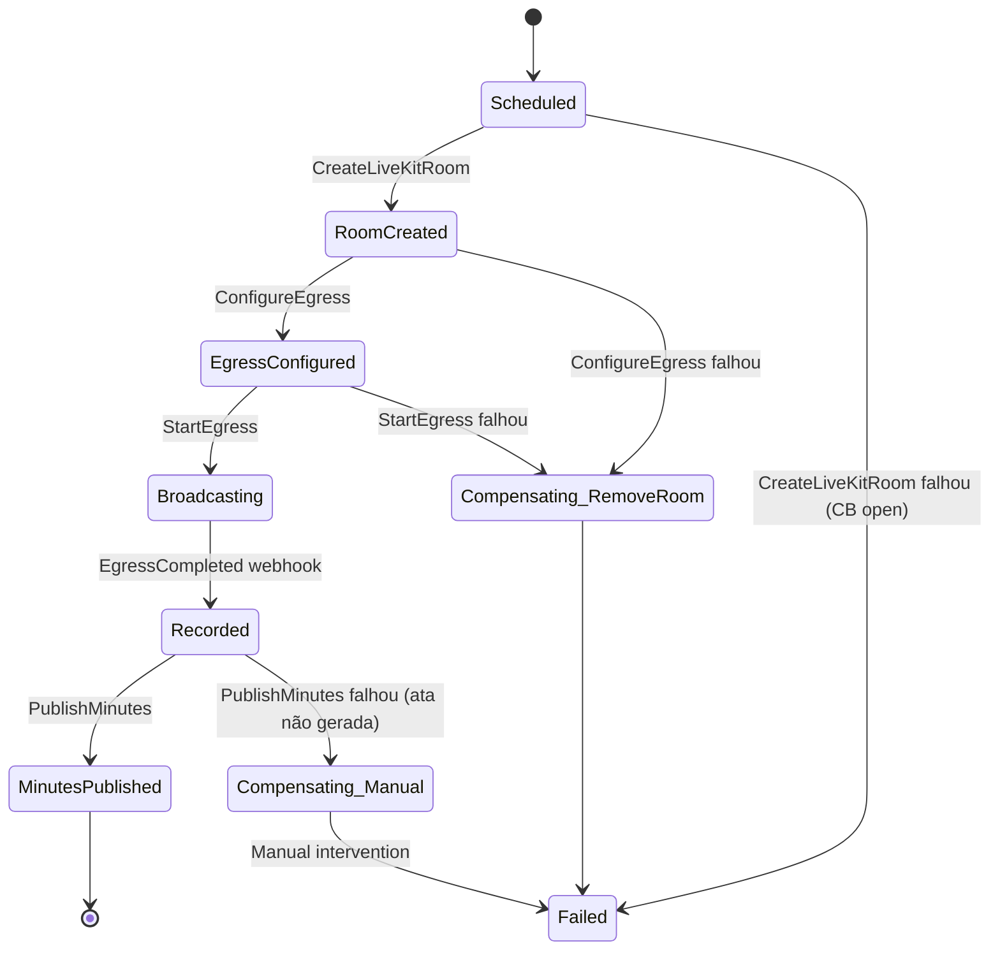

# Event-Driven — NATS JetStream + Outbox + Saga

Arquitetura assíncrona do Master Síndico. Critério explícito para ligar NATS, padrão Outbox como default M1, schema canônico de eventos, idempotência e DLQ.

> Herança canônica: [[../13-research/linkedin/_destilado]] §1 ("The Log" + critério 3x3), [[../13-research/google-arch/_destilado]] §5 (Pub/Sub ordering + idempotency), [[../13-research/netflix/_destilado]] §2 (retry + DLQ).

---

## 1. Quando usar assíncrono vs síncrono

### 1.1 Síncrono via UoW (default dentro de 1 BC)

- Fluxo atômico cabe em 1 tx Postgres.
- Latência crítica (<100ms p95).
- Exemplo: criar unidade + membership no mesmo POST.

### 1.2 Assíncrono via Outbox → Worker

- Side-effect de uma mudança de estado (email de confirmação, indexar OpenSearch, notificar outro BC).
- Não precisa responder síncrono.
- Padrão **canônico M1**.

### 1.3 Assíncrono via NATS JetStream

- Só quando critério ≥ 3 × 3 é atingido (ver §2).
- Outbox pattern continua como fonte; NATS é consumidor do outbox.

### 1.4 Assíncrono via Saga

- Fluxo multi-step com compensação (provider externo).
- Estado da saga persistido em `saga_instances` Postgres.
- Orquestração em `cross-domain/saga/`.

---

## 2. Critério para ligar NATS JetStream (herança LinkedIn)

Decisão registrada em [[adr/0019-nats-jetstream-threshold]]. NATS só entra quando **pelo menos uma** destas condições é real:

1. **Topologia M×N** ≥ 3 produtores × 3 consumidores do mesmo evento.
2. **Replay histórico** obrigatório (auditoria LGPD, reprocessamento em caso de bug).
3. **Latência outbox-polling p95 > 5s** — virou gargalo.
4. **Multi-instância worker** precisa coordenação fina sem sobrecarregar `pg_advisory_lock`.

**Enquanto NÃO atingir**: outbox poll a cada 1s é suficiente. Custo adicional de NATS (infra, código, operacional) não se justifica.

### 2.1 Estado M1

- **Outbox only**. 1 produtor × 1-2 consumers (worker dispatcher → email, push, OS indexer).
- **Condição atingida M1**: ❌ (não justifica NATS).

### 2.2 Estado M2 provável

- Outbox + NATS JetStream quando cruzar critério acima.
- Migração transparente: outbox dispatcher deixa de chamar effect diretamente e passa a publicar em stream NATS.

**Citação** ([[../13-research/linkedin/_destilado]] §1):
> "Adotar Kafka/NATS 'porque é moderno' sem ≥ 3 produtores × ≥ 3 consumidores reais [é cargo-cult]. LinkedIn construiu Kafka em 2010 com 100M+ membros, não em dia 1."

---

## 3. Outbox pattern — template

### 3.1 Schema

```sql
CREATE TABLE outbox_events (
    id            BYTEA PRIMARY KEY,              -- ULID bytes
    tenant_id     BYTEA NOT NULL,
    topic         TEXT NOT NULL,                   -- "institutional.timeline_entry_added"
    aggregate_id  BYTEA NOT NULL,
    payload       JSONB NOT NULL,
    metadata      JSONB NOT NULL,                  -- {request_id, actor, ts, schema_version}
    created_at    TIMESTAMPTZ NOT NULL DEFAULT now(),
    dispatched_at TIMESTAMPTZ,
    attempts      INT NOT NULL DEFAULT 0,
    last_error    TEXT
);
CREATE INDEX ON outbox_events (dispatched_at, created_at) WHERE dispatched_at IS NULL;
CREATE INDEX ON outbox_events (tenant_id, topic);
```

### 3.2 Producer pattern (use case)

```go
func (h *PublishAnnouncementHandler) Handle(ctx, cmd) (*AnnouncementDTO, error) {
    return WithTxReturning(ctx, h.uow, func(ctx) (*AnnouncementDTO, error) {
        ann, err := domain.NewAnnouncement(...)
        if err != nil { return nil, err }
        if err := h.repo.Save(ctx, ann); err != nil { return nil, err }

        evt := domain.AnnouncementPublished{TenantID: ann.TenantID(), ID: ann.ID(), ...}
        if err := h.outbox.Append(ctx, evt); err != nil { return nil, err }

        return toDTO(ann), nil
    })
}
```

Append + save aggregate na **mesma tx** ⇒ atomicidade garantida.

### 3.3 Consumer pattern (worker poll)

```go
func (p *Poller) Run(ctx context.Context) {
    ticker := time.NewTicker(1 * time.Second)
    for {
        select {
        case <-ctx.Done(): return
        case <-ticker.C:
            batch, err := p.repo.FetchPending(ctx, 100)
            // SELECT ... FOR UPDATE SKIP LOCKED
            for _, evt := range batch {
                if err := p.dispatch(ctx, evt); err != nil {
                    p.repo.MarkFailure(ctx, evt.ID, err)
                    continue
                }
                p.repo.MarkDispatched(ctx, evt.ID)
            }
        }
    }
}
```

- `FOR UPDATE SKIP LOCKED` permite múltiplos workers.
- `MarkFailure` incrementa `attempts`; depois de 5 tentativas move para DLQ.

---

## 4. Schema canônico de evento

```json
{
  "id": "01HZ...",                         // ULID do evento
  "topic": "commercial.proposal_submitted",  // <bc>.<verbo_passado>
  "schema_version": "v1",
  "tenant_id": "01HZ...",
  "aggregate_id": "01HZ...",
  "payload": {
    "proposal_id": "01HZ...",
    "rfp_id": "01HZ...",
    "company_id": "01HZ...",
    "amount_cents": 3000000,
    "deadline_days": 30
  },
  "metadata": {
    "request_id": "01HZ...",
    "actor_id": "01HZ...",
    "actor_type": "user",
    "ts": "2026-04-23T14:00:00Z",
    "trace_id": "00-<32hex>-<16hex>-01"
  }
}
```

### 4.1 Convenções

- **Topic**: `<bc>.<verbo_no_passado>` — ex: `institutional.timeline_entry_added`, `assembly.vote_cast`, `billing.subscription_created`.
- **`schema_version`**: string semver simplificada (`v1`, `v2`). Consumer aceita versão conhecida ou ignora + alerta.
- **`tenant_id`** obrigatório — mesmo para eventos globais (usa `tenant_id = GLOBAL` reservado).
- **`metadata.request_id`** propaga OpenTelemetry trace ([[observability]]).
- **Payload minimalista** — IDs + campos necessários; consumer faz fetch se precisar mais.

### 4.2 Evolução de schema

- **Additive** é seguro (adicionar campo opcional).
- **Breaking** vira `schema_version: v2`; publisher emite v1 + v2 por período de transição; consumer migrado lê v2.
- Registry de schemas: arquivo `events/schemas.yaml` versionado em Git; validação CI.

---

## 5. Idempotência no consumer

Obrigatória. Fonte: [[../13-research/google-arch/_destilado]] §5 (Pub/Sub at-least-once).

### 5.1 Pattern

```go
func (c *Consumer) Handle(ctx, evt Event) error {
    // dedup via unique constraint em processed_events
    _, err := c.q.InsertProcessedEvent(ctx, InsertProcessedEventParams{
        EventID: evt.ID.String(),
        ConsumerName: c.name,
    })
    if err != nil {
        if pgerr.IsUniqueViolation(err) {
            return nil // já processado, ACK silent
        }
        return err
    }
    // processa
    return c.do(ctx, evt)
}
```

### 5.2 Tabela `processed_events`

```sql
CREATE TABLE processed_events (
    consumer_name TEXT NOT NULL,
    event_id      BYTEA NOT NULL,
    processed_at  TIMESTAMPTZ NOT NULL DEFAULT now(),
    PRIMARY KEY (consumer_name, event_id)
);
-- partition drop periódica (≥ 30d)
```

---

## 6. Dead-Letter Queue (DLQ)

### 6.1 Stream/tabela

- **Outbox M1**: coluna `attempts` + after `attempts >= 5` → move row para `outbox_dlq` com coluna `first_failed_at`, `last_error`, `attempts_total`.
- **NATS M2+**: stream `events.dlq` com retenção 30d.

### 6.2 Alerta

- Grafana alert: DLQ size > 10 → page ops.
- Sentry issue auto-criado por tipo de erro.

### 6.3 Reprocess manual

- Admin endpoint `POST /admin/v1/dlq/:id/retry` recoloca no outbox/stream original.
- Postmortem obrigatório pra tipo de erro recorrente.

---

## 7. Ordering

Herança [[../13-research/google-arch/_destilado]] §5 (Pub/Sub ordering key = `tenant_id`/`aggregate_id`).

### 7.1 Quando precisa ordem

- Eventos de assembleia (`AssemblyStarted` → `VoteCast` → `AgendaItemClosed` → `AssemblyEnded`).
- Subscription lifecycle (`Created` → `TrialEnded` → `Canceled`).

### 7.2 Estratégia

- **Outbox**: `created_at` ASC + `FOR UPDATE SKIP LOCKED` preserva ordem **por aggregate** (worker processa por ordem).
- **NATS JetStream**: stream particionado por `aggregate_id` hash; ordered delivery dentro de partition.

### 7.3 Trade-off documentado

Ordered delivery reduz throughput e aumenta latência. Eventos broadcast (notificações a muitos) **não** precisam ordem — rodam em stream sem ordering key.

---

## 8. Retry + Exponential Backoff + Jitter

Padrão canônico:

```go
retry.Do(func() error { return c.process(ctx, evt) },
    retry.Attempts(5),
    retry.Delay(200*time.Millisecond),
    retry.DelayType(retry.CombineDelay(retry.BackOffDelay, retry.RandomDelay)),
    retry.MaxDelay(5*time.Second),
    retry.RetryIf(func(err error) bool { return isTransient(err) }),
)
```

- 5 tentativas, base 200ms, max 5s, jitter obrigatório.
- Erros não-transientes (4xx, ErrInvariantViolation) **não** retryam — vão direto pra DLQ.

---

## 9. Mapa de streams M2+ (quando NATS entrar)

| Stream | Produtor(es) | Consumer(s) | Retention | Ordering |
|---|---|---|---|---|
| `events.identity` | identity | billing, commercial, institutional | 7d | by user_id |
| `events.billing` | billing | identity, content | 30d | by subscription_id |
| `events.institutional` | institutional | content, assembly, commercial, notifications | 30d | by condominium_id |
| `events.commercial` | commercial | institutional, notifications | 30d | by rfp_id |
| `events.content` | content | institutional, commercial | 7d | by video_id |
| `events.assembly` | assembly | institutional, content | 90d (ata imutável) | by assembly_id |
| `events.dlq` | todos (falha) | admin | 30d | — |

---

## 10. Saga — orquestração (exemplo AssemblySaga)



Estado persistido em `saga_instances`:

```sql
CREATE TABLE saga_instances (
    id           BYTEA PRIMARY KEY,
    tenant_id    BYTEA NOT NULL,
    saga_type    TEXT NOT NULL,               -- "assembly_saga", "video_publish_saga"
    aggregate_id BYTEA NOT NULL,
    state        TEXT NOT NULL,
    context      JSONB NOT NULL,              -- dados necessários entre steps
    created_at   TIMESTAMPTZ NOT NULL,
    updated_at   TIMESTAMPTZ NOT NULL,
    completed_at TIMESTAMPTZ,
    failed_at    TIMESTAMPTZ,
    last_error   TEXT
);
```

Worker periodicamente avança sagas travadas (ex: esperando webhook que nunca chegou) — timeout + compensação manual.

---

## 11. Observabilidade de eventos

- Todo evento carrega `trace_id` + `span_id` (OpenTelemetry) em `metadata`.
- Dashboard Grafana por stream: rate, size, lag, DLQ size.
- Alertas: lag > 5s, DLQ > 10, attempts médio > 2.
- Ver [[observability]].

---

## 12. ⚠️ Pendências

- **NATS JetStream self-host vs Synadia Cloud** — decidir M2 quando critério bater. Custo infra self-host baixo, mas operacional requer on-call.
- **Schema registry** — arquivo YAML versionado M1; Apicurio/Confluent Schema Registry M3+ se schema evolution complexa.
- **Event sourcing completo** — M2/M3 avaliação: vale para `timeline_entries` e `minutes` já "são" event-sourced por natureza imutável.

---

## 13. Vizinhos

- [[adr/0019-nats-jetstream-threshold]]
- [[adr/0015-uow-intra-saga-inter]]
- [[patterns]] §14 (Outbox), §7 (Saga), §11 (Idempotency), §13 (Retry+DLQ)
- [[observability]]
- [[c4-containers]] — NATS container
- [[../13-research/linkedin/_destilado]] §1
- [[../13-research/google-arch/_destilado]] §5
