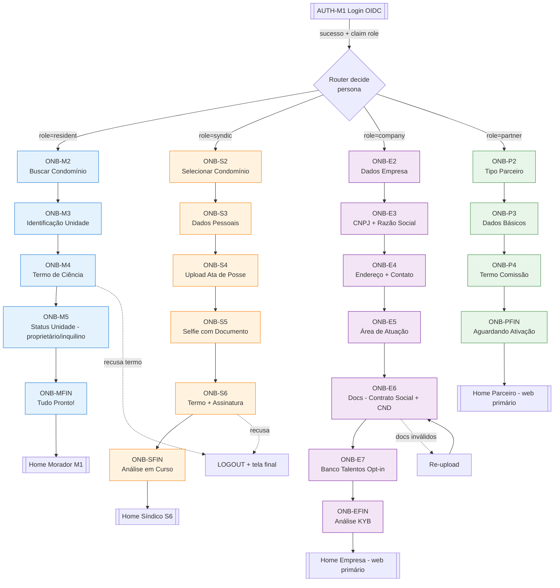

# Onboarding Flow — Mobile

Diagrama end-to-end dos **4 fluxos** de onboarding mobile (morador / síndico / empresa / parceiro). Cada fluxo começa após login OIDC bem-sucedido e termina quando a persona está apta a entrar no shell principal.

## Premissas

- Zitadel ID token carrega claim `role` (`resident | syndic | company | partner`) — roteamento inicial decide persona.
- Cada step chama `PATCH /api/v1/onboarding/sessions/me` com auto-save debounce 2s.
- Retomada: ao abrir app com sessão ativa e onboarding não completo → `GET /sessions/me` retorna step corrente.
- `PATCH` com status `complete` dispara binding final + redirect home.

## Diagrama Mermaid

## Telas por persona

### Morador (5 telas efetivas)
1. `ONB-M2` Buscar condomínio (CEP + número)
2. `ONB-M3` Identificação unidade (bloco/apto/fração)
3. `ONB-M4` Termo de ciência
4. `ONB-M5` Status unidade (proprietário/inquilino/dependente)
5. `ONB-MFIN` Tudo pronto! → home

### Síndico (5 telas + final)
1. `ONB-S2` Selecionar condomínio onde foi eleito
2. `ONB-S3` Dados pessoais (CPF, RG, contato)
3. `ONB-S4` Upload ata de posse
4. `ONB-S5` Selfie com documento
5. `ONB-S6` Termo de uso síndico + assinatura digital
6. `ONB-SFIN` Análise em curso (async — síndico pode usar módulos read-only enquanto aguarda)

### Empresa parceira (6 telas + final)
1. `ONB-E2` Dados empresa (trade name)
2. `ONB-E3` CNPJ + razão social (via consulta serasa/CNPJ lookup)
3. `ONB-E4` Endereço + contato
4. `ONB-E5` Área de atuação (multi-select categorias)
5. `ONB-E6` Docs: contrato social + CND federal/estadual
6. `ONB-E7` Opt-in banco de talentos (D-074)
7. `ONB-EFIN` Análise KYB (async)

### Parceiro comercial (3 telas + final)
1. `ONB-P2` Tipo parceiro (agência / indicador)
2. `ONB-P3` Dados básicos + CNPJ/CPF
3. `ONB-P4` Termo de comissão
4. `ONB-PFIN` Aguardando ativação

## Decisões e padrões

- **Auto-save**: debounce 2s em cada step; se offline, enfileira em `onboarding_queue` (Hive).
- **Retomada**: `hydrated_bloc` em `OnboardingBloc` persiste `currentStep` + `payload`.
- **Abort**: recusa de termo mata sessão + logout Zitadel.
- **Async finalize**: síndico/empresa/parceiro entram em estado `pending_review`; podem acessar módulos restritos (leitura) enquanto aguardam.
- **Morador** tem `auto_approve`: binding imediato pós-ONB-M5.

## Gaps/questões abertas

- **Q-FLOW-01** Parceiro no app: UX essencial é web; mobile = fluxo redundante; avaliar descomissionar em M1.
- **Q-FLOW-02** Empresa no app similar — priorizar web M1. Mobile empresa pode ficar M3.
- **Q-FLOW-03** Onboarding cross-device (começa web, termina mobile) depende de server manter estado — ver `[[../backend/requirements]]`.

## Links

- [[requirements/onboarding]]
- [[ui-catalog/onboarding/_moc]]
- [[../web/ui-catalog/onboarding/_moc]] (equivalente web, a popular)
- [[_moc]]
