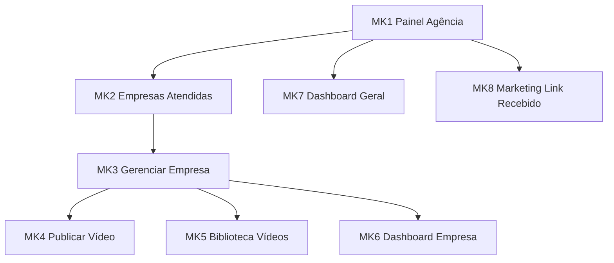

> **Origem**: `60-sources/master-sindico-research/client-material/pdfs/2026-03-09-jornada-agencia-marketing.pdf` (291 linhas extraídas).
> **Absorvido em**: 2026-04-25 — Fase D. Tradução aplicada: "My Síndico" → "Master Síndico".
> **Princípio**: este doc descreve **fluxos de tela e UX (frontend)**. Regras de negócio canônicas vivem em `04-requirements/functional/<bc>.md`. Cross-links em cada tela.

# Jornada — Agência de Marketing

## Sumário

- **Total de telas**: 8 (MK1-MK8).
- **App alvo**: `cms` (porta 3001) com persona ativa = `agencia`.
- **Plan-tier**: agência **não tem plan-tier próprio** — atua via convite das empresas (D-102).
- **Bounded contexts**: identity (persona agência), commercial (vínculo via Marketing Link), institutional (publicação de vídeos delegada).
- **Persona alvo**: Agência de Marketing (actor delegado).

## Propósito (banner — vindo do PDF)

A jornada da agência de marketing tem como objetivo **apoiar empresas prestadoras de serviço na construção da sua presença institucional** dentro do ecossistema da plataforma.

A agência atua **exclusivamente** na gestão de conteúdo institucional das empresas. Ela **NÃO** possui acesso a dados de condomínios, síndicos ou registros técnicos.

## Limitações ABAC (gates frontend + backend)

A agência **NÃO acessa**:
- Connect Me
- Registros de execução
- Comunicados técnicos
- Linha do tempo do condomínio
- Dados de síndicos
- Dados de moradores
- Dashboard de governança do síndico

Estes gates são duplos (UI route guard + backend ABAC enforcement).

## Fluxo macro

---

## Telas

### MK1 — Painel da Agência

**App**: `cms` · **Persona**: Agência · **Rota**: `/agencia` · **TELA-PIVÔ**

**Caminho** (UX): App → Painel Empresarial → Perfil Agência de Marketing.

**Mensagem institucional**:
> Este é o espaço onde sua agência administra os conteúdos institucionais das empresas que confiaram à sua equipe a gestão da comunicação dentro da plataforma Master Síndico.
> Aqui você pode publicar vídeos institucionais e acompanhar o desempenho desses conteúdos.

**Cards disponíveis**:
- Empresas atendidas → MK2
- Publicar vídeos → MK3 (após escolher empresa) → MK4
- Biblioteca de vídeos → MK3 → MK5
- Dashboard de desempenho → MK7
- Marketing Link recebido → MK8

**Notificações** (badges nos cards):
- Empresa envia convite (E14 → status `Convite enviado` na MK)
- Empresa envia Marketing Link (E16 → MK8)

**Estados**: empty (sem empresas), loading, success.

**Cross-links**:
- Persona: [[../../../00-product/personas#agencia]]
- Reqs: [[../../../04-requirements/functional/commercial#REQ-COM-AGENCIA-HOME]]

---

### MK2 — Empresas Atendidas

**App**: `cms` · **Persona**: Agência · **Rota**: `/agencia/empresas`

**Caminho**: MK1 → Empresas atendidas.

**Mensagem institucional**:
> Aqui estão as empresas que autorizaram sua agência a administrar seus conteúdos institucionais dentro da plataforma.

**Lista exibida** (cards):
- Empresa (nome fantasia)
- Segmento da empresa
- Cidade
- Data de início da parceria

**Ações** por linha:
- [Gerenciar empresa] → MK3

**Estados**: empty (sem convites aceitos), loading, success.

**Regras**:
- Empresas aparecem **apenas após aceitar convite enviado pela empresa prestadora** (vínculo nasce em E14, ativa em MK1).

**Cross-links**:
- Aggregate: [[../../../01-domain/aggregates/AgenciaLink|AgenciaLink]]
- Reqs: [[../../../04-requirements/functional/commercial#REQ-COM-AGENCIA-EMPRESAS]]

---

### MK3 — Gerenciar Empresa (switch context)

**App**: `cms` · **Persona**: Agência · **Rota**: `/agencia/empresas/:empresaId`

**Caminho**: MK2 → Gerenciar empresa.

**Mensagem institucional**:
> Nesta área sua agência administra os conteúdos institucionais da empresa dentro da plataforma.

**Cards disponíveis** (sub-pivot):
- Publicar vídeo → MK4
- Biblioteca de vídeos → MK5
- Dashboard da empresa → MK6

**Estados**: loading (resolvendo contexto da empresa), success.

**Regras**:
- **Switch de contexto**: a partir daqui todas as ações ocorrem no contexto da empresa selecionada.
- ABAC enforce: agência só pode gerenciar empresas com vínculo `Ativa`.

**Cross-links**:
- Pattern: [[../../patterns/context-switch-banner]]

---

### MK4 — Publicar Vídeo

**App**: `cms` · **Persona**: Agência · **Rota**: `/agencia/empresas/:empresaId/videos/novo`

**Mensagem institucional**:
> Os vídeos institucionais ajudam empresas a apresentar seus serviços e compartilhar conhecimento com o ecossistema condominial.

**Campos**:
- Empresa vinculada (read-only — definida pelo contexto MK3)
- Título do vídeo (required)
- **Tipo de vídeo** (select — 12 tipos):
  - Apresentação institucional da empresa
  - Apresentação da equipe técnica
  - Demonstração de serviço
  - Explicação técnica
  - Boas práticas condominiais
  - Orientação preventiva
  - Caso real de atendimento
  - Treinamento técnico
  - Explicação de legislação ou normas
  - Dicas de manutenção para condomínios
  - Conteúdo educativo para síndicos
  - Conteúdo educativo para moradores
- Subtema do vídeo (auto-preenchido com base no segmento da empresa)
- Descrição do vídeo (rich-text)
- Link do vídeo / Upload (Mux)
- **Checkbox**: [✓] Autorizar exibição em processos de escolha de fornecedor (votação assembly).

**Ações**:
- [Salvar rascunho]
- [Publicar vídeo]

**Estados**: idle, autosave, upload-progress, submit-loading, success, error.

**Regras** (importantes):
- Moradores **NÃO** acessam vídeos institucionais normalmente.
- Moradores apenas visualizam vídeos quando a **empresa participa de processo de escolha de fornecedor** no módulo assembleia.
- Após votação, acesso é **bloqueado** (revogação automática).
- Trava 90d em vídeo após publicação (E11 — anti-spam, ADR-0033).

**Cross-links**:
- Aggregate: [[../../../01-domain/aggregates/EmpresaVideo|EmpresaVideo]]
- Reqs: [[../../../04-requirements/functional/commercial#REQ-COM-VIDEO-INSTITUCIONAL]]
- ADR: [[../../../02-architecture/adr/0010-mux-video-provider|ADR-0033]]
- Cross-app: [[../assembly/voting|assembly/voting]] (autorização votação)
- Invariante: [[../../../01-domain/invariants#INV-VIDEO-VISIBILITY-VOTING]]

---

### MK5 — Biblioteca de Vídeos

**App**: `cms` · **Persona**: Agência · **Rota**: `/agencia/empresas/:empresaId/videos`

**Mensagem institucional**:
> Aqui estão todos os vídeos publicados para esta empresa.

**Informações exibidas**:
- Título
- Tipo de vídeo
- Data de publicação
- Visualizações

**Ações** por linha:
- [Editar vídeo] (apenas título/descrição/subtema — não substitui o vídeo)
- [Ocultar vídeo] (não remove histórico — R3)

**Estados**: empty, loading, success.

**Regras**:
- Ocultar vídeo **NÃO** remove o histórico (R3 nada deletado).

**Cross-links**:
- Aggregate: [[../../../01-domain/aggregates/EmpresaVideo]]
- Invariante: [[../../../01-domain/invariants#INV-VIDEO-HIDE-NOT-DELETE]]

---

### MK6 — Dashboard da Empresa

**App**: `cms` · **Persona**: Agência · **Rota**: `/agencia/empresas/:empresaId/dashboard`

**Mensagem institucional**:
> Acompanhe o desempenho dos conteúdos publicados para esta empresa.

**Indicadores**:
- Total de vídeos publicados
- Total de visualizações
- Vídeo mais visualizado
- Tempo médio de visualização
- Taxa de retenção

**Filtros**: período.

**Estados**: loading, success, empty.

**Cross-links**:
- Pattern: [[../../patterns/dashboard-kpi-cards]]

---

### MK7 — Dashboard Geral da Agência

**App**: `cms` · **Persona**: Agência · **Rota**: `/agencia/dashboard`

**Mensagem institucional**:
> Este painel apresenta uma visão geral do desempenho dos conteúdos produzidos pela sua agência dentro da plataforma.

**Indicadores**:
- Número de empresas atendidas
- Total de vídeos publicados
- Total de visualizações
- Vídeo mais acessado
- Empresa com maior engajamento

**Cross-links**:
- Pattern: [[../../patterns/dashboard-kpi-cards]]

---

### MK8 — Marketing Link Recebido

**App**: `cms` · **Persona**: Agência · **Rota**: `/agencia/marketing-link`

**Mensagem institucional**:
> Empresas interessadas em contratar serviços de marketing podem registrar aqui suas solicitações de contato com sua agência.

**Lista exibida**:
- Empresa
- Responsável
- Telefone
- Email
- Tipo de apoio solicitado
- Data da solicitação

**Ações** por linha:
- [Entrar em contato] (link tel: ou mailto:)
- [Marcar como atendido]

**Estados**: empty, loading, success.

**Regras** (importantes — vindas do PDF):
- Marketing Link **NÃO** cria vínculo automático entre empresa e agência.
- Apenas registra a **intenção de contato**.
- O vínculo oficial ocorre **apenas** quando a empresa envia convite em "Gestão de Agência de Marketing" (E13/E14).

**Cross-links**:
- Aggregate: [[../../../01-domain/aggregates/MarketingLink|MarketingLink]]
- Cross-app: [[empresa#e16|empresa/E16]]
- Reqs: [[../../../04-requirements/functional/commercial#REQ-COM-MARKETING-LINK-RECV]]
- Invariante: [[../../../01-domain/invariants#INV-MARKETING-LINK-NO-AUTO-VINCULO]]

---

## Integração com outras jornadas (vindo do PDF)

- **Jornada do Síndico**: síndico **nunca** interage com agência.
- **Jornada da Empresa Prestadora**: empresa convida agência (E13/E14) → agência administra vídeos (MK4/MK5).
- **Jornada do Morador**: moradores **NÃO** veem vídeos institucionais normalmente. Moradores apenas visualizam vídeos quando empresa participa de processo de escolha de fornecedor (assembly).

## Pendências detectadas

- **Subtema do vídeo** (MK4) — auto-preenchimento com base em "segmento da empresa" precisa de mapeamento canônico segmento → subtemas. Registrado em `_pendencias-fase-h.md`.

## Vizinhos

- [[_moc|jornadas/_moc]]
- [[empresa|empresa]] (E13-E16 cross-link)
- [[../../ui-catalog|ui-catalog macro]]
- [[../marketing/_moc|ui-catalog/marketing/]] (Fase B sub-features)
