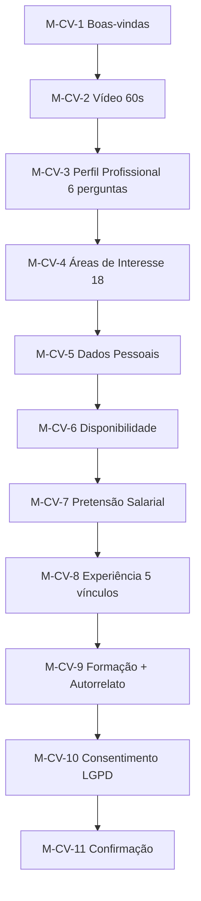

> **Origem**: `60-sources/master-sindico-research/client-material/pdfs/2026-03-09-estrutura-cadastro-curriculo.pdf` (304 linhas extraídas).
> **Absorvido em**: 2026-04-25 — Fase D.
> **Princípio**: este doc descreve **fluxos de tela e UX (frontend)**. Regras de negócio canônicas vivem em `04-requirements/functional/<bc>.md`. Cross-links em cada tela.

# Jornada — Currículo (Morador — Cadastro do Banco de Talentos)

## Sumário

- **Total de telas**: 11 (M-CV-1 a M-CV-11 — alinhadas com TEL1-TEL11 do catálogo macro).
- **App alvo**: `cms` (porta 3001).
- **Plan-tier**: morador `base` + addon **Banco de Talentos** opt-in (D-099 — addon livre, não exige upgrade).
- **Bounded context**: banco-talentos (sub-produto separado — D-099 / COM-049).
- **Persona alvo**: Morador (single).

## Decisão D-099 (banner — vindo do STATE)

> Banco de Talentos é addon **opt-in livre** para morador `base` (D-099). Não consome quota Connect Me. Vídeo de apresentação 60-90s com lock 90 dias após upload (anti-spam). 5 vínculos profissionais (não 3 — divergência resolvida em D-099). 18 áreas de interesse + 9 modalidades de contratação canônicas (COM-049).

## Mensagem institucional (boas-vindas)

> Aqui você é mais do que um currículo. Na Master Síndico, as empresas não procuram apenas experiência. Elas procuram pessoas que combinem com o ambiente de trabalho. Por isso, criamos um cadastro profissional que valoriza comportamento, postura e expectativas reais, ajudando você e as empresas a tomarem decisões mais alinhadas. Leva poucos minutos.

## Fluxo macro

---

## Telas

### M-CV-1 — Boas-vindas (TEL1)

**App**: `cms` · **Persona**: Morador · **Rota**: `/banco-talentos`

**Mensagem institucional**: ver banner acima.

**Ações**:
- [Começar meu cadastro profissional] → M-CV-2

**Estados**: idle, success.

**Regras**:
- Tela exibida apenas no primeiro acesso ao Banco de Talentos.
- Após cadastro inicial, M-CV-1 vira hub com [Editar perfil] / [Ver candidatos similares].

**Cross-links**:
- Aggregate: [[../../../01-domain/aggregates/Curriculum|Curriculum]]
- Reqs: [[../../../04-requirements/functional/commercial#REQ-COM-CV-INIT]] (COM-049)
- ADR: [[../../STATE#D-099|STATE D-099]] (Banco de Talentos addon; sem ADR dedicada) (D-099)

---

### M-CV-2 — Vídeo de Apresentação (60s) (TEL2)

**App**: `cms` · **Persona**: Morador · **Rota**: `/banco-talentos/video`

**Mensagem institucional**:
> Apresente-se em até 60 segundos. Grave um vídeo simples e direto. Não buscamos perfeição, buscamos clareza, profissionalismo e transparência. Esse vídeo ajuda as empresas a conhecerem você antes mesmo da entrevista.

**Sugestões de conteúdo** (texto auxiliar):
- Quem você é
- Como você trabalha
- O que considera importante em um ambiente profissional

**Observação legal** (banner):
> O vídeo é usado apenas para apresentação profissional. Não avaliamos aparência, sotaque ou estilo pessoal.

**Ações**:
- [Gravar vídeo] (browser MediaRecorder API)
- [Enviar vídeo] (upload Mux)

**Estados**: idle, recording, recorded (preview), uploading (progress), success, error, **video-locked** (após upload — bloqueia 90 dias).

**Regras**:
- Limite **60 segundos** (catálogo macro diz 90s — divergência registrada em `_pendencias-fase-h.md`; PDF é canônico = 60s).
- Lock 90 dias após upload (ADR-0033, anti-spam).
- Compressão Mux (HEVC) para mobile.

**Cross-links**:
- Aggregate: [[../../../01-domain/aggregates/Curriculum]]
- ADR: [[../../../02-architecture/adr/0010-mux-video-provider|ADR-0033]]
- Pattern: [[../../patterns/video-recorder-mux]]

---

### M-CV-3 — Perfil Profissional (6 perguntas abertas) (TEL3)

**App**: `cms` · **Persona**: Morador · **Rota**: `/banco-talentos/perfil`

**Mensagem institucional**:
> Queremos conhecer você no ambiente de trabalho. As perguntas abaixo não têm respostas certas ou erradas. Elas ajudam as empresas a entender como você se comporta no dia a dia profissional. Seja sincero.

**Perguntas** (textareas — 6):
1. Conte uma situação difícil que você viveu no trabalho e como lidou com ela.
2. O que você considera mais importante para trabalhar bem em equipe?
3. Como você costuma reagir quando recebe uma orientação ou correção no trabalho?
4. O que costuma tirar sua motivação no trabalho?
5. Que tipo de ambiente de trabalho ajuda você a dar o seu melhor?
6. Deseja acrescentar algo que considere importante sobre você como profissional? (optional)

**Ações**: [Continuar] → M-CV-4.

**Estados**: idle, autosave, submit-loading, success.

**Regras**:
- Cada pergunta tem voice input (R2 cross-cutting).
- Limite de chars sugerido (não obrigatório — sugestão UX 500 chars/pergunta).

**Cross-links**:
- Aggregate: [[../../../01-domain/aggregates/Curriculum]]
- Reqs: [[../../../04-requirements/functional/commercial#REQ-COM-CV-PERFIL]] (COM-049)
- Pattern: [[../../patterns/voice-input-textarea]]

---

### M-CV-4 — Áreas de Interesse (TEL4)

**App**: `cms` · **Persona**: Morador · **Rota**: `/banco-talentos/areas`

**Mensagem institucional**:
> Em quais áreas você tem interesse em trabalhar? Selecione uma ou mais áreas. Para cada área escolhida, descreva qual função, cargo ou tipo de atividade você busca dentro dela.

**Lista de áreas (checkbox — 18 áreas canônicas)**:
1. Operações Condominiais
2. Limpeza, Conservação e Higienização
3. Manutenção Predial
4. Segurança Patrimonial
5. Obras, Reformas e Adequações
6. Administração e Apoio Administrativo
7. Atendimento, Relacionamento e Suporte
8. Logística, Almoxarifado e Suprimentos
9. Gestão, Coordenação e Liderança Operacional
10. Treinamento, Qualidade, Processos e Compliance
11. Tecnologia, Sistemas e Suporte Digital
12. Comercial, Vendas e Parcerias
13. Comunicação, Marketing e Conteúdo
14. Financeiro, Contábil e Controladoria
15. Jurídico, Contratos e Compliance Legal
16. Recursos Humanos e Gestão de Pessoas
17. Apoio Operacional Externo
18. Outras Áreas

**Por área selecionada**: campo "Dentro dessa área, qual função ou atividade você busca?" (text curto — exemplos: portaria diurna, limpeza de áreas comuns, manutenção elétrica, apoio administrativo, supervisão de equipes).

**Ações**: [Continuar] → M-CV-5.

**Estados**: idle, success.

**Cross-links**:
- Enum: [[../../../01-domain/enums/curriculum-areas|18 áreas curriculum]] (COM-049)
- Aggregate: [[../../../01-domain/aggregates/Curriculum]]

---

### M-CV-5 — Dados Pessoais (TEL5)

**App**: `cms` · **Persona**: Morador · **Rota**: `/banco-talentos/dados`

**Mensagem institucional**:
> Vamos aos seus dados básicos.

**Campos obrigatórios**:
- Nome completo
- Telefone
- E-mail
- CEP (apenas para identificar **bairro** — banner explicativo)
- Idade
- Estado civil
- Possui filhos? (Sim/Não)
- Carteira de habilitação: (Não / A / B / AB)
- Cursos NR (multi-select): NR-10 / NR-33 / NR-35 / Outros (campo aberto)

**Banner privacidade**:
> Esses dados não são usados como critério de exclusão.

**Ações**: [Continuar] → M-CV-6.

**Cross-links**:
- Aggregate: [[../../../01-domain/aggregates/Curriculum]]
- Pattern: [[../../patterns/sensitive-data-disclaimer]]
- Reqs: [[../../../04-requirements/functional/commercial#REQ-COM-CV-DADOS]] (COM-049)

---

### M-CV-6 — Disponibilidade e Contratação (TEL6)

**App**: `cms` · **Persona**: Morador · **Rota**: `/banco-talentos/disponibilidade`

**Modalidades aceitas (multi-select — 9 modalidades canônicas)**:
1. CLT
2. PJ
3. Estágio
4. Temporário
5. Folguista
6. Diarista
7. Freelancer
8. Intermitente
9. Outros

**Horários disponíveis** (multi):
- Diurno
- Noturno
- Escala
- Finais de semana

**Início disponível** (radio): Imediato / Até 15 dias / A combinar.

**Tempo de deslocamento aceitável** (radio): Até 30 minutos / Até 1 hora / Até 1h30.

**Ações**: [Continuar] → M-CV-7.

**Cross-links**:
- Enum: [[../../../01-domain/enums/curriculum-modalidades|9 modalidades]] (COM-049)
- Aggregate: [[../../../01-domain/aggregates/Curriculum]]

---

### M-CV-7 — Pretensão Salarial (TEL7)

**App**: `cms` · **Persona**: Morador · **Rota**: `/banco-talentos/pretensao`

**Mensagem institucional**:
> Essa informação ajuda as empresas a entender se existe compatibilidade financeira antes do contato.

**Campos**:
- Valor mínimo esperado (R$)
- Valor ideal (R$)

**Ações**: [Continuar] → M-CV-8.

**Estados**: idle, success.

**Cross-links**:
- Aggregate: [[../../../01-domain/aggregates/Curriculum]]
- Pattern: [[../../patterns/currency-input]]

---

### M-CV-8 — Experiência Profissional (TEL8) — **5 vínculos** (D-099)

**App**: `cms` · **Persona**: Morador · **Rota**: `/banco-talentos/experiencia`

**Mensagem institucional**:
> Sua experiência profissional. Últimos 5 vínculos.

**Por vínculo** (até 5 — array repeater):
- Empresa
- Função exercida
- Atividades desenvolvidas na empresa
- Tempo de permanência (data início / fim ou "Atual")
- Motivo de saída (select):
  - Término de contrato
  - Nova oportunidade
  - Ajuste de horário
  - Outros (campo aberto)

**Ações**: [Continuar] → M-CV-9.

**Estados**: idle, autosave, success.

**Regras**:
- **5 vínculos** (D-099 — divergência com TEL8 catálogo macro que dizia "3 vs 5 inconsistência"; resolvida em D-099 = 5).

**Cross-links**:
- Aggregate: [[../../../01-domain/aggregates/Curriculum]]
- ADR: [[../../STATE#D-099|STATE D-099]] (Banco de Talentos addon; sem ADR dedicada) (D-099)
- Reqs: [[../../../04-requirements/functional/commercial#REQ-COM-CV-EXPERIENCIA]] (COM-049)

---

### M-CV-9 — Formação e Autorrelato (TEL9)

**App**: `cms` · **Persona**: Morador · **Rota**: `/banco-talentos/formacao`

**Por formação** (array repeater):
- Curso
- Instituição
- Relevância profissional do curso (optional, text)

**Pergunta autorrelato** (textarea):
- "O que você faz bem no seu trabalho?"

**Ações**: [Continuar] → M-CV-10.

**Cross-links**:
- Aggregate: [[../../../01-domain/aggregates/Curriculum]]
- Reqs: [[../../../04-requirements/functional/commercial#REQ-COM-CV-FORMACAO]] (COM-049)

---

### M-CV-10 — Consentimento LGPD (TEL10)

**App**: `cms` · **Persona**: Morador · **Rota**: `/banco-talentos/lgpd`

**Objetivo**: segurança jurídica.

**Texto**:
> Declaro que as informações fornecidas são verdadeiras e autorizo o uso dos meus dados exclusivamente para fins de recrutamento e seleção, conforme a LGPD. Estou ciente de que a Master Síndico não garante contratação e atua apenas como plataforma de conexão entre profissionais e empresas.

**Checkbox**: [✓] Concordo com os termos.

**Ações**: [Finalizar cadastro] → M-CV-11.

**Estados**: idle, accepted (botão habilita), submit-loading, success.

**Cross-links**:
- Aggregate: [[../../../01-domain/aggregates/LegalAcceptance]]
- Reqs: [[../../../04-requirements/functional/compliance#REQ-CPL-CV-LGPD]]
- Pattern: [[../../patterns/legal-terms-checkbox]]

---

### M-CV-11 — Confirmação (TEL11)

**App**: `cms` · **Persona**: Morador · **Rota**: `/banco-talentos/confirmacao`

**Mensagem**:
> Cadastro concluído com sucesso! Seu perfil profissional agora faz parte da Master Síndico. As empresas poderão visualizar suas informações, respostas e vídeo para avaliar compatibilidade com o ambiente de trabalho. Você pode atualizar seu perfil sempre que quiser.

> Aqui, comportamento e alinhamento importam.

**Ações**: [Voltar ao painel] → M1.

**Estados**: success.

**Regras**:
- Após confirmação, perfil entra no índice search (cross-link com [[../cross/search-engine|search-engine]]).
- Empresa começa a poder achar este candidato (ver [[curriculo-empresa-view]]).

**Cross-links**:
- Aggregate: [[../../../01-domain/aggregates/Curriculum]]
- Cross-app: [[curriculo-empresa-view|curriculo-empresa-view]]
- Reqs: [[../../../04-requirements/functional/commercial#REQ-COM-CV-COMPLETE]]

---

## Pendências detectadas

- **Duração do vídeo** (M-CV-2): PDF diz **60s**, catálogo macro diz **90s** (TEL2). Divergência: PDF canônico, registrar mudança no macro. Registrado em `_pendencias-fase-h.md`.
- **5 vs 3 vínculos** (M-CV-8): D-099 resolveu = 5; catálogo macro mencionava "inconsistência 3 vs 5 (resolver M1)" — agora resolvido para 5.
- **Idade** (M-CV-5): coletada como int (não data nascimento) — pendência para validação.

## Vizinhos

- [[_moc|jornadas/_moc]]
- [[curriculo-empresa-view|curriculo-empresa-view]] (lado empresa visualizando)
- [[../banco-talentos/_moc|ui-catalog/banco-talentos/]] (Fase B sub-features)
- [[../../ui-catalog|ui-catalog macro]] (TEL1-TEL11)
- [[../../../STATE|STATE]] (D-099)
