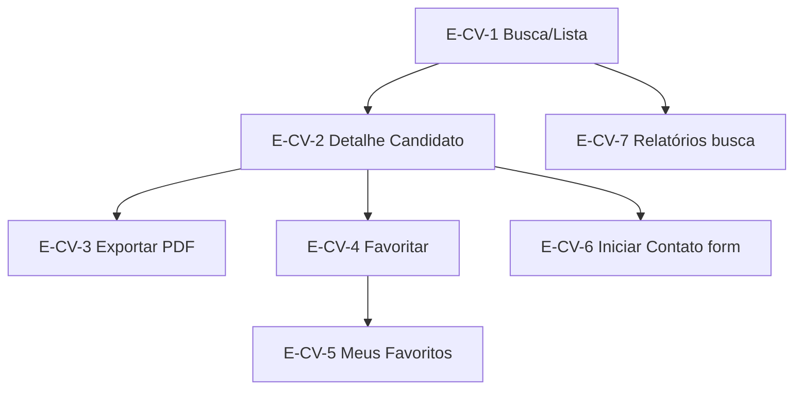

> **Origem**: `60-sources/master-sindico-research/client-material/pdfs/2026-03-09-empresa-ve-curriculo-morador.pdf` (217 linhas extraídas).
> **Absorvido em**: 2026-04-25 — Fase D.
> **Princípio**: este doc descreve **fluxos de tela e UX (frontend)**. Regras de negócio canônicas vivem em `04-requirements/functional/<bc>.md`. Cross-links em cada tela.

# Jornada — Currículo (Empresa — Visualização e Triagem)

## Sumário

- **Total de telas**: 7 (E-CV-1 a E-CV-7).
- **App alvo**: `cms` (porta 3001).
- **Plan-tier**: empresa `plus+pro`. Banco de Talentos é addon livre para morador (D-099) mas para empresa requer plan-tier ativo.
- **Bounded context**: banco-talentos (sub-produto) + commercial (busca/triagem).
- **Persona alvo**: Empresa (admin + operador técnico com permissão).

## Consideração crítica de privacidade (banner — vindo do PDF)

> A empresa **NÃO** terá acesso aos dados de contato do dono do currículo, **apenas por preenchimento de formulário**, onde a plataforma envia notificação via e-mail (e SMS se possível).

Empresa pesquisa, favorita, exporta PDF, mas para entrar em contato precisa preencher formulário → plataforma encaminha ao morador. Morador autoriza ou recusa.

## Fluxo macro



---

## Telas

### E-CV-1 — Busca / Lista de Candidatos

**App**: `cms` · **Persona**: Empresa (plus+pro) · **Rota**: `/empresa/banco-talentos`

**Layout**: lista de cards de candidatos com filtros sticky.

**Card do candidato**:
- (sem foto / sem dado de contato — privacidade)
- Nome (parcial — primeiro nome + inicial)
- Bairro
- Áreas de interesse (badges — top 2)
- **Tags automáticas (até 4 — ver abaixo)**
- Status do perfil (badge: Perfil completo / Faltando vídeo / etc.)

**Tags automáticas (100% por regra) — recomendadas**:

#### A.1 — Status do perfil
- Perfil completo (tem vídeo + 6 respostas + área selecionada)
- Faltando vídeo
- Faltando respostas
- Faltando área de interesse

#### A.2 — Disponibilidade
- Diurno
- Noturno
- Escala
- Finais de semana
- Início imediato
- Início em até 15 dias

#### A.3 — Contratação
- Aceita CLT
- Aceita Temporário
- Aceita Folguista
- Aceita Diarista
- Aceita Freelancer

#### A.4 — Deslocamento
- Deslocamento até 30 min
- Deslocamento até 1h
- Deslocamento até 1h30

#### A.5 — Pretensão salarial
- Pretensão informada
- Pretensão não informada
- Faixa até R$ X / Faixa R$ X-Y / Acima de R$ Y (X/Y definidos pela empresa no filtro, não pela plataforma)

#### A.6 — Formação
- Ensino médio completo
- Técnico
- Superior
- Cursos NR informados

#### A.7 — Experiência
- Experiência informada
- Sem experiência informada
- Mais de 2 anos no último vínculo (regra baseada no tempo preenchido)

**Como aparece no card** (regra UX):
- Mostrar no máximo 4 tags:
  - 1 tag de status (Perfil completo / Faltando vídeo)
  - 1-2 de disponibilidade (Diurno / Escala)
  - 1 de contratação (Aceita CLT)
  - 1 de deslocamento (até 1h)
- O resto fica no perfil completo (E-CV-2).

**Filtros disponíveis**:
- Áreas de interesse (multi)
- Disponibilidade (multi)
- Modalidades aceitas (multi)
- Faixa salarial
- Bairro / cidade (filtro geográfico)
- Tags automáticas (combinador)
- Status do perfil

**Ações**:
- [Ver perfil] → E-CV-2

**Estados**: empty, loading, eof, error.

**Regras**:
- Tags geradas automaticamente do cadastro do morador (M-CV-* — ver `curriculo-cadastro.md`).
- **Regra mestre**: tags só vêm de campos estruturados (checkbox/dropdown/número). Nada de "ler as respostas abertas" (isso seria IA/NLP — fase 2).

**Cross-links**:
- Aggregate: [[../../../01-domain/aggregates/Curriculum|Curriculum]]
- Reqs: [[../../../04-requirements/functional/commercial#REQ-COM-CV-SEARCH]] (COM-049)
- Cross-app: [[curriculo-cadastro|curriculo-cadastro]]
- Pattern: [[../../patterns/auto-tags-rule-based]]

---

### E-CV-2 — Detalhe do Candidato

**App**: `cms` · **Persona**: Empresa · **Rota**: `/empresa/banco-talentos/:candidateId`

**Layout**: perfil completo do candidato.

**Informações exibidas**:
- Nome (parcial — primeiro nome + inicial sobrenome)
- Bairro (sem rua/CEP)
- Áreas de interesse + subárea/cargo desejado (texto do candidato)
- Disponibilidade + modalidades + início + deslocamento
- Pretensão salarial (mín/ideal)
- Formação e cursos
- Experiência (até 5 vínculos — D-099)
- 6 perguntas abertas (em blocos)
- Vídeo de apresentação (player Mux com link/QR)
- Todas as tags automáticas + manuais

**Tags manuais** (curadoria da empresa — seção):
- A empresa marca na própria triagem (sem algoritmo)
- Sugestões pré-preenchidas:
  - Boa comunicação
  - Postura excelente
  - Pontualidade (referida)
  - Perfil calmo
  - Perfil proativo
  - Precisa supervisão
  - Atenção a detalhes
  - Bom para rotina
  - Bom com público
  - A avaliar em entrevista
  - CNH
  - NR
- [Criar tag] (opcional — empresa cria suas próprias)

**Ações**:
- [Exportar PDF] → E-CV-3
- [Favoritar] → toggle (E-CV-4)
- [Iniciar contato] → E-CV-6
- [Adicionar tag manual] (modal)

**Estados**: loading, success, error, **contato-pending** (badge se já enviou form e morador não respondeu).

**Regras**:
- **Sem dados de contato** visíveis (privacidade — banner inicial).
- Tags manuais armazenadas em `candidate_company_tags(company_id, candidate_id, tag_id)`.

**Cross-links**:
- Aggregate: [[../../../01-domain/aggregates/Curriculum]]
- Aggregate: [[../../../01-domain/aggregates/CompanyTag|CompanyTag]]
- Reqs: [[../../../04-requirements/functional/commercial#REQ-COM-CV-DETAIL]] (COM-049)
- Invariante: [[../../../01-domain/invariants#INV-CURRICULUM-NO-DIRECT-CONTACT]]

---

### E-CV-3 — Exportar PDF (obrigatório)

**App**: `cms` · **Persona**: Empresa · **Rota**: action button (gera download)

**Onde aparece**: botão "Exportar PDF" na tela do candidato (E-CV-2) e opcionalmente no card da lista (E-CV-1).

**Conteúdo do PDF (1-2 páginas, layout simples)**:
- Cabeçalho: Master Síndico + data/hora da exportação + empresa que exportou
- Dados do candidato: Nome, bairro
- Áreas de interesse + subárea/cargo desejado (texto do candidato)
- Disponibilidade + modalidades + início + deslocamento
- Pretensão salarial (mín/ideal)
- Formação e cursos
- Experiência (últimos 3 vínculos — PDF dizia 3, mas D-099 = 5; pendência registrada)
- Perguntas abertas (6) – em blocos
- **Link/QR do vídeo** (em vez de embutir vídeo)

**Implementação**: HTML → PDF (template único, sem design complexo).

**Estados**: idle, generating-loading, success (download), error.

**Regras**:
- Cada export gera log em `pdf_exports(company_id, candidate_id, created_at)`.
- Audit + métrica para E-CV-7.

**Cross-links**:
- Reqs: [[../../../04-requirements/functional/commercial#REQ-COM-CV-PDF-EXPORT]]
- Pattern: [[../../patterns/pdf-export-template]]

---

### E-CV-4 — Favoritar (toggle)

**App**: `cms` · **Persona**: Empresa · **Rota**: action button no card / detalhe

**UX**: ícone star (vazio / preenchido) no card e no perfil.

**Tabela** (backend simplificada): `favorites(company_id, candidate_id, created_at)`.

**Ações**:
- [Favoritar] / [Desfavoritar] (toggle)

**Estados**: idle, success (animação heart), error.

**Cross-links**:
- Reqs: [[../../../04-requirements/functional/commercial#REQ-COM-CV-FAVORITE]]

---

### E-CV-5 — Meus Favoritos

**App**: `cms` · **Persona**: Empresa · **Rota**: `/empresa/banco-talentos/favoritos`

**Layout**: lista de candidatos favoritados, com **mesmos filtros da lista E-CV-1**.

**Estados**: empty, loading, success.

**Cross-links**:
- Pattern: [[../../patterns/saved-list]]

---

### E-CV-6 — Iniciar Contato (formulário)

**App**: `cms` · **Persona**: Empresa · **Rota**: `/empresa/banco-talentos/:candidateId/contato`

**Propósito**: empresa preenche formulário → plataforma envia notificação ao morador (e-mail + SMS se possível). Morador autoriza ou recusa contato.

**Campos**:
- Mensagem para o candidato (textarea, required)
- Tipo de oportunidade (CLT / PJ / Temporário / etc. — multi)
- Faixa salarial proposta (optional, min-max)
- Modo preferido de retorno (e-mail / telefone — usado pelo morador caso aceite revelar)

**Ações**:
- [Enviar formulário] → notificação ao morador
- [Cancelar]

**Estados**: idle, submit-loading, success ("Enviado. Aguarde retorno do morador."), error, **already-contacted** (banner com data — bloqueia novo envio dentro de janela cooldown N dias).

**Regras**:
- Plataforma notifica morador via e-mail + SMS.
- Morador autoriza ou recusa em painel próprio (M1 → notificação).
- Empresa **NÃO** vê dados de contato direto até morador autorizar.

**Cross-links**:
- Aggregate: [[../../../01-domain/aggregates/ContactRequest|ContactRequest]] (NOVO — registrar em `_pendencias-fase-h.md` se ainda não existe)
- Reqs: [[../../../04-requirements/functional/commercial#REQ-COM-CV-CONTACT-REQUEST]]
- Invariante: [[../../../01-domain/invariants#INV-CURRICULUM-NO-DIRECT-CONTACT]]
- LGPD: [[../../../02-architecture/adr/0028-lgpd-keyed-hmac|ADR-0028]]

---

### E-CV-7 — Relatórios de Busca (analytics simples)

**App**: `cms` · **Persona**: Empresa · **Rota**: `/empresa/banco-talentos/relatorios`

**Propósito**: "analytics útil", não dashboard complexo.

#### Relatório 1: Histórico de buscas

**Tabela**: `search_logs(company_id, created_at, filters_json, results_count, complete_count)`.

**Lista exibida**:
- Data/hora
- Filtros usados (json — chip preview)
- Total de resultados retornados
- Quantos perfis completos no resultado
- [Reaplicar busca] → executa filtro novamente em E-CV-1

#### Relatório 2: Funil simples da empresa (ações)

**Tabelas suporte**:
- `candidate_views(company_id, candidate_id, created_at)`
- `pdf_exports(company_id, candidate_id, created_at)`
- `favorites` (já existente E-CV-4)

**Indicadores** (cards):
- Visualizações de perfis (quantas vezes abriu um candidato)
- Favoritados
- PDFs exportados
- (extensão futura) Formulários de contato enviados / aceitos / recusados

**Filtros**: período.

**Estados**: empty, loading, success.

**Cross-links**:
- Reqs: [[../../../04-requirements/functional/commercial#REQ-COM-CV-REPORTS]]
- Pattern: [[../../patterns/dashboard-kpi-cards]]
- Pattern: [[../../patterns/saved-search]]

---

## Tabelas de suporte (visão simplificada — para devs)

```sql
-- Engagement / triagem
favorites(company_id, candidate_id, created_at)
candidate_views(company_id, candidate_id, created_at)
pdf_exports(company_id, candidate_id, created_at)

-- Tags manuais
company_tags(id, company_id, name)
candidate_company_tags(company_id, candidate_id, tag_id)

-- Buscas
search_logs(company_id, created_at, filters_json, results_count, complete_count)

-- Solicitações de contato (E-CV-6)
contact_requests(id, company_id, candidate_id, message, status, created_at, responded_at, response)
```

## Pendências detectadas

- **Vínculos no PDF export**: PDF do cliente diz "últimos 3 vínculos" no export, mas D-099 estabelece 5 vínculos. Resolver: export pode ser truncado em 3 (UX simples) mas dado completo permanece com 5. Registrado em `_pendencias-fase-h.md`.
- **Aggregate `ContactRequest`**: pode não existir ainda em `01-domain/aggregates/`. Registrar em `_pendencias-fase-h.md` para Fase H criar/confirmar.
- **Cooldown de contato** (E-CV-6) — janela em dias não definida. Pendência.
- **Tags IA** (Fase 2) — leitura das respostas abertas para gerar tags semânticas. Marcado explicitamente como NÃO Fase 1.

## Vizinhos

- [[_moc|jornadas/_moc]]
- [[curriculo-cadastro|curriculo-cadastro]] (lado morador — fonte dos dados)
- [[../banco-talentos/_moc|ui-catalog/banco-talentos/]] (Fase B sub-features)
- [[../empresa|ui-catalog/empresa/]]
- [[../../ui-catalog|ui-catalog macro]] (visualização Empresa Banco Talentos — 7 funcionalidades)
- [[../../../STATE|STATE]] (D-099)
