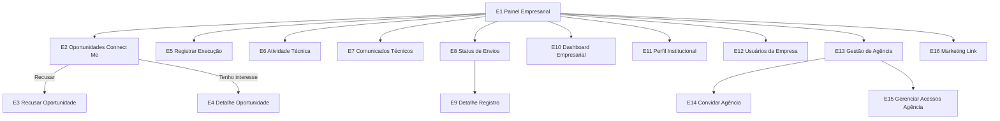

> **Origem**: `60-sources/master-sindico-research/client-material/pdfs/2026-03-09-jornada-empresa.pdf` (606 linhas extraídas).
> **Absorvido em**: 2026-04-25 — Fase D. Tradução aplicada: `N1/N2/N3` → `plan_tier ∈ {trial, base, plus, pro}`; "My Síndico" → "Master Síndico".
> **Princípio**: este doc descreve **fluxos de tela e UX (frontend)**. Regras de negócio canônicas vivem em `04-requirements/functional/<bc>.md`. Cross-links em cada tela.

# Jornada — Empresa

## Sumário

- **Total de telas**: 16 (E1-E16).
- **App alvo**: `cms` (porta 3001, `app.mastersindico.com.br`).
- **Plan-tier**: trial (7d) → plus (responde Connect Me, recebe oportunidades) → pro (envia Connect Me E→E também).
- **Bounded contexts**: identity, commercial (Connect Me, oportunidades, execução, validações), institutional (perfil empresa), governance (timeline indireta — só após validação síndico).
- **Persona alvo**: Empresa Plus/Pro (admin + operador técnico). Conta multi-usuário.

## Pilares (banner — vindo do PDF)

A jornada da empresa é responsável por **três pilares**:
- **Relacionamento com síndicos** (Connect Me)
- **Registro técnico** das atividades executadas
- **Construção da reputação institucional**

**Regra estrutural global**: todas as interações da empresa com o condomínio passam pela **validação do síndico** (R3 — ver jornada do síndico), garantindo governança e rastreabilidade.

## Fluxo macro

---

## Telas

### E1 — Painel Empresarial (Home)

**App**: `cms` · **Persona**: Empresa · **Rota**: `/empresa` (quando persona empresa ativa) · **Plan-tier**: trial+plus+pro · **TELA-PIVÔ**

**Propósito**: Centro de comando da empresa.

**Mensagem institucional**:
> Este é o espaço onde sua empresa se conecta ao ecossistema condominial. Aqui você acompanha oportunidades, registra atividades técnicas e fortalece a transparência dos serviços prestados aos condomínios.

**Cards** (10):
1. Oportunidades (Connect Me) → E2
2. Registrar execução → E5
3. Atividades técnicas → E6
4. Comunicados técnicos → E7
5. Status de envios → E8
6. Dashboard empresarial → E10
7. Perfil institucional → E11
8. Usuários da empresa → E12
9. Gestão de agência de marketing → E13
10. Marketing Link → E16

**Indicadores em tempo real** (badges):
- Novas oportunidades
- Propostas aguardando resposta
- Votações em curso (assembly D-133)
- Negócios ativos
- Execuções pendentes (rascunho / aguardando validação)
- Garantias vencendo
- Avaliações recebidas
- Comunicados rejeitados

**Ações** por card: [Acessar módulo].

**Regras**:
- Painel deve apresentar notificações de pendências (R3 — backend → frontend via WS).

**Cross-links**:
- Persona: [[../../../00-product/personas#empresa]]
- Pattern: [[../../patterns/dashboard-cards-pivot]]
- Reqs: [[../../../04-requirements/functional/commercial#REQ-COM-EMPRESA-HOME]]

---

### E2 — Oportunidades (Connect Me)

**App**: `cms` · **Persona**: Empresa · **Rota**: `/empresa/oportunidades` · **Plan-tier**: plus+pro

**Propósito**: Listar oportunidades do tipo Síndico→Empresa.

**Mensagem institucional**:
> Síndicos podem registrar demandas de serviço para empresas da plataforma. Aqui você acompanha as oportunidades e decide se deseja participar da conversa.

**Card exibido**:
- Condomínio
- Cidade / Bairro
- Categoria do serviço
- Subcategoria
- Descrição da necessidade
- Data da solicitação

**Filtros**: categoria, bairro, período, status.

**Ações** por card:
- [Tenho interesse] → E4 (revela contato síndico)
- [Recusar] → E3 (modal motivo)

**Estados**: empty, loading, success, eof.

**Regras**:
- Empresa precisa estar com perfil completo + plan-tier ativo.
- Categoria filtra automaticamente (matching com áreas de atuação cadastradas em E11).

**Cross-links**:
- Aggregate: [[../../../01-domain/aggregates/connect-me|ConnectMe]]
- Reqs: [[../../../04-requirements/functional/commercial#REQ-COM-CONNECTME-EMPRESA]]

---

### E3 — Recusar Oportunidade (modal)

**App**: `cms` · **Persona**: Empresa · **Rota**: modal sobre E2 · **Plan-tier**: plus+pro

**Mensagem institucional**:
> Ao recusar uma solicitação, informe o motivo para manter a transparência da relação com o síndico.

**Campo — Motivo da recusa** (select required):
- Fora da área de atendimento
- Serviço fora da especialidade da empresa
- Agenda indisponível no período solicitado
- Conflito com serviços já agendados
- Orçamento incompatível com o escopo
- Outro motivo

**Campo adicional**: Justificativa detalhada (text — required se motivo = "Outro").

**Ações**:
- [Enviar recusa]
- [Cancelar]

**Regras**:
- Sistema envia automaticamente mensagem ao síndico informando a recusa.
- Registrar histórico da recusa no banco da oportunidade (audit trail).

**Cross-links**:
- Aggregate: [[../../../01-domain/aggregates/connect-me]]
- Reqs: [[../../../04-requirements/functional/commercial#REQ-COM-CONNECTME-RECUSA]]

---

### E4 — Detalhe da Oportunidade

**App**: `cms` · **Persona**: Empresa · **Rota**: `/empresa/oportunidades/:cmId` · **Plan-tier**: plus+pro

**Mensagem institucional**:
> Ao demonstrar interesse, sua empresa passa a ter acesso aos contatos do síndico para continuidade da conversa.

**Informações exibidas** (após "Tenho interesse"):
- Nome do condomínio
- Nome do síndico
- Telefone
- Email
- Descrição completa da demanda

**Ações**:
- [Entrar em contato] (link tel: ou mailto:)
- [Marcar como em negociação] (status interno empresa)
- [Encerrar oportunidade]

**Estados**: idle, success, error.

**Regras**:
- LGPD log ao revelar contato.
- Empresa pode atualizar status para organização interna (não muda no síndico).

**Cross-links**:
- Aggregate: [[../../../01-domain/aggregates/connect-me]]
- Invariante: [[../../../01-domain/invariants#INV-LGPD-DATA-REVEAL]]
- Reqs: [[../../../04-requirements/functional/commercial#REQ-COM-CONNECTME-INTEREST]]

---

### E5 — Registrar Execução

**App**: `cms` · **Persona**: Empresa (admin ou operador técnico) · **Rota**: `/empresa/execucao/novo` · **Plan-tier**: plus+pro

**Mensagem institucional**:
> Registrar a execução de um serviço fortalece a transparência da gestão e contribui para a memória técnica do condomínio.

**Campos**:
- Condomínio atendido (select autocomplete — apenas condomínios com vínculo ativo)
- Tipo de serviço executado (select)
- Descrição da execução (rich-text)
- Área impactada (lista mestre — ver S8)
- Natureza da atividade
- Status do serviço
- Data da execução
- Garantia do serviço (período)
- Orientações técnicas ao condomínio
- Materiais utilizados (optional)
- Fotos ou vídeos (upload — Mux para vídeos)

**Estados**: idle, autosave (rascunho), submit-loading, success, error.

**Ações**:
- [Salvar rascunho] (estado: `Rascunho`)
- [Enviar para validação do síndico] (estado: `Aguardando validação`)

**Regras**:
- **R3**: registro **NÃO** publica direto — entra em S26 (Validações Pendentes do síndico).
- Após validação do síndico, registro publica na Linha do Tempo do condomínio (atualiza PD se vinculado).

**Cross-links**:
- Aggregate: [[../../../01-domain/aggregates/ExecutionRecord|ExecutionRecord]]
- Reqs: [[../../../04-requirements/functional/commercial#REQ-COM-EXEC-CREATE]]
- State machine: [[../../../01-domain/state-machines#execution-record-states]]

---

### E6 — Atividade Técnica

**App**: `cms` · **Persona**: Empresa (admin ou operador técnico) · **Rota**: `/empresa/atividades-tecnicas/novo` · **Plan-tier**: plus+pro

**Mensagem institucional**:
> Empresas podem contribuir com informações técnicas relevantes para a gestão do condomínio, fortalecendo a prevenção de problemas.

**Campos**:
- Tipo de atividade técnica
- Descrição técnica
- Área impactada
- Nível de importância
- Risco identificado (9 níveis — ver S12)
- Impacto esperado
- Recomendação técnica
- Anexos

**Ações**:
- [Salvar rascunho]
- [Enviar para validação do síndico]

**Regras**:
- Após validação, atividade aparece na Linha do Tempo do condomínio.
- Variante técnica de E5.

**Cross-links**:
- Aggregate: [[../../../01-domain/aggregates/TimelineEntry]] (tipo: `atividade_tecnica_empresa`)
- Reqs: [[../../../04-requirements/functional/commercial#REQ-COM-ATIVIDADE-TECNICA]]

---

### E7 — Comunicados Técnicos

**App**: `cms` · **Persona**: Empresa (admin ou operador técnico) · **Rota**: `/empresa/comunicados-tecnicos` · **Plan-tier**: plus+pro

**Mensagem institucional**:
> Comunicados técnicos permitem orientar moradores e gestores sobre cuidados, recomendações e informações relevantes após a execução de serviços.

**Campos**:
- Tipo de comunicado
- Título
- Descrição
- (catálogo macro adiciona) Encerrar acesso (toggle)

**Ações**:
- [Enviar para validação] → vai para S26 do síndico
- [Salvar rascunho]

**Regras**:
- **R3**: comunicado da empresa entra como pendente de validação no módulo S24/S26 do síndico.

**Cross-links**:
- Aggregate: [[../../../01-domain/aggregates/Announcement]]
- Reqs: [[../../../04-requirements/functional/commercial#REQ-COM-COMUNICADO-TECNICO]]

---

### E8 — Status de Envios

**App**: `cms` · **Persona**: Empresa · **Rota**: `/empresa/envios` · **Plan-tier**: plus+pro

**Mensagem institucional**:
> Acompanhe o andamento das informações enviadas ao síndico e saiba quando elas foram aprovadas, ajustadas ou publicadas.

**Seções/Tabs**:
- Registros de execução enviados (E5)
- Atividades técnicas enviadas (E6)
- Comunicados enviados (E7)

**Status possíveis** (state machine):
`Rascunho | Enviado | Aguardando validação | Solicitado ajuste | Aprovado | Publicado | Rejeitado`.

**Ações**: [Ver detalhes] → E9.

**Filtros**: status, tipo, condomínio, período.

**Estados**: empty, loading, success, error.

**Cross-links**:
- State machine: [[../../../01-domain/state-machines#empresa-submission-states]]
- Reqs: [[../../../04-requirements/functional/commercial#REQ-COM-STATUS-ENVIOS]]

---

### E9 — Detalhe do Registro

**App**: `cms` · **Persona**: Empresa · **Rota**: `/empresa/envios/:executionId` · **Plan-tier**: plus+pro

**Mensagem institucional**:
> Aqui você acompanha o retorno da gestão do condomínio sobre as informações enviadas.

**Informações exibidas**:
- Conteúdo enviado (todos os campos do E5/E6/E7)
- Observação do síndico (se "solicitado ajuste" ou "rejeitado")
- Status atual

**Ações**:
- [Editar envio] (apenas se status `Rascunho` ou `Solicitado ajuste`)
- [Enviar novamente] (apenas após edição em ajuste)

**Estados**: loading, success, error, status-locked (não pode editar — `Aprovado`/`Publicado`/`Rejeitado`).

**Cross-links**:
- State machine: [[../../../01-domain/state-machines#empresa-submission-states]]
- Pattern: [[../../patterns/state-aware-actions]]

---

### E10 — Dashboard Empresarial

**App**: `cms` · **Persona**: Empresa · **Rota**: `/empresa/dashboard` · **Plan-tier**: plus+pro (KPIs avançados em pro)

**Mensagem institucional**:
> O dashboard reúne indicadores que ajudam sua empresa a acompanhar a atuação dentro da plataforma.

**Indicadores**:
- Condomínios conectados
- Solicitações Connect Me recebidas / aceitas / recusadas
- Registros enviados / aprovados / rejeitados
- Publicações na Linha do Tempo (originadas pela empresa / pelo síndico)
- Pendências (registros aguardando validação)
- Avaliação institucional média da empresa
- (catálogo macro) Conversão Connect Me, ranking categoria/região, garantias próximas vencimento, avaliação 5 critérios

**Filtros**: período (7d/30d/90d/12m).

**Estados**: loading, success, error.

**Regras**:
- Indicadores atualizados em tempo real (WS push do backend).

**Cross-links**:
- Reqs: [[../../../04-requirements/functional/commercial#REQ-COM-EMPRESA-DASHBOARD]]
- Pattern: [[../../patterns/dashboard-kpi-cards]]

---

### E11 — Perfil Institucional

**App**: `cms` · **Persona**: Empresa (admin) · **Rota**: `/empresa/perfil` · **Plan-tier**: trial+plus+pro

**Mensagem institucional**:
> O perfil institucional apresenta sua empresa para síndicos e fortalece sua reputação dentro da plataforma.

**Campos**:
- Razão social / Nome fantasia / CNPJ
- Cidade / Estado
- Telefone / Email / Site
- Logo
- Descrição institucional (rich-text)
- Segmento de atuação (categoria principal)
- Subcategoria do serviço
- (catálogo macro) Vídeos institucionais, portfolio, áreas de atuação, certificações — edita com **trava 90d em vídeos**

**Estados**: idle, edit-mode, autosave, submit-loading, success, error, video-locked (até 90d).

**Regras**:
- Perfil pode ser visualizado por síndicos (gate ABAC).
- Vídeos com lock de 90 dias após upload (anti-spam).

**Cross-links**:
- Aggregate: [[../../../01-domain/aggregates/EmpresaProfile|EmpresaProfile]]
- Reqs: [[../../../04-requirements/functional/institutional#REQ-INS-EMPRESA-PROFILE]]
- ADR: [[../../../02-architecture/adr/0010-mux-video-provider|ADR-0033]]

---

### E12 — Usuários da Empresa

**App**: `cms` · **Persona**: Empresa (admin) · **Rota**: `/empresa/usuarios` · **Plan-tier**: plus+pro

**Mensagem institucional**:
> Cada usuário possui acesso individual à plataforma. Não compartilhe sua senha.

**Tipos de usuário**:
- **Administrador** — tudo
- **Operador técnico** — apenas: registrar execução, criar atividade técnica, enviar comunicados, publicar vídeos institucionais

**Lista exibida**: nome / email / tipo / status (ativo / convite pendente / encerrado).

**Ações**:
- [Adicionar usuário] (modal — email + tipo)
- [Remover usuário]

**Estados**: empty, loading, success, error.

**Regras**:
- Convite por email (token expira 7d).
- ABAC enforce: operador técnico bloqueado em E2/E4/E13/E14/E15/E16.

**Cross-links**:
- Aggregate: [[../../../01-domain/aggregates/EmpresaUser|EmpresaUser]]
- ABAC: [[../../../02-architecture/abac#empresa-user-roles]]
- Reqs: [[../../../04-requirements/functional/identity#REQ-IDN-EMPRESA-USERS]]

---

### E13 — Gestão de Agência de Marketing

**App**: `cms` · **Persona**: Empresa (admin) · **Rota**: `/empresa/agencia` · **Plan-tier**: plus+pro

**Mensagem institucional**:
> Caso sua empresa possua uma agência responsável pelos conteúdos institucionais, você pode autorizar o acesso para publicação de vídeos e acompanhamento das métricas.

**Lista exibida**: Nome da agência / Responsável / Email / Status.

**Status**: `Convite enviado | Ativa | Encerrada`.

**Ações**:
- [Convidar agência] → E14
- [Gerenciar acessos] → E15

**Estados**: empty, loading, success, error.

**Cross-links**:
- Aggregate: [[../../../01-domain/aggregates/AgenciaLink|AgenciaLink]]
- Cross-app: [[agencia-marketing|agencia-marketing]]
- Reqs: [[../../../04-requirements/functional/commercial#REQ-COM-AGENCIA-LINK]]

---

### E14 — Convidar Agência

**App**: `cms` · **Persona**: Empresa (admin) · **Rota**: `/empresa/agencia/convidar` · **Plan-tier**: plus+pro

**Campos**:
- Nome da agência
- Responsável
- Email (required)
- Telefone

**Checkbox**:
> Autorizo esta agência a administrar os conteúdos institucionais da minha empresa na plataforma Master Síndico.

**Ações**:
- [Enviar convite] → gera token + email

**Estados**: idle, submit-loading, success, error.

**Regras**:
- Convite via token (expira 7d).
- Audit trail.

**Cross-links**:
- Reqs: [[../../../04-requirements/functional/commercial#REQ-COM-AGENCIA-CONVITE]]
- Pattern: [[../../patterns/token-invite]]

---

### E15 — Gerenciar Acessos da Agência

**App**: `cms` · **Persona**: Empresa (admin) · **Rota**: `/empresa/agencia/acessos` · **Plan-tier**: plus+pro

**Mensagem institucional**:
> Você pode encerrar o acesso da agência a qualquer momento.

**Informações exibidas**: nome da agência / responsável / email / data início do acesso.

**Ações**:
- [Encerrar acesso]

**Regras**:
- Encerrar não remove histórico de vídeos publicados (R3 nada deletado).

**Cross-links**:
- Aggregate: [[../../../01-domain/aggregates/AgenciaLink]]
- Reqs: [[../../../04-requirements/functional/commercial#REQ-COM-AGENCIA-ENCERRAR]]

---

### E16 — Formulário Marketing Link

**App**: `cms` · **Persona**: Empresa (admin) · **Rota**: `/empresa/marketing-link` (ou `/agencias/:id/marketing-link` no perfil da agência) · **Plan-tier**: plus+pro

**Propósito**: Empresa expressa intenção de contato com agência (NÃO cria vínculo automático — só E13/E14 criam).

**Mensagem institucional**:
> Se sua empresa deseja fortalecer sua presença institucional na plataforma Master Síndico, registre aqui sua solicitação de contato com esta agência de marketing.

**Campos** — Empresa:
- Nome da empresa
- Nome do responsável
- Telefone
- Email

**Campos** — Necessidade de Marketing:
- Tipo de apoio desejado (select):
  - Produção de vídeos institucionais
  - Gestão de conteúdos técnicos
  - Estratégia de posicionamento no mercado condominial
  - Gestão de redes sociais
  - Consultoria de marketing para empresas de serviço
  - Outro
- Prioridade (`Imediato | Nos próximos 30 dias | Sem prazo definido`)
- Descrição da necessidade (rich-text)

**Ações**:
- [Enviar solicitação]
- [Cancelar]

**Estados**: idle, submit-loading, success, error.

**Regras** (importantes):
- **NÃO gera vínculo automático** — apenas registra intenção.
- Vínculo oficial só ocorre quando empresa convida agência via E13/E14.
- Solicitação aparece no painel da agência em "Solicitações de Marketing Link" (MK8).

**Cross-links**:
- Aggregate: [[../../../01-domain/aggregates/MarketingLink|MarketingLink]]
- Reqs: [[../../../04-requirements/functional/commercial#REQ-COM-MARKETING-LINK]]
- Cross-app: [[agencia-marketing#mk8|agencia-marketing/MK8]]

---

## Pendências detectadas

- **E7** — campo "Encerrar acesso" no PDF aparece dentro de "Comunicados técnicos" mas é confuso (parece toggle mal-extraído). Registrado em `_pendencias-fase-h.md` para validar com cliente.
- **E10** — PDF lista 8 indicadores; catálogo macro lista 13. Reconciliação com Reqs Fase F.

## Vizinhos

- [[_moc|jornadas/_moc]]
- [[curriculo-empresa-view|curriculo-empresa-view]] (visualização Banco de Talentos)
- [[agencia-marketing|agencia-marketing]] (cross-link E13-E16)
- [[../../ui-catalog|ui-catalog macro]]
- [[../empresa|ui-catalog/empresa/]] — pasta com sub-features (Fase B)
