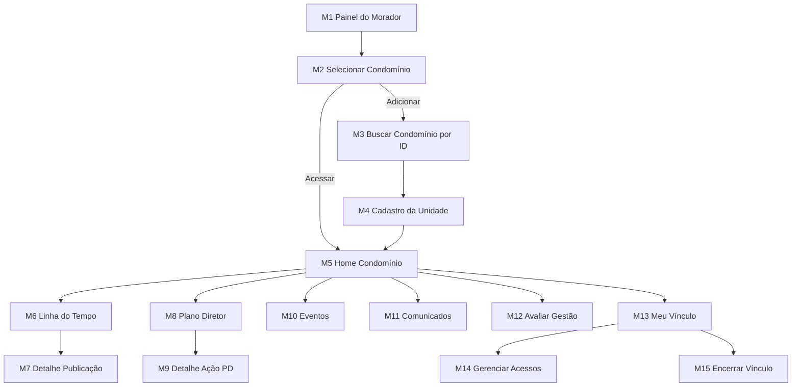

> **Origem**: `60-sources/master-sindico-research/client-material/pdfs/2026-03-09-jornada-morador.pdf` (619 linhas extraídas).
> **Absorvido em**: 2026-04-25 — Fase D. Tradução aplicada: "Morador Pagante" REMOVIDO (D-126) — morador é base gratuito + addon Banco de Talentos opt-in; "My Síndico" → "Master Síndico".
> **Princípio**: este doc descreve **fluxos de tela e UX (frontend)**. Regras de negócio canônicas vivem em `04-requirements/functional/<bc>.md`. Cross-links em cada tela.

# Jornada — Morador

## Sumário

- **Total de telas**: 15 (M1-M15).
- **App alvo**: `cms` (porta 3001, `app.mastersindico.com.br`).
- **Plan-tier**: morador é `base` gratuito (D-126); addon Banco de Talentos é opt-in (TEL1-TEL11 — ver `curriculo-cadastro.md`).
- **Bounded contexts**: identity, institutional (condomínio), governance (timeline, plano diretor, eventos, comunicados — read-only), commercial (avaliação bimestral).
- **Persona alvo**: Morador (titular ou dependente, vínculo proprietário/inquilino/morador autorizado).

## Regras estruturais (banner de leitura — vindas do PDF)

- **Regra 1** — A Linha do Tempo é a principal fonte de informação para o morador.
- **Regra 2** — **Morador NÃO publica conteúdos**. Apenas visualiza, responde perguntas da gestão, participa de eventos e avalia a gestão.
- **Regra 3** — Vínculo com unidade é **obrigatório**. Cada unidade tem 1 titular + até 2 dependentes.
- **Regra 4** — Dependentes não podem alterar status da unidade, remover titular, nem incluir novos dependentes.
- **Regra 5** — Unidade vazia → dependentes removidos automaticamente.

## Fluxo macro

---

## Telas

### M1 — Painel do Morador (Home)

**App**: `cms` · **Persona**: Morador · **Rota**: `/` (redirect baseado em persona ativa) · **Plan-tier**: base

**Propósito**: Conectar o morador à gestão do(s) condomínio(s).

**Mensagem institucional**:
> Este espaço conecta você à gestão do seu condomínio. Aqui você acompanha o que está sendo feito, entende as prioridades da administração e participa da construção de um ambiente mais organizado, seguro e transparente.

**Header**: nome + avatar + notificações + seletor de condomínio ativo.

**Cards/Botões**:
- Selecionar condomínio → M2
- Meu vínculo → M13
- Avaliar gestão → M12
- (catálogo macro adiciona) Meu Banco de Talentos → TEL1, Vizinhança → VM1

**Estados**: empty (sem vínculo → CTA "Adicionar meu primeiro condomínio" → M3), loading (skeleton cards), success.

**Regras**:
- Se morador tiver vínculo com mais de um condomínio, apresentar lista (M2).
- Múltiplos condomínios e múltiplas unidades permitidos.

**Cross-links**:
- Aggregate: [[../../../01-domain/aggregates/Membership|Membership]]
- Persona: [[../../../00-product/personas#morador]]
- Pattern: [[../../patterns/dashboard-cards-pivot]]

---

### M2 — Selecionar Condomínio

**App**: `cms` · **Persona**: Morador · **Rota**: `/condominios` · **Plan-tier**: base

**Propósito**: Selecionar o condomínio ao qual deseja se conectar.

**Mensagem institucional**:
> Selecione o condomínio ao qual você deseja se conectar para acompanhar as informações da gestão.

**Layout**: cards com nome, endereço resumido, unidade, tipo, vínculo, papel.

**Ações**:
- [Acessar] → M5
- [Adicionar novo] → M3
- [Gerenciar acessos] → M13

**Estados**: empty (CTA), loading, error.

**Cross-links**:
- Aggregate: [[../../../01-domain/aggregates/Membership]]
- Reqs: [[../../../04-requirements/functional/identity#REQ-IDN-CONDO-LIST-MORADOR]]

---

### M3 — Buscar Condomínio por ID

**App**: `cms` · **Persona**: Morador · **Rota**: `/condominios/adicionar` · **Plan-tier**: base

**Propósito**: Buscar e validar condomínio antes de cadastrar unidade.

**Campo**: ID alfanumérico 8 chars (gerado em S3).

**Validação automática** após inserir ID — sistema exibe:
- Nome do condomínio
- Endereço completo
- Cidade

**Mensagem**:
> Confirme se este é o condomínio correto antes de prosseguir com o cadastro da unidade.

**Estados**: idle, busca-loading, success (preview card), not-found, error.

**Ações**:
- [Confirmar] → M4
- [Buscar novamente]

**Regras**:
- Rate-limit anti-scraping (backend).
- Confirmação visual reduz fraude / digitação errada.

**Cross-links**:
- Aggregate: [[../../../01-domain/aggregates/Condominium]]
- Reqs: [[../../../04-requirements/functional/institutional#REQ-INS-CONDO-FIND]]
- Invariante: [[../../../01-domain/invariants#INV-CONDO-ID-RATE-LIMIT]]

---

### M4 — Cadastro da Unidade

**App**: `cms` · **Persona**: Morador · **Rota**: `/condominios/:condominiumId/cadastro-unidade` · **Plan-tier**: base

**Propósito**: Cadastrar vínculo do morador com a unidade.

**Mensagem institucional**:
> Para acessar as informações do condomínio é necessário informar a unidade à qual você está vinculado.

**Campos**:
- Bloco/Torre (se houver)
- Número da unidade (required)
- Tipo da unidade (select — `Residencial | Comercial | Vaga de garagem`)
- Tipo de vínculo (select — `Proprietário residente | Proprietário não residente | Inquilino`)

**Termo de ciência e responsabilidade** (texto institucional):
> Declaro, sob minha responsabilidade, que possuo vínculo legítimo com a unidade informada, seja na condição de proprietário, inquilino ou morador autorizado. Estou ciente de que o acesso às informações do condomínio depende da veracidade dessas informações e que a inserção de dados falsos poderá resultar no bloqueio do acesso à plataforma.

**Checkbox**: [✓] Li e concordo com o termo de responsabilidade.

**Estados**: idle, submit-loading, success (gera `pending_membership` → síndico valida), error (unidade já ocupada).

**Ações**:
- [Cadastrar unidade]
- [Cancelar]

**Regras**:
- Cria `pending_membership` que precisa ser validado pelo síndico.
- Exibir mensagem "Aguardando aprovação" após submit.

**Cross-links**:
- Aggregate: [[../../../01-domain/aggregates/Membership]]
- Reqs: [[../../../04-requirements/functional/identity#REQ-IDN-MEMBERSHIP-PENDING]]
- Pattern: [[../../patterns/legal-terms-checkbox]]

---

### M5 — Home do Condomínio

**App**: `cms` · **Persona**: Morador · **Rota**: `/condominios/:condominiumId` · **Plan-tier**: base · **TELA-PIVÔ**

**Propósito**: Ponto de entrada real do morador no condomínio.

**Mensagem institucional**:
> Acompanhe a gestão do seu condomínio e participe das decisões que impactam o ambiente onde você vive ou trabalha.

**Cards**:
- Linha do Tempo → M6
- Plano Diretor → M8
- Eventos → M10
- Comunicados → M11
- Avaliação da gestão → M12
- Meu vínculo → M13

**Header**: nome do condomínio + quick switch (se múltiplos vínculos).

**Estados**: loading skeleton, success, error, **pending-membership** (badge "Aguardando aprovação do síndico").

**Cross-links**:
- Pattern: [[../../patterns/dashboard-cards-pivot]]
- Reqs: [[../../../04-requirements/functional/governance#REQ-GOV-MORADOR-HOME]]

---

### M6 — Linha do Tempo

**App**: `cms` · **Persona**: Morador · **Rota**: `/condominios/:condominiumId/timeline` · **Plan-tier**: base

**Propósito**: Acompanhar atividades registradas pela gestão (read-only).

**Mensagem institucional**:
> A Linha do Tempo apresenta as atividades registradas pela gestão do condomínio, permitindo acompanhar o que foi realizado e o que está em andamento.

**Tipos de publicações visíveis**:
- Atividade da gestão
- Registro de execução
- Comunicado
- Evento
- Adendo
- Resultado de pergunta aos moradores

**Card da publicação**:
- Data
- Tipo (badge color-coded)
- Descrição (preview)
- Área impactada
- Empresa envolvida (quando houver)

**Filtros**: tipo, período, risco, autor.

**Layout**: feed infinito scroll.

**Estados**: empty ("Nenhuma atividade publicada ainda"), loading, error, eof.

**Ações**:
- [Ver detalhes] → M7

**Regras**:
- **Regra 2**: morador NÃO publica.
- **Regra 3 R3**: nada é deletado — vê histórico apenas append-only.

**Cross-links**:
- Aggregate: [[../../../01-domain/aggregates/TimelineEntry]]
- Invariante: [[../../../01-domain/invariants#INV-TIMELINE-INSERT-ONLY]]
- Pattern: [[../../patterns/feed-infinite-scroll]]

---

### M7 — Detalhe da Publicação

**App**: `cms` · **Persona**: Morador · **Rota**: `/condominios/:condominiumId/timeline/:entryId` · **Plan-tier**: base

**Propósito**: Visualizar publicação completa.

**Informações exibidas**:
- Tipo de atividade
- Descrição completa (rich-text DOMPurify sanitized)
- Área impactada
- Natureza da atividade
- Nível de importância
- Impacto esperado
- Empresa responsável (se houver)
- Período de execução
- Anexos (imagens / PDF via viewer)
- Histórico de edições (versões)

**Bloco — Pergunta aos moradores** (se a publicação tem pergunta vinculada):
- Pergunta exibida
- Opções de resposta (varia por tipo: Sim/Não/Não sei | Escala 1-5 | Campo aberto | Múltipla escolha)
- [Enviar resposta]

**Estados**: loading, success, error (404 IDOR se não pertence ao condo do morador), already_answered (CTA esmaecido).

**Regras**:
- Resposta é única por morador por pergunta.
- IDOR guard backend.

**Cross-links**:
- Aggregate: [[../../../01-domain/aggregates/TimelineEntry]]
- Aggregate: [[../../../01-domain/aggregates/MoradorQuestion|MoradorQuestion]]
- Reqs: [[../../../04-requirements/functional/governance#REQ-GOV-PERGUNTA-MORADOR]]

---

### M8 — Plano Diretor (leitura)

**App**: `cms` · **Persona**: Morador · **Rota**: `/condominios/:condominiumId/plano-diretor` · **Plan-tier**: base

**Propósito**: Visualizar plano diretor (read-only para morador).

**Mensagem institucional**:
> O Plano Diretor apresenta as ações planejadas pela gestão para melhorar e preservar o condomínio.

**Card da ação**:
- Nome da ação
- Área impactada
- Prazo previsto
- Status (badge)

**Status possíveis**: `Planejada | Em contratação | Em execução | Concluída | Suspensa | Reprogramada | Atrasada`.

**Filtros**: prazo, status, área impactada.

**Ações**:
- [Ver detalhes] → M9

**Cross-links**:
- Aggregate: [[../../../01-domain/aggregates/MasterPlanAction]]
- Reqs: [[../../../04-requirements/functional/governance#REQ-GOV-PD-MORADOR]]

---

### M9 — Detalhe da Ação PD

**App**: `cms` · **Persona**: Morador · **Rota**: `/condominios/:condominiumId/plano-diretor/:actionId` · **Plan-tier**: base

**Informações exibidas**:
- Descrição da ação
- Área impactada
- Natureza
- Impacto esperado
- Prazo
- Status atual

**Seção — Histórico de atividades vinculadas**: lista publicações da Linha do Tempo relacionadas à ação.

**Estados**: loading, success, error (404 IDOR).

**Cross-links**:
- Aggregate: [[../../../01-domain/aggregates/MasterPlanAction]]
- Pattern: [[../../patterns/timeline-evolution]]

---

### M10 — Eventos

**App**: `cms` · **Persona**: Morador · **Rota**: `/condominios/:condominiumId/eventos` · **Plan-tier**: base

**Mensagem institucional**:
> Eventos organizam atividades importantes do condomínio e permitem a participação da comunidade.

**Card do evento**:
- Título
- Tipo de evento (13 tipos — ver S16)
- Data
- Local

**Ações**:
- [Confirmar participação] (se exigido)
- [Marcar como ciente] (se exigido)

**Estados**: empty, loading, success, error.

**Regras**:
- Morador apenas responde — não cria.
- Resposta atualiza dashboard do síndico (S27).

**Cross-links**:
- Aggregate: [[../../../01-domain/aggregates/Event|Event]]
- Reqs: [[../../../04-requirements/functional/governance#REQ-GOV-EVENT-MORADOR]]

---

### M11 — Comunicados

**App**: `cms` · **Persona**: Morador · **Rota**: `/condominios/:condominiumId/comunicados` · **Plan-tier**: base

**Mensagem institucional**:
> Os comunicados mantêm os moradores informados sobre atividades relevantes da gestão.

**Card**:
- Título
- Tipo (8 tipos — ver S24)
- Data de início
- Data de expiração

**Ações**:
- [Marcar como ciente] (se o síndico exigiu — gera tracking de leitura)

**Filtros**: origem (síndico / empresa validada), tipo.

**Estados**: empty, loading, success, error.

**Cross-links**:
- Aggregate: [[../../../01-domain/aggregates/Announcement]]
- Reqs: [[../../../04-requirements/functional/governance#REQ-GOV-COMUNICADO-MORADOR]]

---

### M12 — Avaliar Gestão (bimestral)

**App**: `cms` · **Persona**: Morador · **Rota**: `/condominios/:condominiumId/avaliar-gestao` · **Plan-tier**: base

**Propósito**: Coletar percepção do morador sobre a gestão.

**Mensagem institucional**:
> Sua avaliação ajuda a administração a compreender a percepção da comunidade e aprimorar a gestão do condomínio.

**Perguntas (3 — escala 1-10)**:
1. Qual seu nível de satisfação com a gestão do síndico?
2. Você considera que a gestão tem sido transparente na comunicação com os moradores?
3. Você percebe evolução na organização do condomínio durante esta gestão?

**Periodicidade**: obrigatória **bimestral**.

**Estados**: idle, **already_submitted** (bloqueado até próximo ciclo — exibir countdown próxima janela), submit-loading, success.

**Ações**:
- [Enviar avaliação]

**Regras**:
- Avaliação é **anônima** — não mostrar autor (apenas estatística agregada).
- Registrar timestamp + ciclo bimestral (`year-period`).
- R9: notifica backend → estatística entra em S27 dashboard do síndico.

**Cross-links**:
- Aggregate: [[../../../01-domain/aggregates/ManagementEvaluation|ManagementEvaluation]]
- Reqs: [[../../../04-requirements/functional/governance#REQ-GOV-AVALIACAO-GESTAO]]
- Invariante: [[../../../01-domain/invariants#INV-AVALIACAO-ANONIMA]]
- Pattern: [[../../patterns/recurring-required-action]]

---

### M13 — Meu Vínculo

**App**: `cms` · **Persona**: Morador · **Rota**: `/conta/vinculos` · **Plan-tier**: base

**Informações exibidas**:
- Bloco
- Unidade
- Tipo de vínculo (Proprietário / Inquilino / Morador autorizado)
- Status da unidade

**Status da unidade** (lista mestre): `Ocupada pelo proprietário | Ocupada por inquilino | Unidade vazia`.

**Layout**: lista de memberships (ativos + encerrados com badge "Encerrado em DD/MM/AAAA").

**Ações**:
- [Editar vínculo] → M14 (limitado — só titular pode editar)
- (catálogo macro) [Encerrar vínculo] → M15

**Estados**: loading, success, error.

**Regras**:
- Dependente não pode alterar status nem remover titular (Regra 4).

**Cross-links**:
- Aggregate: [[../../../01-domain/aggregates/Membership]]
- Reqs: [[../../../04-requirements/functional/identity#REQ-IDN-MEMBERSHIP-VIEW]]

---

### M14 — Gerenciar Acessos (dependentes)

**App**: `cms` · **Persona**: Morador (titular apenas) · **Rota**: `/conta/vinculos/:membershipId/dependentes` · **Plan-tier**: base

**Ações**:
- Incluir dependente
- Remover dependente
- Atualizar status da unidade (titular)
- Alterar vínculo (titular)

**Mensagem de segurança**:
> Não compartilhe sua senha. Cada morador deve possuir seu próprio acesso.

**Layout**: lista até **2 dependentes** por titular. Cards com nome, CPF, data nasc., [Remover].

**Modal "Adicionar dependente"**: form (nome, CPF, data nasc.).

**Estados**: empty (sem dependentes), loading, success, error (limite atingido).

**Regras**:
- **Máx 2 dependentes** por titular (Regra 3).
- Dependente ≥ idade mínima (a confirmar — pendência: vault/PD diz "13 anos", PDF não especifica → registrar `_pendencias-fase-h.md`).
- Dependentes vinculados ao titular, não independentes.

**Cross-links**:
- Aggregate: [[../../../01-domain/aggregates/Membership]]
- Invariante: [[../../../01-domain/invariants#INV-DEPENDENT-MAX-2]]
- Reqs: [[../../../04-requirements/functional/identity#REQ-IDN-DEPENDENT-MANAGE]]

---

### M15 — Encerrar Vínculo com Unidade

**App**: `cms` · **Persona**: Morador (titular) · **Rota**: `/conta/vinculos/:membershipId/encerrar` · **Plan-tier**: base

**Mensagem**:
> Se você não possui mais vínculo com esta unidade, é possível encerrar seu acesso às informações do condomínio.

**Motivos disponíveis** (select required):
- Mudança definitiva
- Venda da unidade
- Encerramento de contrato de locação
- Erro no cadastro

**Dialog double-confirm**:
> Isso removerá seu acesso ao condomínio X. Você perderá histórico de participação, votações futuras, avaliações. Tem certeza?

**Ações**:
- [Cancelar]
- [Encerrar vínculo]

**Estados**: confirm-1, confirm-2, submit-loading, success, error.

**Regras**:
- Manter histórico da participação do usuário (R3 nada deletado — apenas marca encerrado).
- Unidade vazia → remove dependentes automaticamente (backend) (Regra 5).
- Audit trail registra encerramento.

**Cross-links**:
- Aggregate: [[../../../01-domain/aggregates/Membership]]
- Invariante: [[../../../01-domain/invariants#INV-MEMBERSHIP-HISTORY-PRESERVED]]
- Reqs: [[../../../04-requirements/functional/identity#REQ-IDN-MEMBERSHIP-END]]
- Pattern: [[../../patterns/destructive-double-confirm]]

---

## Pendências detectadas

- **Idade mínima dependente** — PDF não especifica, vault macro menciona "≥ 13 anos" como política a confirmar. Registrado em `_pendencias-fase-h.md`.
- **Resposta a perguntas** (Sim/Não/Não sei) — contar única ou permitir mudança? Registrado em `_pendencias-fase-h.md`.

## Vizinhos

- [[_moc|jornadas/_moc]]
- [[curriculo-cadastro|curriculo-cadastro]] (Banco de Talentos — TEL1-TEL11)
- [[parceiro-vizinhanca|parceiro-vizinhanca]] (VM1-VM7 — módulo Vizinhança)
- [[../../ui-catalog|ui-catalog macro]]
- [[../morador|ui-catalog/morador/]] — pasta com sub-features detalhadas (Fase B)
