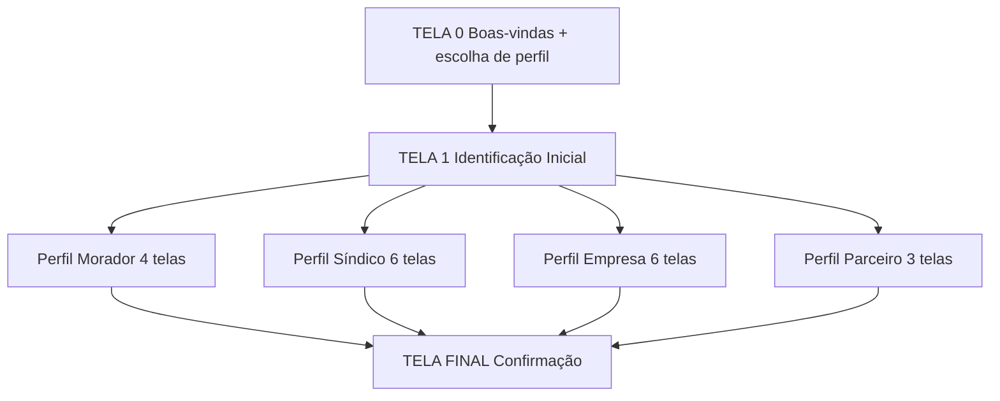

> **Origem**: `60-sources/master-sindico-research/client-material/pdfs/2026-03-09-onboarding-perfis.pdf` (446 linhas extraídas).
> **Absorvido em**: 2026-04-25 — Fase D. Tradução aplicada: "My Síndico" → "Master Síndico"; níveis 2 e 3 do síndico = `plan_tier ∈ {plus, pro}` (D-081, D-096).
> **Princípio**: este doc descreve **fluxos de tela e UX (frontend)**. Regras de negócio canônicas vivem em `04-requirements/functional/<bc>.md`. Cross-links em cada tela.

# Jornada — Onboarding (4 perfis)

## Sumário

- **Total de telas**: 17 (telas comuns 0-1 + 4 perfis × 3-6 telas + tela final).
- **App alvo**: `auth` (porta 3000, `auth.mastersindico.com.br`) — formulários multi-step com auto-save Redis.
- **Plan-tier**: trial automático no signup; perfil decide upgrade pós-onboarding.
- **Bounded contexts**: identity (account, profile, persona), commercial (aceites termos), institutional (síndico cadastra condomínio em S3 — fluxo paralelo).
- **Personas alvo**: 4 perfis distintos — Morador / Síndico / Empresa do Mercado Condominial / Parceiro da Vizinhança (Comércio Local).

## Visão geral do fluxo

**Regra global de auto-save** (cross-cutting):
> "Você pode concluir o cadastro agora ou continuar depois. Suas informações ficam salvas automaticamente."

Auto-save em Redis backend a cada step (TTL 7 dias para retomada).

---

# Parte A — Telas comuns (todos os perfis)

## TELA 0 — Boas-vindas + Escolha de Perfil

**App**: `auth` · **Persona**: Público · **Rota**: `/sign-up`

**Mensagem principal**:
> Bem-vindo à Master Síndico.

**Mensagem de apoio**:
> A Master Síndico é um ambiente digital onde a gestão condominial deixa de ser invisível. Aqui, informações são organizadas, decisões ganham histórico e relações se tornam mais claras.

**Mensagem de orientação**:
> Para começar, precisamos entender qual é o seu papel no universo condominial. A partir disso, mostramos exatamente o que a plataforma pode fazer por você.

**Seleção de perfil** (4 cards):
- Morador
- Síndico
- Empresa do Mercado Condominial
- Comércio Local – Parceiro da Vizinhança

**Ações**:
- [Continuar] → TELA 1 (com perfil selecionado em estado)

**Estados**: idle, perfil-selected (botão habilita), error.

**Cross-links**:
- Persona: [[../../../00-product/personas|personas]]
- Reqs: [[../../../04-requirements/functional/identity#REQ-IDN-SIGNUP-PERSONA-PICK]]

---

## TELA 1 — Identificação Inicial (comum a todos)

**App**: `auth` · **Persona**: Público (com perfil pré-selecionado) · **Rota**: `/sign-up/:persona/identificacao`

**Mensagem principal**:
> Vamos começar pelo essencial.

**Mensagem de apoio**:
> Esses dados garantem seu acesso à plataforma, permitem salvar seu progresso e personalizar sua experiência desde o primeiro momento.

**Campos**:
- Nome completo ou nome da empresa (required)
- E-mail (required, validation single-use)

**Mensagem de tranquilização**:
> Você pode concluir o cadastro agora ou continuar depois. Suas informações ficam salvas automaticamente.

**Ações**:
- [Continuar] → TELA 2 do perfil selecionado

**Estados**: idle, validating (email duplicado backend), submit-loading, success, error.

**Cross-links**:
- Aggregate: [[../../../01-domain/aggregates/Account|Account]]
- Reqs: [[../../../04-requirements/functional/identity#REQ-IDN-SIGNUP-INITIAL]]
- Pattern: [[../../patterns/forms#multi-step-with-autosave]]

---

# Parte B — Perfil Morador (4 telas)

## TELA 2 (Morador) — Sua Identidade

**App**: `auth` · **Persona**: Morador (signup) · **Rota**: `/sign-up/morador/identidade`

**Mensagem principal**:
> Você faz parte da vida do condomínio.

**Mensagem de apoio**:
> Na Master Síndico, o morador acompanha a gestão, entende o que está sendo feito e participa de forma mais consciente.

**Campos**:
- Foto de perfil (upload optional)
- Nome completo (required)
- Data de nascimento (required, validar idade ≥ 13)
- Telefone (required, BR mask)
- CPF (required, validação 11 dígitos + DV)

**Ações**: [Continuar] → TELA 3.

**Cross-links**:
- Aggregate: [[../../../01-domain/aggregates/Profile|Profile (morador)]]
- Reqs: [[../../../04-requirements/functional/identity#REQ-IDN-MORADOR-IDENTITY]]

---

## TELA 3 (Morador) — Vínculo com o Condomínio

**App**: `auth` · **Persona**: Morador · **Rota**: `/sign-up/morador/vinculo`

**Mensagem principal**:
> Agora vamos conectar você ao seu condomínio.

**Mensagem de apoio**:
> Isso permite acesso a registros, comunicações e conteúdos relacionados ao local onde você vive.

**Campos**:
- CEP (ViaCEP autocomplete)
- Endereço (autocompletado)
- Condomínio (autocomplete por nome ou código — busca cadastros existentes)

**Ações**: [Continuar] → TELA 4.

**Estados**: idle, validating (CEP/condo), success, error (condomínio não encontrado — CTA "Buscar pelo ID em M3 após login").

**Regras**:
- Se condomínio existe → cria `pending_membership` (será validado pelo síndico em S2).
- Se não existe → continua sem vincular; usuário pode adicionar depois em M3/M4.

**Cross-links**:
- Aggregate: [[../../../01-domain/aggregates/Membership]]
- Reqs: [[../../../04-requirements/functional/identity#REQ-IDN-MORADOR-VINCULO-PRE]]

---

## TELA 4 (Morador) — Participação e Convivência (Aceites)

**App**: `auth` · **Persona**: Morador · **Rota**: `/sign-up/morador/aceites`

**Mensagem principal**:
> Participar também é responsabilidade.

**Mensagem de apoio**:
> Avaliações, interações e participações em eventos devem refletir sua percepção real, sempre com respeito e boa-fé.

**Aceites** (3 checkboxes — required):
- [✓] Termo Geral de Uso da Plataforma
- [✓] Política de Privacidade e LGPD
- [✓] Termo de Avaliações e Participação

**Ações**: [Finalizar cadastro] → TELA FINAL.

**Estados**: idle, all-accepted (botão habilita), submit-loading, success, error.

**Cross-links**:
- Aggregate: [[../../../01-domain/aggregates/LegalAcceptance|LegalAcceptance]]
- Reqs: [[../../../04-requirements/functional/compliance#REQ-CPL-MORADOR-ACEITES]]
- Pattern: [[../../patterns/legal-terms-checkbox]]

---

# Parte C — Perfil Síndico (6 telas)

## TELA 2 (Síndico) — Sua Identidade de Gestão

**App**: `auth` · **Persona**: Síndico · **Rota**: `/sign-up/sindico/identidade`

**Mensagem principal**:
> Ser síndico é assumir responsabilidade.

**Mensagem de apoio**:
> Aqui, sua atuação não fica restrita ao momento. Ela é registrada, organizada e se transforma em histórico de gestão.

**Campos**:
- Foto profissional (optional)
- Nome completo (required)
- Data de nascimento (required, ≥ 18)
- E-mail profissional (required)
- Telefone (required)
- CPF (required)

**Ações**: [Continuar] → TELA 3.

**Cross-links**:
- Aggregate: [[../../../01-domain/aggregates/Profile]]
- Reqs: [[../../../04-requirements/functional/identity#REQ-IDN-SINDICO-IDENTITY]]

---

## TELA 3 (Síndico) — Sua Atuação

**App**: `auth` · **Persona**: Síndico · **Rota**: `/sign-up/sindico/atuacao`

**Mensagem principal**:
> Conte como você atua hoje.

**Mensagem de apoio**:
> Essas informações ajudam a contextualizar sua experiência e o alcance da sua gestão.

**Campos**:
- Endereço profissional
- Cidade e Estado de atuação
- Tipo de síndico (`Morador eleito | Profissional`)
- Tempo de atuação (anos)
- Quantidade de condomínios sob gestão (integer, sugestão de plan-tier baseado neste valor)

**Ações**: [Continuar] → TELA 4.

**Regras**:
- Sugerir plan-tier no resumo ao final (1 condo = base, 2-5 = plus, 6-15 = pro).

**Cross-links**:
- Reqs: [[../../../04-requirements/functional/identity#REQ-IDN-SINDICO-ATUACAO]]
- Plan-tier: [[../../../00-product/portfolio-de-produtos|plan-tier (trial/base/plus/pro)]]

---

## TELA 4 (Síndico) — Governança e Estrutura

**App**: `auth` · **Persona**: Síndico · **Rota**: `/sign-up/sindico/governanca`

**Mensagem principal**:
> Gestão também é estrutura.

**Mensagem de apoio**:
> Esses marcadores ajudam a demonstrar cuidado com riscos, organização e boas práticas administrativas.

**Marcadores exibidos no perfil conforme seleção** (multiselect):
- Membro ABRACS
- Seguro de Responsabilidade Civil
- Assessoria Jurídica
- Assessoria Contábil
- Assessoria em Segurança do Trabalho
- Conformidade com LGPD
- Conformidade com NR-1
- Programa de Compliance
- Selo Reclame Aqui
- Outras certificações (campo aberto)
- Premiações (campo aberto)

**Ações**: [Continuar] → TELA 5.

**Regras**:
- Marcadores são **autodeclarados** — informativos, não certificação oficial da plataforma.

**Cross-links**:
- Aggregate: [[../../../01-domain/aggregates/GovernanceMarkers|GovernanceMarkers]]
- Reqs: [[../../../04-requirements/functional/institutional#REQ-INS-SINDICO-MARCADORES]]
- Disclaimer: [[../../patterns/self-declaration-disclaimer]]

---

## TELA 5 (Síndico) — Sua Presença Profissional (níveis 2 e 3 — `plus+pro`)

**App**: `auth` · **Persona**: Síndico (plan-tier `plus` ou `pro`) · **Rota**: `/sign-up/sindico/presenca`

**Mensagem principal**:
> Mostre quem está por trás da gestão.

**Mensagem de apoio**:
> Esse espaço permite contextualizar sua trajetória e fortalecer sua imagem como síndico.

**Campos** (apenas para `plus+pro`):
- Mini bio profissional (rich-text)
- Vídeo institucional (upload Mux — lock 90d)
- Formação e certificações
- Administradoras vinculadas

**Ações**: [Continuar] → TELA 6.

**Regras**:
- Trial pode preencher mas só fica visível após upgrade.
- Vídeo segue regra de lock 90d (ADR-0033).

**Cross-links**:
- Aggregate: [[../../../01-domain/aggregates/Profile]]
- ADR: [[../../../02-architecture/adr/0010-mux-video-provider|ADR-0033]]
- Reqs: [[../../../04-requirements/functional/institutional#REQ-INS-SINDICO-PRESENCA]]

---

## TELA 6 (Síndico) — Registros e Responsabilidade (Aceites)

**App**: `auth` · **Persona**: Síndico · **Rota**: `/sign-up/sindico/aceites`

**Mensagem principal**:
> A plataforma registra. A responsabilidade é sua.

**Mensagem de apoio**:
> Os registros organizam a memória institucional, mas não substituem documentos oficiais, assembleias ou obrigações legais.

**Aceites** (3 checkboxes):
- [✓] Termo de Registro de Gestão e Linha do Tempo
- [✓] Termo de Indicadores, Selos e Certificação Própria
- [✓] Termo de Links Temporários e Compartilhamento

**Ações**: [Finalizar cadastro] → TELA FINAL.

**Cross-links**:
- Aggregate: [[../../../01-domain/aggregates/LegalAcceptance]]
- Reqs: [[../../../04-requirements/functional/compliance#REQ-CPL-SINDICO-ACEITES]]
- Pattern: [[../../patterns/legal-terms-checkbox]]

---

# Parte D — Perfil Empresa (6 telas)

## TELA 2 (Empresa) — Identidade Institucional

**App**: `auth` · **Persona**: Empresa · **Rota**: `/sign-up/empresa/identidade`

**Mensagem principal**:
> Aqui, empresas constroem confiança antes do contato.

**Mensagem de apoio**:
> Seu perfil apresenta sua empresa de forma institucional, técnica e alinhada ao que os síndicos esperam.

**Campos**:
- Logo
- Razão social (required)
- Nome fantasia
- CNPJ (required, validação 14 dígitos + DV — Receita Federal opcional async)
- Data de aniversário da empresa
- Nome do representante legal (required)
- E-mail do representante legal (required)

**Ações**: [Continuar] → TELA 3.

**Cross-links**:
- Aggregate: [[../../../01-domain/aggregates/EmpresaProfile|EmpresaProfile]]
- Reqs: [[../../../04-requirements/functional/identity#REQ-IDN-EMPRESA-IDENTITY]]

---

## TELA 3 (Empresa) — Contatos e Organização

**App**: `auth` · **Persona**: Empresa · **Rota**: `/sign-up/empresa/contatos`

**Mensagem principal**:
> Organização também comunica profissionalismo.

**Mensagem de apoio**:
> Esses dados não são exibidos publicamente e ajudam na comunicação correta dentro da plataforma.

**Campos**:
- E-mail comercial
- Telefone comercial
- Endereço comercial com CEP

**Dados do financeiro**:
- Nome do responsável financeiro
- Telefone do financeiro
- E-mail do financeiro

**Ações**: [Continuar] → TELA 4.

**Cross-links**:
- Aggregate: [[../../../01-domain/aggregates/EmpresaProfile]]
- Privacidade: dados financeiros são internos (não públicos).

---

## TELA 4 (Empresa) — Atuação no Mercado

**App**: `auth` · **Persona**: Empresa · **Rota**: `/sign-up/empresa/atuacao`

**Mensagem principal**:
> Mostre onde e como sua empresa atua.

**Mensagem de apoio**:
> Síndicos avaliam compatibilidade técnica, presença regional e especialização.

**Campos**:
- Cidades e Estados de atuação (multi-select)
- Categoria principal
- Subcategorias de atuação (multi-select)

**Ações**: [Continuar] → TELA 5.

**Cross-links**:
- Enum: [[../../../01-domain/enums/categorias-empresa|categorias-empresa]]
- Reqs: [[../../../04-requirements/functional/commercial#REQ-COM-EMPRESA-ATUACAO]]

---

## TELA 5 (Empresa) — Conformidade, Governança e Boas Práticas

**App**: `auth` · **Persona**: Empresa · **Rota**: `/sign-up/empresa/conformidade`

**Mensagem principal**:
> Estrutura e responsabilidade fazem diferença.

**Mensagem de apoio**:
> Esses marcadores ajudam o síndico a identificar empresas alinhadas com boas práticas de gestão, segurança e conformidade.

**Marcadores disponíveis** (multiselect, autodeclarados):
- Membro ABRACS
- Programa de Compliance
- Assessoria Jurídica / Contábil / Segurança do Trabalho
- Seguro de Responsabilidade Civil
- Responsável Técnico
- CIPA
- NR(s) aplicáveis (campo aberto)
- Regularidade em Conselhos Profissionais
- Conformidade com LGPD / NR-1
- ISO 9001 / 14001 / 45001 / 37001 / 19600 / 37301
- ESG
- Selo Verde / Sustentável / Carbon Free / EuReciclo / Empresa Amiga da Criança
- Selo Reclame Aqui
- Premiações (campo aberto)
- Outra certificação (campo aberto)
- Certificação própria (campo aberto)

**Mensagem de esclarecimento** (disclaimer):
> Esses marcadores são informativos, baseados em autodeclaração, e não representam certificação oficial da plataforma.

**Ações**: [Continuar] → TELA 6.

**Cross-links**:
- Aggregate: [[../../../01-domain/aggregates/GovernanceMarkers|GovernanceMarkers (empresa)]]
- Reqs: [[../../../04-requirements/functional/institutional#REQ-INS-EMPRESA-MARCADORES]]
- Pattern: [[../../patterns/self-declaration-disclaimer]]

---

## TELA 6 (Empresa) — Conteúdo Institucional

**App**: `auth` · **Persona**: Empresa · **Rota**: `/sign-up/empresa/conteudo`

**Mensagem principal**:
> Conte sua história com responsabilidade.

**Mensagem de apoio**:
> Os conteúdos aqui têm caráter institucional e técnico. Não são permitidas chamadas comerciais, preços ou dados de contato.

**Campos**:
- Descrição institucional (rich-text)
- Vídeo institucional (upload Mux — lock 90d)
- Vídeos técnicos (upload — múltiplos)
- Portfólio (upload imagens / docs)

**Ações**: [Continuar] → TELA 7 (Aceites).

**Regras**:
- Conteúdo passa por moderação (denúncias em `apps/admin` — D-134).
- Lock 90d em vídeos.

**Cross-links**:
- Aggregate: [[../../../01-domain/aggregates/EmpresaProfile]]
- ADR: [[../../../02-architecture/adr/0010-mux-video-provider|ADR-0033]]
- Pattern: [[../../patterns/content-moderation]]

---

## TELA 7 (Empresa) — Uso da Plataforma (Aceites)

**App**: `auth` · **Persona**: Empresa · **Rota**: `/sign-up/empresa/aceites`

**Mensagem principal**:
> A plataforma facilita conexões, não garante contratos.

**Mensagem de apoio**:
> O interesse entre as partes ocorre exclusivamente dentro dos mecanismos da Master Síndico.

**Aceites** (2 checkboxes):
- [✓] Termo de Conteúdo Técnico
- [✓] Termo de Uso do Connect Me

**Ações**: [Finalizar cadastro] → TELA FINAL.

**Cross-links**:
- Aggregate: [[../../../01-domain/aggregates/LegalAcceptance]]
- Reqs: [[../../../04-requirements/functional/compliance#REQ-CPL-EMPRESA-ACEITES]]

---

# Parte E — Perfil Parceiro da Vizinhança (3 telas)

## TELA 2 (Parceiro) — Presença Local

**App**: `auth` · **Persona**: Parceiro · **Rota**: `/sign-up/parceiro/presenca`

**Mensagem principal**:
> Seu negócio faz parte do cotidiano do condomínio.

**Mensagem de apoio**:
> Aqui, você aparece como apoio local, fortalecendo a relação com moradores.

**Campos**:
- Logo
- Razão social ou nome
- Nome fantasia
- CNPJ ou CPF (opcional — D-126 — autônomo aceito)
- Data de aniversário
- Nome do representante legal
- E-mail do representante legal

**Ações**: [Continuar] → TELA 3.

**Cross-links**:
- Aggregate: [[../../../01-domain/aggregates/Partner|Partner]]
- ADR: [[../../../02-architecture/adr/0021-multi-tenant-row-based|ADR-0030]] (D-126 — partner como EntityID)

---

## TELA 3 (Parceiro) — Contato e Visual

**App**: `auth` · **Persona**: Parceiro · **Rota**: `/sign-up/parceiro/visual`

**Mensagem principal**:
> Apresente seu negócio com clareza.

**Mensagem de apoio**:
> Essas informações ajudam moradores a reconhecer e identificar seu estabelecimento.

**Campos**:
- E-mail comercial
- Telefone comercial
- Endereço com CEP
- Dados do financeiro: nome / telefone / e-mail
- **Até 3 fotos** (upload optional)

**Ações**: [Continuar] → TELA 4.

**Cross-links**:
- Aggregate: [[../../../01-domain/aggregates/Partner]]
- Pattern: [[../../patterns/multi-image-upload]]

---

## TELA 4 (Parceiro) — Ofertas e Responsabilidade (Aceites)

**App**: `auth` · **Persona**: Parceiro · **Rota**: `/sign-up/parceiro/aceites`

**Mensagem principal**:
> Promoções geram interesse. Responsabilidade gera confiança.

**Mensagem de apoio**:
> As condições divulgadas são de responsabilidade exclusiva do parceiro.

**Aceites** (2 checkboxes):
- [✓] Termo de Promoções – Parceiro da Vizinhança
- [✓] Código de Conduta e Uso Indevido

**Ações**: [Finalizar cadastro] → TELA FINAL.

**Cross-links**:
- Aggregate: [[../../../01-domain/aggregates/LegalAcceptance]]
- Reqs: [[../../../04-requirements/functional/compliance#REQ-CPL-PARCEIRO-ACEITES]]

---

# Parte F — Tela final (todos)

## TELA FINAL — Confirmação

**App**: `auth` · **Persona**: Todos · **Rota**: `/sign-up/confirmacao`

**Mensagem principal**:
> Cadastro concluído.

**Mensagem de encerramento**:
> A partir de agora, sua experiência na Master Síndico começa a ser construída com base no seu perfil, nas suas escolhas e na sua participação.

**Texto complementar**:
> Algumas informações e conteúdos podem passar por análise antes de ficarem visíveis.

**Ações**: [Acessar a plataforma] → redirect para CMS (M1/S1/E1/MK1/VZ2 conforme persona).

**Estados**: success.

**Regras**:
- Trial inicia neste momento (15d síndico, 7d empresa, 30d parceiro).
- Conteúdos institucionais (vídeos, descrição) podem entrar em moderação.

**Cross-links**:
- Reqs: [[../../../04-requirements/functional/identity#REQ-IDN-SIGNUP-COMPLETE]]
- ADR: [[../../../02-architecture/adr/0032-global-plans-stripe-style|ADR-0032]] (trial)

---

## Pendências detectadas

- **Síndico TELA 5** — texto diz "níveis 2 e 3"; aplicada tradução D-081 / D-096 → `plus+pro`. Confirmar se trial pode preencher (parece que sim, mas só fica visível após upgrade). Registrado em `_pendencias-fase-h.md`.
- **Idade mínima Morador** (TELA 2) — vault assume 13 anos; PDF não especifica. Pendência.
- **Marcadores autodeclarados** — pendência de moderação posterior (admin) para validar selos de certificação ISO/ABRACS reais.

## Vizinhos

- [[_moc|jornadas/_moc]]
- [[../auth/onboarding|auth/onboarding]] (Fase B — sub-features de auth)
- [[sindico|sindico]], [[morador|morador]], [[empresa|empresa]], [[parceiro-vizinhanca|parceiro-vizinhanca]]
- [[../../ui-catalog|ui-catalog macro]] (AUTH1-AUTH8)
- [[../../../00-product/personas|personas]]
