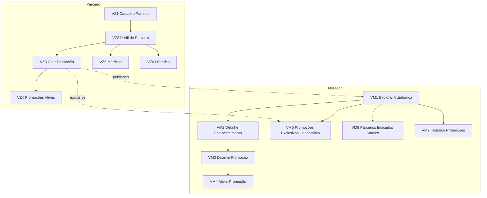

> **Origem**: 2 PDFs combinados sobre o módulo Vizinhança (sub-produto 8 — D-059/D-078):
> - `60-sources/master-sindico-research/client-material/pdfs/2026-03-10-jornada-parceiro-vizinhanca.pdf` (444 linhas — lado parceiro/publisher)
> - `60-sources/master-sindico-research/client-material/pdfs/2026-03-10-modulo-vizinhanca-morador.pdf` (394 linhas — lado morador/consumidor)
> **Absorvido em**: 2026-04-25 — Fase D. Combinados em arquivo único pois pertencem ao mesmo sub-produto Vizinhança.
> **Princípio**: este doc descreve **fluxos de tela e UX (frontend)**. Regras de negócio canônicas vivem em `04-requirements/functional/<bc>.md`. Cross-links em cada tela.

# Jornada — Vizinhança

## Sumário

- **Total de telas**: 13 (VZ1-VZ6 do parceiro + VM1-VM7 do morador).
- **App alvo**: `cms` (porta 3001) e `forum` (porta 3003 — `vizinhanca.mastersindico.com.br`, M2).
- **Plan-tier**: parceiro **não tem plan-tier próprio** — cadastro gratuito; morador é `base`.
- **Bounded contexts**: identity (parceiro como EntityID — D-126), commercial (Vizinhança = sub-produto 8), institutional (segmentação por bairro/condomínio).
- **Persona alvo**: Parceiro da vizinhança (comércio local, profissional autônomo, prestador de serviço — não precisa CNPJ) + Morador (consumidor de promoções).
- **Sub-produto**: Vizinhança (D-059, D-078).

## Lógica central (banner — vindo do PDF)

A lógica do módulo Vizinhança é dual:
- **Promoção Local (bairro)** — visível para moradores/síndicos/empresas da região
- **Promoção Condominial (condomínio específico)** — visível apenas para moradores do condomínio selecionado

Mensagem institucional (parceiro):
> Seu estabelecimento faz parte da vida do bairro. A Master Síndico conecta você diretamente com moradores, síndicos e empresas da região.

Mensagem institucional (morador):
> Seu condomínio faz parte de um bairro vivo. Descubra estabelecimentos da região que valorizam quem mora na comunidade.

## Fluxo macro

---

# Parte 1 — Lado Parceiro (VZ1-VZ6)

## VZ1 — Cadastro do Parceiro da Vizinhança

**App**: `cms` (auth → onboarding parceiro) · **Persona**: Público (em fluxo de cadastro) · **Rota**: `/parceiro/cadastro`

**Caminho**: App → Vizinhança → "Quero ser parceiro da vizinhança".

**Mensagem institucional**:
> Cadastre seu estabelecimento e ofereça benefícios para quem vive e trabalha no bairro.

**Campos obrigatórios**:
- Nome do estabelecimento
- Categoria principal
- Subcategoria
- Telefone
- WhatsApp
- Email
- CEP
- Endereço
- Número
- Bairro
- Cidade
- Descrição do estabelecimento

**Campos opcionais**:
- Instagram
- Logo

**Lista mestre — Categorias** (38 categorias B2C, ver `01-domain/enums/parceiro-vizinhanca-categorias.md` — COM-047):

> Alimentação (Padaria, Restaurante, Lanchonete, Cafeteria, Pizzaria, Hamburgueria, Sorveteria, Doceria, Açaí), Mercado (Supermercado, Hortifruti, Adega), Farmácia, Pet shop (incl. Clínica veterinária, Banho e tosa), Academia (incl. Crossfit, Pilates, Yoga), Estética (Salão de beleza, Barbearia, Spa), Lavanderia, Costureira, Sapateiro, Eletricista, Encanador, Chaveiro, Marceneiro, Pintor, Assistência técnica (Celular, Computadores), Oficina (Lava jato), Cursos (Idiomas, Reforço escolar), Outros serviços.

**Ações**:
- [Cadastrar estabelecimento]

**Estados**: idle, validating (CEP ViaCEP), submit-loading, success, error.

**Regras**:
- Perfil entra como `Parceiro da vizinhança`.
- **NÃO exige CNPJ** — pode ser CPF (autônomo).
- Parceiro é EntityID, não tenant (D-126).

**Cross-links**:
- Enum: [[../../../01-domain/enums/parceiro-vizinhanca-categorias|categorias-vizinhanca]] (38 categorias)
- Aggregate: [[../../../01-domain/aggregates/Partner|Partner]]
- Reqs: [[../../../04-requirements/functional/commercial#REQ-COM-VIZINHANCA-CADASTRO]]
- ADR: [[../../../02-architecture/adr/0021-multi-tenant-row-based|ADR-0030]] (D-126 — partner como EntityID)

---

## VZ2 — Perfil do Parceiro

**App**: `cms` (forum app a partir de M2) · **Persona**: Parceiro · **Rota**: `/parceiro/perfil`

**Caminho**: VZ1 → Cadastro concluído.

**Mensagem institucional**:
> Seu estabelecimento agora faz parte da rede de vizinhança da Master Síndico.

**Informações exibidas**:
- Nome do estabelecimento
- Categoria
- Endereço
- Contato
- Descrição

**Seções**:
- Promoções (link → VZ3/VZ4)
- Métricas (link → VZ5)

**Ações**:
- [Criar promoção] → VZ3
- [Ver métricas] → VZ5
- [Editar perfil] (modal)

**Estados**: loading, success, error.

**Cross-links**:
- Aggregate: [[../../../01-domain/aggregates/Partner]]
- Reqs: [[../../../04-requirements/functional/commercial#REQ-COM-PARTNER-PROFILE]]

---

## VZ3 — Criar Promoção

**App**: `cms` · **Persona**: Parceiro · **Rota**: `/parceiro/promocoes/novo`

**Mensagem institucional**:
> Ofereça um benefício especial para quem vive e trabalha na sua região.

**Campos**:
- Título da promoção
- Descrição

**Tipos de promoção (lista mestre — 7)**:
1. Desconto percentual
2. Desconto fixo
3. Produto gratuito
4. Combo promocional
5. Avaliação gratuita
6. Benefício exclusivo
7. Brinde

**Validade**:
- Data de início
- Data de término

**Segmentação** (campo obrigatório — radio):
- **Opção 1**: Promoção aberta para o bairro (visível para moradores/síndicos/empresas da região)
- **Opção 2**: Promoção exclusiva para condomínio (visível apenas para moradores do condomínio selecionado)

Se Opção 2: campo "Selecionar condomínio" (autocomplete na lista de condomínios cadastrados).

**Ações**:
- [Publicar promoção]

**Estados**: idle, autosave, submit-loading, success, error, condo-not-found (Opção 2).

**Regras**:
- Promoção exclusiva aparece **apenas** para moradores do condomínio selecionado.
- Promoção aberta tem visibilidade ampla (bairro).

**Cross-links**:
- Aggregate: [[../../../01-domain/aggregates/Promotion|Promotion]]
- Enum: [[../../../01-domain/enums/promotion-types|tipos-promocao]] (7 tipos)
- Reqs: [[../../../04-requirements/functional/commercial#REQ-COM-PROMOTION-CREATE]]
- Invariante: [[../../../01-domain/invariants#INV-PROMOTION-SEGMENTATION]]

---

## VZ4 — Promoções Ativas

**App**: `cms` · **Persona**: Parceiro · **Rota**: `/parceiro/promocoes`

**Lista exibida**:
- Título da promoção
- Tipo de promoção
- Validade
- Visualizações
- Ativações

**Ações** por linha:
- [Editar promoção] (limitado — não pode mudar segmentação após publicada)
- [Encerrar promoção]

**Estados**: empty, loading, success, error.

**Cross-links**:
- Aggregate: [[../../../01-domain/aggregates/Promotion]]
- Reqs: [[../../../04-requirements/functional/commercial#REQ-COM-PROMOTION-MANAGE]]

---

## VZ5 — Métricas do Parceiro

**App**: `cms` · **Persona**: Parceiro · **Rota**: `/parceiro/metricas`

**Indicadores**:
- Visualizações do perfil
- Visualizações das promoções
- Ativações
- Cliques em contato

**Gráficos**:
- Engajamento semanal (line chart)
- Promoções mais ativadas (bar chart)

**Filtros**: período.

**Cross-links**:
- Pattern: [[../../patterns/dashboard-kpi-cards]]

---

## VZ6 — Histórico de Promoções

**App**: `cms` · **Persona**: Parceiro · **Rota**: `/parceiro/historico`

**Lista exibida**:
- Promoção
- Data de publicação
- Data de encerramento
- Número de ativações

**Estados**: empty, loading, success.

**Regras**:
- Histórico append-only (R3 — nada deletado).

**Cross-links**:
- Invariante: [[../../../01-domain/invariants#INV-PROMOTION-HISTORY]]

---

# Parte 2 — Lado Morador (VM1-VM7)

## VM1 — Explorar Vizinhança

**App**: `cms` (a partir de M2 — `forum` app) · **Persona**: Morador · **Rota**: `/vizinhanca` ou `/condominios/:id/vizinhanca`

**Caminho** (UX): Painel do Morador → Vizinhança.

**Mensagem institucional**:
> Conheça estabelecimentos do seu bairro que oferecem benefícios para moradores da comunidade.

**Layout**: feed de cards de parceiros.

**Card** exibe:
- Nome do estabelecimento
- Categoria
- Bairro
- Promoção ativa (badge se houver)

**Filtros**: Categoria (lista mestre 38 — ver VZ1 / enum).

**Priorização do feed**:
1. Parceiros do **mesmo bairro** que o condomínio do morador
2. Parceiros com **promoções ativas**
3. Parceiros **indicados por síndicos** (badge "Indicado pelo Síndico")

**Estados**: empty (sem parceiros no bairro), loading, eof, error.

**Cross-links**:
- Aggregate: [[../../../01-domain/aggregates/Partner]]
- Aggregate: [[../../../01-domain/aggregates/Promotion]]
- Reqs: [[../../../04-requirements/functional/commercial#REQ-COM-VIZINHANCA-FEED]]
- Pattern: [[../../patterns/feed-prioritized]]

---

## VM2 — Detalhe do Estabelecimento

**App**: `cms` · **Persona**: Morador · **Rota**: `/vizinhanca/parceiros/:id`

**Caminho**: VM1 → clicar no parceiro.

**Informações exibidas**:
- Nome do estabelecimento
- Categoria
- Endereço
- Telefone
- Descrição
- Promoções disponíveis (seção)

**Ações**:
- [Ver promoção] → VM3
- [Entrar em contato] (link tel: / WhatsApp / mailto:)
- [Ir até o local] (link Google Maps / Apple Maps com endereço)

**Estados**: loading, success, error (404).

**Cross-links**:
- Aggregate: [[../../../01-domain/aggregates/Partner]]

---

## VM3 — Detalhe da Promoção

**App**: `cms` · **Persona**: Morador · **Rota**: `/vizinhanca/promocoes/:id`

**Caminho**: VM2 → Ver promoção.

**Informações exibidas**:
- Título da promoção
- Descrição
- Tipo de promoção
- Validade

**Mensagem institucional**:
> Esta promoção faz parte da rede de vizinhança da Master Síndico.

**Ações**:
- [Ativar promoção] → VM4

**Estados**: loading, success, expired (CTA esmaecido), error.

**Cross-links**:
- Aggregate: [[../../../01-domain/aggregates/Promotion]]
- Pattern: [[../../patterns/expirable-content]]

---

## VM4 — Ativar Promoção

**App**: `cms` · **Persona**: Morador · **Rota**: `/vizinhanca/promocoes/:id/ativar`

**Caminho**: VM3 → Ativar promoção.

**Mensagem exibida**:
> Apresente esta tela no estabelecimento para ativar seu benefício.

**Elementos exibidos**:
- Nome do estabelecimento
- Nome da promoção
- Validade
- (catálogo macro) QR code da ativação (timestamp + user_id assinado)

**Ações**:
- [Mostrar promoção] (modal/fullscreen para apresentar no estabelecimento)

**Estados**: loading, success.

**Regras**:
- A ativação **gera métrica** para o parceiro (VZ5).
- Registra timestamp + morador + promoção.

**Cross-links**:
- Aggregate: [[../../../01-domain/aggregates/PromotionActivation|PromotionActivation]]
- Reqs: [[../../../04-requirements/functional/commercial#REQ-COM-PROMOTION-ACTIVATE]]
- Pattern: [[../../patterns/qr-fullscreen]]

---

## VM5 — Promoções Exclusivas do Condomínio

**App**: `cms` · **Persona**: Morador · **Rota**: `/vizinhanca/beneficios`

**Caminho**: Vizinhança → Benefícios do meu condomínio.

**Mensagem institucional**:
> Alguns parceiros oferecem benefícios exclusivos para moradores do seu condomínio.

**Lista exibida**:
- Promoção
- Parceiro
- Validade

**Estados**: empty (não há exclusivas — banner "Nenhum benefício exclusivo disponível"), loading, success.

**Regras**:
- Aparece **apenas** se houver promoções exclusivas para o condomínio do morador.
- Filtro automático: `promotion.exclusive_condo_id = morador.condominium_id`.

**Cross-links**:
- Aggregate: [[../../../01-domain/aggregates/Promotion]]
- Invariante: [[../../../01-domain/invariants#INV-PROMOTION-SEGMENTATION]]

---

## VM6 — Parceiros Indicados pelo Síndico

**App**: `cms` · **Persona**: Morador · **Rota**: `/vizinhanca/indicados`

**Caminho**: Vizinhança → Parceiros indicados.

**Mensagem institucional**:
> Estabelecimentos indicados pelo seu síndico para a comunidade.

**Lista exibida**:
- Parceiro (nome)
- Categoria
- Descrição

**Badge exibida**: "Indicado pelo Síndico" (cor diferenciada).

**Estados**: empty, loading, success.

**Cross-links**:
- Cross-app: [[sindico|sindico]] (síndico indica parceiros via Connect Me Síndico→Parceiro — sub-fluxo VS9 catálogo macro)
- Reqs: [[../../../04-requirements/functional/commercial#REQ-COM-PARCEIROS-INDICADOS]]

---

## VM7 — Histórico de Promoções Utilizadas

**App**: `cms` · **Persona**: Morador · **Rota**: `/vizinhanca/historico`

**Caminho**: Vizinhança → Histórico.

**Lista exibida**:
- Promoção
- Estabelecimento
- Data de ativação

**Objetivo**: controle de benefícios utilizados pelo morador.

**Estados**: empty, loading, success.

**Cross-links**:
- Aggregate: [[../../../01-domain/aggregates/PromotionActivation]]
- Reqs: [[../../../04-requirements/functional/commercial#REQ-COM-HIST-ATIVACOES]]

---

## Regras operacionais (banner — dos 2 PDFs)

**Parceiro pode**:
- ✔ Criar / editar / encerrar promoções
- ✔ Ver métricas do próprio perfil

**Parceiro NÃO pode**:
- ✖ Publicar comunicados em condomínios
- ✖ Registrar execução de serviços
- ✖ Acessar painel empresarial

**Morador pode**:
- ✔ Visualizar parceiros / promoções / promoções exclusivas
- ✔ Ativar promoções
- ✔ Ver parceiros indicados pelo síndico

**Morador NÃO pode**:
- ✖ Publicar promoções
- ✖ Cadastrar parceiros

## Métricas administrativas (admin platform — D-134)

Admin acompanha (em `apps/admin`):
- Promoções mais ativadas
- Parceiros mais acessados
- Bairros com maior engajamento
- Número de parceiros cadastrados
- Promoções ativas por bairro
- Engajamento médio

## Pendências detectadas

- **Categorias** (lista mestre 38) — confirmar correspondência com `01-domain/enums/parceiro-vizinhanca-categorias.md` (COM-047). Possível diferença em "Outros serviços" vs subcategorias específicas. Registrar `_pendencias-fase-h.md`.
- **VS9 (Síndico indica parceiro)** — está no `ui-catalog.md` macro mas sem PDF dedicado; a indicação é referenciada em VM6. Pendência: documentar fluxo síndico em `sindico.md` ou em sub-feature.

## Vizinhos

- [[_moc|jornadas/_moc]]
- [[../../ui-catalog|ui-catalog macro]] (VS1-VS10 do síndico, VE1-VE6 da empresa)
- [[../vizinhanca/_moc|ui-catalog/vizinhanca/]] (Fase B sub-features)
- [[../../../01-domain/enums/parceiro-vizinhanca-categorias|enum categorias]]
