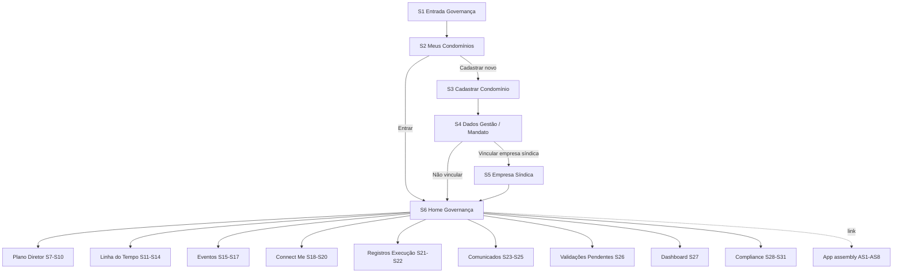

> **Origem**: `60-sources/master-sindico-research/client-material/pdfs/2026-03-09-jornada-sindico-completa.pdf` (PDF interno do cliente, 1634 linhas extraídas).
> **Absorvido em**: 2026-04-25 — Fase D. Tradução aplicada: `N1/N2/N3` → `plan_tier ∈ {trial, base, plus, pro}`; "Morador Pagante" removido (D-126); "My Síndico" → "Master Síndico"; Mandato como flags em Membership (D-129); Empresa Síndica como Membership especial (não aggregate).
> **Princípio**: este doc descreve **fluxos de tela e UX (frontend)**. Regras de negócio canônicas vivem em `04-requirements/functional/<bc>.md`. Cross-links em cada tela.

# Jornada — Síndico

## Sumário

- **Total de telas**: 31 (S1-S31) + 11 telas de Compliance detalhadas (C1-C11) catalogadas em `ui-catalog.md` macro.
- **App alvo**: `cms` (porta 3001, `app.mastersindico.com.br`).
- **Plan-tier**: trial (15d) → base (síndico morador 1 condomínio) → plus → pro (15 condomínios, ilimitado).
- **Bounded contexts envolvidos**: identity, institutional, governance (timeline, plano diretor, eventos, comunicados), commercial (Connect Me, validações), assembly (link), compliance.
- **Persona alvo**: Síndico (morador eleito ou profissional) + Subsíndico + Conselho via ABAC scoped permissions; Empresa Síndica vinculada com permissões parametrizáveis.

## Regras estruturais (banner de leitura)

Estas regras vêm do PDF e devem ser refletidas em UI guards + cross-links a Reqs:

- **R1 — Linha do Tempo é memória oficial**: tudo relevante gera registro na timeline (atividade da gestão, registro de execução validado, comunicado, evento, adendo, resultado de pergunta aos moradores). Ver [[../../../04-requirements/functional/governance#REQ-GOV-TIMELINE]].
- **R2 — Plano Diretor não é atualizado manualmente**: status só muda via publicação vinculada na Linha do Tempo.
- **R3 — Empresa não publica direto para moradores**: tudo passa por validação do síndico (ou empresa síndica vinculada com permissão).
- **R4 — Edição com preservação de histórico**: toda edição relevante gera nova versão + trilha de auditoria.
- **R5 — Síndico pode consultar até 12 condomínios** (PDF dizia 12, mas catálogo macro fixou em 15 — divergência registrada em `_pendencias-fase-h.md`).
- **R6 — Empresa síndica vinculada**: pode visualizar/editar publicações do síndico, ocultar publicações, validar registros e comunicados de empresas (5 toggles parametrizáveis).

## Fluxo macro

---

## Telas

### S1 — Entrada da Governança

**App**: `cms` · **Persona**: Síndico (primeiro acesso) · **Rota**: `/governanca` (gate primeiro acesso) · **Plan-tier**: trial+base+plus+pro

**Propósito**: Apresentar a área de governança e formalizar o uso responsável da plataforma. Exibir apenas no primeiro acesso.

**Mensagem institucional**:
> Bem-vindo à Governança Master Síndico. Aqui a gestão do condomínio deixa de ser apenas rotina administrativa e passa a ser memória institucional, com transparência, rastreabilidade e organização.

**Estados**: idle (welcome), loading (carregando primeiro condomínio).

**Ações**:
- [Entrar na Governança] → S2.

**Regras**: exibir apenas no primeiro acesso (flag `seen_governance_entry` no perfil); rodapé com declaração de uso responsável.

**Cross-links**:
- Persona: [[../../../00-product/personas#sindico|personas/sindico]]
- Pattern: [[../../patterns/ui-states#welcome]]

---

### S2 — Meus Condomínios

**App**: `cms` · **Persona**: Síndico · **Rota**: `/condominios` · **Plan-tier**: trial+base+plus+pro

**Propósito**: Permitir seleção de condomínio e acesso ao histórico de governança de cada um.

**Estados**: empty (síndico novo — CTA "Cadastrar primeiro condomínio"), loading (skeleton cards), success (lista), error (rede).

**Card do condomínio** (componente):
- Nome do condomínio
- Cidade / Estado
- Quantidade de unidades
- Status do mandato (badge — ativo / encerrado / em renovação)
- Período do mandato
- Avaliação institucional média
- Empresa síndica vinculada (se houver)

**Ações**:
- [Entrar] → S6 (Home Governança do condomínio selecionado)
- [Cadastrar novo condomínio] → S3

**Regras**:
- Limite de **15 condomínios ativos** por síndico (catálogo macro D-### / divergência com PDF "12" registrada em `_pendencias-fase-h.md`).
- Ordenação: ativos primeiro; encerrados com selo "Histórico / leitura".
- Plan-tier limita: trial (1), base (1), plus (até 5), pro (até 15).

**Cross-links**:
- Aggregate: [[../../../01-domain/aggregates/Condominium|Condominium]]
- Aggregate: [[../../../01-domain/aggregates/Membership|Membership]] (D-129 — mandato como flags)
- Reqs: [[../../../04-requirements/functional/identity#REQ-IDN-CONDO-LIST]]

---

### S3 — Cadastrar Condomínio

**App**: `cms` · **Persona**: Síndico · **Rota**: `/condominios/novo` · **Plan-tier**: trial+base+plus+pro

**Propósito**: Criar a identidade institucional do condomínio dentro da plataforma.

**Campos**:
- Nome do condomínio (required)
- CEP (required, ViaCEP autocomplete) → preenche logradouro, bairro, cidade, estado
- Endereço (autocompletado)
- Número (required)
- Complemento (optional)
- Bairro / Cidade / Estado (autocompletados, editáveis)
- Tipo de condomínio (select — lista mestre, ver abaixo)
- Quantidade total de unidades (required, integer > 0)
- Possui blocos/torres? (boolean) — se Sim, expande sub-form
- Cadastro de blocos/torres (array de `{nome, qtd_unidades}`)
- Foto da fachada (optional, upload imagem)

**Lista mestre — Tipo de condomínio**:
Residencial / Comercial / Misto / Shopping center / Galeria comercial / Edifício garagem.

**Estados**: idle (form vazio), validating (CEP sendo resolvido), submit-loading, success (gera ID + QR + link), error (CEP inválido, duplicidade).

**Ações**:
- [Continuar] → S4
- [Cancelar] → S2

**Regras pós-criação** (gerar automaticamente):
- ID único alfanumérico 8 chars (visível para morador buscar em M3)
- QR Code do condomínio
- Link curto do app
- Botão "Copiar ID com mensagem" (UX helper)
- Esta estrutura alimenta o cadastro do morador (M3-M4)

**Cross-links**:
- Aggregate: [[../../../01-domain/aggregates/Condominium|Condominium]]
- Reqs: [[../../../04-requirements/functional/institutional#REQ-INS-CONDO-CREATE]]
- Pattern: [[../../patterns/forms#multi-step-with-autosave]]

---

### S4 — Dados da Gestão (Mandato)

**App**: `cms` · **Persona**: Síndico · **Rota**: `/condominios/novo/mandato` · **Plan-tier**: trial+base+plus+pro

**Propósito**: Registrar o tipo de mandato e o período de responsabilidade da gestão.

**Mensagem institucional**:
> Toda gestão precisa de um marco temporal claro. Este vínculo organiza a responsabilidade administrativa do mandato.

**Campos**:
- Tipo de mandato (select — `Síndico eleito | Síndico profissional | Síndico interino`)
- Data de início (date, required)
- Data de término (date, required, > início)
- Vincular empresa síndica? (boolean)

**Estados**: idle, validating, submit-loading, success.

**Ações**:
- [Confirmar] → S5 se "Vincular empresa síndica = Sim", senão S6
- [Voltar] → S3

**Regras**:
- Mandato não é aggregate (D-129) — vira flags `mandate_start`, `mandate_end`, `mandate_kind` em `Membership(role=sindico)`.
- Auto-lock após data de término (R6 — continuidade institucional).

**Cross-links**:
- Aggregate: [[../../../01-domain/aggregates/Membership|Membership]] (D-129)
- ADR: [[../../STATE#D-129|STATE D-129]] (mandato flags em Membership; sem ADR dedicada)
- Reqs: [[../../../04-requirements/functional/identity#REQ-IDN-MANDATE]]

---

### S5 — Cadastro / Vínculo da Empresa Síndica

**App**: `cms` · **Persona**: Síndico (após S4 com toggle) · **Rota**: `/condominios/:id/empresa-sindica` · **Plan-tier**: plus+pro (síndico profissional típico)

**Propósito**: Cadastrar ou vincular empresa síndica com poderes operacionais na governança.

**Campos**:
- Razão social (required)
- Nome fantasia
- CNPJ (required, validação 14 dígitos + dígito verificador)
- Responsável legal (required)
- Telefone / E-mail corporativo (required)
- Site / Cidade / Estado / Logo

**Validação**:
- Envio de **token por e-mail** ao representante legal da empresa síndica (assinatura digital de aceite).

**Permissões parametrizáveis (5 toggles)**:
1. Visualizar publicações
2. Editar publicações do síndico
3. Ocultar publicações
4. Validar registros de execução enviados por empresas
5. Validar comunicados técnicos enviados por empresas

**Estados**: idle, token-sent (aguardando validação), validated, error (token expirado, CNPJ duplicado).

**Ações**:
- [Enviar token] → backend dispara email com link de aceite
- [Validar vínculo] → após resposta do representante
- [Voltar] → S4

**Regras**:
- Toda ação da empresa síndica gera **audit trail** (R6).
- Empresa síndica é Membership especial (D-073), não aggregate; permissões em ABAC scoped.

**Cross-links**:
- Aggregate: [[../../../01-domain/aggregates/Membership|Membership]] (papel `empresa_sindica`)
- ABAC: [[../../../02-architecture/abac#empresa-sindica]]
- Reqs: [[../../../04-requirements/functional/identity#REQ-IDN-EMPRESA-SINDICA]]
- Pattern: [[../../patterns/permission-matrix]]

---

### S6 — Home da Governança

**App**: `cms` · **Persona**: Síndico · **Rota**: `/condominios/:id` · **Plan-tier**: trial+base+plus+pro · **TELA-PIVÔ**

**Propósito**: Centralizar todos os módulos da gestão. Dashboard cross-módulo único do síndico.

**Mensagem institucional**:
> Este é o centro de comando da gestão do condomínio. Aqui você planeja, registra, valida, comunica e acompanha a evolução da administração.

**Cards** (10 — D-### catálogo macro):
1. Plano Diretor → S7
2. Linha do Tempo → S11
3. Eventos → S15
4. Connect Me → S18
5. Registros de Execução → S21
6. Comunicados → S23
7. Validações Pendentes → S26 *(badge com quantidade)*
8. Dashboard → S27
9. Compliance → S28 / C1
10. Modo Assembleia → link app `assembly` (D-133)

**Indicadores em tempo real** (badges nos cards):
- Validações pendentes (qtd)
- Avaliações bimestrais recebidas
- Ações atrasadas do PD
- Eventos próximos (7 dias)
- Score compliance (gauge)
- Última publicação na timeline

**Estados**: loading (skeleton 10 cards), success (renderiza com badges), error (rede), permission-denied (Subsíndico sem visão de Compliance).

**Cross-links**:
- Pattern: [[../../patterns/dashboard-cards-pivot]]
- Aggregate: [[../../../01-domain/aggregates/Condominium|Condominium]]
- Reqs: [[../../../04-requirements/functional/governance#REQ-GOV-HOME]]
- ABAC: [[../../../02-architecture/abac#sindico-subsindico-conselho]]

---

### S7 — Plano Diretor (Home)

**App**: `cms` · **Persona**: Síndico · **Rota**: `/condominios/:id/plano-diretor` · **Plan-tier**: trial+base+plus+pro

**Propósito**: Visualizar e administrar o planejamento estruturado da gestão.

**Mensagem institucional**:
> O Plano Diretor organiza as ações estruturais e estratégicas do condomínio. Seu avanço é registrado conforme a gestão publica atividades vinculadas na Linha do Tempo.

**Layout**: kanban por status + filtros + lista alternativa.

**Ações**:
- [Cadastrar nova ação] → S8
- [Ver ações cadastradas] → S9 (lista tabela)

**Estados**: empty (CTA "Adicionar primeira ação do PD"), loading, success.

**Cross-links**:
- Aggregate: [[../../../01-domain/aggregates/MasterPlanAction|MasterPlanAction]]
- Reqs: [[../../../04-requirements/functional/governance#REQ-GOV-PD]]

---

### S8 — Cadastrar Ação do Plano Diretor

**App**: `cms` · **Persona**: Síndico · **Rota**: `/condominios/:id/plano-diretor/novo` · **Plan-tier**: trial+base+plus+pro

**Propósito**: Criar uma ação estratégica do plano de gestão.

**Campos**:
- Nome da ação (required)
- Descrição (rich-text + voice input — R2 cross-cutting)
- Área impactada (select — lista mestre 26 valores: Estrutura predial / Sistema hidráulico / Sistema elétrico / Sistema de incêndio / Reservatórios / Elevadores / Garagem / Fachada / Cobertura / Segurança patrimonial / Administração / Portaria / Playground / Academia / Salão de festas / Corredores / Jardins / Casa de máquinas / Rede de esgoto / Rede de drenagem / Sistema de gás / Iluminação / Sistema de câmeras / Controle de acesso / Áreas comuns / Outros)
- Natureza (select — `Preventiva | Corretiva | Adequação normativa | Melhoria estrutural | Monitoramento | Modernização | Investigação técnica | Regularização legal`)
- Nível de importância (select — `Baixa | Moderada | Alta | Crítica | Emergencial`)
- Impacto esperado (select — 8 valores: Redução de risco / Adequação legal / Melhoria da infraestrutura / Preservação patrimonial / Aumento da segurança / Melhoria operacional / Economia financeira / Melhoria da qualidade de vida)
- Prazo limite (date)

**Status inicial automático**: `Planejada`.

**Estados**: idle, submit-loading, success (redirect S9), error.

**Ações**:
- [Salvar ação] → S9
- [Cancelar] → S7

**Regras**:
- **R2**: Não permitir edição manual do status (vem da Linha do Tempo).
- Aplicar cores por status na UI (planejada=cinza, em-execução=azul, concluída=verde, atrasada=vermelho).

**Cross-links**:
- Aggregate: [[../../../01-domain/aggregates/MasterPlanAction|MasterPlanAction]]
- Enum: [[../../../01-domain/enums/areas-impactadas|areas-impactadas]] (cross-link enum)
- Reqs: [[../../../04-requirements/functional/governance#REQ-GOV-PD-CREATE]]

---

### S9 — Lista de Ações do Plano Diretor

**App**: `cms` · **Persona**: Síndico · **Rota**: `/condominios/:id/plano-diretor/lista` · **Plan-tier**: trial+base+plus+pro

**Propósito**: Listar todas as ações do PD com situação atual.

**Card da ação**: Nome / Área impactada / Prazo / Status / Última atualização.

**Status possíveis**: `Planejada | Em contratação | Em execução | Concluída | Suspensa | Reprogramada | Atrasada` (calculada automaticamente quando prazo < hoje e status != Concluída).

**Filtros**: status, área impactada, natureza, importância, período.

**Ações** por linha:
- [Ver ação] → S10
- [Editar ação] (modal) — não altera status (R2)
- [Ocultar ação] (R3 nada deletado)

**Estados**: empty, loading, success, error.

**Cross-links**:
- Aggregate: [[../../../01-domain/aggregates/MasterPlanAction]]
- Reqs: [[../../../04-requirements/functional/governance#REQ-GOV-PD-LIST]]

---

### S10 — Detalhe da Ação do Plano Diretor

**App**: `cms` · **Persona**: Síndico · **Rota**: `/condominios/:id/plano-diretor/:actionId` · **Plan-tier**: trial+base+plus+pro

**Propósito**: Exibir os detalhes da ação e o histórico relacionado.

**Exibe**: Nome / Descrição / Área impactada / Natureza / Nível de importância / Impacto esperado / Prazo / Status.

**Seção — Registros vinculados**: lista de publicações da Linha do Tempo ligadas à ação (`master_plan_action_id`).

**Ações**:
- [Criar atividade vinculada] → S12 (pré-preenche `vincular_PD = id`)
- [Editar ação] → modal com novos campos (gera nova versão — R4)
- [Ocultar ação] (R3)

**Estados**: loading, success, error (404 se ação não pertence ao condo do síndico — IDOR guard backend).

**Cross-links**:
- Aggregate: [[../../../01-domain/aggregates/MasterPlanAction]]
- Aggregate: [[../../../01-domain/aggregates/TimelineEntry|TimelineEntry]]
- Pattern: [[../../patterns/timeline-evolution]]

---

### S11 — Linha do Tempo (Home)

**App**: `cms` · **Persona**: Síndico · **Rota**: `/condominios/:id/timeline` · **Plan-tier**: trial+base+plus+pro

**Propósito**: Centralizar todos os registros institucionais do condomínio.

**Mensagem institucional**:
> A Linha do Tempo é a memória institucional do condomínio. Ela registra as ações da gestão, as execuções de empresas, os comunicados e os eventos relevantes.

**Tipos de publicação** (badge color-coded):
- Atividade da gestão
- Registro de execução
- Comunicado
- Evento
- Adendo
- Resultado de consulta aos moradores

**Layout**: feed infinito scroll + filtros sticky.

**Filtros**: período, tipo, empresa, área impactada, status, vínculo ao PD.

**Ações**:
- [Criar atividade] → S12
- [Ver histórico] → S14
- [Filtrar publicações] → drawer

**Estados**: empty, loading, eof, error.

**Cross-links**:
- Aggregate: [[../../../01-domain/aggregates/TimelineEntry|TimelineEntry]]
- Reqs: [[../../../04-requirements/functional/governance#REQ-GOV-TIMELINE]]
- Pattern: [[../../patterns/feed-infinite-scroll]]

---

### S12 — Criar Atividade

**App**: `cms` · **Persona**: Síndico · **Rota**: `/condominios/:id/timeline/novo` · **Plan-tier**: trial+base+plus+pro

**Propósito**: Publicar uma atividade administrativa, técnica ou operacional da gestão.

**Campos** (form rich):
- Data da atividade (date, required)
- Tipo de atividade (select — lista mestre 26 valores: Manutenção preventiva / corretiva / Inspeção técnica / Vistoria técnica / Contratação de serviço / Execução de serviço / Reparo emergencial / Obra de melhoria / Adequação normativa / Atualização de infraestrutura / Monitoramento ambiental / Revisão técnica / Auditoria técnica / Limpeza técnica / Controle de pragas / Limpeza de reservatórios / Treinamento técnico / Adequação legal / Revisão de equipamentos / Atualização administrativa / Contratação de fornecedor / Encerramento de contrato / Avaliação de fornecedor / Implantação de sistema / Atualização de normas / Ação emergencial)
- Descrição detalhada (rich-text + voice input — R2)
- Área impactada (lista mestre S8)
- Natureza (lista S8)
- Nível de importância
- **Risco associado** (select — `Sem risco identificado | Risco operacional | Risco estrutural | Risco sanitário | Risco elétrico | Risco hidráulico | Risco de incêndio | Risco jurídico | Risco ambiental` — 9 níveis)
- Impacto esperado
- **Próxima ação** (select — `Monitorar evolução | Nova inspeção | Contratar fornecedor | Executar manutenção | Atualizar plano diretor | Registrar conclusão | Acompanhar garantia | Reavaliar necessidade`)
- Empresa envolvida (optional, select autocomplete)
- Período da atividade (data início / término)
- Garantia (quando aplicável)
- Orientação técnica/administrativa
- Anexos (upload — imagens/PDF)
- Vincular ao Plano Diretor? (boolean) — se Sim, select da ação
- Adicionar pergunta aos moradores? (boolean) — se Sim, expande bloco

**Bloco — Pergunta aos moradores** (se ativado):
- Pergunta (text)
- Tipo de resposta (select — `Sim/Não/Não sei | Escala 1 a 5 | Campo aberto | Múltipla escolha`)
- Prazo da pergunta (date)
- Público (`Todos os moradores | Apenas titulares`)

**Estados**: idle, autosave (Redis a cada step), submit-loading, success (publica + redirect S11), error.

**Ações**:
- [Salvar rascunho] (Redis backend)
- [Publicar atividade] → push para timeline + atualiza PD
- [Cancelar]

**Regras**:
- Se vinculada ao PD e publicada, **atualiza automaticamente o status** da ação (R2).
- Pergunta não pode ser editada após publicação.
- Atividade editada (S13) gera nova versão com justificativa (R4).

**Cross-links**:
- Aggregate: [[../../../01-domain/aggregates/TimelineEntry|TimelineEntry]]
- Aggregate: [[../../../01-domain/aggregates/MasterPlanAction]]
- Aggregate: [[../../../01-domain/aggregates/MoradorQuestion|MoradorQuestion]]
- Reqs: [[../../../04-requirements/functional/governance#REQ-GOV-TIMELINE-CREATE]]
- Invariante: [[../../../01-domain/invariants#INV-TIMELINE-INSERT-ONLY]]
- Pattern: [[../../patterns/forms#with-autosave-and-voice]]

---

### S13 — Editar Atividade

**App**: `cms` · **Persona**: Síndico · **Rota**: `/condominios/:id/timeline/:entryId/editar` · **Plan-tier**: trial+base+plus+pro

**Propósito**: Ajustar atividade já publicada com controle de versão.

**Campos**: todos os campos da atividade (S12) **+ campo obrigatório**: justificativa da edição (text, required, min 20 chars).

**Estados**: idle, submit-loading, success, error.

**Ações**:
- [Salvar nova versão] → cria novo registro de versão (não sobrescreve)
- [Cancelar]

**Regras**:
- Não sobrescrever publicação anterior — INSERT-only (R3).
- Criar novo registro de versão (link à versão anterior).
- Gerar entrada de auditoria.

**Cross-links**:
- Invariante: [[../../../01-domain/invariants#INV-TIMELINE-INSERT-ONLY]]
- Pattern: [[../../patterns/version-history]]

---

### S14 — Histórico da Linha do Tempo

**App**: `cms` · **Persona**: Síndico · **Rota**: `/condominios/:id/timeline/historico` · **Plan-tier**: plus+pro

**Propósito**: Listar todas as publicações com filtros avançados.

**Filtros**: período, tipo de publicação, empresa, área impactada, status, vínculo ao Plano Diretor.

**Card da publicação**: Tipo / Data / Título / Empresa / Vínculo PD / Status / [Ver detalhes].

**Estados**: empty, loading, eof, error.

**Cross-links**:
- Pattern: [[../../patterns/advanced-filters]]
- Reqs: [[../../../04-requirements/functional/governance#REQ-GOV-TIMELINE-HISTORY]]

---

### S15 — Eventos (Home)

**App**: `cms` · **Persona**: Síndico · **Rota**: `/condominios/:id/eventos` · **Plan-tier**: trial+base+plus+pro

**Propósito**: Gerenciar eventos do condomínio.

**Layout**: calendário (mensal) + lista cronológica.

**Ações**:
- [Criar evento] → S16
- [Ver eventos] → S17 (lista tabela com taxa de confirmação)

**Cross-links**:
- Aggregate: [[../../../01-domain/aggregates/Event|Event]]
- Reqs: [[../../../04-requirements/functional/governance#REQ-GOV-EVENT]]

---

### S16 — Criar Evento

**App**: `cms` · **Persona**: Síndico · **Rota**: `/condominios/:id/eventos/novo` · **Plan-tier**: trial+base+plus+pro

**Campos**:
- Tipo de evento (select — lista mestre 13 valores: Assembleia ordinária / Assembleia extraordinária / Manutenção programada / Inspeção técnica / Obra programada / Interrupção programada de serviços / Treinamento de equipe / Campanha institucional / Evento comunitário / Reunião administrativa / Atualização normativa / Simulado de emergência / Outros)
- Título (required)
- Descrição
- Data / Hora / Local
- Anexos
- Exigir confirmação de presença? (boolean)
- Exigir "Ciente"? (boolean)

**Estados**: idle, submit-loading, success, error.

**Ações**:
- [Publicar evento]
- [Salvar rascunho]
- [Cancelar]

**Regras**:
- Moradores podem marcar "Ciente" e "Confirmar participação" → alimenta dashboard S27.
- Eventos do tipo "Assembleia ordinária/extraordinária" linkam ao app `assembly` (D-133 — não é Live).

**Cross-links**:
- Aggregate: [[../../../01-domain/aggregates/Event]]
- Cross-app: [[../assembly/management|assembly/management]]

---

### S17 — Lista de Eventos

**App**: `cms` · **Persona**: Síndico · **Rota**: `/condominios/:id/eventos/lista` · **Plan-tier**: trial+base+plus+pro

**Card**: Título / Tipo / Data / Local / Status / Taxa de confirmação.

**Ações**: [Editar evento] / [Cancelar evento] / [Ver respostas].

**Estados**: empty, loading, success, error.

---

### S18 — Connect Me (Hub)

**App**: `cms` · **Persona**: Síndico · **Rota**: `/condominios/:id/connect-me` · **Plan-tier**: base+plus+pro (quotas variam)

**Propósito**: Gerenciar conexões entre síndico, empresas e moradores.

**Cards/Tabs**:
- Connect Me criado (síndico → empresa) → S19
- Connect Me recebido (morador → síndico) → S20

**Cross-links**:
- Aggregate: [[../../../01-domain/aggregates/connect-me|ConnectMe]]
- Reqs: [[../../../04-requirements/functional/commercial#REQ-COM-CONNECTME]]

---

### S19 — Criar Connect Me

**App**: `cms` · **Persona**: Síndico · **Rota**: `/condominios/:id/connect-me/novo` · **Plan-tier**: base+plus+pro

**Campos**:
- Categoria do serviço (select)
- Subcategoria
- Descrição da necessidade
- Cidade / Bairro
- Compartilhar dados de contato mediante interesse? (boolean — LGPD log)

**Estados**: idle, submit-loading, success, error, **quota-exceeded** (se síndico ultrapassou limite plan-tier).

**Ações**:
- [Enviar solicitação]

**Regras**:
- Empresas visualizam oportunidade no painel delas (E2).
- Dados do síndico só aparecem após "Tenho interesse" (LGPD R10).
- Quota: trial limitado, base baixo, plus moderado, pro ilimitado.

**Cross-links**:
- Aggregate: [[../../../01-domain/aggregates/connect-me]]
- Reqs: [[../../../04-requirements/functional/commercial#REQ-COM-CONNECTME-CREATE]]
- Pattern: [[../../patterns/quota-display]]

---

### S20 — Connect Me Recebido

**App**: `cms` · **Persona**: Síndico · **Rota**: `/condominios/:id/connect-me/recebido/:cmId` · **Plan-tier**: base+plus+pro

**Exibe**: nome do morador / nome do condomínio / telefone / e-mail / observação.

**Ações**:
- [Tenho interesse] → revela dados completos + LGPD log
- [Recusar] → motivo estruturado (modal)

**Regras**:
- Responder em até 48h.
- Se não responder → mover para recusadas automaticamente.
- Dados completos só aparecem após "Tenho interesse" (LGPD R10).

**Cross-links**:
- Reqs: [[../../../04-requirements/functional/commercial#REQ-COM-CONNECTME-RECV]]
- Invariante: [[../../../01-domain/invariants#INV-LGPD-DATA-REVEAL]]

---

### S21 — Registros de Execução (Hub)

**App**: `cms` · **Persona**: Síndico · **Rota**: `/condominios/:id/execucoes` · **Plan-tier**: trial+base+plus+pro

**Propósito**: Gerenciar registros enviados pelas empresas e publicados no condomínio.

**Card**: Empresa / Tipo de serviço / Data / Status / Ação vinculada PD (se houver).

**Status**: `Aguardando validação | Solicitado ajuste | Rejeitado | Publicado`.

**Filtros**: empresa, tipo de atividade, status, período.

**Ações**: [Ver registro] → S22 / [Filtrar registros].

**Cross-links**:
- Aggregate: [[../../../01-domain/aggregates/ExecutionRecord|ExecutionRecord]]
- Reqs: [[../../../04-requirements/functional/commercial#REQ-COM-EXEC-RECORDS]]

---

### S22 — Detalhe do Registro de Execução

**App**: `cms` · **Persona**: Síndico · **Rota**: `/condominios/:id/execucoes/:executionId` · **Plan-tier**: trial+base+plus+pro

**Exibe**: empresa responsável / descrição do serviço / área impactada / natureza / status do serviço / período de execução / garantia / orientações técnicas / materiais utilizados / anexos.

**Ações**:
- [Validar registro] → publica na Linha do Tempo + atualiza PD se vinculado
- [Solicitar ajuste] (modal motivo)
- [Rejeitar registro] (modal motivo)

**Regras**:
- Após validação: vira publicação Timeline + atualiza status PD (R2).
- Toda decisão gera **audit trail** (R4, R6).

**Cross-links**:
- Aggregate: [[../../../01-domain/aggregates/ExecutionRecord]]
- Aggregate: [[../../../01-domain/aggregates/TimelineEntry]]
- Aggregate: [[../../../01-domain/aggregates/MasterPlanAction]]
- Reqs: [[../../../04-requirements/functional/commercial#REQ-COM-EXEC-VALIDATE]]

---

### S23 — Comunicados (Home)

**App**: `cms` · **Persona**: Síndico · **Rota**: `/condominios/:id/comunicados` · **Plan-tier**: trial+base+plus+pro

**Propósito**: Gerenciar comunicados institucionais e técnicos.

**Ações**: [Criar comunicado] → S24 · [Ver comunicados] → S25.

---

### S24 — Criar Comunicado

**App**: `cms` · **Persona**: Síndico · **Rota**: `/condominios/:id/comunicados/novo` · **Plan-tier**: trial+base+plus+pro

**Campos**:
- Tipo de comunicado (select — `Aviso operacional | Interrupção programada | Orientação aos moradores | Aviso de segurança | Comunicado institucional | Conclusão de serviço | Recomendação de manutenção | Alerta preventivo`)
- Título (required)
- Descrição (rich-text + voice — R2)
- Data de início / expiração
- Anexos
- Exibir "Ciente" ao morador? (boolean)

**Ações**: [Publicar comunicado] · [Salvar rascunho] · [Cancelar].

**Regras**:
- Comunicado da empresa entra como **pendente de validação** neste módulo (R3).
- Guardar histórico de versões (R4).

**Cross-links**:
- Aggregate: [[../../../01-domain/aggregates/Announcement|Communicado]]
- Reqs: [[../../../04-requirements/functional/governance#REQ-GOV-COMUNICADO]]

---

### S25 — Lista de Comunicados

**App**: `cms` · **Persona**: Síndico · **Rota**: `/condominios/:id/comunicados/lista` · **Plan-tier**: trial+base+plus+pro

**Card**: Tipo / Título / Data início / expiração / Status / Taxa de leitura.

**Ações**: [Editar] / [Ocultar] / [Ver métricas].

---

### S26 — Validações Pendentes (Hub)

**App**: `cms` · **Persona**: Síndico · **Rota**: `/condominios/:id/validacoes` · **Plan-tier**: trial+base+plus+pro · **TELA-PIVÔ**

**Propósito**: Centralizar tudo que precisa de validação da gestão antes de se tornar registro institucional.

**Mensagem institucional**:
> Toda informação enviada por empresas precisa ser validada antes de entrar no histórico oficial do condomínio.

**Seções**:
- Registros de execução (vindo de E5 da empresa)
- Atividades criadas pela empresa (E6)
- Comunicados enviados pela empresa (E7)

**Card padrão**: Empresa / Tipo de envio / Data / Condomínio / Status.

**Ações**:
- [Validar] → publica na Linha do Tempo
- [Solicitar ajuste] (modal motivo)
- [Rejeitar] (modal motivo)
- [Ver detalhes]

**Estados**: empty (caixa vazia), loading, success, error. Suporte a **bulk actions** (selecionar múltiplos).

**Regras**:
- Toda decisão gera audit trail.
- Publicação validada entra na Linha do Tempo (R3).

**Cross-links**:
- Reqs: [[../../../04-requirements/functional/commercial#REQ-COM-VALIDACOES]]
- Pattern: [[../../patterns/bulk-actions]]
- ABAC: [[../../../02-architecture/abac#empresa-sindica-permissions]]

---

### S27 — Dashboard do Síndico

**App**: `cms` · **Persona**: Síndico · **Rota**: `/condominios/:id/dashboard` · **Plan-tier**: plus+pro (KPIs avançados)

**Propósito**: Reunir os principais indicadores da gestão.

**Indicadores** (13+):
- Moradores cadastrados
- Percentual de unidades com acesso
- Avaliação média da gestão
- Ações do Plano Diretor (Planejadas / Em contratação / Em execução / Concluídas / Atrasadas — distribuição)
- Atividades publicadas
- Eventos realizados
- Comunicados enviados
- Registros de execução publicados
- Taxa de resposta às perguntas aos moradores
- Tendência de opinião dos moradores (gráfico série temporal)
- Taxa de leitura de comunicados
- Taxa de confirmação em eventos

**Filtros**: período (7d/30d/90d/12m/custom).

**Exportação**: PDF (Sprint 6 / M2).

**Cross-links**:
- Reqs: [[../../../04-requirements/functional/governance#REQ-GOV-DASHBOARD]]
- Pattern: [[../../patterns/dashboard-kpi-cards]]

---

### S28 — Compliance (Hub)

**App**: `cms` · **Persona**: Síndico · **Rota**: `/condominios/:id/compliance` · **Plan-tier**: plus+pro

**Propósito**: Reunir responsabilidade formal da gestão e trilha de auditoria.

**Cards** (3 — expandidos em C1-C11 detalhados no `ui-catalog.md` macro):
- Termo de Responsabilidade da Gestão → S29
- Declaração Anual de Responsabilidade → S30
- Auditoria da Gestão → S31

**Cross-links**:
- Bounded context: [[../compliance|ui-catalog/compliance]]
- Reqs: [[../../../04-requirements/functional/compliance#REQ-CPL-HUB]]

---

### S29 — Termo de Responsabilidade da Gestão

**App**: `cms` · **Persona**: Síndico · **Rota**: `/condominios/:id/compliance/termo` · **Plan-tier**: plus+pro

**Texto** (resumido — íntegra preservada no PDF):
> Declaro, na condição de responsável pela administração do condomínio registrado nesta plataforma, que as informações inseridas e publicadas no ambiente de governança refletem, de forma fidedigna, as ações realizadas no âmbito da gestão condominial.
> Comprometo-me a utilizar a plataforma Master Síndico de forma responsável, registrando atividades, comunicações e decisões administrativas com veracidade e boa-fé.
> Estou ciente de que: (i) a plataforma atua como ferramenta de registro e organização da gestão condominial; (ii) as decisões administrativas são de responsabilidade exclusiva da administração e instâncias deliberativas; (iii) os registros poderão compor a memória institucional para fins de histórico e rastreabilidade.

**Checkbox**: [✓] Li e concordo com o Termo de Responsabilidade da Gestão.

**Ações**: [Assinar termo] / [Voltar].

**Estados**: idle, signing-loading, success (assinado), error.

**Regras**:
- Registrar `{user_id, condominium_id, version_term, timestamp}` em audit table.
- Termo é prerrequisito para usar funcionalidades críticas (ex: publicar atividade).

**Cross-links**:
- Aggregate: [[../../../01-domain/aggregates/ResponsibilityTerm|ResponsibilityTerm]]
- Reqs: [[../../../04-requirements/functional/compliance#REQ-CPL-TERMO]]
- Invariante: [[../../../01-domain/invariants#INV-COMPLIANCE-TERM-ACTIVE]]

---

### S30 — Declaração Anual de Responsabilidade

**App**: `cms` · **Persona**: Síndico · **Rota**: `/condominios/:id/compliance/declaracao` · **Plan-tier**: plus+pro

**Mensagem institucional**:
> A declaração anual reafirma o compromisso da gestão com a veracidade das informações e com a condução responsável da administração do condomínio.

**Texto** (resumido — íntegra no PDF): declaração de boa-fé sobre as ações registradas no período de gestão.

**Checkbox**: [✓] Declaro que as informações registradas refletem, de boa-fé, as ações da gestão no período.

**Ações**: [Registrar declaração anual] / [Voltar].

**Regras**:
- Exigir a cada **12 meses**.
- Alertar no S6/S27 se pendente.

**Cross-links**:
- Reqs: [[../../../04-requirements/functional/compliance#REQ-CPL-DECLARACAO-ANUAL]]
- Pattern: [[../../patterns/recurring-required-action]]

---

### S31 — Auditoria da Gestão

**App**: `cms` · **Persona**: Síndico · **Rota**: `/condominios/:id/compliance/auditoria` · **Plan-tier**: plus+pro

**Propósito**: Permitir rastreabilidade de tudo que foi feito na governança.

**Mensagem institucional**:
> A auditoria registra as atividades realizadas pela administração na plataforma, garantindo transparência, continuidade e memória institucional.

**Registros monitorados** (15+ tipos):
- Criação / alteração de ação do PD
- Publicação de atividade
- Vinculação de atividade ao PD
- Validação / solicitação ajuste / rejeição de registro de execução
- Publicação de comunicado
- Alteração de dados do condomínio
- Cadastro / alteração de evento
- Atualização de mandato
- Registro de avaliação de empresa
- Criação de pergunta aos moradores
- Encerramento de vínculo administrativo relevante

**Card da auditoria**: Data / Hora / Usuário responsável / Tipo de ação / Descrição da ação.

**Estados**: empty (síndico novo), loading, success (lista paginada), error.

**Regras**:
- Auditoria é **imutável** (R3, R4) — append-only.
- Não pode ser apagada nem editada.
- Visível só em leitura.

**Cross-links**:
- Aggregate: [[../../../01-domain/aggregates/AuditEntry|AuditLog]]
- Invariante: [[../../../01-domain/invariants#INV-AUDIT-IMMUTABLE]]
- Reqs: [[../../../04-requirements/functional/compliance#REQ-CPL-AUDITORIA]]
- Pattern: [[../../patterns/append-only-feed]]

---

## Pendências detectadas

- **R5 PDF dizia "12 condomínios"** — catálogo macro fixou em 15. Registrado em `_pendencias-fase-h.md`.
- **Mensagens institucionais** longas (textos jurídicos S29/S30) — preservadas resumidas; íntegra no PDF original.
- **C1-C11 Compliance detalhado** — vivem no `ui-catalog.md` macro (já absorvido), não duplicar aqui.

## Vizinhos

- [[_moc|jornadas/_moc]]
- [[../../ui-catalog|ui-catalog macro]]
- [[../../../04-requirements/functional/_moc|04-requirements/functional/_moc]]
- [[../../../00-product/personas|personas]]
- [[../sindico|ui-catalog/sindico/]] — pasta com sub-features detalhadas
