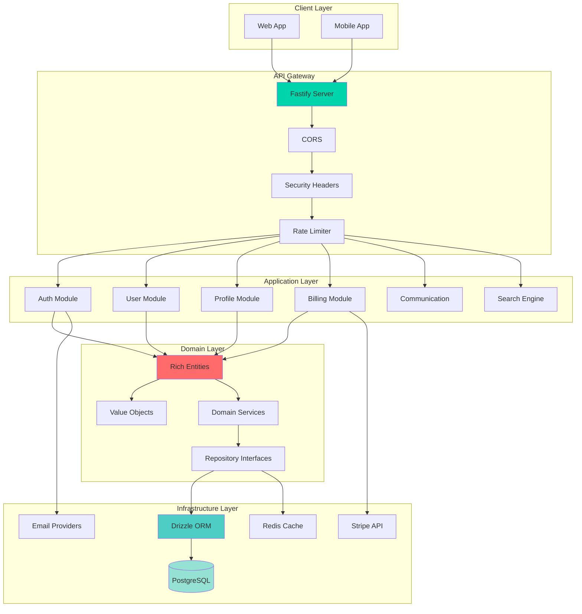
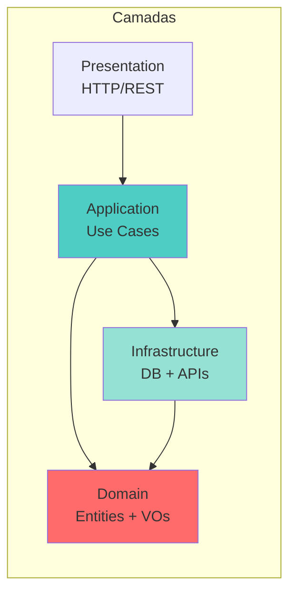
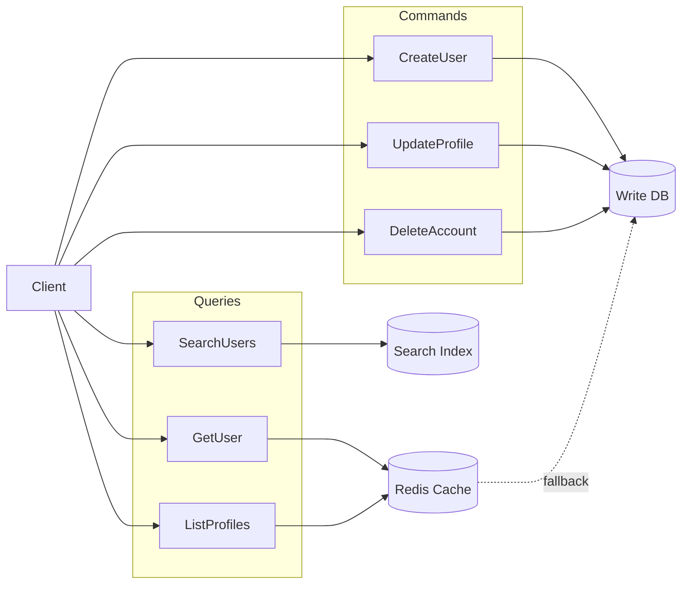
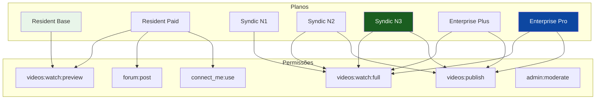
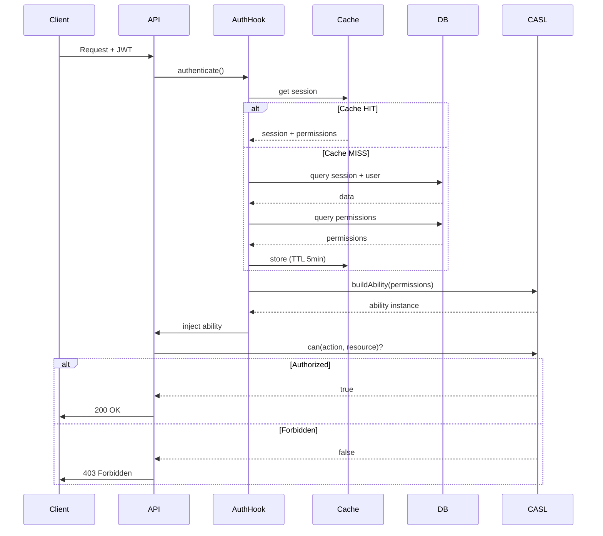
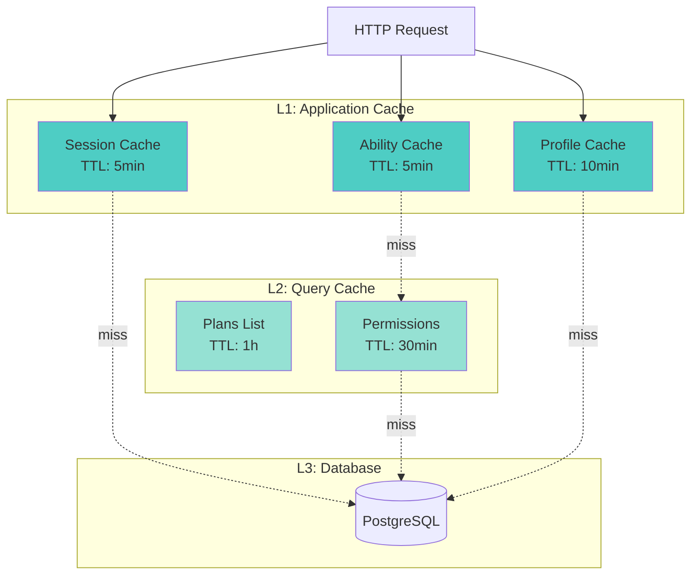
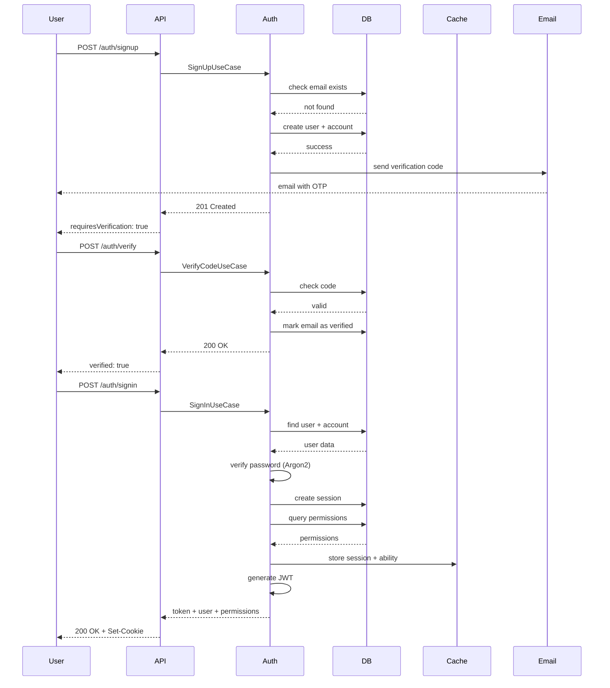
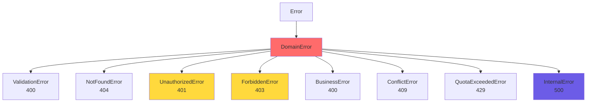
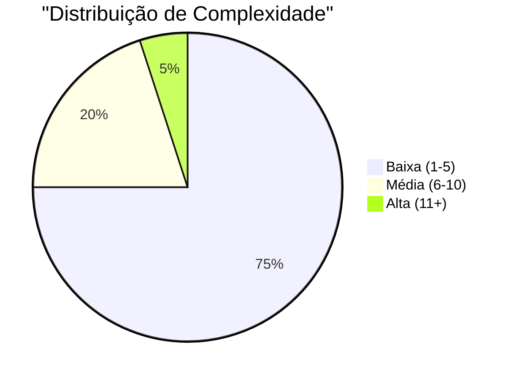
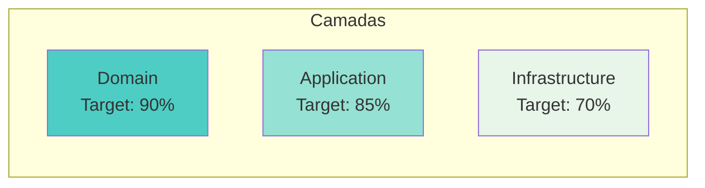

# 🚀 Arquitetura Enterprise-Grade com TypeScript

> Como construí uma API escalável, type-safe e production-ready usando os melhores padrões da indústria

---

## 📊 Visão Geral da Arquitetura



---

## 🏗️ Estrutura de Diretórios

```
apps/api/src/
│
├── 📂 core/                          # Núcleo da aplicação
│   ├── contracts/                    # Contratos base
│   │   ├── base-repository.ts        # Repository pattern
│   │   ├── base-use-case.ts          # Use case pattern
│   │   ├── base-task.ts              # Background jobs
│   │   └── authorization-service.ts  # ABAC interface
│   └── errors/                       # Domain errors
│       └── index.ts                  # Custom exceptions
│
├── 📂 infrastructure/                # Camada de infraestrutura
│   ├── database/
│   │   └── drizzle/
│   │       ├── client.ts             # DB connection
│   │       ├── schema/               # Database schemas
│   │       ├── migrations/           # Version control
│   │       └── unit-of-work/         # Transaction management
│   ├── providers/
│   │   ├── cache/                    # Redis provider
│   │   ├── email/                    # Email with failover
│   │   └── search/                   # Full-text search
│   └── handlers/
│       └── errors.handler.ts         # Global error handling
│
├── 📂 modules/                       # Módulos de negócio (DDD)
│   ├── auth/
│   │   ├── domain/
│   │   │   ├── entities/             # Session, Account, Verification
│   │   │   ├── services/             # JWT, Auth, Username Generator
│   │   │   ├── repositories/         # Interfaces
│   │   │   └── value-objects/        # Password VO
│   │   ├── application/
│   │   │   └── use-cases/            # 13 use cases
│   │   └── infrastructure/
│   │       ├── database/             # Drizzle repositories
│   │       ├── http/                 # REST routes
│   │       ├── jobs/                 # Cleanup tasks
│   │       └── providers/            # OAuth (Arctic)
│   │
│   ├── user/
│   │   ├── domain/
│   │   │   ├── entities/             # User aggregate
│   │   │   ├── enums/                # UserRole
│   │   │   ├── repositories/         # IUserRepository
│   │   │   └── value-objects/        # Email, Phone, Username
│   │   ├── application/
│   │   │   └── use-cases/            # Business logic
│   │   └── infrastructure/
│   │       ├── database/
│   │       └── http/
│   │
│   ├── profile/
│   │   ├── domain/
│   │   │   ├── entities/             # 5 tipos de perfil
│   │   │   │   ├── base-profile.ts   # Abstract base
│   │   │   │   ├── resident.ts       # Morador
│   │   │   │   ├── syndic.ts         # Síndico
│   │   │   │   ├── enterprise.ts     # Empresa
│   │   │   │   ├── local-company.ts  # Comércio Local
│   │   │   │   └── marketing.ts      # Marketing
│   │   │   ├── value-objects/        # CPF, CNPJ
│   │   │   └── interfaces/           # Address, Contacts
│   │   ├── application/
│   │   │   ├── use-cases/
│   │   │   └── mappers/              # DTO transformers
│   │   └── infrastructure/
│   │
│   ├── billing/
│   │   ├── domain/
│   │   │   ├── entities/             # Plan, Subscription, Invoice
│   │   │   ├── services/             # Permission, Quota
│   │   │   ├── value-objects/        # Money VO
│   │   │   └── enums/                # 14 enums
│   │   └── infrastructure/
│   │       ├── providers/
│   │       │   └── stripe/           # Stripe integration
│   │       └── webhooks/             # Payment webhooks
│   │
│   ├── communication/
│   │   ├── domain/
│   │   │   └── entities/             # ConnectMe
│   │   └── application/
│   │       └── use-cases/            # Send, Create, Get
│   │
│   ├── onboarding/
│   │   └── application/
│   │       └── use-cases/            # Onboarding flow
│   │
│   └── search-engine/
│       ├── application/
│       │   ├── services/             # Search orchestration
│       │   └── use-cases/            # 4 tipos de busca
│       └── infrastructure/
│           └── jobs/                 # Index sync
│
├── 📂 shared/                        # Código compartilhado
│   ├── config/                       # Environment validation
│   ├── contracts/                    # Shared interfaces
│   ├── helpers/                      # Response helpers
│   ├── hooks/                        # Fastify hooks
│   │   ├── authenticate.hook.ts      # JWT + Cache
│   │   └── authorize.hook.ts         # CASL ABAC
│   ├── infrastructure/
│   │   └── auth/                     # CASL adapter
│   ├── plugins/                      # Fastify plugins
│   │   ├── awilix.plugin.ts          # DI container
│   │   ├── cors.plugin.ts            # CORS config
│   │   ├── helmet.plugin.ts          # Security headers
│   │   ├── rate-limit.plugin.ts      # Rate limiting
│   │   ├── redis.plugin.ts           # Redis connection
│   │   ├── swagger.plugin.ts         # API docs
│   │   └── ...
│   ├── providers/                    # Provider interfaces
│   ├── types/                        # TypeScript types
│   └── utils/                        # Utilities
│
├── 📄 app.ts                         # Application setup
└── 📄 server.ts                      # Entry point
```

---

## 🎯 Padrões Arquiteturais Implementados

### 1. Clean Architecture + DDD



**Benefícios:**
- ✅ Regras de negócio isoladas
- ✅ Testabilidade máxima
- ✅ Independência de frameworks
- ✅ Manutenibilidade a longo prazo

### 2. Repository Pattern

```typescript
// Interface no domínio (independente de infra)
interface IUserRepository {
  findById(id: string): Promise<User | null>;
  save(user: User): Promise<void>;
}

// Implementação na infraestrutura
class UserRepositoryImpl implements IUserRepository {
  constructor(private db: DrizzleClient) {}
  
  async findById(id: string): Promise<User | null> {
    // Drizzle query
  }
}
```

### 3. Unit of Work Pattern

```typescript
// Transações gerenciadas centralmente
await unitOfWork.run(async () => {
  await userRepository.save(user);
  await profileRepository.save(profile);
  // Commit automático ou rollback em caso de erro
});
```

### 4. Dependency Injection (Awilix)

```typescript
// Registro de dependências
diContainer.register({
  userRepository: asClass(UserRepositoryImpl, {
    lifetime: Lifetime.SCOPED
  }),
  getUserUseCase: asClass(GetUserUseCase, {
    lifetime: Lifetime.SCOPED
  })
});
```

### 5. CQRS (Parcial)



---

## 🔐 Sistema de Permissões (ABAC)

### Matriz Funcional



### Fluxo de Autorização



---

## 💾 Estratégia de Cache

### Cache em Múltiplas Camadas



### Invalidação Inteligente

```typescript
// Invalidação em cascata
async function updateUserRole(userId: string, newRole: UserRole) {
  await unitOfWork.run(async () => {
    user.assignRole(newRole);
    await userRepository.save(user);
  });
  
  // Invalidação após commit
  await Promise.all([
    cache.del(`session:${sessionId}`),
    cache.del(`ability:${userId}`),
    cache.del(`profile:${userId}`)
  ]);
}
```

---

## 🔄 Fluxo de Autenticação Completo



---

## 📊 Stack Tecnológica

### Backend Core

| Tecnologia | Versão | Uso |
|------------|--------|-----|
| **Node.js** | >=25 | Runtime |
| **Bun** | 1.3.5 | Runtime alternativo |
| **TypeScript** | 5.9.3 | Type safety |
| **Fastify** | 5.7.2 | Web framework |

### Database & ORM

| Tecnologia | Versão | Uso |
|------------|--------|-----|
| **PostgreSQL** | Latest | Database |
| **Drizzle ORM** | 1.0.0-beta | Type-safe ORM |
| **Redis** | Latest | Cache + Sessions |

### Segurança & Auth

| Tecnologia | Versão | Uso |
|------------|--------|-----|
| **Jose** | 6.1.3 | JWT |
| **Argon2** | 0.44.0 | Password hashing |
| **CASL** | 6.8.0 | Authorization (ABAC) |
| **Helmet** | 13.0.2 | Security headers |

### Validação & Schemas

| Tecnologia | Versão | Uso |
|------------|--------|-----|
| **Zod** | 4.3.6 | Runtime validation |
| **Drizzle-Zod** | 0.8.3 | Schema integration |

### Dependency Injection

| Tecnologia | Versão | Uso |
|------------|--------|-----|
| **Awilix** | 12.0.5 | DI Container |

### Integrações

| Tecnologia | Versão | Uso |
|------------|--------|-----|
| **Stripe** | 20.3.1 | Payments |
| **Resend** | 6.9.1 | Email (primary) |
| **Nodemailer** | 7.0.13 | Email (fallback) |
| **Arctic** | 3.7.0 | OAuth PKCE |

---

## 🎨 Padrões de Código

### Value Objects

```typescript
// Encapsulamento + Validação
export class EmailVO {
  private constructor(private readonly value: string) {}
  
  static create(value: string): EmailVO {
    if (!value || !/^[^\s@]+@[^\s@]+\.[^\s@]+$/.test(value)) {
      throw new Error("Email inválido");
    }
    return new EmailVO(value.toLowerCase());
  }
  
  getValue(): string {
    return this.value;
  }
  
  equals(other: EmailVO): boolean {
    return this.value === other.value;
  }
}
```

### Rich Entities

```typescript
export class User {
  constructor(
    private readonly id: string,
    private email: EmailVO,
    private role: UserRole,
    // ... outros campos
  ) {}
  
  // Comportamento rico
  changeEmail(newEmail: EmailVO): void {
    if (this.email.equals(newEmail)) {
      throw new BusinessError("Email já é o mesmo");
    }
    this.email = newEmail;
    this.emailVerified = false; // Regra de negócio
  }
  
  ban(reason: string): void {
    if (this.role === UserRole.ADMIN) {
      throw new BusinessError("Admin não pode ser banido");
    }
    this.banned = true;
    this.banReason = reason;
  }
}
```

### Use Cases

```typescript
export class SignInUseCase extends TransactionalUseCase<Input, Output> {
  async execute(data: Input): Promise<Output> {
    // 1. Validação
    const user = await this.userRepository.findByEmail(data.email);
    if (!user) throw new UnauthorizedError();
    
    // 2. Lógica de negócio
    const account = await this.accountRepository.findByUser(user.id);
    const isValid = await account.verifyPassword(data.password);
    if (!isValid) throw new UnauthorizedError();
    
    // 3. Transação
    const session = await this.unitOfWork.run(async () => {
      const session = this.authService.createSession(user);
      await this.sessionRepository.save(session);
      return session;
    });
    
    // 4. Cache
    await this.cacheSession(session, user);
    
    // 5. Retorno
    return this.buildResponse(session, user);
  }
}
```

---

## 🚦 Tratamento de Erros

### Hierarquia de Erros



### Global Error Handler

```typescript
export async function errorHandler(
  error: FastifyError,
  request: FastifyRequest,
  reply: FastifyReply
): Promise<void> {
  // Log estruturado
  request.log.error({
    err: error,
    request: {
      url: request.url,
      method: request.method,
      userId: request.user?.getId()
    }
  });
  
  // Zod validation
  if (error instanceof ZodError) {
    return reply.status(400).send({
      success: false,
      code: "VALIDATION_ERROR",
      details: error.issues
    });
  }
  
  // Domain errors
  if (error instanceof DomainError) {
    return reply.status(error.statusCode).send({
      success: false,
      code: error.code,
      error: error.message
    });
  }
  
  // Unknown errors
  return reply.status(500).send({
    success: false,
    code: "INTERNAL_ERROR",
    error: "Internal Server Error"
  });
}
```

---

## 📈 Métricas de Qualidade

### Complexidade Ciclomática



### Cobertura de Testes (Planejado)



---

## 🎯 Princípios SOLID Aplicados

### Single Responsibility

```typescript
// ❌ Violação
class UserService {
  createUser() {}
  sendEmail() {}
  processPayment() {}
}

// ✅ Correto
class UserService {
  createUser() {}
}
class EmailService {
  sendEmail() {}
}
class PaymentService {
  processPayment() {}
}
```

### Open/Closed

```typescript
// Extensível via herança
abstract class BaseProfile {
  abstract validate(): void;
}

class EnterpriseProfile extends BaseProfile {
  validate() {
    // Validação específica
  }
}
```

### Liskov Substitution

```typescript
// Qualquer IUserRepository pode ser substituído
interface IUserRepository {
  findById(id: string): Promise<User | null>;
}

class DrizzleUserRepository implements IUserRepository {}
class InMemoryUserRepository implements IUserRepository {}
```

### Interface Segregation

```typescript
// Interfaces específicas ao invés de uma grande
interface IReadRepository {
  findById(id: string): Promise<Entity | null>;
}

interface IWriteRepository {
  save(entity: Entity): Promise<void>;
}
```

### Dependency Inversion

```typescript
// Use cases dependem de abstrações, não de implementações
class SignInUseCase {
  constructor(
    private userRepository: IUserRepository, // Interface
    private authService: IAuthService // Interface
  ) {}
}
```

---

## 🔮 Próximos Passos

- [ ] Implementar Event Sourcing para auditoria
- [ ] Adicionar GraphQL para queries complexas
- [ ] Implementar CQRS completo com read models
- [ ] Adicionar observabilidade (OpenTelemetry)
- [ ] Implementar feature flags
- [ ] Adicionar testes E2E com Playwright
- [ ] Implementar CI/CD com GitHub Actions
- [ ] Adicionar monitoramento com Grafana

---

## 💭 Reflexão

Construir uma arquitetura enterprise-grade não é sobre usar as tecnologias mais recentes, mas sim sobre:

✨ **Separação de responsabilidades clara**  
✨ **Código testável e manutenível**  
✨ **Independência de frameworks**  
✨ **Regras de negócio protegidas**  
✨ **Escalabilidade desde o início**

Cada decisão arquitetural foi pensada para suportar crescimento, mudanças e manutenção a longo prazo.

---

**#TypeScript #CleanArchitecture #DDD #SoftwareEngineering #BackendDevelopment #NodeJS #Fastify #PostgreSQL**

