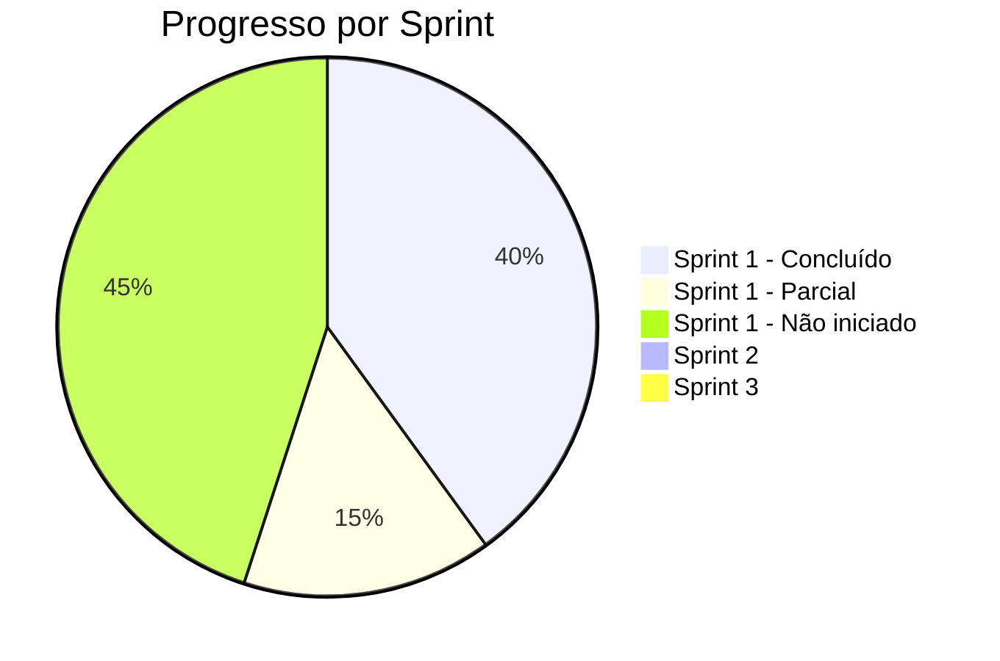

# Status do Projeto My Síndico — API vs. Escopo Contratado

Análise completa do que está implementado no `apps/api` comparado aos três documentos de referência:
- **Novo Escopo v7** (Sprints e funcionalidades detalhadas)
- **Manual Técnico** (Framework conceitual/business)
- **Matriz Funcional** (Permissões por perfil/plano)

> [!NOTE]
> O usuário mencionou que o **fluxo de onboarding não é mais por URL param** — o escopo descreve `?role=sindico&plan=pro` mas isso mudou.

---

## Legenda

| Símbolo | Significado |
|---------|-------------|
| ✅ | Concluído / Implementado |
| 🔧 | Parcialmente implementado (infra pronta, falta lógica) |
| ❌ | Não iniciado |

---

## SPRINT 1 — Fundação, Identidade e Acesso

### 1.1 Arquitetura de Permissões (Core ABAC)

| Item | Status | Detalhes |
|------|--------|---------|
| Sistema de roles | ✅ | Enum `userRoles` com: `user`, `resident`, `syndic`, `enterprise`, `marketing`, `local_company`, `admin` |
| Planos (plan_type) | ✅ | Enum `planType` com todos os planos da Matriz: `resident_base/paid`, `syndic_n1/n2/n3`, `enterprise_plus/pro`, `marketing_standard`, `local_company_standard` |
| Tabelas de permissão | ✅ | Schema `permissions`, `plan_permissions`, `plan_quotas`, `feature_usages` |
| Repositórios Billing | ✅ | `PermissionRepositoryImpl`, `PlanPermissionRepositoryImpl`, `PlanQuotaRepositoryImpl`, `FeatureUsageRepositoryImpl` |
| Domain entities | ✅ | `Permission`, `PlanPermission`, `PlanQuota`, `FeatureUsage` entidades no billing domain |
| `PermissionService` (ABAC) | ❌ | Está comentado no `BillingModule` — não há service ativo que avalie regras ABAC |
| Middleware de proteção | 🔧 | Hook `authenticate.hook.ts` existe (JWT), mas não há middleware de permissão/plano nas rotas |
| Matriz Funcional seed | ❌ | Não há seed script populando as permissões da Matriz Funcional no banco |

---

### 1.2 Onboarding e Autenticação

| Item | Status | Detalhes |
|------|--------|---------|
| **Sign Up** | ✅ | [sign-up.use-case.ts](file:///home/vinni/Documentos/Projetos/Clientes/Joao/MasterSindico/Development/full-stack/apps/api/src/modules/auth/application/use-cases/sign-up.use-case.ts) |
| **Sign In** | ✅ | [sign-in.use-case.ts](file:///home/vinni/Documentos/Projetos/Clientes/Joao/MasterSindico/Development/full-stack/apps/api/src/modules/auth/application/use-cases/sign-in.use-case.ts) |
| **Sign Out** | ✅ | [sign-out.use-case.ts](file:///home/vinni/Documentos/Projetos/Clientes/Joao/MasterSindico/Development/full-stack/apps/api/src/modules/auth/application/use-cases/sign-out.use-case.ts) |
| **OAuth (Arctic)** | ✅ | [oauth.use-case.ts](file:///home/vinni/Documentos/Projetos/Clientes/Joao/MasterSindico/Development/full-stack/apps/api/src/modules/auth/application/use-cases/oauth.use-case.ts) + `ArcticOAuthProvider` |
| **Email Verification** | ✅ | `SendVerificationCodeUseCase` + `VerifyCodeUseCase` |
| **Forgot/Reset Password** | ✅ | `ForgotPasswordUseCase` + `ResetPasswordUseCase` |
| **Sessões (CRUD)** | ✅ | `GetSession`, `ListSessions`, `RevokeSession`, `RevokeOtherSessions`, `RevokeAllSessions` |
| **Cleanup Jobs** | ✅ | `SessionCleanupTask` (30min) + `VerificationCleanupTask` (1h) |
| **JWT Service** | ✅ | `JwtTokenService` singleton |
| **Username Generator** | ✅ | `UsernameGeneratorService` |
| **Onboarding UseCase** | 🔧 | [create-onboarding.use-case.ts](file:///home/vinni/Documentos/Projetos/Clientes/Joao/MasterSindico/Development/full-stack/apps/api/src/modules/onboarding/application/use-cases/create-onboarding.use-case.ts) — existe mas sem repositórios registrados no módulo |
| Onboarding por URL param | ⚠️ | O escopo previa `?role=sindico&plan=pro` — **o usuário disse que isso mudou** e não é mais por URL param |

---

### 1.3 Gestão de Perfis e Visibilidade

| Item | Status | Detalhes |
|------|--------|---------|
| Schema Syndic | ✅ | [syndic.ts](file:///home/vinni/Documentos/Projetos/Clientes/Joao/MasterSindico/Development/full-stack/apps/api/src/infrastructure/database/drizzle/schema/profiles/syndic.ts) |
| Schema Enterprise | ✅ | [enterprise.ts](file:///home/vinni/Documentos/Projetos/Clientes/Joao/MasterSindico/Development/full-stack/apps/api/src/infrastructure/database/drizzle/schema/profiles/enterprise.ts) |
| Schema Resident | ✅ | [resident.ts](file:///home/vinni/Documentos/Projetos/Clientes/Joao/MasterSindico/Development/full-stack/apps/api/src/infrastructure/database/drizzle/schema/profiles/resident.ts) |
| Schema Marketing | ✅ | [marketing.ts](file:///home/vinni/Documentos/Projetos/Clientes/Joao/MasterSindico/Development/full-stack/apps/api/src/infrastructure/database/drizzle/schema/profiles/marketing.ts) |
| Schema LocalCompany | ✅ | [localCompany.ts](file:///home/vinni/Documentos/Projetos/Clientes/Joao/MasterSindico/Development/full-stack/apps/api/src/infrastructure/database/drizzle/schema/profiles/localCompany.ts) |
| Domain Entities (Profile) | ✅ | `BaseProfile`, `SyndicEntity`, `EnterpriseEntity`, `ResidentEntity`, `MarketingEntity`, `LocalCompanyEntity` |
| Value Objects | ✅ | `CPF`, `CNPJ` |
| Domain Interfaces | ✅ | Address, Certifications, CommercialContact, FinanceContact, ISOs, LegalRepresentative, OperatingCity, Seals |
| Repositórios | ✅ | 5 repositórios implementados (Syndic, Enterprise, Resident, LocalCompany, Marketing) |
| `GetProfileUseCase` | ✅ | [get-profile.use-case.ts](file:///home/vinni/Documentos/Projetos/Clientes/Joao/MasterSindico/Development/full-stack/apps/api/src/modules/profile/application/use-cases/get-profile.use-case.ts) |
| Rotas de Profile | ✅ | [profile.routes.ts](file:///home/vinni/Documentos/Projetos/Clientes/Joao/MasterSindico/Development/full-stack/apps/api/src/modules/profile/infrastructure/http/routes/profile.routes.ts) em `/v1/profiles` |
| CRUD completo de Perfil | ❌ | Só tem GET — falta Create, Update, Delete de perfis |
| Middleware de visibilidade | ❌ | Não há lógica de "perfil só aparece se o plano permitir" |
| Status Bronze/Prata/Ouro | ❌ | Não há lógica de cálculo/exibição de status do síndico |
| Vínculo com condomínios | 🔧 | Schema `vinculos.ts` existe no DB, mas sem use-case/rota |

---

### 1.4 Motor de Upload com Trava Temporal (Vídeo)

| Item | Status | Detalhes |
|------|--------|---------|
| Schema de vídeos | ✅ | `videos`, `video_comments`, `video_likes`, `video_views` |
| Enums de vídeo | ✅ | `videoType` (instrucional, institucional, curriculo, sindico, curso) + `videoStatus` |
| Trava trimestral (90d) | ❌ | Não há use-case nem lógica implementada |
| Upload integration (Mux/CF) | ❌ | Sem provider de streaming |
| Use cases de vídeo | ❌ | Nenhum use-case de vídeo implementado |

---

### 1.5 Motor de Busca e Catálogo

| Item | Status | Detalhes |
|------|--------|---------|
| Search endpoints | ❌ | Nenhum endpoint de busca implementado |
| Filtros por categoria | 🔧 | Schemas `enterprise_categories` e `service_categories` existem no DB |
| Filtro por CEP | ❌ | Não implementado |

---

### 1.6 Connect Me (Formulário de Contato)

| Item | Status | Detalhes |
|------|--------|---------|
| CRUD + disparo | ❌ | Não implementado |
| Validação de cota | ❌ | Não implementado |

---

### 1.7 Player de Vídeo e Consumo

| Item | Status | Detalhes |
|------|--------|---------|
| Integração streaming | ❌ | Sem Mux/Cloudflare |
| Paywall 25% | ❌ | Não implementado |
| Contador de views (>70%) | ❌ | Schema `video_views` existe mas sem lógica |

---

## SPRINT 2 — Motor de Gestão Condominial

| Funcionalidade | Status | Detalhes |
|----------------|--------|---------|
| Gestão de Assembleias/Eventos | ❌ | Sem schemas, entidades ou use-cases |
| Votação Assíncrona | ❌ | Não iniciado |
| Painel de Transparência | ❌ | Não iniciado |
| Avaliação Objetiva (Rating) | ❌ | Não iniciado |

---

## SPRINT 3 — Vizinhança e Promoções

| Funcionalidade | Status | Detalhes |
|----------------|--------|---------|
| Engine de Cupons | ❌ | Não iniciado |
| Promoção do Dia | ❌ | Não iniciado |
| Busca por CEP (vizinhança) | ❌ | Schema `buildings` existe mas sem lógica |

---

## Funcionalidades Transversais (Escopo)

| Funcionalidade | Status | Detalhes |
|----------------|--------|---------|
| Cursos/Módulos | ❌ | Enum `curso` existe em `videoType` mas sem CRUD |
| Feedback Privado ("Rede Social Cega") | ❌ | Schemas `video_likes`, `video_comments` existem mas sem lógica de visibilidade |
| Fórum/Comunidade | ❌ | Completamente ausente |
| Lives (Streaming ao vivo) | ❌ | Não iniciado |
| Podcast (YouTube API) | ❌ | Não iniciado |
| Painel Admin MasterSíndico | ❌ | Não iniciado |
| Banco de Talentos | ❌ | Não iniciado |

---

## Infraestrutura Base ✅

| Item | Status |
|------|--------|
| Fastify + Awilix DI | ✅ |
| Drizzle ORM + PostgreSQL | ✅ |
| Redis Cache | ✅ |
| Email Provider | ✅ |
| Stripe Provider (Billing) | ✅ |
| Webhook Handler (Stripe) | ✅ |
| CORS, Helmet, Rate Limit, Cookie | ✅ |
| Swagger docs | ✅ |
| Logger (Pino) | ✅ |
| Scheduler (toad-scheduler) | ✅ |
| UnitOfWork pattern | ✅ |
| Error handler global | ✅ |
| Response helpers | ✅ |
| Plan limits config | ✅ |
| 11 migrations Drizzle | ✅ |

---

## Resumo Executivo

### O que está SÓLIDO:
- **Autenticação completa** — fluxo completo com JWT, OAuth (Arctic), sessions, verificação, forgot/reset password
- **Modelagem de dados** — schemas Drizzle bem estruturados para auth, billing, profiles, video, buildings, categories
- **Billing infra** — entities, repositories, Stripe provider, webhook handler, mas sem use-cases expostos
- **Profile domain** — entidades ricas com VOs (CPF/CNPJ), interfaces de detalhe, 5 repositórios implementados

### O que falta para completar a Sprint 1:
1. **PermissionService ABAC** ativo (está comentado)
2. **CRUD completo de Perfis** (só tem GET)
3. **Onboarding refatorado** (novo fluxo, sem URL params)
4. **Motor de vídeo** (upload, trava 90d, streaming)
5. **Motor de busca** (search engine com filtros)
6. **Connect Me** (formulário + cotas)
7. **Middleware de visibilidade** por plano nas rotas
8. **Seed da Matriz Funcional** no banco

### Sprints 2 e 3:
- Completamente **não iniciadas** no backend
