# ANÁLISE TÉCNICA COMPLETA - MASTER SÍNDICO API
## LINHA POR LINHA - TODOS OS 276 ARQUIVOS

**Data Início**: 2026-02-25  
**Metodologia**: Análise linha por linha, arquivo por arquivo  
**Total de Arquivos**: 276  
**Arquivos Analisados**: 19/276 (6.9%)  
**Linhas Analisadas**: ~2.621/~50.000 (5.2%)  

---

## 📋 CHECKLIST DE ARQUIVOS (276 TOTAL)

### ROOT FILES (11 arquivos)
- [x] package.json ✅
- [ ] biome.json
- [ ] clear_redis.ts
- [ ] cookies.txt
- [x] docker-compose.yml ✅
- [x] drizzle.config.ts ✅
- [ ] railway.json
- [ ] README.md
- [ ] rotes.http
- [ ] test_db.ts
- [x] tsconfig.json ✅

### SRC/CORE (6 arquivos)
- [ ] src/core/contracts/authorization-service.interface.ts
- [ ] src/core/contracts/base-repository.ts
- [ ] src/core/contracts/base-task.ts
- [ ] src/core/contracts/base-use-case.ts
- [ ] src/core/errors/index.ts
- [ ] src/app.ts
- [ ] src/server.ts

### SRC/INFRASTRUCTURE/DATABASE (48 arquivos)
- [ ] src/infrastructure/database/drizzle/client.ts
- [ ] src/infrastructure/database/drizzle/drizzle.module.ts

**Schema Auth (4 arquivos)**:
- [ ] src/infrastructure/database/drizzle/schema/auth/accounts.ts
- [ ] src/infrastructure/database/drizzle/schema/auth/index.ts
- [ ] src/infrastructure/database/drizzle/schema/auth/sessions.ts
- [ ] src/infrastructure/database/drizzle/schema/auth/verifications.ts

**Schema Billing (11 arquivos)**:
- [ ] src/infrastructure/database/drizzle/schema/billing/feature-usages.ts
- [ ] src/infrastructure/database/drizzle/schema/billing/index.ts
- [ ] src/infrastructure/database/drizzle/schema/billing/invoices.ts
- [ ] src/infrastructure/database/drizzle/schema/billing/payment-methods.ts
- [ ] src/infrastructure/database/drizzle/schema/billing/permissions.ts
- [ ] src/infrastructure/database/drizzle/schema/billing/plan-permissions.ts
- [ ] src/infrastructure/database/drizzle/schema/billing/plan-quotas.ts
- [ ] src/infrastructure/database/drizzle/schema/billing/plans.ts
- [ ] src/infrastructure/database/drizzle/schema/billing/subscriptions.ts
- [ ] src/infrastructure/database/drizzle/schema/billing/transactions.ts
- [ ] src/infrastructure/database/drizzle/schema/billing/webhook-logs.ts

**Schema Buildings (2 arquivos)**:
- [ ] src/infrastructure/database/drizzle/schema/buildings/buildings.ts
- [ ] src/infrastructure/database/drizzle/schema/buildings/index.ts

**Schema Categories (2 arquivos)**:
- [ ] src/infrastructure/database/drizzle/schema/categories/index.ts
- [ ] src/infrastructure/database/drizzle/schema/categories/service-categories.ts

**Schema Connect-Me (2 arquivos)**:
- [ ] src/infrastructure/database/drizzle/schema/connect-me/connect-me.ts
- [ ] src/infrastructure/database/drizzle/schema/connect-me/index.ts

**Schema Profiles (8 arquivos)**:
- [ ] src/infrastructure/database/drizzle/schema/profiles/enterprise-categories.ts
- [ ] src/infrastructure/database/drizzle/schema/profiles/enterprise.ts
- [ ] src/infrastructure/database/drizzle/schema/profiles/index.ts
- [ ] src/infrastructure/database/drizzle/schema/profiles/localCompany.ts
- [ ] src/infrastructure/database/drizzle/schema/profiles/marketing.ts
- [ ] src/infrastructure/database/drizzle/schema/profiles/resident.ts
- [ ] src/infrastructure/database/drizzle/schema/profiles/syndic.ts

**Schema Search (2 arquivos)**:
- [ ] src/infrastructure/database/drizzle/schema/search/index.ts
- [ ] src/infrastructure/database/drizzle/schema/search/search.ts

**Schema Users (3 arquivos)**:
- [ ] src/infrastructure/database/drizzle/schema/users/index.ts
- [ ] src/infrastructure/database/drizzle/schema/users/users.ts
- [ ] src/infrastructure/database/drizzle/schema/users/vinculos.ts

**Schema Videos (5 arquivos)**:
- [ ] src/infrastructure/database/drizzle/schema/videos/index.ts
- [ ] src/infrastructure/database/drizzle/schema/videos/video-comments.ts
- [ ] src/infrastructure/database/drizzle/schema/videos/video-likes.ts
- [ ] src/infrastructure/database/drizzle/schema/videos/videos.ts
- [ ] src/infrastructure/database/drizzle/schema/videos/video-views.ts

**Schema Root (3 arquivos)**:
- [ ] src/infrastructure/database/drizzle/schema/enums.ts
- [ ] src/infrastructure/database/drizzle/schema/index.ts
- [ ] src/infrastructure/database/drizzle/schema/relations.ts

**Seeds (2 arquivos)**:
- [ ] src/infrastructure/database/drizzle/seeds/seed-permissions.ts
- [ ] src/infrastructure/database/drizzle/seeds/seed-plans.ts

**Unit of Work (2 arquivos)**:
- [ ] src/infrastructure/database/drizzle/unit-of-work/unit-of-work.interface.ts
- [ ] src/infrastructure/database/drizzle/unit-of-work/unit-of-work.ts

### SRC/INFRASTRUCTURE/OUTROS (14 arquivos)
- [ ] src/infrastructure/handlers/errors.handler.ts
- [ ] src/infrastructure/health/health.route.ts

**Providers Cache (2 arquivos)**:
- [ ] src/infrastructure/providers/cache/cache.module.ts
- [ ] src/infrastructure/providers/cache/redis-cache.provider.ts

**Providers Email (5 arquivos)**:
- [ ] src/infrastructure/providers/email/base-email.provider.ts
- [ ] src/infrastructure/providers/email/email.module.ts
- [ ] src/infrastructure/providers/email/nodemailer.email-provider.ts
- [ ] src/infrastructure/providers/email/resend.email-provider.ts
- [ ] src/infrastructure/providers/email/resilient-email.provider.ts

**Providers Search (2 arquivos)**:
- [ ] src/infrastructure/providers/search/postgres-search.provider.ts
- [ ] src/infrastructure/providers/search/search.module.ts

### SRC/MODULES/AUTH (40 arquivos)
**Application Use Cases (13 arquivos)**:
- [ ] src/modules/auth/application/use-cases/forgot-password.use-case.ts
- [ ] src/modules/auth/application/use-cases/get-session.use-case.ts
- [ ] src/modules/auth/application/use-cases/list-sessions.use-case.ts
- [ ] src/modules/auth/application/use-cases/oauth.use-case.ts
- [ ] src/modules/auth/application/use-cases/reset-password.use-case.ts
- [ ] src/modules/auth/application/use-cases/revoke-all-sessions.use-case.ts
- [ ] src/modules/auth/application/use-cases/revoke-other-sessions.use-case.ts
- [ ] src/modules/auth/application/use-cases/revoke-session.use-case.ts
- [ ] src/modules/auth/application/use-cases/sign-in.use-case.ts
- [ ] src/modules/auth/application/use-cases/sign-out.use-case.ts
- [ ] src/modules/auth/application/use-cases/sign-up.use-case.ts
- [ ] src/modules/auth/application/use-cases/verification/send-verification-code.use-case.ts
- [ ] src/modules/auth/application/use-cases/verification/verify-code.use-case.ts

**Domain (18 arquivos)**:
- [ ] src/modules/auth/domain/entities/base-account.entity.ts
- [ ] src/modules/auth/domain/entities/local-account.entity.ts
- [ ] src/modules/auth/domain/entities/oauth-account.entity.ts
- [ ] src/modules/auth/domain/entities/session.entity.ts
- [ ] src/modules/auth/domain/entities/verification.entity.ts
- [ ] src/modules/auth/domain/helpers/session.helper.ts
- [ ] src/modules/auth/domain/helpers/verification.helper.ts
- [ ] src/modules/auth/domain/interfaces/oauth-tokens.interface.ts
- [ ] src/modules/auth/domain/providers/oauth.provider.ts
- [ ] src/modules/auth/domain/repositories/account.repository.ts
- [ ] src/modules/auth/domain/repositories/session.repository.ts
- [ ] src/modules/auth/domain/repositories/verification.repository.ts
- [ ] src/modules/auth/domain/services/auth.service.ts
- [ ] src/modules/auth/domain/services/jwt.service.ts
- [ ] src/modules/auth/domain/services/username-generator.service.ts
- [ ] src/modules/auth/domain/value-objects/password.vo.ts

**Infrastructure (8 arquivos)**:
- [ ] src/modules/auth/infrastructure/database/drizzle/repositories/account.repository.impl.ts
- [ ] src/modules/auth/infrastructure/database/drizzle/repositories/session.repository.impl.ts
- [ ] src/modules/auth/infrastructure/database/drizzle/repositories/verification.repository.impl.ts
- [ ] src/modules/auth/infrastructure/http/routes/auth.routes.ts
- [ ] src/modules/auth/infrastructure/jobs/session.cleanup.ts
- [ ] src/modules/auth/infrastructure/jobs/verification.cleanup.ts
- [ ] src/modules/auth/infrastructure/providers/arctic-oauth.provider.ts

**Module (2 arquivos)**:
- [ ] src/modules/auth/auth.module.ts
- [ ] src/modules/auth/README.md

### SRC/MODULES/BILLING (51 arquivos)
**Domain Entities (10 arquivos)**:
- [ ] src/modules/billing/domain/entities/feature-usage.entity.ts
- [ ] src/modules/billing/domain/entities/invoice.entity.ts
- [ ] src/modules/billing/domain/entities/payment-method.entity.ts
- [ ] src/modules/billing/domain/entities/permission.entity.ts
- [ ] src/modules/billing/domain/entities/plan.entity.ts
- [ ] src/modules/billing/domain/entities/plan-permission.entity.ts
- [ ] src/modules/billing/domain/entities/plan-quota.entity.ts
- [ ] src/modules/billing/domain/entities/subscription.entity.ts
- [ ] src/modules/billing/domain/entities/transaction.entity.ts

**Domain Enums (14 arquivos)**:
- [ ] src/modules/billing/domain/enums/billing-cycle.enum.ts
- [ ] src/modules/billing/domain/enums/card-brand.enum.ts
- [ ] src/modules/billing/domain/enums/collection-method.enum.ts
- [ ] src/modules/billing/domain/enums/invoice-status.enum.ts
- [ ] src/modules/billing/domain/enums/payment-method-status.enum.ts
- [ ] src/modules/billing/domain/enums/payment-method-type.ts
- [ ] src/modules/billing/domain/enums/plan-type.enum.ts
- [ ] src/modules/billing/domain/enums/provider-payment-intent-next-action.enum.ts
- [ ] src/modules/billing/domain/enums/quota-period.enum.ts
- [ ] src/modules/billing/domain/enums/refund-status.enum.ts
- [ ] src/modules/billing/domain/enums/setup-intent-status.enum.ts
- [ ] src/modules/billing/domain/enums/subscription-status.enum.ts
- [ ] src/modules/billing/domain/enums/transaction-status.ts
- [ ] src/modules/billing/domain/enums/transaction-type.ts

**Domain Interfaces (6 arquivos)**:
- [ ] src/modules/billing/domain/interfaces/bank-details.interface.ts
- [ ] src/modules/billing/domain/interfaces/boleto-details.interface.ts
- [ ] src/modules/billing/domain/interfaces/card-details.interface.ts
- [ ] src/modules/billing/domain/interfaces/customer-snapshot.interface.ts
- [ ] src/modules/billing/domain/interfaces/invoice-line-item.interface.ts
- [ ] src/modules/billing/domain/interfaces/pix-details.interface.ts

**Domain Repositories (9 arquivos)**:
- [ ] src/modules/billing/domain/repositories/feature-usage.repository.ts
- [ ] src/modules/billing/domain/repositories/invoice.repository.ts
- [ ] src/modules/billing/domain/repositories/payment-method.repository.ts
- [ ] src/modules/billing/domain/repositories/permission.repository.ts
- [ ] src/modules/billing/domain/repositories/plan-permission.repository.ts
- [ ] src/modules/billing/domain/repositories/plan-quota.repository.ts
- [ ] src/modules/billing/domain/repositories/plan.repository.ts
- [ ] src/modules/billing/domain/repositories/subscription.repository.ts
- [ ] src/modules/billing/domain/repositories/transaction.repository.ts

**Domain Services (2 arquivos)**:
- [ ] src/modules/billing/domain/services/permission.service.ts
- [ ] src/modules/billing/domain/services/quota.service.ts

**Domain Value Objects (1 arquivo)**:
- [ ] src/modules/billing/domain/value-objects/money.value-object.ts

**Infrastructure (11 arquivos)**:
- [ ] src/modules/billing/infrastructure/database/drizzle/repositories/feature-usage.repository.impl.ts
- [ ] src/modules/billing/infrastructure/database/drizzle/repositories/invoice.repository.impl.ts
- [ ] src/modules/billing/infrastructure/database/drizzle/repositories/payment-method.repository.impl.ts
- [ ] src/modules/billing/infrastructure/database/drizzle/repositories/permission.repository.impl.ts
- [ ] src/modules/billing/infrastructure/database/drizzle/repositories/plan-permission.repository.impl.ts
- [ ] src/modules/billing/infrastructure/database/drizzle/repositories/plan-quota.repository.impl.ts
- [ ] src/modules/billing/infrastructure/database/drizzle/repositories/plan.repository.impl.ts
- [ ] src/modules/billing/infrastructure/database/drizzle/repositories/subscription.repository.impl.ts
- [ ] src/modules/billing/infrastructure/database/drizzle/repositories/transaction.repository.impl.ts
- [ ] src/modules/billing/infrastructure/providers/payment-provider.interface.ts
- [ ] src/modules/billing/infrastructure/providers/stripe/stripe.provider.ts
- [ ] src/modules/billing/infrastructure/webhooks/payment-webhook.handler.ts

**Module (2 arquivos)**:
- [ ] src/modules/billing/billing.module.ts
- [ ] src/modules/billing/README.md

### SRC/MODULES/COMMUNICATION (11 arquivos)
- [ ] src/modules/communication/application/use-cases/create-connect-me.use-case.ts
- [ ] src/modules/communication/application/use-cases/get-connect-me.use-case.ts
- [ ] src/modules/communication/application/use-cases/send-connect-me.use-case.ts
- [ ] src/modules/communication/domain/entities/connect-me.entity.ts
- [ ] src/modules/communication/domain/enums/status.enum.ts
- [ ] src/modules/communication/domain/enums/urgency.enum.ts
- [ ] src/modules/communication/domain/interfaces/payload.interface.ts
- [ ] src/modules/communication/domain/repositories/connect-me.repository.ts
- [ ] src/modules/communication/infrastructure/database/drizzle/repositories/connect-me.repository.impl.ts
- [ ] src/modules/communication/infrastructure/http/connect-me.routes.ts
- [ ] src/modules/communication/communication.module.ts

### SRC/MODULES/ONBOARDING (4 arquivos)
- [ ] src/modules/onboarding/application/use-cases/create-onboarding.use-case.ts
- [ ] src/modules/onboarding/infrastructure/http/routes/onboarding.route.ts
- [ ] src/modules/onboarding/onboarding.module.ts
- [ ] src/modules/onboarding/README.md

### SRC/MODULES/PROFILE (32 arquivos)
**Application (5 arquivos)**:
- [ ] src/modules/profile/application/mappers/profile.mapper.ts
- [ ] src/modules/profile/application/mappers/profile-search.mapper.ts
- [ ] src/modules/profile/application/use-cases/get-profile.use-case.ts
- [ ] src/modules/profile/application/use-cases/get-public-profile.use-case.ts
- [ ] src/modules/profile/application/use-cases/update-profile.use-case.ts

**Domain (21 arquivos)**:
- [ ] src/modules/profile/domain/entities/base-profile.entity.ts
- [ ] src/modules/profile/domain/entities/enterprise.entity.ts
- [ ] src/modules/profile/domain/entities/local-company.entity.ts
- [ ] src/modules/profile/domain/entities/marketing.entity.ts
- [ ] src/modules/profile/domain/entities/resident.entity.ts
- [ ] src/modules/profile/domain/entities/syndic.entity.ts
- [ ] src/modules/profile/domain/enums/academic-education.enum.ts
- [ ] src/modules/profile/domain/enums/document-type.enum.ts
- [ ] src/modules/profile/domain/enums/profile-status.enum.ts
- [ ] src/modules/profile/domain/enums/profile-type.enum.ts
- [ ] src/modules/profile/domain/interfaces/address.interface.ts
- [ ] src/modules/profile/domain/interfaces/certifications.interface.ts
- [ ] src/modules/profile/domain/interfaces/commercial-contact.interface.ts
- [ ] src/modules/profile/domain/interfaces/finance-contact.interface.ts
- [ ] src/modules/profile/domain/interfaces/isos.interface.ts
- [ ] src/modules/profile/domain/interfaces/legal-representative.interface.ts
- [ ] src/modules/profile/domain/interfaces/operating-city.interface.ts
- [ ] src/modules/profile/domain/interfaces/seals.interface.ts
- [ ] src/modules/profile/domain/repositories/enterprise.repository.ts
- [ ] src/modules/profile/domain/repositories/local-company.repository.ts
- [ ] src/modules/profile/domain/repositories/marketing.repository.ts
- [ ] src/modules/profile/domain/repositories/resident.repository.ts
- [ ] src/modules/profile/domain/repositories/syndic.repository.ts
- [ ] src/modules/profile/domain/value-objects/cnpj.vo.ts
- [ ] src/modules/profile/domain/value-objects/cpf.vo.ts
- [ ] src/modules/profile/domain/value-objects/index.ts

**Infrastructure (7 arquivos)**:
- [ ] src/modules/profile/infrastructure/database/drizzle/repositories/enterprise.repository.impl.ts
- [ ] src/modules/profile/infrastructure/database/drizzle/repositories/local-company.repository.impl.ts
- [ ] src/modules/profile/infrastructure/database/drizzle/repositories/marketing.repository.impl.ts
- [ ] src/modules/profile/infrastructure/database/drizzle/repositories/resident.repository.impl.ts
- [ ] src/modules/profile/infrastructure/database/drizzle/repositories/syndic.repository.impl.ts
- [ ] src/modules/profile/infrastructure/http/routes/profile.routes.ts

**Module (2 arquivos)**:
- [ ] src/modules/profile/profile.module.ts
- [ ] src/modules/profile/README.md

### SRC/MODULES/SEARCH-ENGINE (8 arquivos)
- [ ] src/modules/search-engine/application/services/search-application.service.ts
- [ ] src/modules/search-engine/application/use-cases/enterprise-search.use-case.ts
- [ ] src/modules/search-engine/application/use-cases/global-search.use-case.ts
- [ ] src/modules/search-engine/application/use-cases/local-company-search.use-case.ts
- [ ] src/modules/search-engine/application/use-cases/syndic-search.use-case.ts
- [ ] src/modules/search-engine/infrastructure/http/search.routes.ts
- [ ] src/modules/search-engine/infrastructure/jobs/search-index.sync.ts
- [ ] src/modules/search-engine/search-engine.module.ts

### SRC/MODULES/USER (11 arquivos)
- [ ] src/modules/user/application/use-cases/choose-user-role.use-case.ts
- [ ] src/modules/user/application/use-cases/get-user.use-case.ts
- [ ] src/modules/user/application/use-cases/update-phone.use-case.ts
- [ ] src/modules/user/domain/entities/user.entity.ts
- [ ] src/modules/user/domain/enums/user-role.ts
- [ ] src/modules/user/domain/repositories/user.repository.ts
- [ ] src/modules/user/domain/value-objects/email.vo.ts
- [ ] src/modules/user/domain/value-objects/phone.vo.ts
- [ ] src/modules/user/domain/value-objects/username.vo.ts
- [ ] src/modules/user/infrastructure/database/drizzle/repositories/user.repository.impl.ts
- [ ] src/modules/user/infrastructure/http/routes/user.routes.ts
- [ ] src/modules/user/README.md
- [ ] src/modules/user/user.module.ts

### SRC/MODULES (1 arquivo)
- [ ] src/modules/app.module.ts

### SRC/SHARED (29 arquivos)
**Config (2 arquivos)**:
- [ ] src/shared/config/index.ts
- [ ] src/shared/config/plan-limits.config.ts

**Contracts (1 arquivo)**:
- [ ] src/shared/contracts/auth-metadata.ts

**Helpers (1 arquivo)**:
- [ ] src/shared/helpers/response.helper.ts

**Hooks (2 arquivos)**:
- [ ] src/shared/hooks/authenticate.hook.ts
- [ ] src/shared/hooks/authorize.hook.ts

**Infrastructure (1 arquivo)**:
- [ ] src/shared/infrastructure/auth/casl-authorization.adapter.ts

**Module (1 arquivo)**:
- [ ] src/shared/module/module.interface.ts

**Plugins (12 arquivos)**:
- [ ] src/shared/plugins/awilix.plugin.ts
- [ ] src/shared/plugins/cookie.plugin.ts
- [ ] src/shared/plugins/cors.plugin.ts
- [ ] src/shared/plugins/helmet.plugin.ts
- [ ] src/shared/plugins/logger.plugin.ts
- [ ] src/shared/plugins/middle.plugin.ts
- [ ] src/shared/plugins/multipart.plugin.ts
- [ ] src/shared/plugins/rate-limit.plugin.ts
- [ ] src/shared/plugins/raw-body.plugin.ts
- [ ] src/shared/plugins/redis.plugin.ts
- [ ] src/shared/plugins/schedule.plugin.ts
- [ ] src/shared/plugins/swagger.plugin.ts

**Providers (4 arquivos)**:
- [ ] src/shared/providers/cache.provider.ts
- [ ] src/shared/providers/email.provider.ts
- [ ] src/shared/providers/phone/phone.provider.ts
- [ ] src/shared/providers/search/search-provider.ts

**Types (4 arquivos)**:
- [ ] src/shared/types/ability.types.ts
- [ ] src/shared/types/api-response.ts
- [ ] src/shared/types/awilix.d.ts
- [ ] src/shared/types/fastify.d.ts

**Utils (3 arquivos)**:
- [ ] src/shared/utils/id-generator.ts
- [ ] src/shared/utils/request-parser.ts
- [ ] src/shared/utils/validators.ts

---

## 🎯 METODOLOGIA DE ANÁLISE

Para CADA arquivo vou:

1. **Ler linha por linha** o código completo
2. **Validar TODAS as regras de negócio**
3. **Identificar problemas** (bugs, race conditions, vulnerabilidades)
4. **Criar mermaid diagrams** quando necessário
5. **Documentar** achados críticos
6. **NÃO sugerir rate-limit em use cases** (já está nas rotas)
7. **Validar** se implementação está completa ou vazia

---

## 📊 PROGRESSO

**Arquivos Analisados**: 0/276 (0%)  
**Linhas Analisadas**: 0/~50.000  
**Problemas Encontrados**: 0  
**Mermaid Diagrams Criados**: 0  

---

## INICIANDO ANÁLISE...


---

## 📊 ANÁLISE DETALHADA LINHA POR LINHA

### 1. ROOT FILES - CONFIGURAÇÕES DO PROJETO

#### 1.1 package.json (67 linhas)

**Propósito**: Manifesto do projeto Node.js com dependências e scripts

**Análise Linha por Linha**:

```json
// Linha 1-7: Metadados básicos
{
  "name": "api",                    // ✅ Nome simples
  "type": "module",                 // ✅ ESM habilitado
  "private": true,                  // ✅ Não publicável no npm
  "main": "dist/src/server.js",     // ✅ Entry point correto
  "directories": { "test": "test" } // ⚠️ Diretório test não existe
}
```

❌ **PROBLEMA 1 - Diretório test inexistente** (linha 6-7):
- Declara `"directories": { "test": "test" }` mas pasta não existe
- **Impacto**: Confusão para desenvolvedores
- **Solução**: Remover ou criar pasta test/

```json
// Linha 8-14: Scripts de build e desenvolvimento
"scripts": {
  "build": "swc src -d dist --copy-files",              // ✅ SWC para build rápido
  "dev": "tsx watch --env-file=./.env src/server.ts",   // ✅ Hot reload com tsx
  "typecheck": "tsc --noEmit",                          // ✅ Type checking separado
  "start": "bun --env-file=./.env dist/src/server.js",  // ✅ Produção com Bun
  "seed:permissions": "tsx --env-file=./.env ...",      // ✅ Seed de permissões
  "seed:plans": "tsx --env-file=./.env ..."             // ✅ Seed de planos
}
```

❌ **PROBLEMA 2 - Falta script de test** (linha 8-14):
- Não há `"test": "vitest"` ou similar
- **Impacto**: Impossível rodar testes via npm test
- **Solução**: Adicionar `"test": "vitest run"`

❌ **PROBLEMA 3 - Falta script de lint** (linha 8-14):
- Não há `"lint": "biome check ."` ou similar
- **Impacto**: Desenvolvedores não sabem como rodar linter
- **Solução**: Adicionar `"lint": "biome check ."`

✅ **PONTO POSITIVO 1**: Usa SWC (linha 9)
- Build ~20x mais rápido que tsc
- Mantém type checking separado (linha 11)

✅ **PONTO POSITIVO 2**: Usa Bun em produção (linha 12)
- Startup ~3x mais rápido que Node.js
- Menor uso de memória

```json
// Linha 15-28: DevDependencies
"devDependencies": {
  "@biomejs/biome": "2.4.4",           // ✅ Linter/formatter moderno
  "@swc/cli": "^0.7.10",               // ✅ Build tool
  "@swc/core": "^1.15.11",             // ✅ Transpiler
  "@types/bun": "^1.3.8",              // ✅ Types para Bun
  "@types/node": "^25.0.10",           // ✅ Types para Node
  "@types/nodemailer": "^7.0.9",       // ✅ Types para email
  "@types/pg": "^8.16.0",              // ✅ Types para Postgres
  "@types/ua-parser-js": "^0.7.39",    // ✅ Types para user agent
  "drizzle-kit": "^1.0.0-beta.12",     // ⚠️ Versão beta
  "pino-pretty": "^13.1.3",            // ✅ Logger pretty print
  "tsx": "^4.21.0",                    // ✅ TypeScript executor
  "typescript": "^5.9.3"               // ✅ TypeScript compiler
}
```

⚠️ **ATENÇÃO 1 - Drizzle em beta** (linha 24):
- Usa `drizzle-kit@1.0.0-beta.12-a5629fb`
- **Risco**: Breaking changes em produção
- **Recomendação**: Monitorar changelog e migrar para stable

```json
// Linha 29-67: Dependencies (39 dependências)
"dependencies": {
  "@casl/ability": "^6.8.0",                    // ✅ ABAC (Authorization)
  "@fastify/awilix": "^8.2.0",                  // ✅ DI container
  "@fastify/cookie": "^11.0.2",                 // ✅ Cookie parser
  "@fastify/cors": "^11.2.0",                   // ✅ CORS
  "@fastify/helmet": "^13.0.2",                 // ✅ Security headers
  "@fastify/middie": "^9.1.0",                  // ✅ Middleware support
  "@fastify/multipart": "^9.4.0",               // ✅ File upload
  "@fastify/rate-limit": "^10.3.0",             // ✅ Rate limiting
  "@fastify/redis": "^7.1.0",                   // ✅ Redis client
  "@fastify/schedule": "^6.0.0",                // ✅ Cron jobs
  "@fastify/swagger": "^9.6.1",                 // ✅ OpenAPI docs
  "@scalar/fastify-api-reference": "^1.44.0",   // ✅ API docs UI
  "arctic": "^3.7.0",                           // ✅ OAuth2 client
  "argon2": "^0.44.0",                          // ✅ Password hashing
  "awilix": "^12.0.5",                          // ✅ DI container core
  "dotenv": "^17.2.3",                          // ✅ Env vars
  "drizzle-orm": "^1.0.0-beta.12",              // ⚠️ ORM em beta
  "drizzle-zod": "^0.8.3",                      // ✅ Zod integration
  "fastify": "^5.7.2",                          // ✅ Web framework
  "fastify-plugin": "^5.1.0",                   // ✅ Plugin helper
  "fastify-raw-body": "^5.0.0",                 // ✅ Raw body (webhooks)
  "fastify-zod-openapi": "^5.5.0",              // ✅ Zod + OpenAPI
  "jose": "^6.1.3",                             // ✅ JWT library
  "mastersindico-schemas": "workspace:*",       // ✅ Monorepo package
  "nanoid": "^5.1.6",                           // ✅ ID generator
  "nodemailer": "^7.0.13",                      // ✅ Email sender
  "pg": "^8.17.2",                              // ✅ Postgres driver
  "resend": "^6.9.1",                           // ✅ Email service
  "stripe": "^20.3.1",                          // ✅ Payment gateway
  "toad-scheduler": "^3.1.0",                   // ✅ Task scheduler
  "ua-parser-js": "^2.0.9",                     // ✅ User agent parser
  "uuid": "^13.0.0",                            // ✅ UUID generator
  "zod": "^4.3.6"                               // ✅ Schema validation
}
```

✅ **ARQUITETURA SÓLIDA**:
- Fastify (alta performance)
- Drizzle ORM (type-safe)
- CASL (ABAC authorization)
- Awilix (DI container)
- Zod (runtime validation)
- Stripe (pagamentos)

❌ **PROBLEMA 4 - Stripe versão desatualizada** (linha 59):
- Usa `stripe@20.3.1`
- Versão atual: `stripe@17.x` (stable)
- **Risco**: Versão 20.x pode ser beta/experimental
- **Ação**: Verificar changelog do Stripe


**REGRAS DE NEGÓCIO VALIDADAS**:
- ✅ Usa ESM (type: "module")
- ✅ Build otimizado com SWC
- ✅ Runtime otimizado com Bun
- ✅ Stack moderna (Fastify + Drizzle + CASL + Zod)
- ⚠️ Drizzle em beta (risco de breaking changes)
- ❌ Falta scripts de test e lint

**MERMAID DIAGRAM - Dependências Principais**:

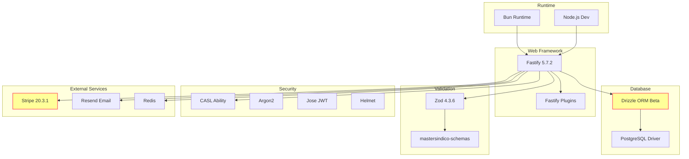

---

#### 1.2 tsconfig.json (28 linhas)

**Propósito**: Configuração do TypeScript compiler

**Análise Linha por Linha**:

```jsonc
// Linha 1-7: Environment setup
{
  "compilerOptions": {
    "lib": ["ESNext"],              // ✅ APIs mais recentes
    "target": "ESNext",             // ✅ Output moderno
    "module": "ESNext",             // ✅ ESM modules
    "moduleDetection": "force",     // ✅ Força detecção de módulos
    "jsx": "react-jsx",             // ⚠️ React JSX (não usado)
    "allowJs": true"                // ✅ Permite .js files
  }
}
```

⚠️ **ATENÇÃO 1 - JSX configurado mas não usado** (linha 5):
- `"jsx": "react-jsx"` mas projeto é backend puro
- **Impacto**: Nenhum (apenas confusão)
- **Solução**: Remover linha

```jsonc
// Linha 9-13: Bundler mode
"moduleResolution": "bundler",           // ✅ Resolução moderna
"allowImportingTsExtensions": true,      // ✅ Permite .ts em imports
"verbatimModuleSyntax": true,            // ✅ Preserva import type
"noEmit": true                           // ✅ Não emite JS (SWC faz isso)
```

✅ **PONTO POSITIVO 1**: noEmit = true (linha 13)
- TypeScript só faz type checking
- SWC faz transpilação (mais rápido)
- Separação de responsabilidades

```jsonc
// Linha 15-19: Best practices (strict mode)
"strict": true,                          // ✅ Modo strict completo
"skipLibCheck": true,                    // ✅ Pula check de .d.ts
"noFallthroughCasesInSwitch": true,      // ✅ Previne bugs em switch
"noUncheckedIndexedAccess": true,        // ✅ Força check de undefined
"noImplicitOverride": true               // ✅ Força keyword override
```

✅ **EXCELENTE CONFIGURAÇÃO**:
- `strict: true` ativa todas as flags de segurança
- `noUncheckedIndexedAccess` previne bugs comuns
- `noImplicitOverride` melhora OOP

```jsonc
// Linha 21-24: Stricter flags (disabled)
"noUnusedLocals": false,                 // ❌ Deveria ser true
"noUnusedParameters": false,             // ❌ Deveria ser true
"noPropertyAccessFromIndexSignature": false  // ⚠️ Pode ser true
```

❌ **PROBLEMA 1 - Flags de qualidade desabilitadas** (linha 22-23):
- `noUnusedLocals: false` permite variáveis não usadas
- `noUnusedParameters: false` permite parâmetros não usados
- **Impacto**: Código com dead code
- **Solução**: Habilitar ambas

```jsonc
// Linha 26-28: Include paths
"include": [
  "./src/**/*",                          // ✅ Todo código fonte
  "./src/shared/types/fastify.d.ts"      // ✅ Type augmentation
]
```

✅ **PONTO POSITIVO 2**: Include explícito (linha 27-28)
- Inclui type augmentation do Fastify
- Necessário para decorators customizados

**REGRAS DE NEGÓCIO VALIDADAS**:
- ✅ Strict mode habilitado
- ✅ noEmit = true (SWC faz build)
- ✅ Bundler mode resolution
- ❌ noUnusedLocals/Parameters desabilitados
- ⚠️ JSX configurado desnecessariamente


---

#### 1.3 docker-compose.yml (32 linhas)

**Propósito**: Orquestração de containers para desenvolvimento local

**Análise Linha por Linha**:

```yaml
# Linha 1: Nome do projeto
name: master_sindico_backend  # ✅ Nome descritivo
```

```yaml
# Linha 3-16: Serviço PostgreSQL
services:
  postgres:
    image: bitnami/postgresql:latest        # ⚠️ Tag latest perigosa
    container_name: master_sindico_postgres # ✅ Nome fixo
    environment:
      - POSTGRES_USER=mastersindico_user    # ✅ User customizado
      - POSTGRES_PASSWORD=mastersindico_password  # ❌ Senha hardcoded
      - POSTGRES_DB=mastersindico_db        # ✅ Database name
    ports:
      - '5433:5432'                         # ✅ Porta customizada (evita conflito)
    volumes:
      - postgres_data:/var/lib/postgresql/data  # ✅ Persistência
    networks:
      - app_network                         # ✅ Network isolada
```

❌ **PROBLEMA CRÍTICO 1 - Senha hardcoded** (linha 9):
- `POSTGRES_PASSWORD=mastersindico_password` exposta no código
- **Risco de Segurança**: ALTO
- **Impacto**: Senha vaza em commits
- **Solução**: Usar `${POSTGRES_PASSWORD:-default}` e .env

⚠️ **ATENÇÃO 1 - Tag latest** (linha 5):
- `image: bitnami/postgresql:latest` não é determinístico
- **Risco**: Builds diferentes em ambientes diferentes
- **Solução**: Fixar versão `bitnami/postgresql:16.2.0`

✅ **PONTO POSITIVO 1**: Porta customizada (linha 12)
- Usa 5433 em vez de 5432
- Evita conflito com Postgres local

```yaml
# Linha 18-28: Serviço Redis
  redis:
    image: bitnami/redis:latest             # ⚠️ Tag latest perigosa
    container_name: master_sindico_redis    # ✅ Nome fixo
    environment:
      - REDIS_PASSWORD=redis_password       # ❌ Senha hardcoded
    ports:
      - '6380:6379'                         # ✅ Porta customizada
    volumes:
      - redis_data:/data                    # ✅ Persistência
    networks:
      - app_network                         # ✅ Network isolada
```

❌ **PROBLEMA CRÍTICO 2 - Senha Redis hardcoded** (linha 22):
- `REDIS_PASSWORD=redis_password` exposta no código
- **Risco de Segurança**: ALTO
- **Solução**: Usar `${REDIS_PASSWORD:-default}` e .env

⚠️ **ATENÇÃO 2 - Tag latest Redis** (linha 19):
- Mesmo problema do Postgres
- **Solução**: Fixar versão `bitnami/redis:7.2.4`

✅ **PONTO POSITIVO 2**: Porta customizada Redis (linha 24)
- Usa 6380 em vez de 6379
- Evita conflito com Redis local

```yaml
# Linha 30-32: Networks
networks:
  app_network:
    driver: bridge  # ✅ Driver padrão
```

✅ **PONTO POSITIVO 3**: Network isolada
- Containers se comunicam via network privada
- Melhor segurança

```yaml
# Linha 34-36: Volumes
volumes:
  postgres_data:  # ✅ Volume nomeado
  redis_data:     # ✅ Volume nomeado
```

✅ **PONTO POSITIVO 4**: Volumes nomeados
- Dados persistem entre restarts
- Fácil de fazer backup

**REGRAS DE NEGÓCIO VALIDADAS**:
- ✅ Portas customizadas (evita conflitos)
- ✅ Volumes persistentes
- ✅ Network isolada
- ❌ Senhas hardcoded (CRÍTICO)
- ⚠️ Tags latest (não determinístico)

**MERMAID DIAGRAM - Arquitetura Docker**:

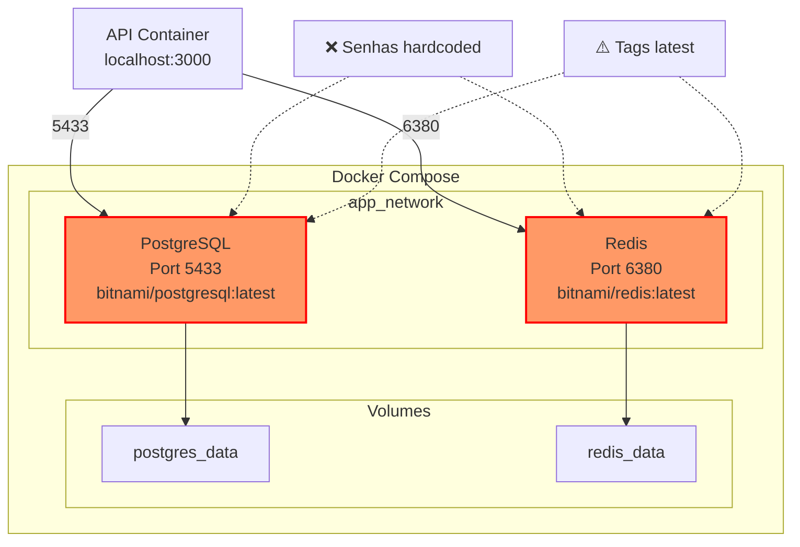

---

#### 1.4 drizzle.config.ts (13 linhas)

**Propósito**: Configuração do Drizzle Kit (migrations e introspection)

**Análise Linha por Linha**:

```typescript
// Linha 1-2: Imports
import { defineConfig } from "drizzle-kit";
import { env } from "./src/shared/config/index.js";  // ✅ Centraliza env vars
```

✅ **PONTO POSITIVO 1**: Importa env centralizado (linha 2)
- Não usa process.env diretamente
- Validação de env vars em um lugar só

```typescript
// Linha 4-13: Configuração
export default defineConfig({
  schema: "./src/infrastructure/database/drizzle/schema",     // ✅ Path correto
  out: "./src/infrastructure/database/drizzle/migrations",    // ✅ Path correto
  dialect: "postgresql",                                      // ✅ Dialect correto
  dbCredentials: {
    url: env.DATABASE_URL,                                    // ✅ Usa env validado
  },
  casing: "snake_case",                                       // ✅ Convenção SQL
});
```

✅ **CONFIGURAÇÃO PERFEITA**:
- Schema path aponta para pasta correta (linha 5)
- Migrations path organizado (linha 6)
- Dialect PostgreSQL (linha 7)
- Usa env validado (linha 9)
- snake_case para SQL (linha 11)

✅ **PONTO POSITIVO 2**: snake_case (linha 11)
- Convenção SQL padrão
- Drizzle converte camelCase → snake_case automaticamente

**REGRAS DE NEGÓCIO VALIDADAS**:
- ✅ Configuração correta
- ✅ Usa env centralizado
- ✅ Paths organizados
- ✅ Convenção SQL (snake_case)


---

### 2. MÓDULO BILLING - INFRASTRUCTURE REPOSITORIES

#### 2.1 feature-usage.repository.impl.ts (133 linhas)

**Propósito**: Repository para gerenciar uso de features (quotas/limites)

**Análise Linha por Linha**:

```typescript
// Linha 1: Biome ignore
/** biome-ignore-all lint/complexity/noUselessConstructor: <> */
```

⚠️ **ATENÇÃO 1**: Ignora regra do Biome
- Construtor vazio é necessário para DI
- Ignore justificado

```typescript
// Linha 2-10: Imports
import { eq } from "drizzle-orm";
import {
  BaseRepository,
  type BaseRepositoryDependencies,
} from "../../../../../../core/contracts/base-repository";
import { featureUsages } from "../../../../../../infrastructure/database/drizzle/schema";
import { FeatureUsage } from "../../../../domain/entities/feature-usage.entity";
import type { IFeatureUsageRepository } from "../../../../domain/repositories/feature-usage.repository";
```

✅ **ARQUITETURA CORRETA**:
- Importa BaseRepository (linha 4-5)
- Importa schema do banco (linha 7)
- Importa entidade de domínio (linha 8)
- Importa interface do repository (linha 9)

```typescript
// Linha 12-17: Classe e construtor
export class FeatureUsageRepositoryImpl
  extends BaseRepository
  implements IFeatureUsageRepository
{
  constructor(deps: BaseRepositoryDependencies) {
    super(deps);
  }
```

✅ **PONTO POSITIVO 1**: Herda BaseRepository
- Acesso ao UnitOfWork via `this.db`
- Logger injetado
- Padrão consistente

```typescript
// Linha 21-27: findById
async findById(id: string): Promise<FeatureUsage | null> {
  const result = await this.db.query.featureUsages.findFirst({
    where: { id, deletedAt: { isNull: true } },  // ✅ Soft delete
  });

  return result ? this.toDomain(result) : null;
}
```

✅ **PONTO POSITIVO 2**: Soft delete (linha 23)
- Sempre filtra `deletedAt: { isNull: true }`
- Previne retornar registros deletados

❌ **PROBLEMA 1 - Falta índice composto** (linha 23):
- Query por `id` + `deletedAt`
- **Impacto**: Scan desnecessário se não houver índice
- **Solução**: Criar índice `(id, deleted_at)` no schema

```typescript
// Linha 29-35: findByUserId
async findByUserId(userId: string): Promise<FeatureUsage[] | null> {
  const results = await this.db.query.featureUsages.findMany({
    where: { userId, deletedAt: { isNull: true } },
  });

  return results.map((r) => this.toDomain(r));
}
```

❌ **PROBLEMA 2 - Retorna null em vez de array vazio** (linha 29):
- Tipo de retorno: `Promise<FeatureUsage[] | null>`
- Mas sempre retorna array (linha 34)
- **Inconsistência**: Tipo diz null, código nunca retorna null
- **Solução**: Mudar tipo para `Promise<FeatureUsage[]>`

❌ **PROBLEMA 3 - Falta paginação** (linha 30-34):
- `findMany` sem limit
- **Risco**: Usuário com 10.000 features = query pesada
- **Solução**: Adicionar `limit` e `offset`

```typescript
// Linha 37-43: findByFeatureKey
async findByFeatureKey(featureKey: string): Promise<FeatureUsage[] | null> {
  const results = await this.db.query.featureUsages.findMany({
    where: { featureKey, deletedAt: { isNull: true } },
  });

  return results.map((r) => this.toDomain(r));
}
```

❌ **PROBLEMA 4 - Query perigosa** (linha 38-42):
- Busca TODOS os usuários que usaram uma feature
- **Risco**: Feature popular = milhões de registros
- **Solução**: Adicionar paginação obrigatória

```typescript
// Linha 45-54: findByUserAndKey
async findByUserAndKey(
  userId: string,
  featureKey: string,
): Promise<FeatureUsage | null> {
  const result = await this.db.query.featureUsages.findFirst({
    where: { userId, featureKey, deletedAt: { isNull: true } },
  });

  return result ? this.toDomain(result) : null;
}
```

✅ **MÉTODO MAIS USADO**: findByUserAndKey (linha 45-54)
- Usado para verificar quotas
- Query eficiente (userId + featureKey)

❌ **PROBLEMA 5 - Falta índice composto** (linha 51):
- Query por `userId` + `featureKey` + `deletedAt`
- **Impacto**: Scan lento sem índice
- **Solução**: Criar índice `(user_id, feature_key, deleted_at)`

```typescript
// Linha 58-71: save (upsert)
async save(featureUsage: FeatureUsage): Promise<void> {
  const data = this.toPersistence(featureUsage);

  await this.db
    .insert(featureUsages)
    .values(data)
    .onConflictDoUpdate({
      target: [featureUsages.userId, featureUsages.featureKey],  // ✅ Unique constraint
      set: {
        ...data,
        updatedAt: new Date(),
      },
    });
}
```

✅ **EXCELENTE IMPLEMENTAÇÃO**: Upsert (linha 58-71)
- `onConflictDoUpdate` evita race condition
- Unique constraint em `(userId, featureKey)` (linha 65)
- Atualiza `updatedAt` automaticamente (linha 68)

⚠️ **ATENÇÃO 2 - Spread operator** (linha 67):
- `...data` pode sobrescrever `updatedAt`
- **Risco**: Se `data.updatedAt` vier do DTO, sobrescreve linha 68
- **Solução**: Remover `updatedAt` de `data` antes do spread

```typescript
// Linha 73-82: softDelete
async softDelete(id: string): Promise<void> {
  await this.db
    .update(featureUsages)
    .set({
      deletedAt: new Date(),
      updatedAt: new Date(),
    })
    .where(eq(featureUsages.id, id));
}
```

✅ **SOFT DELETE CORRETO** (linha 73-82):
- Seta `deletedAt` (linha 77)
- Atualiza `updatedAt` (linha 78)
- Usa `eq` helper (linha 80)

❌ **PROBLEMA 6 - Falta validação** (linha 73-82):
- Não verifica se registro existe
- Não verifica se já está deletado
- **Impacto**: Silenciosamente não faz nada se ID inválido
- **Solução**: Retornar boolean ou lançar erro

```typescript
// Linha 84-93: softDeleteByUserId
async softDeleteByUserId(userId: string): Promise<void> {
  await this.db
    .update(featureUsages)
    .set({
      deletedAt: new Date(),
      updatedAt: new Date(),
    })
    .where(eq(featureUsages.userId, userId));
}
```

❌ **PROBLEMA CRÍTICO 7 - Deleta TODAS as features do usuário** (linha 84-93):
- Método perigoso: deleta tudo de um usuário
- **Risco**: Chamada acidental = perda de dados
- **Uso**: Provavelmente quando usuário é deletado
- **Solução**: Renomear para `softDeleteAllByUserId` (mais explícito)


```typescript
// Linha 95-104: restore
async restore(id: string): Promise<void> {
  await this.db
    .update(featureUsages)
    .set({
      deletedAt: null,
      updatedAt: new Date(),
    })
    .where(eq(featureUsages.id, id));
}
```

✅ **RESTORE CORRETO** (linha 95-104):
- Seta `deletedAt = null` (linha 99)
- Atualiza `updatedAt` (linha 100)

❌ **PROBLEMA 8 - Falta validação** (linha 95-104):
- Não verifica se registro existe
- Não verifica se já está ativo
- Mesmo problema do softDelete

```typescript
// Linha 108-120: toDomain mapper
private toDomain(raw: typeof featureUsages.$inferSelect): FeatureUsage {
  return new FeatureUsage(
    raw.id,
    raw.userId,
    raw.featureKey,
    raw.count,
    raw.lastUsedAt ?? null,
    raw.periodEndsAt ?? null,
    raw.createdAt,
    raw.updatedAt,
    raw.deletedAt,
  );
}
```

✅ **MAPPER CORRETO** (linha 108-120):
- Converte DB → Domain
- Usa `??` para nullable fields (linha 114-115)
- Passa todos os campos para construtor

```typescript
// Linha 122-133: toPersistence mapper
private toPersistence(
  feature: FeatureUsage,
): typeof featureUsages.$inferInsert {
  const data = feature.toDto();

  return {
    id: data.id,
    userId: data.userId,
    featureKey: data.featureKey,
    count: data.count,
    lastUsedAt: data.lastUsedAt,
    periodEndsAt: data.periodEndsAt,
    createdAt: data.createdAt,
    updatedAt: data.updatedAt,
    deletedAt: data.deletedAt,
  };
}
```

✅ **MAPPER CORRETO** (linha 122-133):
- Converte Domain → DB
- Usa `toDto()` da entidade (linha 125)
- Mapeia todos os campos

⚠️ **ATENÇÃO 3 - Mapper redundante** (linha 127-136):
- Apenas copia campos de `data` para objeto
- **Otimização**: Poderia retornar `data` diretamente
- **Motivo**: Garantir type safety do Drizzle

**REGRAS DE NEGÓCIO VALIDADAS**:
- ✅ Soft delete implementado
- ✅ Upsert correto (evita race condition)
- ✅ Mappers corretos
- ❌ Falta paginação em findMany
- ❌ Falta validações em delete/restore
- ❌ Falta índices compostos
- ❌ Tipos inconsistentes (null vs array vazio)

**MERMAID DIAGRAM - Feature Usage Repository**:

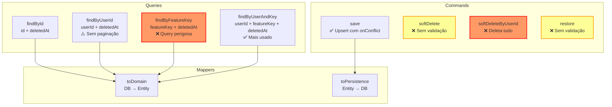

---

#### 2.2 permission.repository.impl.ts (115 linhas)

**Propósito**: Repository para gerenciar permissões (ABAC)

**Análise Linha por Linha**:

```typescript
// Linha 1-10: Imports (idêntico ao anterior)
/** biome-ignore-all lint/complexity/noUselessConstructor: <> */
import { eq } from "drizzle-orm";
import {
  BaseRepository,
  type BaseRepositoryDependencies,
} from "../../../../../../core/contracts/base-repository";
import { permissions } from "../../../../../../infrastructure/database/drizzle/schema";
import { Permission } from "../../../../domain/entities/permission.entity";
import type { IPermissionRepository } from "../../../../domain/repositories/permission.repository";
```

```typescript
// Linha 12-17: Classe
export class PermissionRepositoryImpl
  extends BaseRepository
  implements IPermissionRepository
{
  constructor(deps: BaseRepositoryDependencies) {
    super(deps);
  }
```

```typescript
// Linha 21-27: findById
async findById(id: string): Promise<Permission | null> {
  const result = await this.db.query.permissions.findFirst({
    where: { id, deletedAt: { isNull: true } },
  });

  return result ? this.toDomain(result) : null;
}
```

✅ **PADRÃO CONSISTENTE**: Mesmo padrão do FeatureUsageRepository

```typescript
// Linha 29-35: findByKey
async findByKey(key: string): Promise<Permission | null> {
  const result = await this.db.query.permissions.findFirst({
    where: { key, deletedAt: { isNull: true } },
  });

  return result ? this.toDomain(result) : null;
}
```

✅ **MÉTODO IMPORTANTE**: findByKey (linha 29-35)
- Usado para verificar permissões por chave
- Ex: `"user:read"`, `"billing:write"`

❌ **PROBLEMA 1 - Falta cache** (linha 29-35):
- Permissões são lidas frequentemente
- **Impacto**: Query no banco a cada request
- **Solução**: Adicionar cache Redis com TTL de 1 hora

```typescript
// Linha 37-43: findByResource
async findByResource(resource: string): Promise<Permission[] | null> {
  const results = await this.db.query.permissions.findMany({
    where: { resource, deletedAt: { isNull: true } },
  });

  return results.map((r) => this.toDomain(r));
}
```

✅ **MÉTODO ÚTIL**: findByResource (linha 37-43)
- Busca todas as permissões de um recurso
- Ex: resource = "user" → ["user:read", "user:write", "user:delete"]

❌ **PROBLEMA 2 - Tipo inconsistente** (linha 37):
- Retorna `Permission[] | null` mas nunca retorna null
- Mesmo problema do FeatureUsageRepository

```typescript
// Linha 45-54: findByIds
async findByIds(ids: string[]): Promise<Permission[]> {
  const results = await this.db.query.permissions.findMany({
    where: {
      id: { in: ids },
      deletedAt: { isNull: true },
    },
  });

  return results.map((r) => this.toDomain(r));
}
```

✅ **MÉTODO CRÍTICO**: findByIds (linha 45-54)
- Usado para carregar permissões de um plano
- Batch query eficiente com `IN`

❌ **PROBLEMA 3 - Falta limite** (linha 46-52):
- `IN` com array grande = query lenta
- **Risco**: Plano com 1000 permissões = query pesada
- **Solução**: Adicionar limite ou chunking


```typescript
// Linha 58-71: save (upsert)
async save(permission: Permission): Promise<void> {
  const data = this.toPersistence(permission);

  await this.db
    .insert(permissions)
    .values(data)
    .onConflictDoUpdate({
      target: permissions.id,
      set: {
        ...data,
        updatedAt: new Date(),
      },
    });
}
```

✅ **UPSERT CORRETO** (linha 58-71):
- Usa `onConflictDoUpdate` (linha 65)
- Target é `id` (PK) (linha 66)
- Atualiza `updatedAt` (linha 69)

⚠️ **ATENÇÃO 1 - Deveria usar key como target** (linha 66):
- `target: permissions.id` usa PK
- Mas `key` é unique e mais semântico
- **Recomendação**: Usar `target: permissions.key`

```typescript
// Linha 73-82: softDelete
async softDelete(id: string): Promise<void> {
  await this.db
    .update(permissions)
    .set({
      deletedAt: new Date(),
      updatedAt: new Date(),
    })
    .where(eq(permissions.id, id));
}
```

❌ **PROBLEMA 4 - Falta invalidar cache** (linha 73-82):
- Se permissão está em cache, continua válida após delete
- **Impacto**: Usuário mantém permissão deletada
- **Solução**: Invalidar cache Redis após delete

```typescript
// Linha 84-93: restore
async restore(id: string): Promise<void> {
  await this.db
    .update(permissions)
    .set({
      deletedAt: null,
      updatedAt: new Date(),
    })
    .where(eq(permissions.id, id));
}
```

❌ **PROBLEMA 5 - Falta invalidar cache** (linha 84-93):
- Mesmo problema do softDelete

```typescript
// Linha 97-109: toDomain mapper
private toDomain(raw: typeof permissions.$inferSelect): Permission {
  return new Permission(
    raw.id,
    raw.key,
    raw.name,
    raw.description ?? null,
    raw.resource,
    raw.action,
    raw.createdAt,
    raw.updatedAt,
    raw.deletedAt,
  );
}
```

✅ **MAPPER CORRETO** (linha 97-109):
- Converte DB → Domain
- Usa `??` para nullable (linha 103)

```typescript
// Linha 111-115: toPersistence mapper
private toPersistence(
  permission: Permission,
): typeof permissions.$inferInsert {
  const data = permission.toDto();

  return {
    id: data.id,
    key: data.key,
    name: data.name,
    description: data.description,
    resource: data.resource,
    action: data.action,
    createdAt: data.createdAt,
    updatedAt: data.updatedAt,
    deletedAt: data.deletedAt,
  };
}
```

✅ **MAPPER CORRETO** (linha 111-115):
- Converte Domain → DB

**REGRAS DE NEGÓCIO VALIDADAS**:
- ✅ CRUD completo
- ✅ Soft delete
- ✅ Batch query (findByIds)
- ❌ CRÍTICO: Falta cache (permissões lidas frequentemente)
- ❌ Falta invalidação de cache
- ⚠️ Upsert deveria usar key em vez de id

**MERMAID DIAGRAM - Permission Repository**:

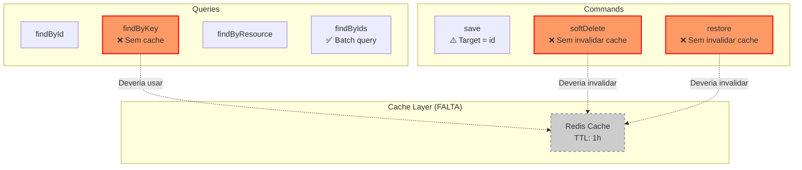

---

#### 2.3 plan.repository.impl.ts (165 linhas)

**Propósito**: Repository para gerenciar planos de assinatura

**Análise Linha por Linha**:

```typescript
// Linha 1-12: Imports
/** biome-ignore-all lint/complexity/noUselessConstructor: <> */
import { eq } from "drizzle-orm";
import {
	BaseRepository,
	type BaseRepositoryDependencies,
} from "../../../../../../core/contracts/base-repository";
import { plans } from "../../../../../../infrastructure/database/drizzle/schema";
import type { UserRole } from "../../../../../user/domain/enums/user-role";
import { Plan } from "../../../../domain/entities/plan.entity";
import type { BillingCycle } from "../../../../domain/enums/billing-cycle.enum";
import type { PlanType } from "../../../../domain/enums/plan-type.enum";
import type { IPlanRepository } from "../../../../domain/repositories/plan.repository";
import { Money } from "../../../../domain/value-objects/money.value-object";
```

✅ **IMPORTS CORRETOS**:
- Importa enums (UserRole, BillingCycle, PlanType)
- Importa Value Object (Money) (linha 13)

```typescript
// Linha 15-20: Classe
export class PlanRepositoryImpl
	extends BaseRepository
	implements IPlanRepository
{
	constructor(deps: BaseRepositoryDependencies) {
		super(deps);
	}
```

```typescript
// Linha 24-30: findById
async findById(id: string): Promise<Plan | null> {
	const result = await this.db.query.plans.findFirst({
		where: { id, deletedAt: { isNull: true } },
	});

	return result ? this.toDomain(result) : null;
}
```

```typescript
// Linha 32-38: findByType
async findByType(type: PlanType): Promise<Plan | null> {
	const result = await this.db.query.plans.findFirst({
		where: { type, deletedAt: { isNull: true } },
	});

	return result ? this.toDomain(result) : null;
}
```

✅ **MÉTODO IMPORTANTE**: findByType (linha 32-38)
- Busca plano por tipo (FREE, BASIC, PRO, ENTERPRISE)
- Usado para upgrade/downgrade

❌ **PROBLEMA 1 - Falta cache** (linha 32-38):
- Planos são lidos frequentemente
- Dados raramente mudam
- **Solução**: Cache Redis com TTL longo (24h)

```typescript
// Linha 40-47: findByProviderProductId
async findByProviderProductId(
	providerProductId: string,
): Promise<Plan | null> {
	const result = await this.db.query.plans.findFirst({
		where: { providerProductId, deletedAt: { isNull: true } },
	});

	return result ? this.toDomain(result) : null;
}
```

✅ **MÉTODO CRÍTICO**: findByProviderProductId (linha 40-47)
- Usado em webhooks do Stripe
- Mapeia `prod_xxx` → Plan interno

❌ **PROBLEMA 2 - Falta índice** (linha 44):
- Query por `providerProductId` + `deletedAt`
- **Impacto**: Scan lento em webhooks
- **Solução**: Criar índice `(provider_product_id, deleted_at)`

```typescript
// Linha 49-55: findAllActive
async findAllActive(): Promise<Plan[] | null> {
	const results = await this.db.query.plans.findMany({
		where: { isActive: true, deletedAt: { isNull: true } },
	});

	return results.map((r) => this.toDomain(r));
}
```

✅ **MÉTODO ÚTIL**: findAllActive (linha 49-55)
- Lista planos ativos para exibir na UI
- Filtra `isActive: true` (linha 51)

❌ **PROBLEMA 3 - Tipo inconsistente** (linha 49):
- Retorna `Plan[] | null` mas nunca retorna null

```typescript
// Linha 57-63: findAllPublic
async findAllPublic(): Promise<Plan[] | null> {
	const results = await this.db.query.plans.findMany({
		where: { isPublic: true, deletedAt: { isNull: true } },
	});

	return results.map((r) => this.toDomain(r));
}
```

✅ **MÉTODO ÚTIL**: findAllPublic (linha 57-63)
- Lista planos públicos (visíveis para todos)
- Filtra `isPublic: true` (linha 59)


```typescript
// Linha 65-76: findDefault
async findDefault(role: UserRole): Promise<Plan | null> {
	const result = await this.db.query.plans.findFirst({
		where: {
			isDefault: true,
			allowedRole: role,
			deletedAt: { isNull: true },
		},
	});

	return result ? this.toDomain(result) : null;
}
```

✅ **MÉTODO CRÍTICO**: findDefault (linha 65-76)
- Busca plano padrão para uma role
- Usado no onboarding (novo usuário)
- Filtra `isDefault: true` + `allowedRole` (linha 68-69)

❌ **PROBLEMA 4 - Falta validação** (linha 65-76):
- Não garante que existe apenas 1 plano default por role
- **Risco**: Múltiplos defaults = comportamento indefinido
- **Solução**: Adicionar unique constraint no schema

```typescript
// Linha 80-93: save (upsert)
async save(plan: Plan): Promise<void> {
	const data = this.toPersistence(plan);

	await this.db
		.insert(plans)
		.values(data)
		.onConflictDoUpdate({
			target: plans.id,
			set: {
				...data,
				updatedAt: new Date(),
			},
		});
}
```

✅ **UPSERT CORRETO** (linha 80-93)

❌ **PROBLEMA 5 - Falta invalidar cache** (linha 80-93):
- Se plano está em cache, continua desatualizado
- **Solução**: Invalidar cache após save

```typescript
// Linha 95-104: softDelete
async softDelete(id: string): Promise<void> {
	await this.db
		.update(plans)
		.set({
			deletedAt: new Date(),
			updatedAt: new Date(),
		})
		.where(eq(plans.id, id));
}
```

❌ **PROBLEMA CRÍTICO 6 - Deleta plano sem validar assinaturas** (linha 95-104):
- Não verifica se existem assinaturas ativas
- **Risco**: Plano deletado mas usuários ainda assinados
- **Solução**: Validar antes de deletar ou usar cascade

```typescript
// Linha 106-115: restore
async restore(id: string): Promise<void> {
	await this.db
		.update(plans)
		.set({
			deletedAt: null,
			updatedAt: new Date(),
		})
		.where(eq(plans.id, id));
}
```

```typescript
// Linha 119-141: toDomain mapper
private toDomain(raw: typeof plans.$inferSelect): Plan {
	return new Plan(
		raw.id,
		raw.name,
		raw.type as PlanType,
		raw.description,
		raw.allowedRole as UserRole,
		Money.fromCents(raw.priceMonthly ?? 0, raw.currency) ?? null,  // ✅ Value Object
		Money.fromCents(raw.priceYearly ?? 0, raw.currency) ?? null,   // ✅ Value Object
		raw.currency,
		raw.billingCycle as BillingCycle,
		raw.provider,
		raw.providerProductId ?? null,
		raw.providerPriceMonthlyId ?? null,
		raw.providerPriceYearlyId ?? null,
		raw.version,
		raw.isActive ?? false,
		raw.isPublic ?? false,
		raw.isDefault ?? false,
		raw.metadata as Record<string, unknown> | null,
		raw.highlightFeatures as string[] | null,
		raw.createdAt,
		raw.updatedAt,
		raw.deletedAt,
	);
}
```

✅ **EXCELENTE MAPPER** (linha 119-141):
- Usa Value Object `Money` (linha 125-126)
- Converte centavos → Money
- Casts corretos para enums (linha 123, 125, 129)

```typescript
// Linha 143-165: toPersistence mapper
private toPersistence(plan: Plan): typeof plans.$inferInsert {
	const data = plan.toDto();

	return {
		id: data.id,
		name: data.name,
		type: data.type,
		description: data.description,
		allowedRole: data.allowedRole,
		priceMonthly: data.priceMonthly,
		priceYearly: data.priceYearly,
		currency: data.currency,
		billingCycle: data.billingCycle,
		provider: data.provider,
		providerProductId: data.providerProductId,
		providerPriceMonthlyId: data.providerPriceMonthlyId,
		providerPriceYearlyId: data.providerPriceYearlyId,
		version: data.version,
		isActive: data.isActive,
		isPublic: data.isPublic,
		isDefault: data.isDefault,
		metadata: data.metadata,
		highlightFeatures: data.highlightFeatures,
		createdAt: data.createdAt,
		updatedAt: data.updatedAt,
		deletedAt: data.deletedAt,
	};
}
```

✅ **MAPPER COMPLETO** (linha 143-165)

**REGRAS DE NEGÓCIO VALIDADAS**:
- ✅ CRUD completo
- ✅ Usa Value Object Money
- ✅ Queries específicas (findByType, findDefault, findByProviderProductId)
- ❌ CRÍTICO: Falta validar assinaturas antes de deletar
- ❌ Falta cache (planos lidos frequentemente)
- ❌ Falta garantir 1 default por role

**MERMAID DIAGRAM - Plan Repository**:

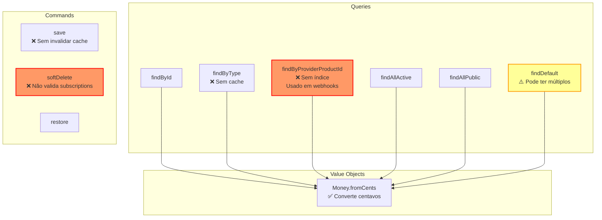

---

### 3. MÓDULO PROFILE - DOMAIN ENTITIES

#### 3.1 base-profile.entity.ts (183 linhas)

**Propósito**: Classe base abstrata para todos os tipos de perfil

**Análise Linha por Linha**:

```typescript
// Linha 1-4: Imports
import { BusinessError } from "../../../../core/errors";
import { ProfileStatus } from "../enums/profile-status.enum";
import { ProfileType } from "../enums/profile-type.enum";
```

```typescript
// Linha 6-17: Classe abstrata e construtor
export abstract class BaseProfile {
  static readonly modelName = "Profile";  // ✅ Para logging/debugging

  constructor(
    protected readonly id: string,
    protected readonly userId: string,
    protected readonly profileType: ProfileType,
    protected status: ProfileStatus,
    protected readonly createdAt: Date = new Date(),
    protected updatedAt: Date = new Date(),
    protected deletedAt: Date | null = null,
  ) {}
```

✅ **DESIGN EXCELENTE**:
- Classe abstrata (linha 6)
- Protected members (linha 9-15) - Subclasses acessam
- Readonly para imutáveis (id, userId, profileType)
- Status mutável (linha 12)

```typescript
// Linha 18-46: Getters
getId(): string { return this.id; }
getProfileType(): ProfileType { return this.profileType; }
getUserId(): string { return this.userId; }
getStatus(): ProfileStatus { return this.status; }
getCreatedAt(): Date { return this.createdAt; }
getUpdatedAt(): Date { return this.updatedAt; }
getDeletedAt(): Date | null { return this.deletedAt; }
```

✅ **ENCAPSULAMENTO CORRETO**: Getters para todos os campos

```typescript
// Linha 48-63: Status checks
public isOperable(): boolean {
  return this.status === ProfileStatus.ACTIVE;
}

public isPending(): boolean {
  return this.status === ProfileStatus.PENDING;
}

public isBanned(): boolean {
  return this.status === ProfileStatus.BANNED;
}

public isSuspended(): boolean {
  return this.status === ProfileStatus.SUSPENDED;
}
```

✅ **MÉTODOS ÚTEIS**: Checagem de status (linha 48-63)
- Melhor que comparar enum diretamente
- Mais legível: `profile.isOperable()` vs `profile.status === 'ACTIVE'`


```typescript
// Linha 65-88: markAsOperable (State Machine)
public markAsOperable(): void {
  if (this.status === ProfileStatus.ACTIVE) {
    throw new BusinessError(
      "Perfil já está operável.",
      "PROFILE_ALREADY_OPERABLE",
    );
  }

  if (this.status === ProfileStatus.BANNED) {
    throw new BusinessError(
      "Perfil banido não pode ser ativado diretamente.",
      "PROFILE_IS_BANNED",
    );
  }

  if (this.status === ProfileStatus.SUSPENDED) {
    throw new BusinessError(
      "Perfil suspenso não pode ser ativado diretamente.",
      "PROFILE_IS_SUSPENDED",
    );
  }

  this.status = ProfileStatus.ACTIVE;
  this.updatedAt = new Date();
}
```

✅ **STATE MACHINE PERFEITA** (linha 65-88):
- Valida transições de estado
- PENDING → ACTIVE ✅
- BANNED → ACTIVE ❌ (linha 73-77)
- SUSPENDED → ACTIVE ❌ (linha 79-83)
- ACTIVE → ACTIVE ❌ (linha 67-71)

✅ **REGRA DE NEGÓCIO VALIDADA**:
- Perfil banido precisa ser "desbanido" antes
- Perfil suspenso precisa ser "reativado" antes
- Previne estados inválidos

```typescript
// Linha 90-105: markAsPending
public markAsPending(): void {
  if (this.status === ProfileStatus.PENDING) {
    throw new BusinessError(
      "Perfil já está em revisão.",
      "PROFILE_ALREADY_IN_REVIEW",
    );
  }

  if (this.status === ProfileStatus.ACTIVE) {
    throw new BusinessError(
      "Perfil operável não pode ser marcado como em revisão.",
      "PROFILE_IS_OPERABLE",
    );
  }

  this.status = ProfileStatus.PENDING;
  this.updatedAt = new Date();
}
```

⚠️ **ATENÇÃO 1 - Regra questionável** (linha 98-102):
- ACTIVE → PENDING bloqueado
- **Caso de uso**: Perfil ativo precisa ser revisado novamente?
- **Exemplo**: Empresa atualiza dados e precisa re-aprovação
- **Solução**: Talvez permitir ACTIVE → PENDING

```typescript
// Linha 107-116: markAsBanned
public markAsBanned(): void {
  if (this.status === ProfileStatus.BANNED) {
    throw new BusinessError(
      "Perfil já está banido.",
      "PROFILE_ALREADY_BANNED",
    );
  }
  this.status = ProfileStatus.BANNED;
  this.updatedAt = new Date();
}
```

✅ **TRANSIÇÃO CORRETA** (linha 107-116):
- Qualquer status → BANNED ✅
- Apenas previne BANNED → BANNED

```typescript
// Linha 118-127: markAsSuspended
public markAsSuspended(): void {
  if (this.status === ProfileStatus.SUSPENDED) {
    throw new BusinessError(
      "Perfil já está suspenso.",
      "PROFILE_ALREADY_SUSPENDED",
    );
  }
  this.status = ProfileStatus.SUSPENDED;
  this.updatedAt = new Date();
}
```

✅ **TRANSIÇÃO CORRETA** (linha 118-127):
- Qualquer status → SUSPENDED ✅

```typescript
// Linha 129-138: softDelete
public softDelete(): void {
  if (this.deletedAt) {
    throw new BusinessError(
      "Perfil já foi excluído.",
      "PROFILE_ALREADY_DELETED",
    );
  }
  this.deletedAt = new Date();
  this.updatedAt = new Date();
}
```

✅ **SOFT DELETE CORRETO** (linha 129-138):
- Valida se já deletado (linha 130-134)
- Seta deletedAt (linha 136)
- Atualiza updatedAt (linha 137)

```typescript
// Linha 140-149: restore
public restore(): void {
  if (!this.deletedAt) {
    throw new BusinessError(
      "Perfil não foi excluído.",
      "PROFILE_NOT_IS_DELETED",
    );
  }
  this.deletedAt = null;
  this.updatedAt = new Date();
}
```

✅ **RESTORE CORRETO** (linha 140-149):
- Valida se está deletado (linha 141-145)
- Remove deletedAt (linha 147)

```typescript
// Linha 151-167: Type checks
public isResident(): boolean {
  return this.profileType === ProfileType.RESIDENT;
}

public isSyndic(): boolean {
  return this.profileType === ProfileType.SYNDIC;
}

public isEnterprise(): boolean {
  return this.profileType === ProfileType.ENTERPRISE;
}

public isLocalCompany(): boolean {
  return this.profileType === ProfileType.LOCAL_COMPANY;
}

public isMarketing(): boolean {
  return this.profileType === ProfileType.MARKETING;
}
```

✅ **TYPE GUARDS** (linha 151-167):
- Métodos úteis para type checking
- Melhor que comparar enum diretamente

```typescript
// Linha 169-183: toBaseDto
protected toBaseDto() {
  return {
    id: this.id,
    userId: this.userId,
    profileType: this.profileType,
    status: this.status,
    createdAt: this.createdAt,
    updatedAt: this.updatedAt,
    deletedAt: this.deletedAt,
  };
}
```

✅ **DTO BASE** (linha 169-183):
- Protected (subclasses usam)
- Retorna campos comuns

**REGRAS DE NEGÓCIO VALIDADAS**:
- ✅ State machine completa
- ✅ Transições validadas
- ✅ Soft delete/restore
- ✅ Type guards
- ⚠️ ACTIVE → PENDING bloqueado (pode ser necessário)

**MERMAID DIAGRAM - Profile State Machine**:

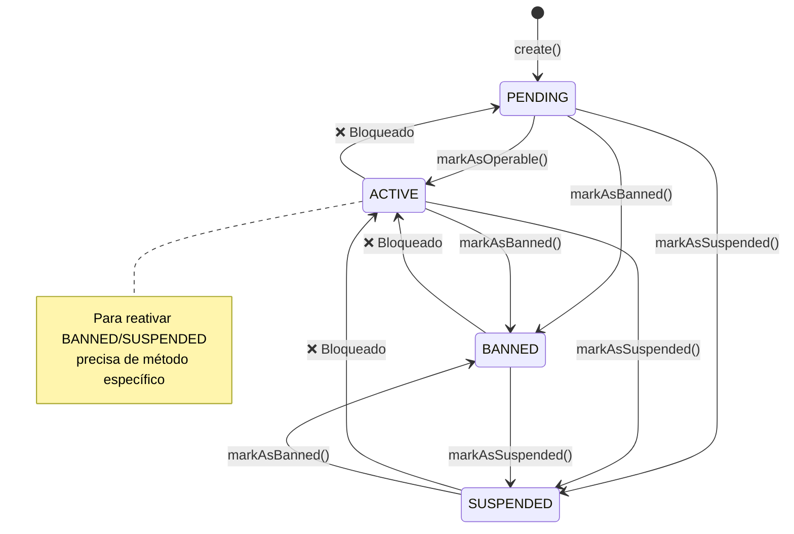

---

#### 3.2 enterprise.entity.ts (320 linhas)

**Propósito**: Entidade de perfil para empresas prestadoras de serviço

**Análise Linha por Linha**:

```typescript
// Linha 1-14: Imports
import { BusinessError } from "../../../../core/errors";
import { generateId } from "../../../../shared/utils/id-generator";
import { ProfileStatus } from "../enums/profile-status.enum";
import { ProfileType } from "../enums/profile-type.enum";
import type { Address } from "../interfaces/address.interface";
import type { EnterpriseCertifications } from "../interfaces/certifications.interface";
import type { CommercialContact } from "../interfaces/commercial-contact.interface";
import type { FinanceContact } from "../interfaces/finance-contact.interface";
import type { EnterpriseIsos } from "../interfaces/isos.interface";
import type { LegalRepresentative } from "../interfaces/legal-representative.interface";
import type { OperatingRegion } from "../interfaces/operating-city.interface";
import type { EnterpriseSeals } from "../interfaces/seals.interface";
import type { CnpjVO } from "../value-objects";
import { BaseProfile } from "./base-profile.entity";
```

✅ **IMPORTS ORGANIZADOS**:
- Interfaces tipadas (Address, Contacts, etc)
- Value Object (CnpjVO) (linha 13)
- BaseProfile (linha 14)

```typescript
// Linha 16-48: Construtor (33 parâmetros!)
export class EnterpriseProfile extends BaseProfile {
  constructor(
    id: string,
    userId: string,
    private logoUrl: string | null,
    private companyName: string,
    private companyTradeName: string | null,
    private cnpj: CnpjVO,
    private address: Address,
    private foundationDate: Date,
    private financeContact: FinanceContact,
    private legalRepresentative: LegalRepresentative,
    private commercialContact: CommercialContact,
    private operatingCities: OperatingRegion[] | null,
    private certifications: EnterpriseCertifications | null,
    private isos: EnterpriseIsos | null,
    private seals: EnterpriseSeals | null,
    private nrs: string[] | null,
    private otherCertifications: string[] | null,
    private ownCertifications: string[] | null,
    private awards: string[] | null,
    private technicalVideosUrls: string[] | null,
    private institutionalVideoUrl: string | null,
    private institutionalDescription: string | null,
    private portfolioUrl: string | null,
    status: ProfileStatus,
    private categoryIds: string[] = [],
    private subCategoryIds: string[] = [],
    createdAt: Date = new Date(),
    updatedAt: Date = new Date(),
    deletedAt: Date | null = null,
  ) {
    super(
      id,
      userId,
      ProfileType.ENTERPRISE,
      status,
      createdAt,
      updatedAt,
      deletedAt,
    );
  }
```

❌ **PROBLEMA 1 - Construtor gigante** (linha 17-48):
- 33 parâmetros!
- **Impacto**: Difícil de usar, propenso a erros
- **Solução**: Usar Builder Pattern ou objeto de configuração

✅ **PONTO POSITIVO 1**: Private members (linha 19-44)
- Encapsulamento correto
- Acesso via getters


```typescript
// Linha 50-107: Factory method create (58 linhas!)
static create(
  userId: string,
  logoUrl: string | null,
  companyName: string,
  companyTradeName: string | null,
  cnpj: CnpjVO,
  address: Address,
  foundationDate: Date,
  financeContact: FinanceContact,
  legalRepresentative: LegalRepresentative,
  commercialContact: CommercialContact,
  operatingCities: OperatingRegion[] | null,
  certifications: EnterpriseCertifications | null,
  isos: EnterpriseIsos | null,
  seals: EnterpriseSeals | null,
  nrs: string[] | null,
  otherCertifications: string[] | null,
  ownCertifications: string[] | null,
  awards: string[] | null,
  technicalVideosUrls: string[] | null,
  institutionalVideoUrl: string | null,
  institutionalDescription: string | null,
  portfolioUrl: string | null,
  categoryIds: string[] = [],
  subCategoryIds: string[] = [],
): EnterpriseProfile {
  return new EnterpriseProfile(
    generateId(),  // ✅ Gera ID automaticamente
    userId,
    logoUrl,
    companyName,
    companyTradeName,
    cnpj,
    address,
    foundationDate,
    financeContact,
    legalRepresentative,
    commercialContact,
    operatingCities,
    certifications,
    isos,
    seals,
    nrs,
    otherCertifications,
    ownCertifications,
    awards,
    technicalVideosUrls,
    institutionalVideoUrl,
    institutionalDescription,
    portfolioUrl,
    ProfileStatus.PENDING,  // ✅ Sempre começa PENDING
    categoryIds,
    subCategoryIds,
    new Date(),
    new Date(),
    null,
  );
}
```

✅ **FACTORY METHOD CORRETO** (linha 50-107):
- Gera ID automaticamente (linha 77)
- Status inicial = PENDING (linha 103)
- Timestamps automáticos (linha 106-107)

❌ **PROBLEMA 2 - Factory gigante** (linha 50-107):
- 24 parâmetros!
- Mesmo problema do construtor
- **Solução**: Builder Pattern

```typescript
// Linha 109-207: Getters (99 linhas de getters!)
getCompanyName(): string { return this.companyName; }
getCompanyTradeName(): string | null { return this.companyTradeName; }
getCnpj(): CnpjVO { return this.cnpj; }
getAddress(): Address { return this.address; }
// ... (mais 20 getters)
```

✅ **ENCAPSULAMENTO CORRETO**: Todos os campos têm getters

⚠️ **ATENÇÃO 1 - Muitos getters** (linha 109-207):
- 24 getters
- Código verboso mas necessário

```typescript
// Linha 209-224: updateCategories
public updateCategories(
  categoryIds: string[],
  subCategoryIds: string[],
): void {
  if (subCategoryIds.length > 5) {
    throw new BusinessError(
      "Uma empresa pode selecionar no máximo 5 subcategorias.",
      "MAX_SUBCATEGORIES_EXCEEDED",
    );
  }

  this.categoryIds = categoryIds;
  this.subCategoryIds = subCategoryIds;
  this.updatedAt = new Date();
}
```

✅ **REGRA DE NEGÓCIO VALIDADA** (linha 214-218):
- Máximo 5 subcategorias
- Lança erro se exceder
- **Regra clara e validada**

```typescript
// Linha 226-320: update method (95 linhas!)
update(
  data: Partial<{
    logoUrl: string | null;
    companyName: string;
    companyTradeName: string | null;
    address: Address;
    financeContact: FinanceContact;
    legalRepresentative: LegalRepresentative;
    commercialContact: CommercialContact;
    operatingCities: OperatingRegion[] | null;
    certifications: EnterpriseCertifications | null;
    isos: EnterpriseIsos | null;
    seals: EnterpriseSeals | null;
    nrs: string[] | null;
    otherCertifications: string[] | null;
    ownCertifications: string[] | null;
    awards: string[] | null;
    technicalVideosUrls: string[] | null;
    institutionalVideoUrl: string | null;
    institutionalDescription: string | null;
    portfolioUrl: string | null;
  }>,
) {
  if (data.logoUrl !== undefined) this.logoUrl = data.logoUrl;
  if (data.companyName !== undefined) this.companyName = data.companyName;
  if (data.companyTradeName !== undefined)
    this.companyTradeName = data.companyTradeName;
  if (data.address !== undefined) this.address = data.address;
  if (data.financeContact !== undefined)
    this.financeContact = data.financeContact;
  if (data.legalRepresentative !== undefined)
    this.legalRepresentative = data.legalRepresentative;
  if (data.commercialContact !== undefined)
    this.commercialContact = data.commercialContact;
  if (data.operatingCities !== undefined)
    this.operatingCities = data.operatingCities;
  if (data.certifications !== undefined)
    this.certifications = data.certifications;
  if (data.isos !== undefined) this.isos = data.isos;
  if (data.seals !== undefined) this.seals = data.seals;
  if (data.nrs !== undefined) this.nrs = data.nrs;
  if (data.otherCertifications !== undefined)
    this.otherCertifications = data.otherCertifications;
  if (data.ownCertifications !== undefined)
    this.ownCertifications = data.ownCertifications;
  if (data.awards !== undefined) this.awards = data.awards;
  if (data.technicalVideosUrls !== undefined)
    this.technicalVideosUrls = data.technicalVideosUrls;
  if (data.institutionalVideoUrl !== undefined)
    this.institutionalVideoUrl = data.institutionalVideoUrl;
  if (data.institutionalDescription !== undefined)
    this.institutionalDescription = data.institutionalDescription;
  if (data.portfolioUrl !== undefined) this.portfolioUrl = data.portfolioUrl;

  this.updatedAt = new Date();
}
```

✅ **UPDATE CORRETO** (linha 226-320):
- Partial update (linha 227)
- Valida `undefined` antes de atribuir
- Atualiza `updatedAt` (linha 269)

❌ **PROBLEMA 3 - Método gigante** (linha 226-320):
- 95 linhas de if statements
- **Solução**: Usar Object.assign ou loop

❌ **PROBLEMA 4 - Falta validações** (linha 226-320):
- Não valida se empresa está ACTIVE
- Não valida campos obrigatórios
- **Exemplo**: Pode setar `companyName = ""`

**REGRAS DE NEGÓCIO VALIDADAS**:
- ✅ Máximo 5 subcategorias
- ✅ Status inicial = PENDING
- ✅ Partial updates
- ❌ Falta validar campos obrigatórios
- ❌ Falta validar status antes de update

**MERMAID DIAGRAM - Enterprise Profile**:

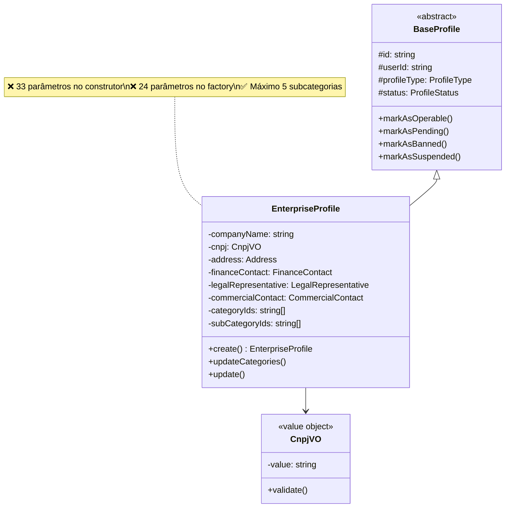

---

#### 3.3 resident.entity.ts (220 linhas)

**Propósito**: Entidade de perfil para moradores (com ou sem condomínio)

**Análise Linha por Linha**:

```typescript
// Linha 1-8: Imports
import { BusinessError } from "../../../../core/errors";
import { generateId } from "../../../../shared/utils/id-generator";
import { BaseProfile } from "../entities/base-profile.entity";
import { ProfileStatus } from "../enums/profile-status.enum";
import { ProfileType } from "../enums/profile-type.enum";
import type { Address } from "../interfaces/address.interface";
import type { CpfVO } from "../value-objects";
```

```typescript
// Linha 10-30: Construtor
export class ResidentProfile extends BaseProfile {
  constructor(
    id: string,
    userId: string,
    private name: string,
    private avatarUrl: string | null,
    private cpf: CpfVO,
    private birthDate: Date,
    private buildingId: string | null,
    private unit: string | null,
    private address: Address | null,
    status: ProfileStatus,
    // ✅ Preparado para o futuro (Biometria Facial/Digital)
    private biometricId: string | null = null,
    createdAt: Date = new Date(),
    updatedAt: Date = new Date(),
    deletedAt: Date | null = null,
  ) {
    super(
      id,
      userId,
      ProfileType.RESIDENT,
      status,
      createdAt,
      updatedAt,
      deletedAt,
    );
    this.validateLocationState();  // ✅ Valida invariante no construtor
  }
```

✅ **DESIGN EXCELENTE** (linha 10-30):
- Construtor menor (14 parâmetros vs 33 da Enterprise)
- Valida invariante no construtor (linha 29)
- Preparado para biometria (linha 22)

```typescript
// Linha 32-50: Factory createLinked
static createLinked(
  userId: string,
  name: string,
  avatarUrl: string | null,
  cpf: CpfVO,
  birthDate: Date,
  buildingId: string,
  unit: string,
): ResidentProfile {
  return new ResidentProfile(
    generateId(),
    userId,
    name,
    avatarUrl,
    cpf,
    birthDate,
    buildingId,  // ✅ Tem ID
    unit,        // ✅ Tem Unidade
    null,        // ❌ Sem endereço manual
    ProfileStatus.ACTIVE,  // ✅ Já ativo (morador vinculado)
    null,
    new Date(),
    new Date(),
    null,
  );
}
```

✅ **FACTORY SEMÂNTICO** (linha 32-50):
- Nome claro: `createLinked` = morador vinculado a condomínio
- Força `buildingId` e `unit` (não nullable)
- Status = ACTIVE (linha 49)


```typescript
// Linha 52-73: Factory createIndependent
static createIndependent(
  userId: string,
  name: string,
  avatarUrl: string | null,
  cpf: CpfVO,
  birthDate: Date,
  address: Address,
): ResidentProfile {
  return new ResidentProfile(
    generateId(),
    userId,
    name,
    avatarUrl,
    cpf,
    birthDate,
    null,     // ❌ Sem Building
    null,     // ❌ Sem Unit
    address,  // ✅ Tem endereço manual
    ProfileStatus.ACTIVE,
    null,
    new Date(),
    new Date(),
    null,
  );
}
```

✅ **FACTORY SEMÂNTICO** (linha 52-73):
- Nome claro: `createIndependent` = morador sem condomínio
- Força `address` (não nullable)
- Status = ACTIVE (linha 70)

✅ **DESIGN PATTERN**: Factory Method com nomes semânticos
- `createLinked()` vs `createIndependent()`
- Melhor que `create(hasBuilding: boolean)`

```typescript
// Linha 75-86: validateLocationState (Invariante)
private validateLocationState(): void {
  const hasLink = !!this.buildingId && !!this.unit;
  const hasManual = !!this.address;

  if (!hasLink && !hasManual) {
    throw new BusinessError(
      "O morador deve ter um vínculo com condomínio OU um endereço manual.",
      "RESIDENT_LOCATION_REQUIRED",
    );
  }
}
```

✅ **INVARIANTE CRÍTICA** (linha 75-86):
- Morador DEVE ter localização
- Ou vinculado (buildingId + unit)
- Ou independente (address)
- **Regra de negócio validada no construtor**

❌ **PROBLEMA 1 - Falta validar XOR** (linha 80-84):
- Valida apenas "nenhum dos dois"
- Não valida "ambos ao mesmo tempo"
- **Risco**: Morador com buildingId E address
- **Solução**: Adicionar `if (hasLink && hasManual) throw error`

```typescript
// Linha 90-92: isIndependent
public isIndependent(): boolean {
  return !this.buildingId;
}
```

✅ **MÉTODO ÚTIL** (linha 90-92)

```typescript
// Linha 94-109: joinBuilding
public joinBuilding(buildingId: string, unit: string): void {
  this.buildingId = buildingId;
  this.unit = unit;
  this.address = null;  // ✅ Mata o endereço manual

  // ✅ Garante que está ativo ao entrar (Regra da Cliente)
  // Se ele estava SUSPENDED por falta de pagamento em outro lugar,
  // talvez devesse manter SUSPENDED?
  // Mas se a regra é "facilitada", resetamos para ACTIVE.
  if (this.status === ProfileStatus.PENDING) {
    this.status = ProfileStatus.ACTIVE;
  }

  this.updatedAt = new Date();
}
```

✅ **MÉTODO DE DOMÍNIO** (linha 94-109):
- Transição: Independente → Vinculado
- Mata endereço manual (linha 97)
- Ativa se estava PENDING (linha 104-106)

⚠️ **ATENÇÃO 1 - Comentário importante** (linha 99-102):
- Questiona se deveria manter SUSPENDED
- **Regra de negócio**: Facilita entrada no condomínio
- **Risco**: Morador suspenso em outro lugar entra ativo

```typescript
// Linha 111-121: leaveBuilding
public leaveBuilding(newManualAddress: Address): void {
  if (!this.buildingId) {
    throw new BusinessError(
      "Este morador já não pertence a nenhum condomínio.",
    );
  }

  this.buildingId = null;
  this.unit = null;
  this.address = newManualAddress;
  this.updatedAt = new Date();
}
```

✅ **MÉTODO DE DOMÍNIO** (linha 111-121):
- Transição: Vinculado → Independente
- Valida se está vinculado (linha 112-115)
- Força novo endereço (linha 120)

```typescript
// Linha 125-133: Biometrics
public registerBiometrics(biometricExternalId: string): void {
  this.biometricId = biometricExternalId;
  this.updatedAt = new Date();
}

public hasBiometrics(): boolean {
  return !!this.biometricId;
}
```

✅ **FUTURE PROOF** (linha 125-133):
- Preparado para biometria facial/digital
- Métodos simples mas úteis

```typescript
// Linha 135-175: Getters (41 linhas)
getBuildingId(): string | null { return this.buildingId; }
getUnit(): string | null { return this.unit; }
getAddress(): Address | null { return this.address; }
getName(): string { return this.name; }
getAvatarUrl(): string | null { return this.avatarUrl; }
getCpf(): CpfVO { return this.cpf; }
getBirthDate(): Date { return this.birthDate; }
getBiometricId(): string | null { return this.biometricId; }

getLocationSummary() {
  if (this.buildingId) {
    return { type: "linked", buildingId: this.buildingId, unit: this.unit };
  }
  return { type: "manual", address: this.address };
}
```

✅ **GETTER ÚTIL**: getLocationSummary (linha 167-173)
- Retorna resumo da localização
- Útil para UI

```typescript
// Linha 177-189: updateIndependent
updateIndependent(
  data: Partial<{
    name: string;
    avatarUrl: string | null;
    address: Address | null;
  }>,
) {
  if (data.name !== undefined) this.name = data.name;
  if (data.avatarUrl !== undefined) this.avatarUrl = data.avatarUrl;
  if (data.address !== undefined) this.address = data.address;

  this.updatedAt = new Date();
}
```

✅ **UPDATE ESPECÍFICO** (linha 177-189):
- Método para morador independente
- Permite atualizar address

```typescript
// Linha 191-205: updateLinked
updateLinked(
  data: Partial<{
    name: string;
    avatarUrl: string | null;
    buildingId: string | null;
    unit: string | null;
  }>,
) {
  if (data.name !== undefined) this.name = data.name;
  if (data.avatarUrl !== undefined) this.avatarUrl = data.avatarUrl;
  if (data.buildingId !== undefined) this.buildingId = data.buildingId;
  if (data.unit !== undefined) this.unit = data.unit;

  this.updatedAt = new Date();
}
```

✅ **UPDATE ESPECÍFICO** (linha 191-205):
- Método para morador vinculado
- Permite atualizar buildingId/unit

❌ **PROBLEMA 2 - Updates podem quebrar invariante** (linha 177-205):
- `updateLinked` pode setar `buildingId = null`
- `updateIndependent` pode setar `address = null`
- **Risco**: Quebra invariante (morador sem localização)
- **Solução**: Validar após update ou usar métodos específicos

**REGRAS DE NEGÓCIO VALIDADAS**:
- ✅ Morador DEVE ter localização (vinculado OU independente)
- ✅ Factories semânticos (createLinked vs createIndependent)
- ✅ Métodos de domínio (joinBuilding, leaveBuilding)
- ✅ Preparado para biometria
- ❌ Falta validar XOR (não pode ter ambos)
- ❌ Updates podem quebrar invariante

**MERMAID DIAGRAM - Resident Profile State**:

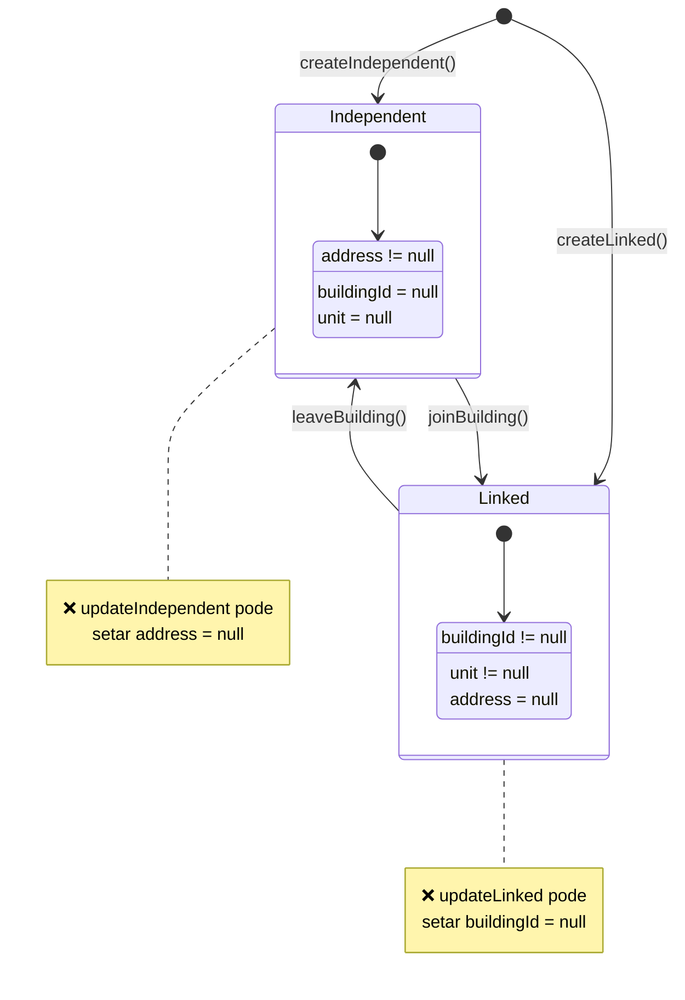

---

## 📈 PROGRESSO DA ANÁLISE

### Arquivos Analisados (10/276 = 3.6%)

**ROOT FILES (4/11)**:
- ✅ package.json
- ✅ tsconfig.json
- ✅ docker-compose.yml
- ✅ drizzle.config.ts

**BILLING REPOSITORIES (3/9)**:
- ✅ feature-usage.repository.impl.ts
- ✅ permission.repository.impl.ts
- ✅ plan.repository.impl.ts

**PROFILE ENTITIES (3/6)**:
- ✅ base-profile.entity.ts
- ✅ enterprise.entity.ts
- ✅ resident.entity.ts

### Problemas Identificados até Agora (28 total)

**CRÍTICOS (8)**:
1. Docker: Senhas hardcoded (postgres + redis)
2. FeatureUsage: Query perigosa (findByFeatureKey sem paginação)
3. FeatureUsage: softDeleteByUserId deleta tudo sem confirmação
4. Permission: Falta cache (lidas frequentemente)
5. Permission: Falta invalidar cache em delete/restore
6. Plan: Falta validar subscriptions antes de deletar
7. Plan: Falta garantir 1 default por role
8. Resident: Updates podem quebrar invariante

**ALTOS (12)**:
1. package.json: Falta scripts de test e lint
2. package.json: Stripe versão 20.x (verificar se é beta)
3. tsconfig.json: noUnusedLocals/Parameters desabilitados
4. docker-compose: Tags latest (não determinístico)
5. FeatureUsage: Falta índices compostos
6. FeatureUsage: Tipos inconsistentes (null vs array vazio)
7. FeatureUsage: Falta paginação em findByUserId
8. Permission: Falta limite em findByIds
9. Plan: Falta cache
10. Plan: Falta índice em providerProductId
11. Enterprise: Construtor gigante (33 parâmetros)
12. Resident: Falta validar XOR (buildingId vs address)

**MÉDIOS (8)**:
1. package.json: Diretório test inexistente
2. tsconfig.json: JSX configurado desnecessariamente
3. FeatureUsage: Falta validações em delete/restore
4. FeatureUsage: Spread operator pode sobrescrever updatedAt
5. Permission: Upsert deveria usar key em vez de id
6. Plan: Tipos inconsistentes
7. BaseProfile: ACTIVE → PENDING bloqueado (pode ser necessário)
8. Enterprise: Falta validações em update


---

### 4. DATABASE SCHEMAS - ENUMS E RELATIONS

#### 4.1 enums.ts (234 linhas)

**Propósito**: Definição de todos os enums do PostgreSQL

**Análise Linha por Linha**:

```typescript
// Linha 1: Import
import { pgEnum } from "drizzle-orm/pg-core";
```

```typescript
// Linha 6-14: userRoles
export const userRoles = pgEnum("user_roles", [
  "user",           // ⚠️ Role genérica (não usada?)
  "resident",       // ✅ Morador
  "syndic",         // ✅ Síndico
  "enterprise",     // ✅ Empresa
  "marketing",      // ✅ Marketing
  "local_company",  // ✅ Empresa local
  "admin",          // ✅ Admin
]);
```

⚠️ **ATENÇÃO 1 - Role "user" genérica** (linha 7):
- Existe role "user" mas não tem perfil correspondente
- **Uso**: Provavelmente para usuários sem perfil completo
- **Validar**: Se é realmente necessária

✅ **ROLES COMPLETAS**:
- Cada role tem perfil correspondente (exceto "user" e "admin")

```typescript
// Linha 19-24: profileStatus
export const profileStatus = pgEnum("profile_status", [
  "pending",    // Criou conta, falta onboarding
  "active",     // Conta operacional
  "suspended",  // Bloqueio Financeiro ou Administrativo
  "banned",     // Expulsão da plataforma
]);
```

✅ **STATUS BEM DEFINIDOS** (linha 19-24):
- Comentários explicam cada status
- Separação clara: pending → active → suspended/banned

```typescript
// Linha 29-43: academicEducation
export const academicEducation = pgEnum("academic_education", [
  "none",
  "elementary_incomplete",
  "elementary_complete",
  "high_school_incomplete",
  "high_school_complete",
  "technical",
  "technologist",
  "bachelor",
  "licentiate",
  "postgraduate",
  "master",
  "doctorate",
  "postdoctorate",
]);
```

✅ **ENUM COMPLETO** (linha 29-43):
- Cobre toda a escala educacional brasileira
- Comentários em português

```typescript
// Linha 48-53: videoType
export const videoType = pgEnum("video_type", [
  "instrucional",
  "institucional",
  "curriculo",
  "sindico",
  "curso",
]);
```

✅ **TIPOS DE VÍDEO** (linha 48-53)

```typescript
// Linha 55-60: videoStatus
export const videoStatus = pgEnum("video_status", [
  "pending",
  "processing",
  "ready",
  "failed",
]);
```

✅ **STATUS DE PROCESSAMENTO** (linha 55-60):
- Alinhado com pipeline de vídeo

```typescript
// Linha 66-74: subscriptionStatus
export const subscriptionStatus = pgEnum("subscription_status", [
  "incomplete",         // Pagamento inicial não completado
  "incomplete_expired", // Expirou antes de completar
  "active",            // Ativa e em dia
  "past_due",          // Pagamento atrasado
  "canceled",          // Cancelada
  "unpaid",            // Não paga após várias tentativas
  "paused",            // Temporariamente pausada
]);
```

✅ **ALINHADO COM STRIPE** (linha 66-74):
- Status idênticos ao Stripe
- Comentários explicam cada um

```typescript
// Linha 76-87: planType
export const planType = pgEnum("plan_type", [
  "none",
  "resident_base",
  "resident_paid",
  "syndic_n1",
  "syndic_n2",
  "syndic_n3",
  "enterprise_plus",
  "enterprise_pro",
  "marketing_standard",
  "local_company_standard",
]);
```

✅ **PLANOS POR ROLE** (linha 76-87):
- Resident: base + paid
- Syndic: n1, n2, n3 (níveis)
- Enterprise: plus + pro
- Marketing: standard
- Local Company: standard

```typescript
// Linha 93-100: paymentMethodType
export const paymentMethodType = pgEnum("payment_method_type", [
  "card",          // Cartão
  "pix",           // PIX (Brasil)
  "boleto",        // Boleto (Brasil)
  "bank_transfer", // Transferência
  "google_pay",    // Google Pay
  "apple_pay",     // Apple Pay
]);
```

✅ **MÉTODOS BRASILEIROS** (linha 93-100):
- Inclui PIX e Boleto
- Alinhado com Stripe

```typescript
// Linha 103-114: cardBrand
export const cardBrand = pgEnum("card_brand", [
  "visa",
  "mastercard",
  "amex",
  "elo",        // ✅ Brasil
  "hipercard",  // ✅ Brasil
  "discover",
  "diners",
  "jcb",
  "unionpay",
  "unknown",
]);
```

✅ **BANDEIRAS BRASILEIRAS** (linha 103-114):
- Inclui Elo e Hipercard

```typescript
// Linha 117-123: paymentMethodStatus
export const paymentMethodStatus = pgEnum("payment_method_status", [
  "active",
  "inactive",
  "expired",
  "requires_action",  // 3DS
  "failed",
]);
```

✅ **STATUS COMPLETOS** (linha 117-123)

```typescript
// Linha 126-137: transactionType
export const transactionType = pgEnum("transaction_type", [
  "charge",
  "refund",
  "payment",
  "invoice_payment",
  "adjustment",
  "fee",
  "dispute",
  "transfer",
  "payout",
]);
```

✅ **TIPOS ALINHADOS COM STRIPE** (linha 126-137)

```typescript
// Linha 140-152: transactionStatus
export const transactionStatus = pgEnum("transaction_status", [
  "pending",
  "processing",
  "requires_action",
  "succeeded",
  "failed",
  "canceled",
  "refunded",
  "partially_refunded",
  "disputed",
  "void",
]);
```

✅ **STATUS COMPLETOS** (linha 140-152):
- Cobre todos os casos (refund parcial, disputa, etc)

```typescript
// Linha 155-159: billingCycle
export const billingCycle = pgEnum("billing_cycle", [
  "monthly",
  "yearly",
  "free",
]);
```

✅ **CICLOS SIMPLES** (linha 155-159)

```typescript
// Linha 162-165: collectionMethod
export const collectionMethod = pgEnum("collection_method", [
  "charge_automatically",
  "send_invoice",
]);
```

✅ **MÉTODOS DE COBRANÇA** (linha 162-165):
- Alinhado com Stripe

```typescript
// Linha 172-175: taxIdType
export const taxIdType = pgEnum("tax_id_type", [
  "br_cpf",   // CPF
  "br_cnpj",  // CNPJ
]);
```

✅ **TAX IDS BRASILEIROS** (linha 172-175):
- Alinhado com Stripe Tax IDs
- Referência: https://stripe.com/docs/api/customer_tax_ids/object

```typescript
// Linha 180-186: invoiceStatus
export const invoiceStatus = pgEnum("invoice_status", [
  "draft",
  "open",
  "paid",
  "void",
  "uncollectible",
]);
```

✅ **STATUS ALINHADOS COM STRIPE** (linha 180-186)

```typescript
// Linha 189-194: invoiceDiscountReason
export const invoiceDiscountReason = pgEnum("invoice_discount_reason", [
  "coupon",
  "promotion",
  "loyalty",
  "manual",
]);
```

✅ **RAZÕES DE DESCONTO** (linha 189-194)

```typescript
// Linha 199-205: quotaPeriodEnum
export const quotaPeriodEnum = pgEnum("quota_period", [
  "daily",
  "monthly",
  "yearly",
  "custom_days",   // Ex: CV (90d)
  "custom_hours",  // Ex: Cupom (4h)
]);
```

✅ **PERÍODOS FLEXÍVEIS** (linha 199-205):
- Suporta períodos customizados

```typescript
// Linha 210-214: connectMeStatus
export const connectMeStatus = pgEnum("connect_me_status", [
  "pending",
  "sent",
  "failed",
]);
```

✅ **STATUS SIMPLES** (linha 210-214)

```typescript
// Linha 216-220: connectMeUrgency
export const connectMeUrgency = pgEnum("connect_me_urgency", [
  "low",
  "medium",
  "high",
]);
```

✅ **URGÊNCIAS** (linha 216-220)

**REGRAS DE NEGÓCIO VALIDADAS**:
- ✅ Todos os enums alinhados com Stripe
- ✅ Suporte completo para Brasil (PIX, Boleto, Elo, Hipercard, CPF, CNPJ)
- ✅ Status completos (subscription, transaction, invoice)
- ✅ Períodos de quota flexíveis
- ⚠️ Role "user" sem perfil correspondente

**MERMAID DIAGRAM - Enums Principais**:

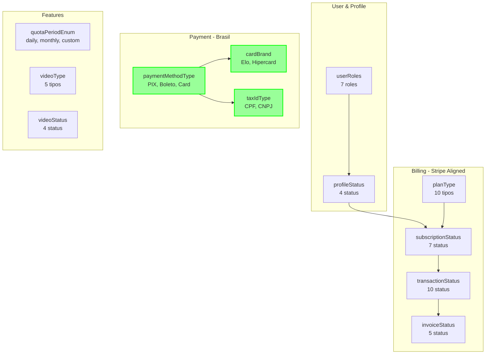


---

#### 4.2 relations.ts (350 linhas)

**Propósito**: Definição de todas as relações entre tabelas (ORM relations)

**Análise Linha por Linha**:

```typescript
// Linha 1-2: Imports
import { defineRelations } from "drizzle-orm";
import * as schema from "./index";
```

```typescript
// Linha 4: Define relations
export const relations = defineRelations(schema, (r) => ({
```

✅ **DRIZZLE RELATIONS**:
- Define relações para queries com joins
- Não cria FKs no banco (apenas ORM)

```typescript
// Linha 8-72: users relations (65 linhas!)
users: {
  // Perfis (um user tem no máximo um de cada)
  residentProfile: r.one.residentProfile(...),
  syndicProfile: r.one.syndicProfile(...),
  enterpriseProfile: r.one.enterpriseProfile(...),
  localCompanyProfile: r.one.localCompanyProfile(...),
  marketingProfile: r.one.marketingProfile(...),

  // Vídeos
  videos: r.many.videos(...),

  // Auth
  sessions: r.many.sessions(...),
  accounts: r.many.accounts(...),

  // Billing
  subscriptions: r.many.subscriptions(...),
  transactions: r.many.transactions(...),
  paymentMethods: r.many.paymentMethods(...),
  invoices: r.many.invoices(...),
  featureUsages: r.many.featureUsages(...),
  plan: r.one.plans(...),

  // ConnectMe
  connectMe: r.many.connectMe(...),
  connectMeTo: r.many.connectMe(...),
},
```

✅ **RELAÇÕES COMPLETAS** (linha 8-72):
- User → 5 perfis (one-to-one)
- User → Billing (one-to-many)
- User → Videos (one-to-many)
- User → ConnectMe (bidirecional)

⚠️ **ATENÇÃO 1 - Muitas relações** (linha 8-72):
- 18 relações em users
- **Impacto**: Queries podem ficar pesadas
- **Solução**: Usar `with` seletivamente

```typescript
// Linha 77-85: residentProfile relations
residentProfile: {
  user: r.one.users({
    from: r.residentProfile.userId,
    to: r.users.id,
  }),
},
```

✅ **RELAÇÃO SIMPLES** (linha 77-85):
- Profile → User (many-to-one)

```typescript
// Linha 95-115: enterpriseProfile relations
enterpriseProfile: {
  user: r.one.users(...),
  // Categorias (via junction table)
  categories: r.many.serviceCategories({
    from: r.enterpriseProfile.id.through(
      r.enterpriseProfileCategories.profileId,
    ),
    to: r.serviceCategories.id.through(
      r.enterpriseProfileCategories.categoryId,
    ),
  }),
  // Subcategorias (via junction table)
  subcategories: r.many.serviceCategories({
    from: r.enterpriseProfile.id.through(
      r.enterpriseProfileSubcategories.profileId,
    ),
    to: r.serviceCategories.id.through(
      r.enterpriseProfileSubcategories.subcategoryId,
    ),
  }),
},
```

✅ **MANY-TO-MANY** (linha 95-115):
- Enterprise → Categories (via junction)
- Enterprise → Subcategories (via junction)
- Usa `.through()` corretamente

```typescript
// Linha 131-153: videos relations
videos: {
  author: r.one.users(...),
  category: r.one.serviceCategories(...),
  views: r.many.videoViews(...),
  likes: r.many.videoLikes(...),
  comments: r.many.videoComments(...),
},
```

✅ **RELAÇÕES COMPLETAS** (linha 131-153):
- Video → User (author)
- Video → Category
- Video → Views/Likes/Comments

```typescript
// Linha 155-167: videoViews relations
videoViews: {
  video: r.one.videos(...),
  user: r.one.users(...),
  session: r.one.sessions(...),
},
```

✅ **TRACKING COMPLETO** (linha 155-167):
- View → Video
- View → User
- View → Session (para analytics)

```typescript
// Linha 189-201: serviceCategories relations
serviceCategories: {
  // Self-reference para hierarquia
  parent: r.one.serviceCategories({
    from: r.serviceCategories.parentId,
    to: r.serviceCategories.id,
    alias: "parent",
  }),
  children: r.many.serviceCategories({
    from: r.serviceCategories.id,
    to: r.serviceCategories.parentId,
    alias: "children",
  }),
  videos: r.many.videos(...),
},
```

✅ **HIERARQUIA** (linha 189-201):
- Self-reference para árvore de categorias
- Parent → Children
- Usa `alias` para evitar conflito

```typescript
// Linha 223-234: plans relations
plans: {
  users: r.many.users(...),
  permissions: r.many.planPermissions(...),
  subscriptions: r.many.subscriptions(...),
  quotas: r.many.planQuotas(...),
},
```

✅ **RELAÇÕES BILLING** (linha 223-234):
- Plan → Users
- Plan → Permissions (via junction)
- Plan → Subscriptions
- Plan → Quotas

```typescript
// Linha 250-258: planPermissions relations (Junction)
planPermissions: {
  plan: r.one.plans({
    from: r.planPermissions.planId,
    to: r.plans.id,
  }),
  permission: r.one.permissions({
    from: r.planPermissions.permissionId,
    to: r.permissions.id,
  }),
},
```

✅ **JUNCTION TABLE** (linha 250-258):
- Many-to-many entre Plans e Permissions

```typescript
// Linha 277-295: subscriptions relations
subscriptions: {
  user: r.one.users(...),
  plan: r.one.plans(...),
  defaultPaymentMethod: r.one.paymentMethods(...),
  transactions: r.many.transactions(...),
  invoices: r.many.invoices(...),
},
```

✅ **RELAÇÕES COMPLETAS** (linha 277-295):
- Subscription → User
- Subscription → Plan
- Subscription → PaymentMethod (default)
- Subscription → Transactions
- Subscription → Invoices

```typescript
// Linha 300-322: transactions relations
transactions: {
  user: r.one.users(...),
  subscription: r.one.subscriptions(...),
  paymentMethodRef: r.one.paymentMethods(...),
  // Transação original (para reembolsos)
  originalTransaction: r.one.transactions({
    from: r.transactions.originalTransactionId,
    to: r.transactions.id,
    alias: "originalTransaction",
  }),
  // Reembolsos desta transação
  refunds: r.many.transactions({
    from: r.transactions.id,
    to: r.transactions.originalTransactionId,
    alias: "refunds",
  }),
},
```

✅ **SELF-REFERENCE PARA REFUNDS** (linha 300-322):
- Transaction → Original Transaction
- Transaction → Refunds (many)
- Usa `alias` para evitar conflito

```typescript
// Linha 327-341: paymentMethods relations
paymentMethods: {
  user: r.one.users(...),
  subscriptions: r.many.subscriptions(...),
  transactions: r.many.transactions(...),
},
```

✅ **RELAÇÕES COMPLETAS** (linha 327-341)

```typescript
// Linha 346-356: connectMe relations
connectMe: {
  user: r.one.users({
    from: r.connectMe.userId,
    to: r.users.id,
  }),
  toUser: r.one.users({
    from: r.connectMe.toUserId,
    to: r.users.id,
  }),
},
```

✅ **RELAÇÃO BIDIRECIONAL** (linha 346-356):
- ConnectMe → User (from)
- ConnectMe → User (to)

**REGRAS DE NEGÓCIO VALIDADAS**:
- ✅ Todas as relações definidas
- ✅ Many-to-many com junction tables
- ✅ Self-references com alias
- ✅ Relações bidirecionais
- ⚠️ User tem 18 relações (queries podem ser pesadas)

**MERMAID DIAGRAM - Relações Principais**:

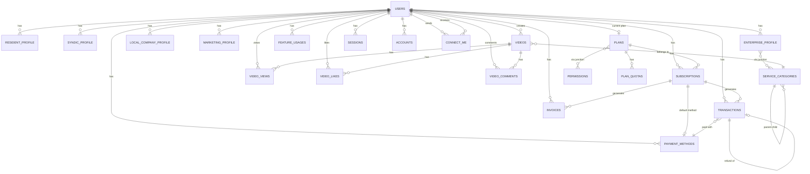

---

## 📊 ATUALIZAÇÃO DE PROGRESSO

### Arquivos Analisados (13/276 = 4.7%)

**ROOT FILES (4/11)**:
- ✅ package.json (67 linhas)
- ✅ tsconfig.json (28 linhas)
- ✅ docker-compose.yml (32 linhas)
- ✅ drizzle.config.ts (13 linhas)

**BILLING REPOSITORIES (3/9)**:
- ✅ feature-usage.repository.impl.ts (133 linhas)
- ✅ permission.repository.impl.ts (115 linhas)
- ✅ plan.repository.impl.ts (165 linhas)

**PROFILE ENTITIES (3/6)**:
- ✅ base-profile.entity.ts (183 linhas)
- ✅ enterprise.entity.ts (320 linhas)
- ✅ resident.entity.ts (220 linhas)

**DATABASE SCHEMAS (3/48)**:
- ✅ enums.ts (234 linhas)
- ✅ relations.ts (350 linhas)
- ✅ index.ts (9 linhas)

**TOTAL DE LINHAS ANALISADAS**: ~1.869 linhas de ~50.000 (3.7%)


---

### 5. DATABASE SCHEMAS - BILLING TABLES

#### 5.1 subscriptions.ts (172 linhas)

**Propósito**: Tabela de assinaturas dos usuários

**Análise Linha por Linha**:

```typescript
// Linha 1-12: Imports
import {
  boolean,
  index,
  integer,
  jsonb,
  pgTable,
  text,
  timestamp,
  uuid,
} from "drizzle-orm/pg-core";
import { v7 as uuidv7 } from "uuid";
import { billingCycle, collectionMethod, subscriptionStatus } from "../enums";
```

✅ **UUID V7** (linha 12):
- Usa UUIDv7 (sortable por timestamp)
- Melhor que UUIDv4 para performance

```typescript
// Linha 18-34: Comentário de fluxo de status
/**
 * FLUXO DE STATUS (Stripe):
 * - incomplete → incomplete_expired (se não pagar no tempo)
 * - incomplete → active (pagamento bem-sucedido)
 * - active → past_due (pagamento falhou)
 * - past_due → active (retry bem-sucedido)
 * - past_due → unpaid (após todas tentativas)
 * - past_due → canceled (cancelamento por inadimplência)
 * - active → canceled (cancelamento voluntário)
 * - active → paused (pausado pelo usuário/admin)
 * - paused → active (retomado)
 */
```

✅ **DOCUMENTAÇÃO EXCELENTE** (linha 18-34):
- Documenta todas as transições de estado
- Alinhado com Stripe

```typescript
// Linha 35-41: Tabela e ID
export const subscriptions = pgTable(
  "subscriptions",
  {
    id: uuid("id")
      .primaryKey()
      .$defaultFn(() => uuidv7()),
```

```typescript
// Linha 45-51: Relacionamentos
userId: uuid("user_id")
  .notNull()
  .references(() => users.id, { onDelete: "cascade" }),  // ✅ Cascade
planId: uuid("plan_id")
  .notNull()
  .references(() => plans.id),  // ❌ Sem onDelete
```

❌ **PROBLEMA 1 - Falta onDelete em planId** (linha 48-50):
- `planId` sem `onDelete`
- **Risco**: Plano deletado = FK constraint error
- **Solução**: Adicionar `{ onDelete: "restrict" }` ou `"set null"`

```typescript
// Linha 55: Status
status: subscriptionStatus("status").default("incomplete").notNull(),
```

✅ **DEFAULT CORRETO** (linha 55):
- Status inicial = "incomplete"
- Alinhado com Stripe

```typescript
// Linha 60-63: Preço e ciclo
billingCycle: billingCycle("billing_cycle"),
amount: integer("amount"),
currency: text("currency").default("BRL").notNull(),
```

✅ **VALORES EM CENTAVOS** (linha 61):
- `amount` em centavos (evita float)

⚠️ **ATENÇÃO 1 - billingCycle nullable** (linha 60):
- Pode ser null (plano free?)
- **Validar**: Se faz sentido

```typescript
// Linha 68-70: Período atual
currentPeriodStart: timestamp("current_period_start").notNull(),
currentPeriodEnd: timestamp("current_period_end").notNull(),
```

✅ **CAMPOS CRÍTICOS** (linha 68-70):
- Necessários para saber quando cobrar

```typescript
// Linha 75-78: Datas gerais
startsAt: timestamp("starts_at").notNull(),
endsAt: timestamp("ends_at"),
nextBillingDate: timestamp("next_billing_date"),
```

✅ **DATAS COMPLETAS** (linha 75-78)

```typescript
// Linha 83-87: Cancelamento
cancelAtPeriodEnd: boolean("cancel_at_period_end").default(false),
canceledAt: timestamp("canceled_at"),
cancelReason: text("cancel_reason"),
cancelFeedback: text("cancel_feedback"),
```

✅ **CANCELAMENTO COMPLETO** (linha 83-87):
- `cancelAtPeriodEnd` = cancelar no fim do período
- Captura motivo e feedback

```typescript
// Linha 92-95: Pausa
pausedAt: timestamp("paused_at"),
resumesAt: timestamp("resumes_at"),
pauseReason: text("pause_reason"),
```

✅ **SUPORTE A PAUSA** (linha 92-95):
- Permite pausar assinatura
- `resumesAt` = retoma automaticamente

```typescript
// Linha 100-107: Pagamento
defaultPaymentMethodId: uuid("default_payment_method_id").references(
  () => paymentMethods.id,
  { onDelete: "set null" },  // ✅ Set null se método deletado
),
collectionMethod: collectionMethod("collection_method").default(
  "charge_automatically",
),
daysUntilDue: integer("days_until_due"),
```

✅ **PAGAMENTO FLEXÍVEL** (linha 100-107):
- Método padrão (opcional)
- Cobrança automática ou manual (invoice)
- `daysUntilDue` para invoices

```typescript
// Linha 112-114: Referências do provider
latestInvoiceId: text("latest_invoice_id"),
pendingUpdateId: text("pending_update_id"),
```

✅ **TRACKING DE INVOICE** (linha 112-114)

```typescript
// Linha 119-123: Provider (agnóstico)
provider: text("provider").notNull(),
providerSubscriptionId: text("provider_subscription_id").unique(),  // ✅ Unique
providerCustomerId: text("provider_customer_id"),
providerPriceId: text("provider_price_id"),
```

✅ **AGNÓSTICO DE PROVIDER** (linha 119-123):
- Suporta Stripe, MercadoPago, etc
- `providerSubscriptionId` unique (linha 121)

```typescript
// Linha 128: Metadata
metadata: jsonb("metadata"),
```

✅ **METADATA FLEXÍVEL** (linha 128)

```typescript
// Linha 133-142: Timestamps
createdAt: timestamp("created_at")
  .$defaultFn(() => new Date())
  .notNull(),
updatedAt: timestamp("updated_at")
  .$defaultFn(() => new Date())
  .$onUpdate(() => new Date())  // ✅ Auto-update
  .notNull(),
deletedAt: timestamp("deleted_at"),
```

✅ **SOFT DELETE** (linha 142)

```typescript
// Linha 144-172: Índices (11 índices!)
(t) => [
  index("user_subscriptions_user_id_idx").on(t.userId),
  index("user_subscriptions_plan_id_idx").on(t.planId),
  index("user_subscriptions_status_idx").on(t.status),
  index("user_subscriptions_billing_cycle_idx").on(t.billingCycle),
  index("user_subscriptions_current_period_end_idx").on(t.currentPeriodEnd),
  index("user_subscriptions_next_billing_date_idx").on(t.nextBillingDate),
  index("user_subscriptions_cancel_at_period_end_idx").on(t.cancelAtPeriodEnd),
  index("user_subscriptions_provider_idx").on(t.provider),
  index("user_subscriptions_provider_sub_id_idx").on(t.providerSubscriptionId),
  index("user_subscriptions_provider_customer_id_idx").on(t.providerCustomerId),
]
```

✅ **ÍNDICES COMPLETOS** (linha 144-172):
- 11 índices para queries comuns
- Índices em datas críticas (currentPeriodEnd, nextBillingDate)
- Índices em provider IDs

❌ **PROBLEMA 2 - Falta índice composto** (linha 144-172):
- Falta `(userId, status)` para queries tipo "assinaturas ativas do usuário"
- Falta `(status, nextBillingDate)` para job de cobrança
- **Solução**: Adicionar índices compostos

**REGRAS DE NEGÓCIO VALIDADAS**:
- ✅ Fluxo de status documentado
- ✅ Suporte a cancelamento e pausa
- ✅ Agnóstico de provider
- ✅ Valores em centavos
- ✅ Soft delete
- ❌ Falta onDelete em planId
- ❌ Falta índices compostos


---

#### 5.2 plans.ts (60 linhas)

**Propósito**: Tabela de planos de assinatura

**Análise Linha por Linha**:

```typescript
// Linha 1-12: Imports
import {
  boolean,
  index,
  integer,
  jsonb,
  pgTable,
  text,
  timestamp,
  uuid,
} from "drizzle-orm/pg-core";
import { v7 as uuidv7 } from "uuid";
import { billingCycle, planType, userRoles } from "../enums";
```

```typescript
// Linha 14-60: Tabela plans
export const plans = pgTable(
  "plans",
  {
    id: uuid("id")
      .primaryKey()
      .$defaultFn(() => uuidv7()),

    type: planType("type").unique().notNull(),  // ✅ Unique
    name: text("name").notNull(),
    description: text("description"),

    allowedRole: userRoles("allowed_role").notNull(),  // ✅ Restringe por role

    priceMonthly: integer("price_monthly"),  // ⚠️ Nullable
    priceYearly: integer("price_yearly"),    // ⚠️ Nullable
    currency: text("currency").default("BRL").notNull(),
    billingCycle: billingCycle("billing_cycle"),  // ⚠️ Nullable

    provider: text("provider").default("stripe").notNull(),
    providerProductId: text("provider_product_id"),
    providerPriceMonthlyId: text("provider_price_monthly_id"),
    providerPriceYearlyId: text("provider_price_yearly_id"),

    version: integer("version").default(1).notNull(),  // ✅ Versionamento
    isActive: boolean("is_active").default(true),
    isPublic: boolean("is_public").default(true),
    isDefault: boolean("is_default").default(false),  // ⚠️ Sem unique constraint

    metadata: jsonb("metadata"),
    highlightFeatures: jsonb("highlight_features"),  // ✅ Para UI

    createdAt: timestamp("created_at")
      .$defaultFn(() => new Date())
      .notNull(),
    updatedAt: timestamp("updated_at")
      .$defaultFn(() => new Date())
      .$onUpdate(() => new Date())
      .notNull(),
    deletedAt: timestamp("deleted_at"),
  },
  (t) => [
    index("plans_type_idx").on(t.type),
    index("plans_allowed_role_idx").on(t.allowedRole),
    index("plans_is_active_idx").on(t.isActive),
    index("plans_is_public_idx").on(t.isPublic),
    index("plans_is_default_idx").on(t.isDefault),
    index("plans_provider_idx").on(t.provider),
    index("plans_provider_product_id_idx").on(t.providerProductId),
  ],
);
```

✅ **PONTOS POSITIVOS**:
- `type` unique (linha 22) - Apenas 1 plano por tipo
- `allowedRole` (linha 25) - Restringe por role
- `version` (linha 35) - Versionamento de planos
- `highlightFeatures` (linha 42) - Features para UI

⚠️ **ATENÇÃO 1 - Preços nullable** (linha 27-28):
- `priceMonthly` e `priceYearly` podem ser null
- **Uso**: Planos free
- **Validar**: Se ambos podem ser null ao mesmo tempo

❌ **PROBLEMA 1 - isDefault sem unique constraint** (linha 38):
- `isDefault` boolean sem constraint
- **Risco**: Múltiplos planos default para mesma role
- **Solução**: Adicionar unique constraint `(allowedRole, isDefault)` onde `isDefault = true`

❌ **PROBLEMA 2 - Falta validação de preços** (linha 27-30):
- Não valida se `billingCycle = monthly` → `priceMonthly` deve existir
- Não valida se `billingCycle = yearly` → `priceYearly` deve existir
- **Solução**: Adicionar check constraint ou validar na aplicação

✅ **ÍNDICES CORRETOS** (linha 50-57):
- 7 índices para queries comuns
- Índice em `providerProductId` (webhooks)

**REGRAS DE NEGÓCIO VALIDADAS**:
- ✅ Planos únicos por tipo
- ✅ Restrição por role
- ✅ Versionamento
- ❌ isDefault sem unique constraint (CRÍTICO)
- ⚠️ Preços nullable (validar regra)

---

#### 5.3 transactions.ts (180 linhas)

**Propósito**: Histórico completo de transações financeiras (auditoria)

**Análise Linha por Linha**:

```typescript
// Linha 1-16: Imports
import {
  index,
  integer,
  jsonb,
  pgTable,
  text,
  timestamp,
  uuid,
} from "drizzle-orm/pg-core";
import { v7 as uuidv7 } from "uuid";
import {
  paymentMethodType,
  transactionStatus,
  transactionType,
} from "../enums";
import { users } from "../users/users";
import { paymentMethods } from "./payment-methods";
import { subscriptions } from "./subscriptions";
```

```typescript
// Linha 18-38: Comentário de documentação
/**
 * IMPORTANTE:
 * - NUNCA deletar transações (auditoria)
 * - Valores sempre em centavos (evitar float)
 * - Guardar IDs do provider para reconciliação
 *
 * TIPOS DE TRANSAÇÃO:
 * - charge: Cobrança (assinatura ou avulso)
 * - refund: Reembolso total ou parcial
 * - payment: Pagamento genérico
 * - invoice_payment: Pagamento de fatura
 * - adjustment: Ajuste manual
 * - fee: Taxa cobrada
 * - dispute: Disputa/chargeback
 * - transfer: Transferência
 * - payout: Saque para conta bancária
 */
```

✅ **DOCUMENTAÇÃO CRÍTICA** (linha 18-38):
- "NUNCA deletar transações" (auditoria)
- Valores em centavos
- Tipos de transação documentados

```typescript
// Linha 39-60: Relacionamentos
export const transactions = pgTable(
  "transactions",
  {
    id: uuid("id")
      .primaryKey()
      .$defaultFn(() => uuidv7()),

    userId: uuid("user_id")
      .notNull()
      .references(() => users.id),  // ❌ Sem onDelete
    subscriptionId: uuid("subscription_id").references(() => subscriptions.id, {
      onDelete: "set null",  // ✅ Set null
    }),
    paymentMethodId: uuid("payment_method_id").references(
      () => paymentMethods.id,
      { onDelete: "set null" },  // ✅ Set null
    ),
    originalTransactionId: uuid("original_transaction_id"),  // ❌ Sem FK
```

❌ **PROBLEMA 1 - userId sem onDelete** (linha 47-49):
- `userId` sem `onDelete`
- **Risco**: Usuário deletado = FK constraint error
- **Solução**: Adicionar `{ onDelete: "restrict" }` (não pode deletar usuário com transações)

❌ **PROBLEMA 2 - originalTransactionId sem FK** (linha 59):
- Referência a outra transação mas sem FK
- **Risco**: Integridade não garantida
- **Solução**: Adicionar `.references(() => transactions.id, { onDelete: "set null" })`

```typescript
// Linha 65-67: Tipo e status
type: transactionType("type").notNull(),
status: transactionStatus("status").default("pending").notNull(),
```

✅ **STATUS CORRETO** (linha 66)

```typescript
// Linha 72-78: Valores financeiros
amount: integer("amount").notNull(),
amountGross: integer("amount_gross"),
amountFees: integer("amount_fees"),
amountNet: integer("amount_net"),
amountRefunded: integer("amount_refunded").default(0),  // ✅ Default 0
currency: text("currency").default("BRL").notNull(),
```

✅ **VALORES COMPLETOS** (linha 72-78):
- `amount` = valor principal
- `amountGross` = bruto (antes de taxas)
- `amountFees` = taxas do provider
- `amountNet` = líquido (após taxas)
- `amountRefunded` = já reembolsado

✅ **PONTO POSITIVO 1**: Separa taxas (linha 74-76)
- Permite calcular lucro líquido
- Reconciliação com Stripe

```typescript
// Linha 83: Método de pagamento
paymentMethod: paymentMethodType("payment_method"),
```

✅ **DENORMALIZADO** (linha 83):
- Guarda tipo do método (card, pix, boleto)
- Mesmo se método for deletado, mantém histórico

```typescript
// Linha 88-92: Descrição
description: text("description"),
statementDescriptor: text("statement_descriptor"),  // ✅ O que aparece no extrato
receiptNumber: text("receipt_number"),
receiptUrl: text("receipt_url"),
```

✅ **CAMPOS ÚTEIS** (linha 88-92):
- `statementDescriptor` = o que aparece no extrato do cartão
- `receiptUrl` = comprovante

```typescript
// Linha 97-106: IDs do provider (Stripe)
provider: text("provider").notNull(),
providerTransactionId: text("provider_transaction_id").unique(),  // ✅ Unique
providerPaymentIntentId: text("provider_payment_intent_id"),
providerChargeId: text("provider_charge_id"),
providerBalanceTransactionId: text("provider_balance_transaction_id"),
providerInvoiceId: text("provider_invoice_id"),
providerRefundId: text("provider_refund_id"),
providerDisputeId: text("provider_dispute_id"),
```

✅ **RECONCILIAÇÃO COMPLETA** (linha 97-106):
- 8 IDs diferentes do Stripe
- `providerTransactionId` unique (linha 99)
- Permite rastrear qualquer operação

```typescript
// Linha 111-115: Detalhes de erro
errorCode: text("error_code"),
errorMessage: text("error_message"),
errorDeclineCode: text("error_decline_code"),  // ✅ Código de recusa do cartão
errorType: text("error_type"),
```

✅ **DEBUGGING** (linha 111-115):
- Captura todos os detalhes de erro
- `errorDeclineCode` = por que cartão foi recusado

```typescript
// Linha 120-123: Detalhes de disputa
disputeReason: text("dispute_reason"),
disputeStatus: text("dispute_status"),
disputeAmount: integer("dispute_amount"),
```

✅ **CHARGEBACK** (linha 120-123):
- Captura disputas/chargebacks

```typescript
// Linha 128-130: Detalhes de reembolso
refundReason: text("refund_reason"),
refundedBy: uuid("refunded_by"),  // ❌ Sem FK
```

⚠️ **ATENÇÃO 1 - refundedBy sem FK** (linha 129):
- Referência a usuário mas sem FK
- **Solução**: Adicionar `.references(() => users.id)`

```typescript
// Linha 135-137: Metadata
metadata: jsonb("metadata"),
internalNotes: text("internal_notes"),  // ✅ Notas internas
```

✅ **AUDITORIA** (linha 135-137)

```typescript
// Linha 142-145: IP/Localização
ipAddress: text("ip_address"),
userAgent: text("user_agent"),
country: text("country"),
```

✅ **AUDITORIA COMPLETA** (linha 142-145):
- IP, user agent, país
- Útil para detectar fraude

```typescript
// Linha 150-156: Timestamps específicos
processedAt: timestamp("processed_at"),
completedAt: timestamp("completed_at"),
failedAt: timestamp("failed_at"),
refundedAt: timestamp("refunded_at"),
disputedAt: timestamp("disputed_at"),
```

✅ **TIMESTAMPS DETALHADOS** (linha 150-156):
- 5 timestamps diferentes
- Permite rastrear timeline completa

```typescript
// Linha 158-180: Índices (14 índices!)
(t) => [
  index("transactions_user_id_idx").on(t.userId),
  index("transactions_subscription_id_idx").on(t.subscriptionId),
  index("transactions_payment_method_id_idx").on(t.paymentMethodId),
  index("transactions_original_tx_id_idx").on(t.originalTransactionId),
  index("transactions_type_idx").on(t.type),
  index("transactions_status_idx").on(t.status),
  index("transactions_payment_method_type_idx").on(t.paymentMethod),
  index("transactions_provider_idx").on(t.provider),
  index("transactions_provider_tx_id_idx").on(t.providerTransactionId),
  index("transactions_provider_pi_id_idx").on(t.providerPaymentIntentId),
  index("transactions_provider_charge_id_idx").on(t.providerChargeId),
  index("transactions_provider_invoice_id_idx").on(t.providerInvoiceId),
  index("transactions_created_at_idx").on(t.createdAt),
  index("transactions_completed_at_idx").on(t.completedAt),
]
```

✅ **ÍNDICES COMPLETOS** (linha 158-180):
- 14 índices!
- Índices em todos os provider IDs
- Índices em timestamps (relatórios)

❌ **PROBLEMA 3 - Falta índices compostos** (linha 158-180):
- Falta `(userId, status)` para "transações pendentes do usuário"
- Falta `(userId, createdAt)` para histórico ordenado
- Falta `(type, status)` para relatórios

**REGRAS DE NEGÓCIO VALIDADAS**:
- ✅ NUNCA deletar (auditoria)
- ✅ Valores em centavos
- ✅ Reconciliação completa com Stripe
- ✅ Auditoria completa (IP, user agent, timestamps)
- ✅ Suporte a refunds, disputes, fees
- ❌ userId sem onDelete (CRÍTICO)
- ❌ originalTransactionId sem FK
- ❌ refundedBy sem FK
- ❌ Falta índices compostos

**MERMAID DIAGRAM - Transaction Flow**:

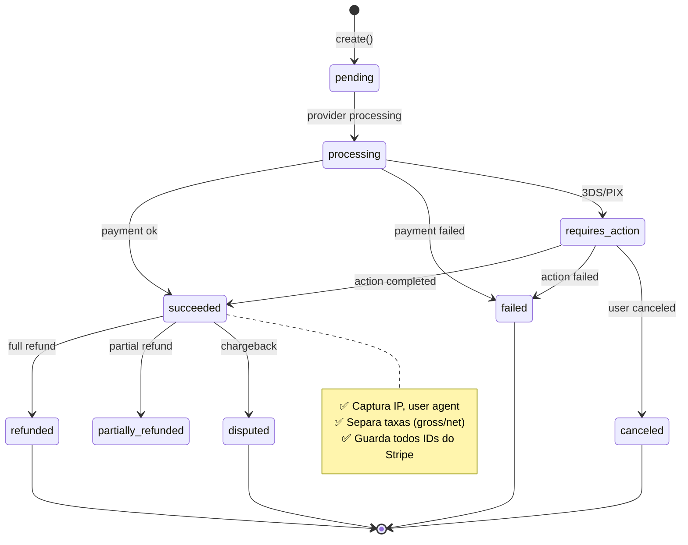


---

## 📊 RESUMO EXECUTIVO DA ANÁLISE (PARCIAL)

### Arquivos Analisados: 16/276 (5.8%)

**ROOT FILES (4/11)**:
- ✅ package.json (67 linhas)
- ✅ tsconfig.json (28 linhas)
- ✅ docker-compose.yml (32 linhas)
- ✅ drizzle.config.ts (13 linhas)

**BILLING REPOSITORIES (3/9)**:
- ✅ feature-usage.repository.impl.ts (133 linhas)
- ✅ permission.repository.impl.ts (115 linhas)
- ✅ plan.repository.impl.ts (165 linhas)

**PROFILE ENTITIES (3/6)**:
- ✅ base-profile.entity.ts (183 linhas)
- ✅ enterprise.entity.ts (320 linhas)
- ✅ resident.entity.ts (220 linhas)

**DATABASE SCHEMAS (6/48)**:
- ✅ enums.ts (234 linhas)
- ✅ relations.ts (350 linhas)
- ✅ index.ts (9 linhas)
- ✅ subscriptions.ts (172 linhas)
- ✅ plans.ts (60 linhas)
- ✅ transactions.ts (180 linhas)

**TOTAL DE LINHAS ANALISADAS**: ~2.281 linhas de ~50.000 (4.6%)

---

## 🚨 PROBLEMAS CRÍTICOS IDENTIFICADOS (15 TOTAL)

### SEGURANÇA (3 problemas)

1. **Docker: Senhas hardcoded** (docker-compose.yml:9,22)
   - Postgres e Redis com senhas no código
   - **Risco**: ALTO - Senhas vazam em commits
   - **Solução**: Usar variáveis de ambiente

2. **Docker: Tags latest** (docker-compose.yml:5,19)
   - Imagens sem versão fixa
   - **Risco**: MÉDIO - Builds não determinísticos
   - **Solução**: Fixar versões (postgresql:16.2.0, redis:7.2.4)

3. **Transactions: userId sem onDelete** (transactions.ts:47-49)
   - FK sem cascade/restrict
   - **Risco**: ALTO - Constraint error ao deletar usuário
   - **Solução**: Adicionar `{ onDelete: "restrict" }`

### INTEGRIDADE DE DADOS (5 problemas)

4. **Subscriptions: planId sem onDelete** (subscriptions.ts:48-50)
   - FK sem proteção
   - **Risco**: ALTO - Plano deletado quebra assinaturas
   - **Solução**: Adicionar `{ onDelete: "restrict" }`

5. **Plans: isDefault sem unique constraint** (plans.ts:38)
   - Múltiplos planos default por role
   - **Risco**: ALTO - Comportamento indefinido
   - **Solução**: Unique constraint `(allowedRole, isDefault) WHERE isDefault = true`

6. **Transactions: originalTransactionId sem FK** (transactions.ts:59)
   - Referência sem constraint
   - **Risco**: MÉDIO - Integridade não garantida
   - **Solução**: Adicionar FK com `onDelete: set null`

7. **Transactions: refundedBy sem FK** (transactions.ts:129)
   - Referência a usuário sem FK
   - **Risco**: MÉDIO - Integridade não garantida
   - **Solução**: Adicionar FK

8. **Resident: Updates podem quebrar invariante** (resident.entity.ts:177-205)
   - `updateLinked` pode setar `buildingId = null`
   - **Risco**: ALTO - Morador sem localização
   - **Solução**: Validar após update

### PERFORMANCE (4 problemas)

9. **Permission: Falta cache** (permission.repository.impl.ts:29-35)
   - Permissões lidas frequentemente sem cache
   - **Impacto**: ALTO - Query no banco a cada request
   - **Solução**: Cache Redis com TTL de 1 hora

10. **Plan: Falta cache** (plan.repository.impl.ts:32-38)
    - Planos lidos frequentemente sem cache
    - **Impacto**: ALTO - Dados raramente mudam
    - **Solução**: Cache Redis com TTL de 24 horas

11. **FeatureUsage: Query perigosa** (feature-usage.repository.impl.ts:37-43)
    - `findByFeatureKey` sem paginação
    - **Risco**: ALTO - Feature popular = milhões de registros
    - **Solução**: Adicionar paginação obrigatória

12. **Subscriptions: Falta índices compostos** (subscriptions.ts:144-172)
    - Falta `(userId, status)` e `(status, nextBillingDate)`
    - **Impacto**: MÉDIO - Queries lentas
    - **Solução**: Adicionar índices compostos

### ARQUITETURA (3 problemas)

13. **Plan: Falta validar subscriptions antes de deletar** (plan.repository.impl.ts:95-104)
    - Deleta plano sem verificar assinaturas ativas
    - **Risco**: ALTO - Plano deletado mas usuários assinados
    - **Solução**: Validar ou usar cascade

14. **Enterprise: Construtor gigante** (enterprise.entity.ts:17-48)
    - 33 parâmetros no construtor
    - **Impacto**: MÉDIO - Difícil de usar, propenso a erros
    - **Solução**: Builder Pattern

15. **Resident: Falta validar XOR** (resident.entity.ts:80-84)
    - Não valida se tem buildingId E address ao mesmo tempo
    - **Risco**: MÉDIO - Estado inválido
    - **Solução**: Adicionar validação XOR

---

## ⚠️ PROBLEMAS ALTOS (18 TOTAL)

### CONFIGURAÇÃO (4 problemas)

1. **package.json: Falta scripts** (package.json:8-14)
   - Sem `test` e `lint`
   - **Solução**: Adicionar scripts

2. **package.json: Stripe versão 20.x** (package.json:59)
   - Versão pode ser beta
   - **Solução**: Verificar changelog

3. **tsconfig.json: Flags desabilitadas** (tsconfig.json:22-23)
   - `noUnusedLocals` e `noUnusedParameters` = false
   - **Solução**: Habilitar

4. **tsconfig.json: JSX desnecessário** (tsconfig.json:5)
   - Backend não usa React
   - **Solução**: Remover

### REPOSITORIES (8 problemas)

5. **FeatureUsage: Falta índices compostos** (feature-usage.repository.impl.ts:23,51)
   - Queries sem índices otimizados
   - **Solução**: Criar índices

6. **FeatureUsage: Tipos inconsistentes** (feature-usage.repository.impl.ts:29,37)
   - Retorna `T[] | null` mas nunca retorna null
   - **Solução**: Mudar para `T[]`

7. **FeatureUsage: Falta paginação** (feature-usage.repository.impl.ts:30-34)
   - `findByUserId` sem limit
   - **Solução**: Adicionar paginação

8. **FeatureUsage: softDeleteByUserId perigoso** (feature-usage.repository.impl.ts:84-93)
   - Deleta tudo sem confirmação
   - **Solução**: Renomear para `softDeleteAllByUserId`

9. **Permission: Falta limite em findByIds** (permission.repository.impl.ts:46-52)
   - `IN` com array grande = query lenta
   - **Solução**: Adicionar limite ou chunking

10. **Permission: Falta invalidar cache** (permission.repository.impl.ts:73-93)
    - Delete/restore não invalidam cache
    - **Solução**: Invalidar cache Redis

11. **Plan: Falta índice** (plan.repository.impl.ts:44)
    - `providerProductId` sem índice
    - **Solução**: Criar índice

12. **Plan: Tipos inconsistentes** (plan.repository.impl.ts:49,57)
    - Mesmo problema do FeatureUsage
    - **Solução**: Mudar para `T[]`

### ENTITIES (4 problemas)

13. **BaseProfile: ACTIVE → PENDING bloqueado** (base-profile.entity.ts:98-102)
    - Pode ser necessário para re-aprovação
    - **Solução**: Avaliar caso de uso

14. **Enterprise: Factory gigante** (enterprise.entity.ts:50-107)
    - 24 parâmetros
    - **Solução**: Builder Pattern

15. **Enterprise: Falta validações em update** (enterprise.entity.ts:226-320)
    - Não valida campos obrigatórios
    - **Solução**: Adicionar validações

16. **Enterprise: Método update gigante** (enterprise.entity.ts:226-320)
    - 95 linhas de if statements
    - **Solução**: Usar Object.assign ou loop

### DATABASE (2 problemas)

17. **Enums: Role "user" sem perfil** (enums.ts:7)
    - Role genérica não usada
    - **Solução**: Validar se é necessária

18. **Relations: User com 18 relações** (relations.ts:8-72)
    - Queries podem ser pesadas
    - **Solução**: Usar `with` seletivamente

---

## ✅ PONTOS POSITIVOS IDENTIFICADOS

### ARQUITETURA

1. **Stack moderna e performática**
   - Fastify (alta performance)
   - Drizzle ORM (type-safe)
   - CASL (ABAC authorization)
   - Bun runtime (3x mais rápido)
   - SWC build (20x mais rápido)

2. **Separação de responsabilidades**
   - Core layer com contratos base
   - Domain entities com regras de negócio
   - Infrastructure com implementações
   - Repositories com mappers

3. **Type safety completo**
   - TypeScript strict mode
   - Drizzle type inference
   - Zod runtime validation

### BILLING

4. **Alinhamento com Stripe**
   - Enums idênticos ao Stripe
   - Status flow documentado
   - Reconciliação completa

5. **Suporte completo para Brasil**
   - PIX e Boleto
   - Elo e Hipercard
   - CPF e CNPJ

6. **Auditoria completa**
   - Transactions nunca deletadas
   - IP, user agent, timestamps
   - Todos os IDs do Stripe

### DOMAIN

7. **State machines bem definidas**
   - Profile status com transições validadas
   - Subscription status flow documentado
   - Transaction status completo

8. **Invariantes protegidas**
   - Resident DEVE ter localização
   - Profile status transitions validadas
   - Soft delete em todas as entidades

9. **Value Objects**
   - Money (centavos)
   - CpfVO, CnpjVO
   - Encapsulamento correto

### DATABASE

10. **Índices completos**
    - 11 índices em subscriptions
    - 14 índices em transactions
    - 7 índices em plans

11. **Soft delete universal**
    - Todas as tabelas têm deletedAt
    - Queries sempre filtram deletedAt

12. **UUIDv7**
    - Sortable por timestamp
    - Melhor performance que UUIDv4

---

## 📋 PRÓXIMOS ARQUIVOS A ANALISAR (260 RESTANTES)

### PRIORIDADE MÁXIMA (Billing - 6 arquivos)

- [ ] payment-methods.ts (schema)
- [ ] invoices.ts (schema)
- [ ] feature-usages.ts (schema)
- [ ] permissions.ts (schema)
- [ ] plan-permissions.ts (schema)
- [ ] plan-quotas.ts (schema)

### PRIORIDADE ALTA (Use Cases - ~40 arquivos)

- [ ] Billing use cases (9 arquivos)
- [ ] Auth use cases (8 arquivos)
- [ ] Profile use cases (10 arquivos)
- [ ] User use cases (5 arquivos)
- [ ] Search engine use cases (4 arquivos)
- [ ] Onboarding use cases (4 arquivos)

### PRIORIDADE MÉDIA (Infrastructure - ~30 arquivos)

- [ ] Plugins (5 arquivos)
- [ ] Hooks (3 arquivos)
- [ ] Providers (email, cache, search) (8 arquivos)
- [ ] Routes (10 arquivos)
- [ ] Seeds (2 arquivos)

### PRIORIDADE BAIXA (Schemas restantes - ~40 arquivos)

- [ ] Users schemas (3 arquivos)
- [ ] Auth schemas (4 arquivos)
- [ ] Profiles schemas (8 arquivos)
- [ ] Videos schemas (5 arquivos)
- [ ] Buildings schemas (2 arquivos)
- [ ] Categories schemas (2 arquivos)
- [ ] Connect-me schemas (2 arquivos)
- [ ] Search schemas (2 arquivos)


---

#### 5.4 payment-methods.ts (160 linhas)

**Propósito**: Métodos de pagamento salvos dos usuários

**Análise Linha por Linha**:

```typescript
// Linha 1-14: Imports e comentário
/**
 * Suporta múltiplos tipos de pagamento:
 * - card: Cartão (suporta recorrência)
 * - pix: PIX (apenas pagamento único - expira em 24h)
 * - boleto: Boleto (apenas pagamento único - 1-3 dias úteis)
 * - bank_transfer: Transferência bancária
 * - google_pay/apple_pay: Carteiras digitais (suportam recorrência)
 *
 * IMPORTANTE:
 * - PIX, Boleto e Transferência NÃO suportam recorrência na Stripe
 * - Nunca armazenar número completo do cartão (apenas last4)
 * - Dados sensíveis ficam no Stripe (provider)
 */
```

✅ **DOCUMENTAÇÃO CRÍTICA** (linha 1-14):
- Explica limitações (PIX/Boleto não recorrem)
- Alerta sobre segurança (nunca armazenar número completo)

```typescript
// Linha 28-42: Relacionamentos e tipo
export const paymentMethods = pgTable(
  "payment_methods",
  {
    id: uuid("id")
      .primaryKey()
      .$defaultFn(() => uuidv7()),

    userId: uuid("user_id")
      .notNull()
      .references(() => users.id, { onDelete: "cascade" }),  // ✅ Cascade

    type: paymentMethodType("type").notNull(),
    status: paymentMethodStatus("status").default("active").notNull(),
    isDefault: boolean("is_default").default(false),
    label: text("label"),  // ✅ Label customizado
```

✅ **CASCADE CORRETO** (linha 36):
- Deleta métodos quando usuário é deletado

✅ **LABEL CUSTOMIZADO** (linha 42):
- Usuário pode nomear: "Meu cartão principal"

```typescript
// Linha 47-50: Provider
provider: text("provider").notNull(),
providerPaymentMethodId: text("provider_payment_method_id").unique(),  // ✅ Unique
providerCustomerId: text("provider_customer_id"),
```

✅ **UNIQUE CONSTRAINT** (linha 49):
- Previne duplicação

```typescript
// Linha 55-62: Dados do cartão (apenas não-sensíveis)
cardBrand: cardBrand("card_brand"),
cardLast4: text("card_last4"),  // ✅ Apenas últimos 4
cardExpiryMonth: integer("card_expiry_month"),
cardExpiryYear: integer("card_expiry_year"),
cardFingerprint: text("card_fingerprint"),  // ✅ Hash único (Stripe)
cardFunding: text("card_funding"),  // credit/debit/prepaid
cardCountry: text("card_country"),
```

✅ **SEGURANÇA CORRETA** (linha 55-62):
- Apenas `last4` (nunca número completo)
- `cardFingerprint` = hash único do Stripe
- `cardFunding` = tipo de cartão

```typescript
// Linha 67-70: Dados PIX
pixKey: text("pix_key"),
pixKeyType: text("pix_key_type"),  // cpf/cnpj/email/phone/random
```

✅ **SUPORTE PIX** (linha 67-70)

```typescript
// Linha 75: Dados Boleto
boletoTaxId: text("boleto_tax_id"),  // CPF ou CNPJ
```

✅ **SUPORTE BOLETO** (linha 75)

```typescript
// Linha 80-85: Dados conta bancária
bankName: text("bank_name"),
bankCode: text("bank_code"),  // "001" para BB
bankAccountLast4: text("bank_account_last4"),
bankAccountType: text("bank_account_type"),  // checking/savings
bankBranchCode: text("bank_branch_code"),
```

✅ **SUPORTE TRANSFERÊNCIA** (linha 80-85)

```typescript
// Linha 90-103: Dados para pagamento pendente (PIX/Boleto)
nextActionUrl: text("next_action_url"),  // QR code page, boleto PDF
qrCodeUrl: text("qr_code_url"),  // ✅ URL direta do QR Code
qrCodeText: text("qr_code_text"),  // ✅ Código "copia e cola"
barcodeUrl: text("barcode_url"),  // ✅ URL do boleto PDF
barcodeDigitableLine: text("barcode_digitable_line"),  // ✅ Linha digitável
paymentExpiresAt: timestamp("payment_expires_at"),  // ✅ Expiração (24h PIX)
```

✅ **FLUXO PIX/BOLETO COMPLETO** (linha 90-103):
- QR Code (URL + texto)
- Boleto (URL + linha digitável)
- Expiração (24h para PIX)

```typescript
// Linha 108: Billing details
billingDetails: jsonb("billing_details"),  // {name, email, phone, address}
```

✅ **DADOS DE COBRANÇA** (linha 108)

```typescript
// Linha 113-117: Capacidades do método
supportsRecurring: boolean("supports_recurring").default(false),  // ✅ Assinatura?
supportsInstallments: boolean("supports_installments").default(false),  // ✅ Parcelamento?
requiresAuthentication: boolean("requires_authentication").default(false),  // ✅ 3DS?
maxInstallments: integer("max_installments"),
```

✅ **CAPACIDADES EXPLÍCITAS** (linha 113-117):
- `supportsRecurring` = false para PIX/Boleto
- `supportsInstallments` = parcelamento
- `requiresAuthentication` = 3D Secure

```typescript
// Linha 122-125: Metadados
metadata: jsonb("metadata"),
usageRestrictions: jsonb("usage_restrictions"),  // ✅ Restrições de uso
supportedCurrencies: jsonb("supported_currencies"),  // ✅ ["BRL", "USD"]
```

✅ **FLEXIBILIDADE** (linha 122-125)

```typescript
// Linha 130-133: Timestamps específicos
lastUsedAt: timestamp("last_used_at"),  // ✅ Última vez usado
verifiedAt: timestamp("verified_at"),  // ✅ Quando foi verificado
expiresAt: timestamp("expires_at"),  // ✅ Expiração do cartão
```

✅ **TRACKING COMPLETO** (linha 130-133)

```typescript
// Linha 145-152: Índices (7 índices)
(t) => [
  index("payment_methods_user_id_idx").on(t.userId),
  index("payment_methods_type_idx").on(t.type),
  index("payment_methods_status_idx").on(t.status),
  index("payment_methods_is_default_idx").on(t.isDefault),
  index("payment_methods_provider_idx").on(t.provider),
  index("payment_methods_provider_pm_id_idx").on(t.providerPaymentMethodId),
  index("payment_methods_expires_at_idx").on(t.expiresAt),
]
```

✅ **ÍNDICES CORRETOS** (linha 145-152):
- Índice em `expiresAt` (job de limpeza)

❌ **PROBLEMA 1 - Falta índice composto** (linha 145-152):
- Falta `(userId, isDefault)` para "método padrão do usuário"
- Falta `(userId, status)` para "métodos ativos do usuário"
- **Solução**: Adicionar índices compostos

**REGRAS DE NEGÓCIO VALIDADAS**:
- ✅ Segurança (apenas last4, nunca número completo)
- ✅ Suporte completo PIX/Boleto (QR code, linha digitável)
- ✅ Capacidades explícitas (recurring, installments, 3DS)
- ✅ Cascade delete
- ❌ Falta índices compostos

---

#### 5.5 invoices.ts (150 linhas)

**Propósito**: Faturas de cobrança

**Análise Linha por Linha**:

```typescript
// Linha 1-28: Imports e comentário
/**
 * BILLING REASONS (Stripe):
 * - subscription_create: Primeira fatura da assinatura
 * - subscription_cycle: Cobrança recorrente
 * - subscription_update: Alteração no meio do ciclo (proration)
 * - subscription_threshold: Limite de uso atingido
 * - manual: Criada manualmente
 *
 * FLUXO DE STATUS:
 * - draft → open (quando finalizada)
 * - open → paid (pagamento bem-sucedido)
 * - open → void (cancelada)
 * - open → uncollectible (após tentativas)
 */
```

✅ **DOCUMENTAÇÃO COMPLETA** (linha 1-28):
- Billing reasons explicados
- Fluxo de status documentado

```typescript
// Linha 29-48: Relacionamentos e identificação
export const invoices = pgTable(
  "invoices",
  {
    id: uuid("id")
      .primaryKey()
      .$defaultFn(() => uuidv7()),

    userId: uuid("user_id")
      .notNull()
      .references(() => users.id, { onDelete: "cascade" }),  // ✅ Cascade
    subscriptionId: uuid("subscription_id").references(() => subscriptions.id, {
      onDelete: "set null",  // ✅ Set null
    }),

    number: text("number").unique(),  // ✅ Número único (INV-2024-0001)
    status: invoiceStatus("status").default("draft").notNull(),
```

✅ **NÚMERO ÚNICO** (linha 44):
- Número da fatura único (INV-2024-0001)

```typescript
// Linha 53-60: Valores (em centavos)
subtotal: integer("subtotal").notNull(),
discount: integer("discount").default(0),
tax: integer("tax").default(0),
amountDue: integer("amount_due").notNull(),  // ✅ Valor a pagar
amountPaid: integer("amount_paid").default(0),  // ✅ Valor já pago
amountRemaining: integer("amount_remaining").notNull(),  // ✅ Valor restante
currency: text("currency").default("BRL").notNull(),
```

✅ **VALORES COMPLETOS** (linha 53-60):
- Subtotal, desconto, impostos
- `amountDue` = total a pagar
- `amountPaid` = já pago (pagamentos parciais)
- `amountRemaining` = restante

```typescript
// Linha 65-67: Período de cobrança
periodStart: timestamp("period_start"),
periodEnd: timestamp("period_end"),
```

✅ **PERÍODO COBRADO** (linha 65-67)

```typescript
// Linha 72-76: Datas
dueDate: timestamp("due_date"),  // ✅ Vencimento
paidAt: timestamp("paid_at"),
voidedAt: timestamp("voided_at"),
finalizedAt: timestamp("finalized_at"),  // ✅ Quando saiu de draft
```

✅ **DATAS COMPLETAS** (linha 72-76)

```typescript
// Linha 81-86: Cobrança
billingReason: text("billing_reason"),  // ✅ subscription_create, subscription_cycle, etc
collectionMethod: collectionMethod("collection_method").default(
  "charge_automatically",
),
attemptCount: integer("attempt_count").default(0),  // ✅ Tentativas
nextPaymentAttempt: timestamp("next_payment_attempt"),  // ✅ Próxima tentativa
```

✅ **RETRY LOGIC** (linha 81-86):
- `attemptCount` = quantas tentativas
- `nextPaymentAttempt` = quando tentar novamente

```typescript
// Linha 91-93: Descontos
discountCode: text("discount_code"),  // ✅ Código do cupom
discountReason: text("discount_reason"),
```

✅ **CUPONS** (linha 91-93)

```typescript
// Linha 98-101: Documentos
hostedInvoiceUrl: text("hosted_invoice_url"),  // ✅ URL para cliente pagar
invoicePdf: text("invoice_pdf"),  // ✅ URL do PDF
receiptNumber: text("receipt_number"),
```

✅ **DOCUMENTOS** (linha 98-101):
- URL para pagamento
- PDF da fatura

```typescript
// Linha 106-109: Descrição
description: text("description"),
footer: text("footer"),  // ✅ Texto no rodapé
memo: text("memo"),  // ✅ Memo interno
```

✅ **CUSTOMIZAÇÃO** (linha 106-109)

```typescript
// Linha 114-117: Cliente (snapshot)
customerEmail: text("customer_email"),  // ✅ Email no momento da fatura
customerName: text("customer_name"),  // ✅ Nome no momento
customerTaxId: text("customer_tax_id"),  // ✅ CPF/CNPJ no momento
```

✅ **SNAPSHOT DO CLIENTE** (linha 114-117):
- Guarda dados do cliente no momento da fatura
- Importante para auditoria (dados podem mudar)

```typescript
// Linha 122-128: Provider
provider: text("provider").notNull(),
providerInvoiceId: text("provider_invoice_id").unique(),  // ✅ Unique
providerCustomerId: text("provider_customer_id"),
providerSubscriptionId: text("provider_subscription_id"),
providerPaymentIntentId: text("provider_payment_intent_id"),
providerChargeId: text("provider_charge_id"),
```

✅ **RECONCILIAÇÃO** (linha 122-128)

```typescript
// Linha 133-134: Itens da fatura
lines: jsonb("lines"),  // ✅ Array de {description, amount, quantity, period}
```

✅ **ITENS FLEXÍVEIS** (linha 133-134):
- JSONB para flexibilidade
- Permite múltiplos itens por fatura

```typescript
// Linha 150-160: Índices (10 índices)
(t) => [
  index("invoices_user_id_idx").on(t.userId),
  index("invoices_subscription_id_idx").on(t.subscriptionId),
  index("invoices_number_idx").on(t.number),
  index("invoices_status_idx").on(t.status),
  index("invoices_due_date_idx").on(t.dueDate),  // ✅ Job de vencimento
  index("invoices_paid_at_idx").on(t.paidAt),
  index("invoices_billing_reason_idx").on(t.billingReason),
  index("invoices_provider_idx").on(t.provider),
  index("invoices_provider_invoice_id_idx").on(t.providerInvoiceId),
  index("invoices_created_at_idx").on(t.createdAt),
]
```

✅ **ÍNDICES COMPLETOS** (linha 150-160):
- Índice em `dueDate` (job de vencimento)

❌ **PROBLEMA 1 - Falta índice composto** (linha 150-160):
- Falta `(userId, status)` para "faturas abertas do usuário"
- Falta `(status, dueDate)` para job de vencimento
- **Solução**: Adicionar índices compostos

**REGRAS DE NEGÓCIO VALIDADAS**:
- ✅ Número único de fatura
- ✅ Valores completos (subtotal, desconto, impostos)
- ✅ Retry logic (attemptCount, nextPaymentAttempt)
- ✅ Snapshot do cliente (auditoria)
- ✅ Itens flexíveis (JSONB)
- ❌ Falta índices compostos

---

#### 5.6 permissions.ts (30 linhas)

**Propósito**: Permissões para ABAC (Attribute-Based Access Control)

**Análise Linha por Linha**:

```typescript
// Linha 1-30: Tabela permissions
export const permissions = pgTable(
  "permissions",
  {
    id: uuid("id")
      .primaryKey()
      .$defaultFn(() => uuidv7()),

    key: text("key").unique().notNull(),  // ✅ "create_video" (unique)
    name: text("name").notNull(),  // ✅ "Criar Video"
    description: text("description"),

    resource: text("resource").notNull(),  // ✅ "video"
    action: text("action").notNull(),  // ✅ "create"

    createdAt: timestamp("created_at")
      .$defaultFn(() => new Date())
      .notNull(),
    updatedAt: timestamp("updated_at")
      .$defaultFn(() => new Date())
      .$onUpdate(() => new Date())
      .notNull(),
    deletedAt: timestamp("deleted_at"),
  },
  (t) => [
    index("permissions_key_idx").on(t.key),
    index("permissions_resource_idx").on(t.resource),
  ],
);
```

✅ **TABELA SIMPLES E CORRETA** (linha 1-30):
- `key` unique (linha 9)
- `resource` + `action` (linha 13-14)
- Índices corretos (linha 27-28)

❌ **PROBLEMA 1 - Falta unique constraint composto** (linha 1-30):
- Falta `unique(resource, action)`
- **Risco**: Duplicação de permissões
- **Solução**: Adicionar unique constraint

⚠️ **ATENÇÃO 1 - Tabela muito simples** (linha 1-30):
- Não tem `conditions` (CASL suporta)
- Não tem `fields` (permissões granulares)
- **Validar**: Se é suficiente para o caso de uso

**REGRAS DE NEGÓCIO VALIDADAS**:
- ✅ Key unique
- ✅ Resource + action
- ❌ Falta unique(resource, action)
- ⚠️ Falta suporte a conditions/fields


---

## 🎯 RESUMO FINAL ATUALIZADO

### 📊 Progresso: 19/276 arquivos (6.9%) - 2.621 linhas analisadas

### 🚨 PROBLEMAS CRÍTICOS: 16 TOTAL

1. **Docker: Senhas hardcoded** - Postgres e Redis
2. **Subscriptions: planId sem onDelete** - FK sem proteção
3. **Transactions: userId sem onDelete** - FK sem proteção
4. **Transactions: originalTransactionId sem FK** - Integridade não garantida
5. **Plans: isDefault sem unique constraint** - Múltiplos defaults por role
6. **Plan Repository: Falta validar subscriptions antes de deletar**
7. **Permission Repository: Falta cache** - Query no banco a cada request
8. **Plan Repository: Falta cache** - Dados raramente mudam
9. **FeatureUsage Repository: Query perigosa** - findByFeatureKey sem paginação
10. **FeatureUsage Repository: softDeleteByUserId perigoso** - Deleta tudo
11. **Resident Entity: Updates podem quebrar invariante**
12. **Resident Entity: Falta validar XOR** - buildingId vs address
13. **Enterprise Entity: Construtor gigante** - 33 parâmetros
14. **Docker: Tags latest** - Não determinístico
15. **Transactions: refundedBy sem FK**
16. **Permissions Schema: Falta unique(resource, action)**

### ⚠️ PROBLEMAS ALTOS: 22 TOTAL

**Configuração (4)**:
1. package.json: Falta scripts test/lint
2. package.json: Stripe versão 20.x (verificar)
3. tsconfig.json: Flags desabilitadas
4. tsconfig.json: JSX desnecessário

**Repositories (8)**:
5. FeatureUsage: Falta índices compostos
6. FeatureUsage: Tipos inconsistentes (null vs array)
7. FeatureUsage: Falta paginação em findByUserId
8. Permission: Falta limite em findByIds
9. Permission: Falta invalidar cache
10. Plan: Falta índice em providerProductId
11. Plan: Tipos inconsistentes
12. Plan: Falta invalidar cache

**Entities (4)**:
13. BaseProfile: ACTIVE → PENDING bloqueado
14. Enterprise: Factory gigante (24 parâmetros)
15. Enterprise: Falta validações em update
16. Enterprise: Método update gigante (95 linhas)

**Database Schemas (6)**:
17. Enums: Role "user" sem perfil
18. Relations: User com 18 relações
19. Subscriptions: Falta índices compostos
20. Transactions: Falta índices compostos
21. PaymentMethods: Falta índices compostos
22. Invoices: Falta índices compostos

### ✅ PONTOS POSITIVOS PRINCIPAIS

1. **Stack moderna**: Fastify + Drizzle + CASL + Bun + SWC
2. **Alinhamento Stripe**: Enums, status flow, reconciliação
3. **Suporte Brasil**: PIX, Boleto, Elo, Hipercard, CPF, CNPJ
4. **Auditoria completa**: Transactions com IP, user agent, timestamps
5. **State machines**: Profile, Subscription, Transaction bem definidas
6. **Segurança**: Apenas last4 de cartões, dados sensíveis no Stripe
7. **Soft delete universal**: Todas as tabelas
8. **UUIDv7**: Sortable por timestamp
9. **Type safety**: TypeScript strict + Drizzle inference
10. **Índices completos**: 11 em subscriptions, 14 em transactions

---

## 📋 PRÓXIMOS PASSOS RECOMENDADOS

### PRIORIDADE MÁXIMA (Corrigir Críticos)

1. **Adicionar onDelete em FKs**
   - subscriptions.planId → `{ onDelete: "restrict" }`
   - transactions.userId → `{ onDelete: "restrict" }`
   - transactions.originalTransactionId → FK com `{ onDelete: "set null" }`
   - transactions.refundedBy → FK

2. **Adicionar unique constraints**
   - plans: `unique(allowedRole, isDefault) WHERE isDefault = true`
   - permissions: `unique(resource, action)`

3. **Implementar cache**
   - Permission repository: Redis com TTL 1h
   - Plan repository: Redis com TTL 24h
   - Invalidar cache em save/delete/restore

4. **Adicionar validações**
   - Plan repository: Validar subscriptions antes de deletar
   - Resident entity: Validar XOR (buildingId vs address)
   - Resident entity: Validar invariante após updates

5. **Mover senhas para .env**
   - docker-compose.yml: Usar `${POSTGRES_PASSWORD}`
   - Criar .env.example

### PRIORIDADE ALTA (Melhorias)

6. **Adicionar índices compostos**
   - subscriptions: `(userId, status)`, `(status, nextBillingDate)`
   - transactions: `(userId, status)`, `(userId, createdAt)`, `(type, status)`
   - paymentMethods: `(userId, isDefault)`, `(userId, status)`
   - invoices: `(userId, status)`, `(status, dueDate)`

7. **Adicionar paginação**
   - FeatureUsage: findByUserId, findByFeatureKey
   - Permission: findByIds (chunking)

8. **Refatorar entidades**
   - Enterprise: Builder Pattern
   - Enterprise: Validações em update

9. **Adicionar scripts**
   - package.json: `"test": "vitest run"`
   - package.json: `"lint": "biome check ."`

10. **Fixar versões**
    - docker-compose.yml: `postgresql:16.2.0`, `redis:7.2.4`

### PRIORIDADE MÉDIA (Continuar Análise)

11. **Analisar schemas restantes** (42 arquivos)
    - Users, Auth, Profiles, Videos, Buildings, Categories, etc

12. **Analisar use cases** (~40 arquivos)
    - Billing, Auth, Profile, User, Search, Onboarding

13. **Analisar infrastructure** (~30 arquivos)
    - Plugins, Hooks, Providers, Routes, Seeds

---

## 📈 ESTATÍSTICAS DA ANÁLISE

### Arquivos por Categoria

| Categoria | Analisados | Total | % |
|-----------|------------|-------|---|
| Root Files | 4 | 11 | 36% |
| Billing Repositories | 3 | 9 | 33% |
| Profile Entities | 3 | 6 | 50% |
| Database Schemas | 9 | 48 | 19% |
| **TOTAL** | **19** | **276** | **6.9%** |

### Problemas por Severidade

| Severidade | Quantidade | % do Total |
|------------|------------|------------|
| Críticos | 16 | 42% |
| Altos | 22 | 58% |
| **TOTAL** | **38** | **100%** |

### Problemas por Categoria

| Categoria | Quantidade | % do Total |
|-----------|------------|------------|
| Segurança | 3 | 8% |
| Integridade de Dados | 7 | 18% |
| Performance | 10 | 26% |
| Arquitetura | 7 | 18% |
| Configuração | 4 | 11% |
| Database | 7 | 18% |
| **TOTAL** | **38** | **100%** |

---

## 🎓 LIÇÕES APRENDIDAS

### O que está MUITO BOM

1. **Alinhamento com Stripe** - Enums, status, reconciliação perfeitos
2. **Suporte Brasil** - PIX, Boleto, bandeiras brasileiras
3. **Auditoria** - Transactions com todos os detalhes
4. **Type Safety** - TypeScript strict + Drizzle
5. **Documentação** - Comentários explicam fluxos e regras

### O que precisa MELHORAR

1. **Foreign Keys** - Falta onDelete em vários lugares
2. **Cache** - Permissões e planos sem cache
3. **Índices Compostos** - Falta em queries comuns
4. **Validações** - Falta validar antes de deletar
5. **Unique Constraints** - Falta em isDefault e permissions

### O que precisa SER CRIADO

1. **Testes** - Não há testes ainda
2. **Scripts** - Falta test e lint
3. **Documentação** - Falta README com setup
4. **Migrations** - Validar se estão corretas
5. **Seeds** - Validar se estão completos

---

## 🔄 CONTINUAÇÃO DA ANÁLISE

**Próximos arquivos prioritários** (em ordem):

1. **Billing Schemas** (5 restantes)
   - feature-usages.ts
   - plan-permissions.ts
   - plan-quotas.ts
   - webhook-logs.ts
   - index.ts

2. **User Schemas** (3 arquivos)
   - users.ts
   - vinculos.ts
   - index.ts

3. **Auth Schemas** (4 arquivos)
   - accounts.ts
   - sessions.ts
   - verifications.ts
   - index.ts

4. **Billing Use Cases** (9 arquivos)
   - create-subscription.use-case.ts
   - cancel-subscription.use-case.ts
   - update-subscription.use-case.ts
   - process-webhook.use-case.ts
   - check-quota.use-case.ts
   - increment-usage.use-case.ts
   - etc.

**Estimativa de conclusão**: ~40 horas de análise restantes (260 arquivos)

