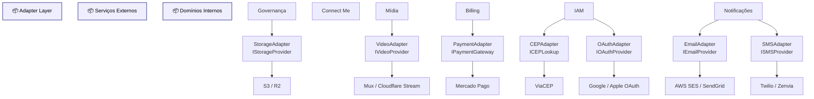

# Adapter Layer

Diagrama original do cliente convertido de `.canvas` (Obsidian Canvas) para Mermaid. **Visão visual** dos fluxos/arquitetura; conteúdo canônico vive em [[../04-requirements/_moc]] + [[../02-architecture/_moc]].

## Diagrama

## Nodes (23)

- **[GROUP]** `g_adapter` — Adapter Layer
- **[GROUP]** `g_ext` — Serviços Externos
- **[GROUP]** `g_internal` — Domínios Internos
- `n_gov` — Governança
- `n_cm` — Connect Me
- `n_media` — Mídia
- `n_bill` — Billing
- `n_auth` — IAM
- `n_notif` — Notificações
- `n_av` — VideoAdapter · `IVideoProvider`
- `n_ap` — PaymentAdapter · `IPaymentGateway`
- `n_ae` — EmailAdapter · `IEmailProvider`
- `n_as` — SMSAdapter · `ISMSProvider`
- `n_ast` — StorageAdapter · `IStorageProvider`
- `n_ac` — CEPAdapter · `ICEPLookup`
- `n_ao` — OAuthAdapter · `IOAuthProvider`
- `n_mux` — Mux / Cloudflare Stream
- `n_mp` — Mercado Pago
- `n_ses` — AWS SES / SendGrid
- `n_twi` — Twilio / Zenvia
- `n_s3` — S3 / R2
- `n_cep` — ViaCEP
- `n_oauth` — Google / Apple OAuth

## Edges (14)

- `n_media` → `n_av`
- `n_av` → `n_mux`
- `n_bill` → `n_ap`
- `n_ap` → `n_mp`
- `n_notif` → `n_ae`
- `n_ae` → `n_ses`
- `n_notif` → `n_as`
- `n_as` → `n_twi`
- `n_gov` → `n_ast`
- `n_ast` → `n_s3`
- `n_auth` → `n_ac`
- `n_ac` → `n_cep`
- `n_auth` → `n_ao`
- `n_ao` → `n_oauth`

## Links

- [[_moc]] — índice dos canvas do cliente
- [[../CLAUDE]] — contrato do projeto
- [[../02-architecture/_moc]]
- [[../04-requirements/_moc]]