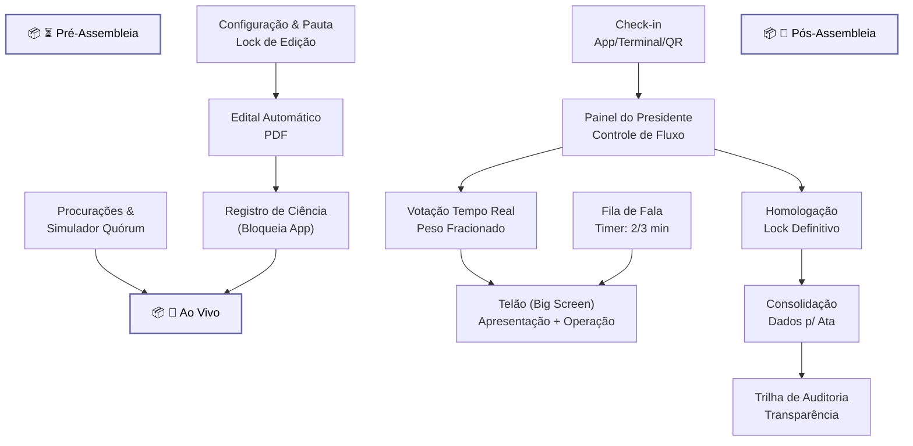

# Arquitetura Assembleia

Diagrama original do cliente convertido de `.canvas` (Obsidian Canvas) para Mermaid. **Visão visual** dos fluxos/arquitetura; conteúdo canônico vive em [[../04-requirements/_moc]] + [[../02-architecture/_moc]].

## Diagrama

## Nodes (15)

- **[GROUP]** `g_pre` — ⏳ Pré-Assembleia
- `CONF` — Configuração & Pauta · Lock de Edição
- `EDITAL` — Edital Automático · PDF
- `CIENCIA` — Registro de Ciência · (Bloqueia App)
- `PROX` — Procurações & · Simulador Quórum
- **[GROUP]** `g_live` — 🔴 Ao Vivo
- `CHECK` — Check-in · App/Terminal/QR
- `PRES` — Painel do Presidente · Controle de Fluxo
- `TELAO` — Telão (Big Screen) · Apresentação + Operação
- `VOZ` — Fila de Fala · Timer: 2/3 min
- `VOTO` — Votação Tempo Real · Peso Fracionado
- **[GROUP]** `g_post` — 📜 Pós-Assembleia
- `HOMOLOG` — Homologação · Lock Definitivo
- `ATA` — Consolidação · Dados p/ Ata
- `AUDIT` — Trilha de Auditoria · Transparência

## Edges (11)

- `CONF` → `EDITAL`
- `EDITAL` → `CIENCIA`
- `PROX` → `g_live`
- `CIENCIA` → `g_live`
- `CHECK` → `PRES`
- `PRES` → `VOTO`
- `VOTO` → `TELAO`
- `VOZ` → `TELAO`
- `PRES` → `HOMOLOG`
- `HOMOLOG` → `ATA`
- `ATA` → `AUDIT`

## Links

- [[_moc]] — índice dos canvas do cliente
- [[../CLAUDE]] — contrato do projeto
- [[../02-architecture/_moc]]
- [[../04-requirements/_moc]]