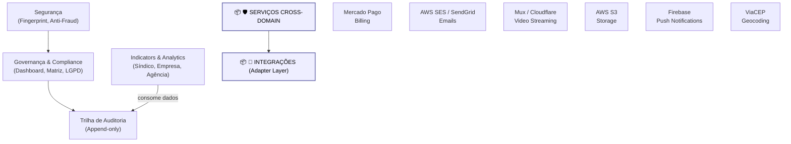

# Arquitetura Horizontal

Diagrama original do cliente convertido de `.canvas` (Obsidian Canvas) para Mermaid. **Visão visual** dos fluxos/arquitetura; conteúdo canônico vive em [[../04-requirements/_moc]] + [[../02-architecture/_moc]].

## Diagrama

## Nodes (12)

- **[GROUP]** `g_cross` — 🛡️ SERVIÇOS CROSS-DOMAIN
- `COMP` — Governança & Compliance · (Dashboard, Matriz, LGPD)
- `AUDIT` — Trilha de Auditoria · (Append-only)
- `DASH` — Indicators & Analytics · (Síndico, Empresa, Agência)
- `SEC` — Segurança · (Fingerprint, Anti-Fraud)
- **[GROUP]** `g_ext` — 🔌 INTEGRAÇÕES (Adapter Layer)
- `MP` — Mercado Pago · Billing
- `SES` — AWS SES / SendGrid · Emails
- `MUX` — Mux / Cloudflare · Video Streaming
- `S3` — AWS S3 · Storage
- `FIRE` — Firebase · Push Notifications
- `CEP` — ViaCEP · Geocoding

## Edges (4)

- `COMP` → `AUDIT`
- `DASH` → `AUDIT` — _consome dados_
- `SEC` → `COMP`
- `g_cross` → `g_ext`

## Links

- [[_moc]] — índice dos canvas do cliente
- [[../CLAUDE]] — contrato do projeto
- [[../02-architecture/_moc]]
- [[../04-requirements/_moc]]