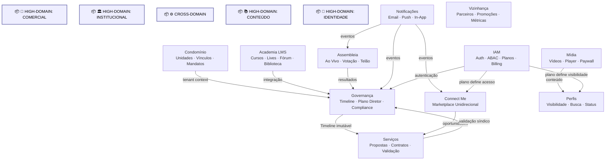

# Arquitetura de Domínios

Diagrama original do cliente convertido de `.canvas` (Obsidian Canvas) para Mermaid. **Visão visual** dos fluxos/arquitetura; conteúdo canônico vive em [[../04-requirements/_moc]] + [[../02-architecture/_moc]].

## Diagrama

## Nodes (16)

- **[GROUP]** `group_com` — 💼 HIGH-DOMAIN: COMERCIAL
- **[GROUP]** `group_inst` — 🏛️ HIGH-DOMAIN: INSTITUCIONAL
- **[GROUP]** `group_cross` — ⚙️ CROSS-DOMAIN
- **[GROUP]** `group_cont` — 📚 HIGH-DOMAIN: CONTEÚDO
- **[GROUP]** `group_id` — 🔐 HIGH-DOMAIN: IDENTIDADE
- `node_iam` — **IAM** · Auth · ABAC · Planos · Billing
- `node_assembly` — **Assembleia** · Ao Vivo · Votação · Telão
- `node_notify` — **Notificações** · Email · Push · In-App
- `node_condo` — **Condomínio** · Unidades · Vínculos · Mandatos
- `node_viz` — **Vizinhança** · Parceiros · Promoções · Métricas
- `node_media` — **Mídia** · Vídeos · Player · Paywall
- `node_lms` — **Academia LMS** · Cursos · Lives · Fórum · Biblioteca
- `node_gov` — **Governança** · Timeline · Plano Diretor · Compliance
- `node_connect` — **Connect Me** · Marketplace Unidirecional
- `node_profile` — **Perfis** · Visibilidade · Busca · Status
- `node_service` — **Serviços** · Propostas · Contratos · Validação

## Edges (13)

- `node_condo` → `node_gov` — _tenant context_
- `node_gov` → `node_service` — _Timeline imutável_
- `node_connect` → `node_service` — _oportunidades_
- `node_service` → `node_gov` — _validação síndico_
- `node_media` → `node_profile` — _conteúdo_
- `node_lms` → `node_gov` — _integração_
- `node_assembly` → `node_gov` — _resultados_
- `node_notify` → `node_gov` — _eventos_
- `node_notify` → `node_connect` — _eventos_
- `node_notify` → `node_assembly` — _eventos_
- `node_iam` → `node_gov` — _autenticação_
- `node_iam` → `node_connect` — _plano define acesso_
- `node_iam` → `node_profile` — _plano define visibilidade_

## Links

- [[_moc]] — índice dos canvas do cliente
- [[../CLAUDE]] — contrato do projeto
- [[../02-architecture/_moc]]
- [[../04-requirements/_moc]]