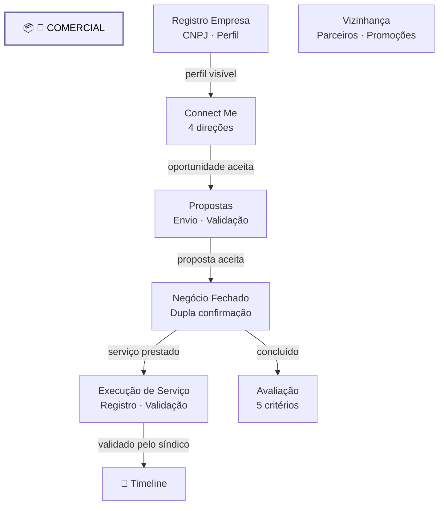

# Dominio Comercial

Diagrama original do cliente convertido de `.canvas` (Obsidian Canvas) para Mermaid. **Visão visual** dos fluxos/arquitetura; conteúdo canônico vive em [[../04-requirements/_moc]] + [[../02-architecture/_moc]].

## Diagrama

## Nodes (9)

- **[GROUP]** `g_com` — 💼 COMERCIAL
- `REG` — Registro Empresa · CNPJ · Perfil
- `CM` — Connect Me · 4 direções
- `PROP` — Propostas · Envio · Validação
- `DEAL` — Negócio Fechado · Dupla confirmação
- `EXEC` — Execução de Serviço · Registro · Validação
- `EVAL` — Avaliação · 5 critérios
- `VIZ` — Vizinhança · Parceiros · Promoções
- `TIMELINE` — 📜 Timeline

## Edges (6)

- `CM` → `PROP` — _oportunidade aceita_
- `PROP` → `DEAL` — _proposta aceita_
- `DEAL` → `EXEC` — _serviço prestado_
- `EXEC` → `TIMELINE` — _validado pelo síndico_
- `DEAL` → `EVAL` — _concluído_
- `REG` → `CM` — _perfil visível_

## Links

- [[_moc]] — índice dos canvas do cliente
- [[../CLAUDE]] — contrato do projeto
- [[../02-architecture/_moc]]
- [[../04-requirements/_moc]]