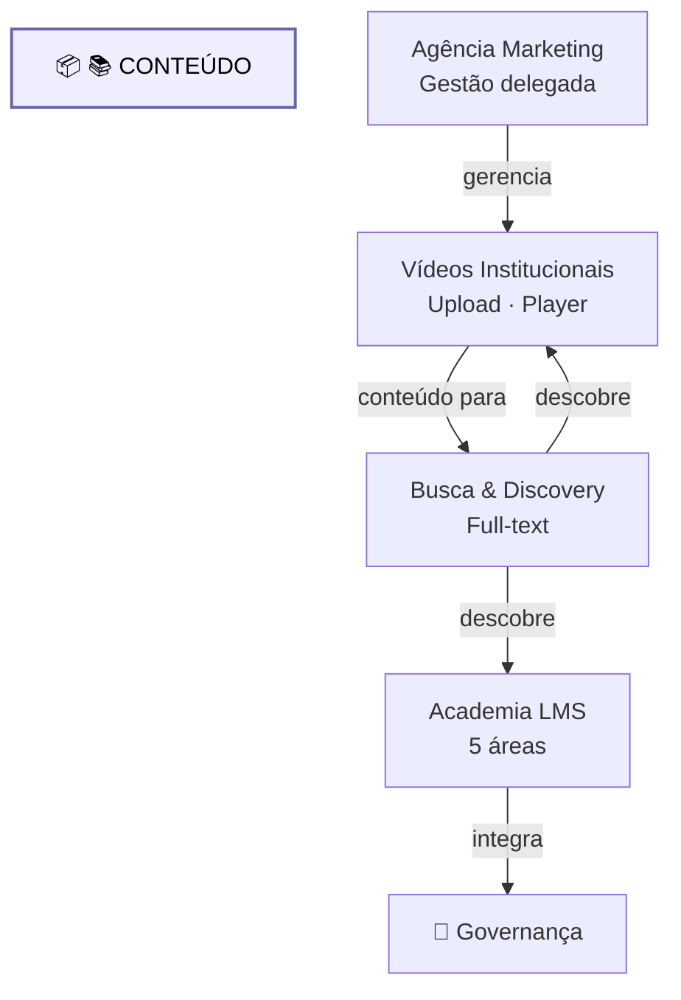

# Dominio Conteudo

Diagrama original do cliente convertido de `.canvas` (Obsidian Canvas) para Mermaid. **Visão visual** dos fluxos/arquitetura; conteúdo canônico vive em [[../04-requirements/_moc]] + [[../02-architecture/_moc]].

## Diagrama

## Nodes (6)

- **[GROUP]** `g_cont` — 📚 CONTEÚDO
- `VIDEO` — Vídeos Institucionais · Upload · Player
- `AGENCY` — Agência Marketing · Gestão delegada
- `SEARCH` — Busca & Discovery · Full-text
- `LMS` — Academia LMS · 5 áreas
- `GOV` — 📜 Governança

## Edges (5)

- `VIDEO` → `SEARCH` — _conteúdo para_
- `AGENCY` → `VIDEO` — _gerencia_
- `SEARCH` → `VIDEO` — _descobre_
- `SEARCH` → `LMS` — _descobre_
- `LMS` → `GOV` — _integra_

## Links

- [[_moc]] — índice dos canvas do cliente
- [[../CLAUDE]] — contrato do projeto
- [[../02-architecture/_moc]]
- [[../04-requirements/_moc]]