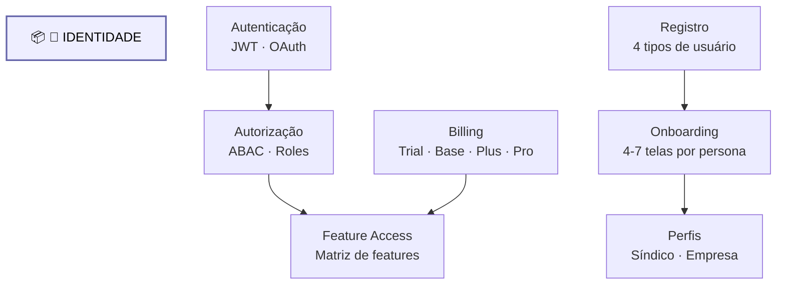

# Dominio Identidade

Diagrama original do cliente convertido de `.canvas` (Obsidian Canvas) para Mermaid. **Visão visual** dos fluxos/arquitetura; conteúdo canônico vive em [[../04-requirements/_moc]] + [[../02-architecture/_moc]].

## Diagrama

## Nodes (8)

- **[GROUP]** `g_id` — 🔐 IDENTIDADE
- `AUTH` — Autenticação · JWT · OAuth
- `ABAC` — Autorização · ABAC · Roles
- `REG` — Registro · 4 tipos de usuário
- `ONBOARD` — Onboarding · 4-7 telas por persona
- `BILLING` — Billing · Trial · Base · Plus · Pro
- `FEATURE` — Feature Access · Matriz de features
- `PROFILE` — Perfis · Síndico · Empresa

## Edges (5)

- `AUTH` → `ABAC`
- `ABAC` → `FEATURE`
- `REG` → `ONBOARD`
- `ONBOARD` → `PROFILE`
- `BILLING` → `FEATURE`

## Links

- [[_moc]] — índice dos canvas do cliente
- [[../CLAUDE]] — contrato do projeto
- [[../02-architecture/_moc]]
- [[../04-requirements/_moc]]