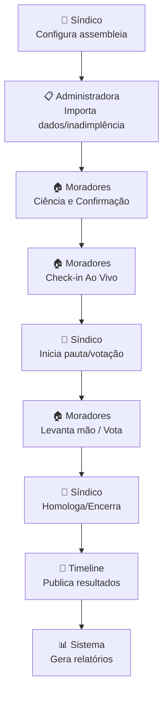

# Fluxo Assembleia Ao Vivo

Diagrama original do cliente convertido de `.canvas` (Obsidian Canvas) para Mermaid. **Visão visual** dos fluxos/arquitetura; conteúdo canônico vive em [[../04-requirements/_moc]] + [[../02-architecture/_moc]].

## Diagrama

## Nodes (9)

- `S1` — 👔 Síndico · Configura assembleia
- `A1` — 📋 Administradora · Importa dados/inadimplência
- `M1` — 🏠 Moradores · Ciência e Confirmação
- `M2` — 🏠 Moradores · Check-in Ao Vivo
- `S2` — 👔 Síndico · Inicia pauta/votação
- `M3` — 🏠 Moradores · Levanta mão / Vota
- `S3` — 👔 Síndico · Homologa/Encerra
- `T1` — 📜 Timeline · Publica resultados
- `R1` — 📊 Sistema · Gera relatórios

## Edges (8)

- `S1` → `A1`
- `A1` → `M1`
- `M1` → `M2`
- `M2` → `S2`
- `S2` → `M3`
- `M3` → `S3`
- `S3` → `T1`
- `T1` → `R1`

## Links

- [[_moc]] — índice dos canvas do cliente
- [[../CLAUDE]] — contrato do projeto
- [[../02-architecture/_moc]]
- [[../04-requirements/_moc]]