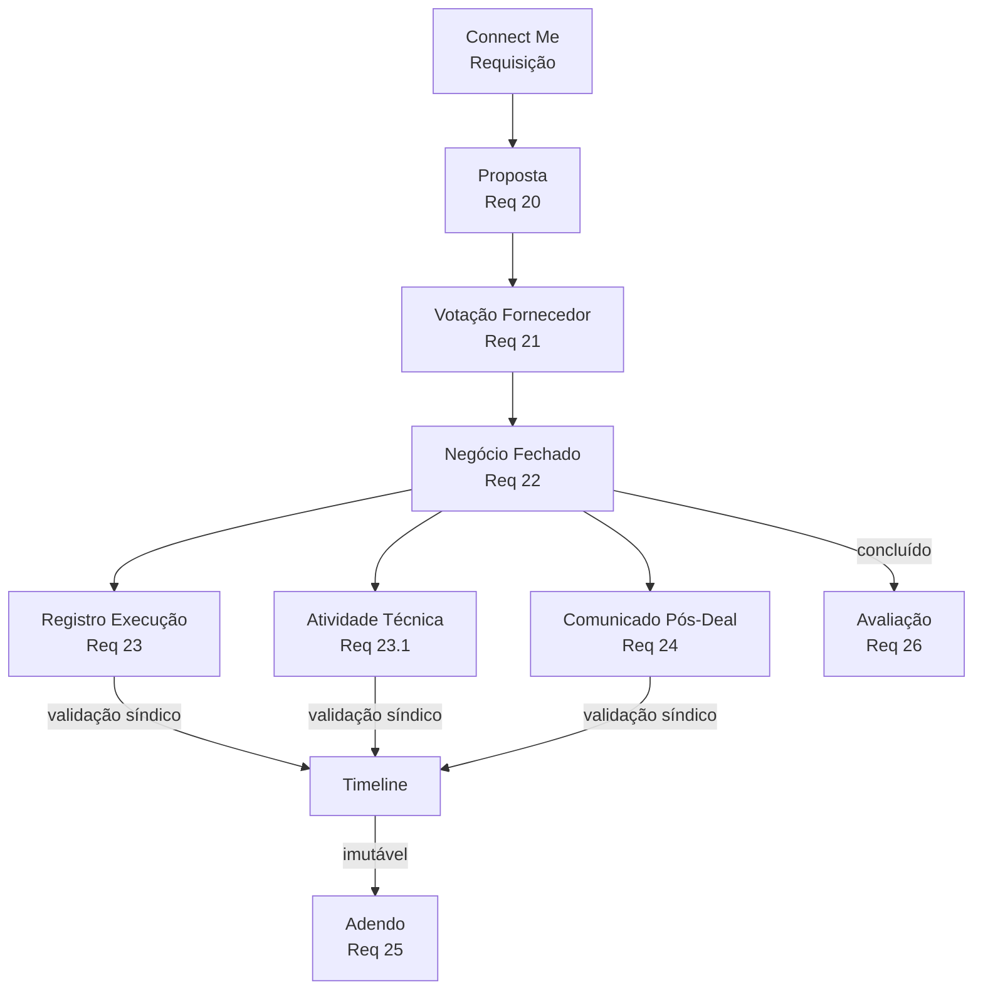

# Fluxo Ciclo Servico

Diagrama original do cliente convertido de `.canvas` (Obsidian Canvas) para Mermaid. **Visão visual** dos fluxos/arquitetura; conteúdo canônico vive em [[../04-requirements/_moc]] + [[../02-architecture/_moc]].

## Diagrama

## Nodes (10)

- `CM` — Connect Me · Requisição
- `PROP` — Proposta · Req 20
- `VOTE` — Votação Fornecedor · Req 21
- `DEAL` — Negócio Fechado · Req 22
- `EXEC` — Registro Execução · Req 23
- `TECH` — Atividade Técnica · Req 23.1
- `COM` — Comunicado Pós-Deal · Req 24
- `EVAL` — Avaliação · Req 26
- `ADENDO` — Adendo · Req 25
- `TL` — Timeline

## Edges (11)

- `CM` → `PROP`
- `PROP` → `VOTE`
- `VOTE` → `DEAL`
- `DEAL` → `EXEC`
- `DEAL` → `TECH`
- `DEAL` → `COM`
- `EXEC` → `TL` — _validação síndico_
- `TECH` → `TL` — _validação síndico_
- `COM` → `TL` — _validação síndico_
- `TL` → `ADENDO` — _imutável_
- `DEAL` → `EVAL` — _concluído_

## Links

- [[_moc]] — índice dos canvas do cliente
- [[../CLAUDE]] — contrato do projeto
- [[../02-architecture/_moc]]
- [[../04-requirements/_moc]]