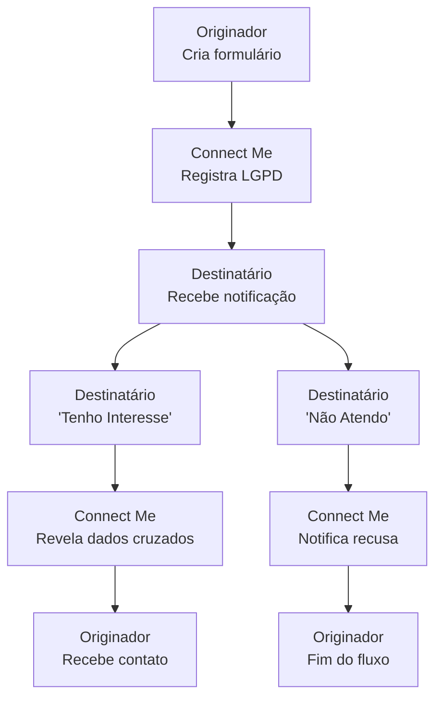

# Fluxo Connect Me

Diagrama original do cliente convertido de `.canvas` (Obsidian Canvas) para Mermaid. **Visão visual** dos fluxos/arquitetura; conteúdo canônico vive em [[../04-requirements/_moc]] + [[../02-architecture/_moc]].

## Diagrama

## Nodes (9)

- `O1` — Originador · Cria formulário
- `CM1` — Connect Me · Registra LGPD
- `D1` — Destinatário · Recebe notificação
- `D2` — Destinatário · 'Tenho Interesse'
- `CM2` — Connect Me · Revela dados cruzados
- `O2` — Originador · Recebe contato
- `D3` — Destinatário · 'Não Atendo'
- `CM3` — Connect Me · Notifica recusa
- `O3` — Originador · Fim do fluxo

## Edges (8)

- `O1` → `CM1`
- `CM1` → `D1`
- `D1` → `D2`
- `D2` → `CM2`
- `CM2` → `O2`
- `D1` → `D3`
- `D3` → `CM3`
- `CM3` → `O3`

## Links

- [[_moc]] — índice dos canvas do cliente
- [[../CLAUDE]] — contrato do projeto
- [[../02-architecture/_moc]]
- [[../04-requirements/_moc]]