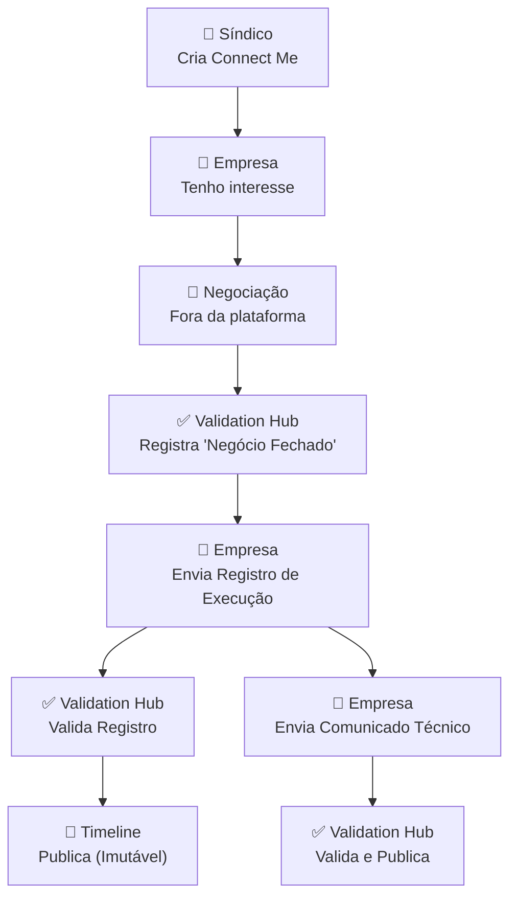

# Fluxo Contratacao

Diagrama original do cliente convertido de `.canvas` (Obsidian Canvas) para Mermaid. **Visão visual** dos fluxos/arquitetura; conteúdo canônico vive em [[../04-requirements/_moc]] + [[../02-architecture/_moc]].

## Diagrama

## Nodes (9)

- `S1` — 👔 Síndico · Cria Connect Me
- `E1` — 🏢 Empresa · Tenho interesse
- `N1` — 🤝 Negociação · Fora da plataforma
- `S2` — ✅ Validation Hub · Registra 'Negócio Fechado'
- `E2` — 🏢 Empresa · Envia Registro de Execução
- `S3` — ✅ Validation Hub · Valida Registro
- `T1` — 📜 Timeline · Publica (Imutável)
- `E3` — 🏢 Empresa · Envia Comunicado Técnico
- `S4` — ✅ Validation Hub · Valida e Publica

## Edges (8)

- `S1` → `E1`
- `E1` → `N1`
- `N1` → `S2`
- `S2` → `E2`
- `E2` → `S3`
- `S3` → `T1`
- `E2` → `E3`
- `E3` → `S4`

## Links

- [[_moc]] — índice dos canvas do cliente
- [[../CLAUDE]] — contrato do projeto
- [[../02-architecture/_moc]]
- [[../04-requirements/_moc]]