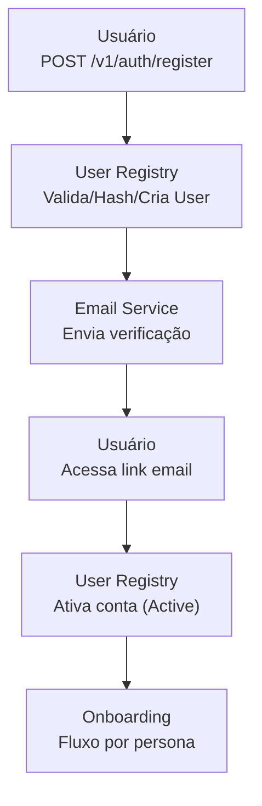

# Fluxo Registro

Diagrama original do cliente convertido de `.canvas` (Obsidian Canvas) para Mermaid. **Visão visual** dos fluxos/arquitetura; conteúdo canônico vive em [[../04-requirements/_moc]] + [[../02-architecture/_moc]].

## Diagrama

## Nodes (6)

- `U1` — Usuário · POST /v1/auth/register
- `R1` — User Registry · Valida/Hash/Cria User
- `E1` — Email Service · Envia verificação
- `U2` — Usuário · Acessa link email
- `R2` — User Registry · Ativa conta (Active)
- `O1` — Onboarding · Fluxo por persona

## Edges (5)

- `U1` → `R1`
- `R1` → `E1`
- `E1` → `U2`
- `U2` → `R2`
- `R2` → `O1`

## Links

- [[_moc]] — índice dos canvas do cliente
- [[../CLAUDE]] — contrato do projeto
- [[../02-architecture/_moc]]
- [[../04-requirements/_moc]]