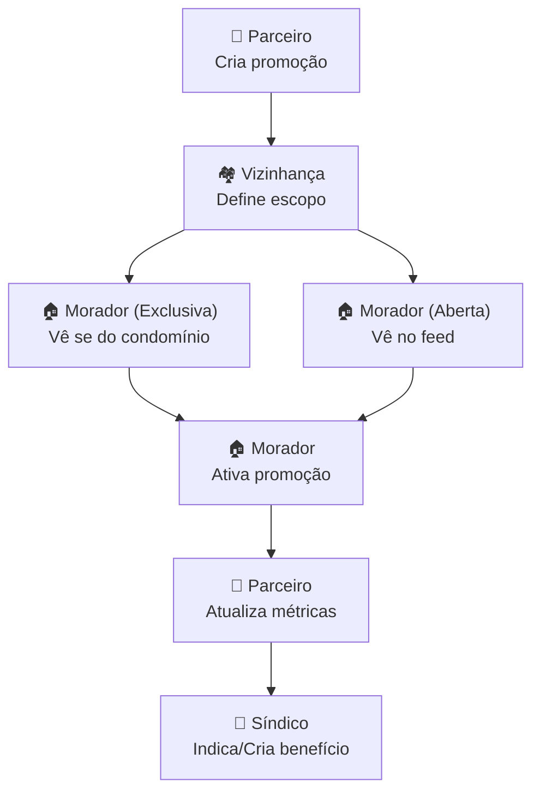

# Fluxo Vizinhanca

Diagrama original do cliente convertido de `.canvas` (Obsidian Canvas) para Mermaid. **Visão visual** dos fluxos/arquitetura; conteúdo canônico vive em [[../04-requirements/_moc]] + [[../02-architecture/_moc]].

## Diagrama

## Nodes (7)

- `PV1` — 🏪 Parceiro · Cria promoção
- `VZ1` — 🏘️ Vizinhança · Define escopo
- `M1` — 🏠 Morador (Aberta) · Vê no feed
- `M2` — 🏠 Morador (Exclusiva) · Vê se do condomínio
- `M3` — 🏠 Morador · Ativa promoção
- `PV2` — 🏪 Parceiro · Atualiza métricas
- `S1` — 👔 Síndico · Indica/Cria benefício

## Edges (7)

- `PV1` → `VZ1`
- `VZ1` → `M1`
- `VZ1` → `M2`
- `M2` → `M3`
- `M1` → `M3`
- `M3` → `PV2`
- `PV2` → `S1`

## Links

- [[_moc]] — índice dos canvas do cliente
- [[../CLAUDE]] — contrato do projeto
- [[../02-architecture/_moc]]
- [[../04-requirements/_moc]]