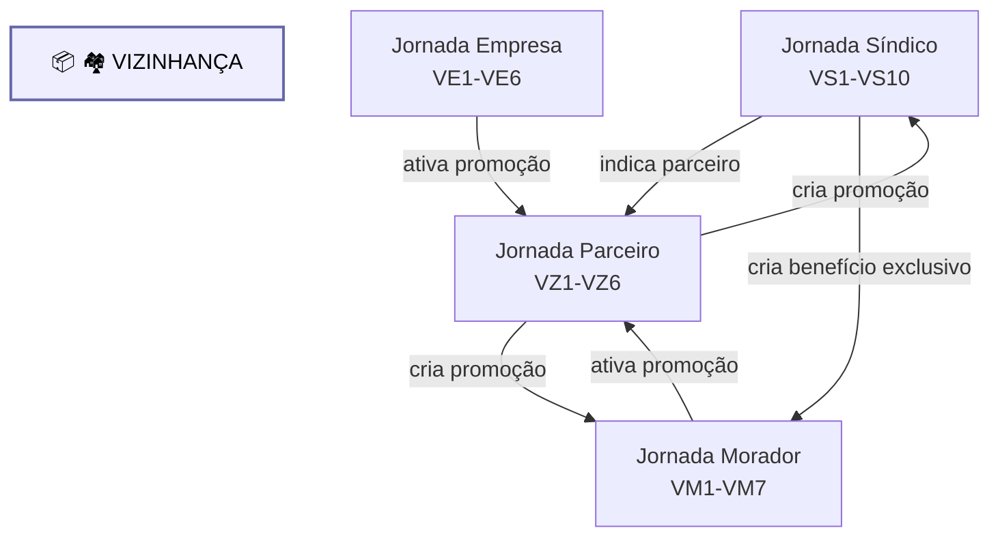

# Jornadas Vizinhanca

Diagrama original do cliente convertido de `.canvas` (Obsidian Canvas) para Mermaid. **Visão visual** dos fluxos/arquitetura; conteúdo canônico vive em [[../04-requirements/_moc]] + [[../02-architecture/_moc]].

## Diagrama

## Nodes (5)

- **[GROUP]** `g_viz` — 🏘️ VIZINHANÇA
- `VS` — Jornada Síndico · VS1-VS10
- `VZ` — Jornada Parceiro · VZ1-VZ6
- `VE` — Jornada Empresa · VE1-VE6
- `VM` — Jornada Morador · VM1-VM7

## Edges (6)

- `VZ` → `VS` — _cria promoção_
- `VZ` → `VM` — _cria promoção_
- `VS` → `VZ` — _indica parceiro_
- `VE` → `VZ` — _ativa promoção_
- `VM` → `VZ` — _ativa promoção_
- `VS` → `VM` — _cria benefício exclusivo_

## Links

- [[_moc]] — índice dos canvas do cliente
- [[../CLAUDE]] — contrato do projeto
- [[../02-architecture/_moc]]
- [[../04-requirements/_moc]]