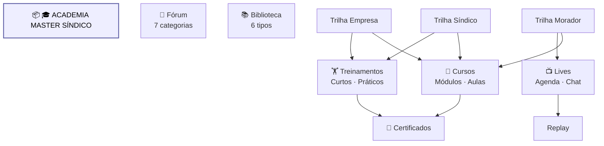

# Mapa Academia

Diagrama original do cliente convertido de `.canvas` (Obsidian Canvas) para Mermaid. **Visão visual** dos fluxos/arquitetura; conteúdo canônico vive em [[../04-requirements/_moc]] + [[../02-architecture/_moc]].

## Diagrama

## Nodes (11)

- **[GROUP]** `g_lms` — 🎓 ACADEMIA MASTER SÍNDICO
- `CURSOS` — 📖 Cursos · Módulos · Aulas
- `TREINA` — 🏋️ Treinamentos · Curtos · Práticos
- `LIVES` — 📺 Lives · Agenda · Chat
- `FORUM` — 💬 Fórum · 7 categorias
- `BIBLIO` — 📚 Biblioteca · 6 tipos
- `TRILHA_S` — Trilha Síndico
- `TRILHA_E` — Trilha Empresa
- `TRILHA_M` — Trilha Morador
- `CERT` — 📜 Certificados
- `REPLAY` — Replay

## Edges (9)

- `TRILHA_S` → `CURSOS`
- `TRILHA_S` → `TREINA`
- `TRILHA_E` → `CURSOS`
- `TRILHA_E` → `TREINA`
- `TRILHA_M` → `CURSOS`
- `TRILHA_M` → `LIVES`
- `CURSOS` → `CERT`
- `TREINA` → `CERT`
- `LIVES` → `REPLAY`

## Links

- [[_moc]] — índice dos canvas do cliente
- [[../CLAUDE]] — contrato do projeto
- [[../02-architecture/_moc]]
- [[../04-requirements/_moc]]