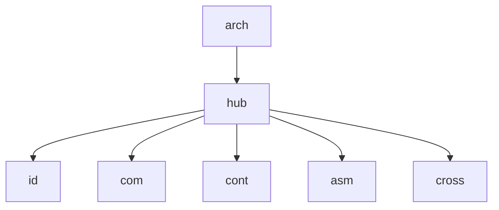

# Master Canvas

Diagrama original do cliente convertido de `.canvas` (Obsidian Canvas) para Mermaid. **Visão visual** dos fluxos/arquitetura; conteúdo canônico vive em [[../04-requirements/_moc]] + [[../02-architecture/_moc]].

## Diagrama

## Nodes (7)

- `hub` — 
- `arch` — 
- `id` — 
- `com` — 
- `cont` — 
- `asm` — 
- `cross` — 

## Edges (6)

- `hub` → `id`
- `hub` → `com`
- `hub` → `cont`
- `hub` → `asm`
- `hub` → `cross`
- `arch` → `hub`

## Links

- [[_moc]] — índice dos canvas do cliente
- [[../CLAUDE]] — contrato do projeto
- [[../02-architecture/_moc]]
- [[../04-requirements/_moc]]