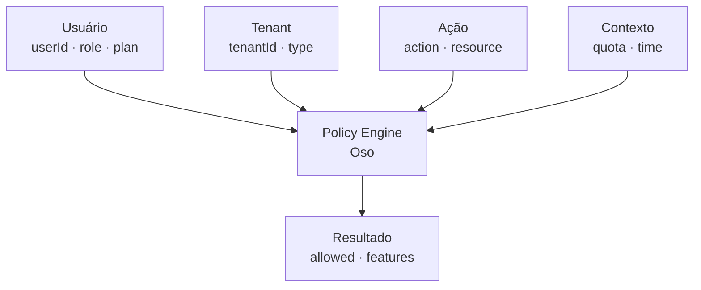

# Modelo ABAC

Diagrama original do cliente convertido de `.canvas` (Obsidian Canvas) para Mermaid. **Visão visual** dos fluxos/arquitetura; conteúdo canônico vive em [[../04-requirements/_moc]] + [[../02-architecture/_moc]].

## Diagrama

## Nodes (6)

- `U` — Usuário · userId · role · plan
- `T` — Tenant · tenantId · type
- `A` — Ação · action · resource
- `C` — Contexto · quota · time
- `P` — Policy Engine · Oso
- `R` — Resultado · allowed · features

## Edges (5)

- `U` → `P`
- `T` → `P`
- `A` → `P`
- `C` → `P`
- `P` → `R`

## Links

- [[_moc]] — índice dos canvas do cliente
- [[../CLAUDE]] — contrato do projeto
- [[../02-architecture/_moc]]
- [[../04-requirements/_moc]]