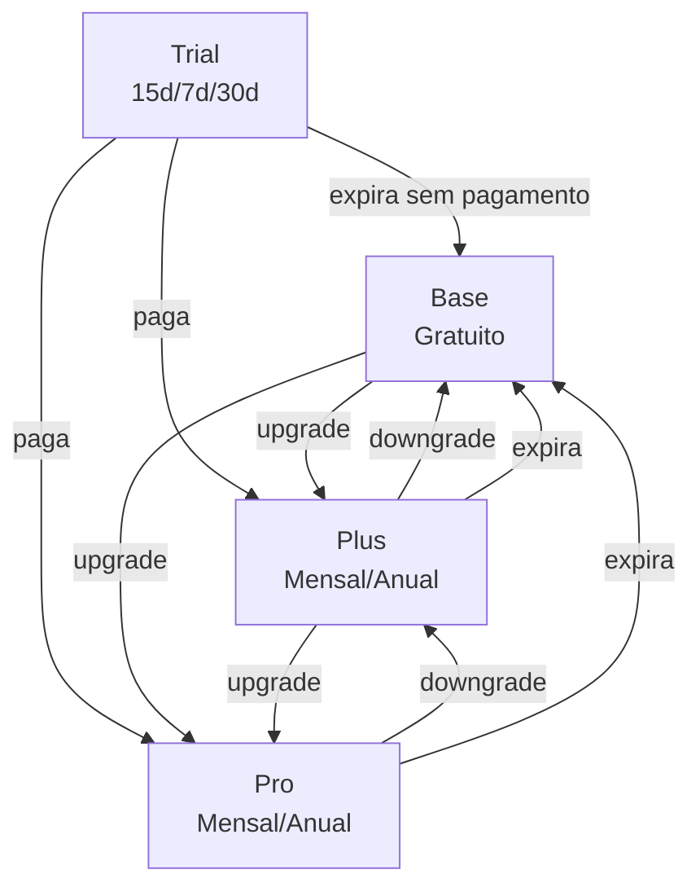

# Modelo Planos

Diagrama original do cliente convertido de `.canvas` (Obsidian Canvas) para Mermaid. **Visão visual** dos fluxos/arquitetura; conteúdo canônico vive em [[../04-requirements/_moc]] + [[../02-architecture/_moc]].

## Diagrama

## Nodes (4)

- `B` — Base · Gratuito
- `PRO` — Pro · Mensal/Anual
- `T` — Trial · 15d/7d/30d
- `PLUS` — Plus · Mensal/Anual

## Edges (10)

- `T` → `B` — _expira sem pagamento_
- `T` → `PLUS` — _paga_
- `T` → `PRO` — _paga_
- `B` → `PLUS` — _upgrade_
- `B` → `PRO` — _upgrade_
- `PLUS` → `PRO` — _upgrade_
- `PRO` → `PLUS` — _downgrade_
- `PLUS` → `B` — _downgrade_
- `PRO` → `B` — _expira_
- `PLUS` → `B` — _expira_

## Links

- [[_moc]] — índice dos canvas do cliente
- [[../CLAUDE]] — contrato do projeto
- [[../02-architecture/_moc]]
- [[../04-requirements/_moc]]