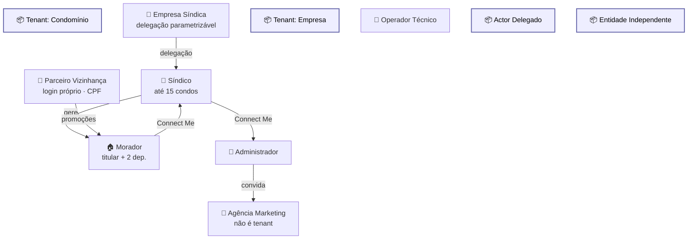

# Modelo de Tenants

Diagrama original do cliente convertido de `.canvas` (Obsidian Canvas) para Mermaid. **Visão visual** dos fluxos/arquitetura; conteúdo canônico vive em [[../04-requirements/_moc]] + [[../02-architecture/_moc]].

## Diagrama

## Nodes (11)

- **[GROUP]** `g_tc` — Tenant: Condomínio
- `S` — 👔 Síndico · até 15 condos
- `M` — 🏠 Morador · titular + 2 dep.
- `ES` — 🏢 Empresa Síndica · delegação parametrizável
- **[GROUP]** `g_te` — Tenant: Empresa
- `EA` — 👤 Administrador
- `EO` — 🔧 Operador Técnico
- **[GROUP]** `g_ad` — Actor Delegado
- `AG` — 📸 Agência Marketing · não é tenant
- **[GROUP]** `g_ei` — Entidade Independente
- `PV` — 🏪 Parceiro Vizinhança · login próprio · CPF

## Edges (6)

- `S` → `M` — _gere_
- `ES` → `S` — _delegação_
- `EA` → `AG` — _convida_
- `S` → `EA` — _Connect Me_
- `M` → `S` — _Connect Me_
- `PV` → `M` — _promoções_

## Links

- [[_moc]] — índice dos canvas do cliente
- [[../CLAUDE]] — contrato do projeto
- [[../02-architecture/_moc]]
- [[../04-requirements/_moc]]