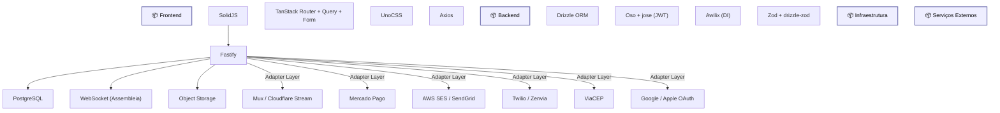

# Stack Tecnologica

Diagrama original do cliente convertido de `.canvas` (Obsidian Canvas) para Mermaid. **Visão visual** dos fluxos/arquitetura; conteúdo canônico vive em [[../04-requirements/_moc]] + [[../02-architecture/_moc]].

## Diagrama

## Nodes (22)

- **[GROUP]** `g_front` — Frontend
- `SOLID` — SolidJS
- `TANSTACK` — TanStack Router + Query + Form
- `UNO` — UnoCSS
- `AXIOS` — Axios
- **[GROUP]** `g_back` — Backend
- `FASTIFY` — Fastify
- `DRIZZLE` — Drizzle ORM
- `OSO` — Oso + jose (JWT)
- `AWILIX` — Awilix (DI)
- `ZOD` — Zod + drizzle-zod
- **[GROUP]** `g_infra` — Infraestrutura
- `PG` — PostgreSQL
- `WS` — WebSocket (Assembleia)
- `S3` — Object Storage
- **[GROUP]** `g_ext` — Serviços Externos
- `MUX` — Mux / Cloudflare Stream
- `MP` — Mercado Pago
- `SES` — AWS SES / SendGrid
- `SMS` — Twilio / Zenvia
- `CEP` — ViaCEP
- `OAUTH` — Google / Apple OAuth

## Edges (10)

- `SOLID` → `FASTIFY`
- `FASTIFY` → `PG`
- `FASTIFY` → `WS`
- `FASTIFY` → `S3`
- `FASTIFY` → `MUX` — _Adapter Layer_
- `FASTIFY` → `MP` — _Adapter Layer_
- `FASTIFY` → `SES` — _Adapter Layer_
- `FASTIFY` → `SMS` — _Adapter Layer_
- `FASTIFY` → `CEP` — _Adapter Layer_
- `FASTIFY` → `OAUTH` — _Adapter Layer_

## Links

- [[_moc]] — índice dos canvas do cliente
- [[../CLAUDE]] — contrato do projeto
- [[../02-architecture/_moc]]
- [[../04-requirements/_moc]]