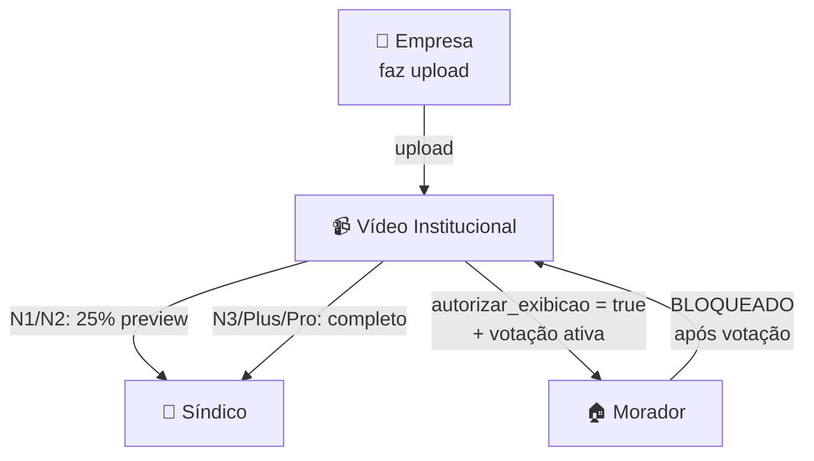

# Visibilidade Videos

Diagrama original do cliente convertido de `.canvas` (Obsidian Canvas) para Mermaid. **Visão visual** dos fluxos/arquitetura; conteúdo canônico vive em [[../04-requirements/_moc]] + [[../02-architecture/_moc]].

## Diagrama

## Nodes (4)

- `E` — 🏢 Empresa · faz upload
- `V` — 📹 Vídeo Institucional
- `S` — 👔 Síndico
- `M` — 🏠 Morador

## Edges (5)

- `E` → `V` — _upload_
- `V` → `S` — _N1/N2: 25% preview_
- `V` → `S` — _N3/Plus/Pro: completo_
- `V` → `M` — _autorizar_exibicao = true
+ votação ativa_
- `M` → `V` — _BLOQUEADO
após votação_

## Links

- [[_moc]] — índice dos canvas do cliente
- [[../CLAUDE]] — contrato do projeto
- [[../02-architecture/_moc]]
- [[../04-requirements/_moc]]