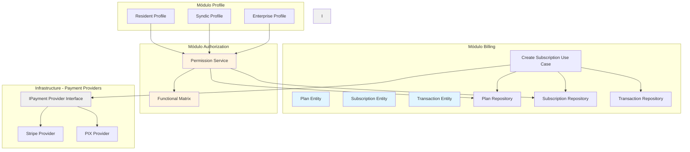

# Arquitetura Refinada - Master Síndico

## Visão Geral

Este documento apresenta a arquitetura refinada do Master Síndico, baseada nas observações sobre desacoplamento de provedores de pagamento e posicionamento do PermissionService.

## Princípios Chave

### 1. Desacoplamento de Provedores de Pagamento

**Subscription deve ser agnóstico ao provedor de pagamento.**

- `Subscription` representa o contrato de serviço com o usuário
- `Transaction` representa cada transação financeira
- `PaymentProvider` (Stripe, PIX, etc.) é apenas um canal de processamento
- O domínio de billing não deve conhecer detalhes de implementação do Stripe

### 2. PermissionService como Serviço Global

**PermissionService não deve estar acoplado a um módulo específico.**

- É um serviço de autorização usado por toda a aplicação
- Deve estar em um módulo central (`authorization` ou `core`)
- Todos os módulos dependem dele para verificar permissões

### 3. Separação de Responsabilidades

Cada módulo tem uma responsabilidade clara:
- `billing`: Gerencia pagamentos, subscriptions e transações
- `authorization`: Gerencia permissões e autorização (ABAC)
- `profile`: Gerencia perfis de usuários
- `content`: Gerencia vídeos e conteúdo
- `assembly`: Gerencia assembleias e votações
- `engagement`: Gerencia fórum, cupons e connect-me
- `lms`: Gerencia cursos e certificados

---

## Estrutura de Módulos

### Módulo Billing (Pagamentos)

**Responsabilidade**: Gerenciar pagamentos, subscriptions e transações financeiras.

#### Entidades de Domínio

```typescript
// apps/api/src/modules/billing/domain/entities/plan.entity.ts
export class Plan {
  constructor(
    private readonly id: string,
    private code: PlanCode,
    private name: string,
    private description: string,
    private price: Money,
    private billingCycle: BillingCycle,
    private features: PlanFeature[],
    private isActive: boolean,
    private readonly createdAt: Date,
    private updatedAt: Date,
  ) {}

  getCode(): PlanCode {
    return this.code;
  }

  hasFeature(feature: Feature): boolean {
    return this.features.some(f => f.code === feature.code);
  }

  deactivate(): void {
    this.isActive = false;
    this.updatedAt = new Date();
  }
}
```

```typescript
// apps/api/src/modules/billing/domain/entities/subscription.entity.ts
export class Subscription {
  constructor(
    private readonly id: string,
    private readonly userId: string,
    private planId: string,
    private status: SubscriptionStatus,
    private currentPeriodStart: Date,
    private currentPeriodEnd: Date,
    private cancelAtPeriodEnd: boolean,
    private readonly createdAt: Date,
    private updatedAt: Date,
    private canceledAt: Date | null = null,
  ) {}

  isActive(): boolean {
    return this.status === "active";
  }

  cancel(): void {
    if (this.status === "canceled") {
      throw new BusinessError("Subscription already canceled", "SUBSCRIPTION_ALREADY_CANCELED");
    }
    this.status = "canceled";
    this.canceledAt = new Date();
    this.updatedAt = new Date();
  }

  renew(): void {
    if (this.status === "canceled") {
      throw new BusinessError("Cannot renew canceled subscription", "SUBSCRIPTION_CANCELED");
    }
    this.currentPeriodEnd = this.calculateNextPeriodEnd();
    this.updatedAt = new Date();
  }
}
```

```typescript
// apps/api/src/modules/billing/domain/entities/transaction.entity.ts
export class Transaction {
  constructor(
    private readonly id: string,
    private readonly subscriptionId: string,
    private type: TransactionType,
    private amount: Money,
    private status: TransactionStatus,
    private paymentMethod: PaymentMethod,
    private provider: PaymentProvider,
    private providerTransactionId: string | null,
    private metadata: Record<string, unknown>,
    private readonly createdAt: Date,
    private updatedAt: Date,
    private completedAt: Date | null = null,
  ) {}

  complete(): void {
    if (this.status === "completed") {
      throw new BusinessError("Transaction already completed", "TRANSACTION_ALREADY_COMPLETED");
    }
    this.status = "completed";
    this.completedAt = new Date();
    this.updatedAt = new Date();
  }

  fail(reason: string): void {
    if (this.status === "completed") {
      throw new BusinessError("Cannot fail completed transaction", "TRANSACTION_ALREADY_COMPLETED");
    }
    this.status = "failed";
    this.failureReason = reason;
    this.updatedAt = new Date();
  }

  refund(amount?: number): void {
    if (this.status !== "completed") {
      throw new BusinessError("Can only refund completed transactions", "TRANSACTION_NOT_COMPLETED");
    }
    // Lógica de reembolso
  }
}
```

#### Schema do Banco de Dados

```typescript
// apps/api/src/infrastructure/database/drizzle/schema/billing/plans.ts
export const plans = pgTable("plans", {
  id: uuid("id").primaryKey().$defaultFn(() => uuidv7()),
  code: text("code").notNull().unique(),
  name: text("name").notNull(),
  description: text("description"),
  price: integer("price").notNull(),
  currency: text("currency").default("BRL").notNull(),
  billingCycle: text("billing_cycle").notNull(),
  features: jsonb("features").$type<PlanFeature[]>().notNull(),
  isActive: boolean("is_active").default(true).notNull(),
  createdAt: timestamp("created_at").$defaultFn(() => new Date()).notNull(),
  updatedAt: timestamp("updated_at").$defaultFn(() => new Date()).$onUpdate(() => new Date()).notNull(),
  deletedAt: timestamp("deleted_at"),
});
```

```typescript
// apps/api/src/infrastructure/database/drizzle/schema/billing/subscriptions.ts
export const subscriptions = pgTable("subscriptions", {
  id: uuid("id").primaryKey().$defaultFn(() => uuidv7()),
  userId: uuid("user_id").notNull().references(() => users.id, { onDelete: "cascade" }),
  planId: uuid("plan_id").notNull().references(() => plans.id, { onDelete: "restrict" }),
  status: subscriptionStatus("status").default("trial").notNull(),
  currentPeriodStart: timestamp("current_period_start").notNull(),
  currentPeriodEnd: timestamp("current_period_end").notNull(),
  cancelAtPeriodEnd: boolean("cancel_at_period_end").default(false),
  createdAt: timestamp("created_at").$defaultFn(() => new Date()).notNull(),
  updatedAt: timestamp("updated_at").$defaultFn(() => new Date()).$onUpdate(() => new Date()).notNull(),
  canceledAt: timestamp("canceled_at"),
  deletedAt: timestamp("deleted_at"),
});
```

```typescript
// apps/api/src/infrastructure/database/drizzle/schema/billing/transactions.ts
export const transactions = pgTable("transactions", {
  id: uuid("id").primaryKey().$defaultFn(() => uuidv7()),
  subscriptionId: uuid("subscription_id").notNull().references(() => subscriptions.id, { onDelete: "cascade" }),
  type: transactionType("type").notNull(),
  amount: integer("amount").notNull(),
  currency: text("currency").default("BRL").notNull(),
  status: transactionStatus("status").notNull(),
  paymentMethod: text("payment_method").notNull(),
  provider: text("provider").notNull(),
  providerTransactionId: text("provider_transaction_id"),
  metadata: jsonb("metadata").$type<Record<string, unknown>>(),
  createdAt: timestamp("created_at").$defaultFn(() => new Date()).notNull(),
  updatedAt: timestamp("updated_at").$defaultFn(() => new Date()).$onUpdate(() => new Date()).notNull(),
  completedAt: timestamp("completed_at"),
  deletedAt: timestamp("deleted_at"),
});
```

---

### Módulo Authorization (Permissões)

**Responsabilidade**: Gerenciar permissões e autorização (ABAC - Attribute-Based Access Control).

#### PermissionService (Serviço Global)

```typescript
// apps/api/src/modules/authorization/domain/services/permission.service.ts
export class PermissionService {
  constructor(
    private subscriptionRepository: ISubscriptionRepository,
    private planRepository: IPlanRepository,
    private functionalMatrix: FunctionalMatrix,
  ) {}

  async can(userId: string, feature: Feature, action: Action): Promise<boolean> {
    // 1. Buscar subscription do usuário
    const subscription = await this.subscriptionRepository.findActiveByUserId(userId);
    if (!subscription) {
      return false;
    }

    // 2. Buscar plano da subscription
    const plan = await this.planRepository.findById(subscription.getPlanId());
    if (!plan) {
      return false;
    }

    // 3. Verificar permissão na matriz funcional
    return this.functionalMatrix.hasPermission(plan.getCode(), feature, action);
  }

  async getUserPlan(userId: string): Promise<PlanCode | null> {
    const subscription = await this.subscriptionRepository.findActiveByUserId(userId);
    if (!subscription) return null;

    const plan = await this.planRepository.findById(subscription.getPlanId());
    return plan?.getCode() ?? null;
  }
}
```

#### FunctionalMatrix (Matriz Funcional)

```typescript
// apps/api/src/modules/authorization/domain/services/functional-matrix.service.ts
export class FunctionalMatrix {
  private matrix: Map<PlanCode, Map<FeatureCode, (string | number)[]>>;

  constructor() {
    this.matrix = new Map();
    this.initializeMatrix();
  }

  private initializeMatrix(): void {
    // Morador Base
    this.setPermissions("resident_base", "search", ["read"]);
    this.setPermissions("resident_base", "videos", ["read"]);
    this.setPermissions("resident_base", "enterprise_videos", ["read_preview"]);
    
    // Morador Pagante
    this.setPermissions("resident_paid", "search", ["read"]);
    this.setPermissions("resident_paid", "videos", ["read"]);
    this.setPermissions("resident_paid", "enterprise_videos", ["read"]);
    this.setPermissions("resident_paid", "connect_me", ["send", 4]);
    this.setPermissions("resident_paid", "video_curriculum", ["create"]);
    
    // Síndico N1
    this.setPermissions("syndic_n1", "search", ["read"]);
    this.setPermissions("syndic_n1", "videos", ["read", "create"]);
    this.setPermissions("syndic_n1", "assemblies", ["create", "read", "update"]);
    this.setPermissions("syndic_n1", "connect_me", ["send", 0]);
    
    // Síndico N2
    this.setPermissions("syndic_n2", "search", ["read"]);
    this.setPermissions("syndic_n2", "videos", ["read", "create"]);
    this.setPermissions("syndic_n2", "assemblies", ["create", "read", "update"]);
    this.setPermissions("syndic_n2", "connect_me", ["send", 2]);
    
    // Síndico N3
    this.setPermissions("syndic_n3", "search", ["read"]);
    this.setPermissions("syndic_n3", "videos", ["read", "create"]);
    this.setPermissions("syndic_n3", "assemblies", ["create", "read", "update"]);
    this.setPermissions("syndic_n3", "connect_me", ["send", 4]);
    
    // Empresa Plus
    this.setPermissions("enterprise_plus", "search", ["read"]);
    this.setPermissions("enterprise_plus", "videos", ["read", "create"]);
    this.setPermissions("enterprise_plus", "connect_me", ["send", 10]);
    this.setPermissions("enterprise_plus", "video_institutional", ["create"]);
    
    // Empresa Pro
    this.setPermissions("enterprise_pro", "search", ["read"]);
    this.setPermissions("enterprise_pro", "videos", ["read", "create"]);
    this.setPermissions("enterprise_pro", "connect_me", ["send", 20]);
    this.setPermissions("enterprise_pro", "video_institutional", ["create"]);
    this.setPermissions("enterprise_pro", "courses", ["create"]);
    
    // Marketing
    this.setPermissions("marketing_standard", "search", ["read"]);
    this.setPermissions("marketing_standard", "videos", ["read", "create"]);
    this.setPermissions("marketing_standard", "connect_me", ["send", 0]);
    
    // Comércio Local
    this.setPermissions("local_company_standard", "search", ["read"]);
    this.setPermissions("local_company_standard", "coupons", ["create"]);
    this.setPermissions("local_company_standard", "connect_me", ["send", 0]);
  }

  private setPermissions(
    planCode: PlanCode,
    feature: FeatureCode,
    actions: (string | number)[]
  ): void {
    if (!this.matrix.has(planCode)) {
      this.matrix.set(planCode, new Map());
    }
    this.matrix.get(planCode)!.set(feature, actions);
  }

  hasPermission(planCode: PlanCode, action: Action): boolean {
    const planPermissions = this.matrix.get(planCode);
    if (!planPermissions) return false;

    const featurePermissions = planPermissions.get(action.feature.code);
    if (!featurePermissions) return false;

    return featurePermissions.includes(action.type);
  }

  getQuota(planCode: PlanCode, feature: FeatureCode): number {
    const planPermissions = this.matrix.get(planCode);
    if (!planPermissions) return 0;

    const featurePermissions = planPermissions.get(feature);
    if (!featurePermissions) return 0;

    const lastElement = featurePermissions[featurePermissions.length - 1];
    return typeof lastElement === "number" ? lastElement : 0;
  }
}
```

---

### Provedores de Pagamento (Infrastructure)

**Responsabilidade**: Implementar integrações com provedores de pagamento externos.

#### Interface de Provedor de Pagamento

```typescript
// apps/api/src/modules/billing/infrastructure/providers/payment-provider.interface.ts
export interface IPaymentProvider {
  name: PaymentProvider;

  // Criar cliente no provedor
  createCustomer(customerData: CustomerData): Promise<Customer>;

  // Criar assinatura
  createSubscription(subscriptionData: SubscriptionData): Promise<ProviderSubscription>;

  // Cancelar assinatura
  cancelSubscription(providerSubscriptionId: string): Promise<void>;

  // Processar pagamento
  processPayment(paymentData: PaymentData): Promise<PaymentResult>;

  // Reembolsar pagamento
  refundPayment(providerTransactionId: string, amount?: number): Promise<RefundResult>;

  // Webhook verification
  verifyWebhookSignature(payload: string, signature: string): boolean;

  // Parse webhook event
  parseWebhookEvent(payload: string): WebhookEvent;
}
```

#### Implementação Stripe

```typescript
// apps/api/src/modules/billing/infrastructure/providers/stripe/stripe.provider.ts
export class StripePaymentProvider implements IPaymentProvider {
  name = "stripe" as const;

  constructor(private stripeClient: Stripe) {}

  async createCustomer(customerData: CustomerData): Promise<Customer> {
    const stripeCustomer = await this.stripeClient.customers.create({
      email: customerData.email,
      name: customerData.name,
      metadata: customerData.metadata,
    });

    return {
      id: stripeCustomer.id,
      email: stripeCustomer.email,
      name: stripeCustomer.name,
      metadata: stripeCustomer.metadata,
    };
  }

  async createSubscription(subscriptionData: SubscriptionData): Promise<ProviderSubscription> {
    const stripeSubscription = await this.stripeClient.subscriptions.create({
      customer: subscriptionData.customerId,
      items: [{ price: subscriptionData.priceId }],
      payment_behavior: "default_incomplete",
      payment_settings: { save_default_payment_method: "on_subscription" },
      expand: ["latest_invoice.payment_intent"],
    });

    return {
      id: stripeSubscription.id,
      status: this.mapStripeStatus(stripeSubscription.status),
      currentPeriodStart: new Date(stripeSubscription.current_period_start * 1000),
      currentPeriodEnd: new Date(stripeSubscription.current_period_end * 1000),
      cancelAtPeriodEnd: stripeSubscription.cancel_at_period_end,
    };
  }

  // ... outros métodos
}
```

---

### Use Cases de Billing

```typescript
// apps/api/src/modules/billing/application/use-cases/create-subscription.use-case.ts
export class CreateSubscriptionUseCase extends TransactionalUseCase<CreateSubscriptionInput, SubscriptionDto> {
  constructor(
    deps: UseCaseDependencies,
    private subscriptionRepository: ISubscriptionRepository,
    private planRepository: IPlanRepository,
    private transactionRepository: ITransactionRepository,
    private paymentProvider: IPaymentProvider,
  ) {
    super(deps);
  }

  async execute(input: CreateSubscriptionInput): Promise<SubscriptionDto> {
    return this.runInTransaction(async () => {
      // 1. Buscar plano
      const plan = await this.planRepository.findByCode(input.planCode);
      if (!plan) throw new NotFoundError("Plan not found");

      // 2. Criar cliente no provedor de pagamento
      const customer = await this.paymentProvider.createCustomer({
        email: input.email,
        name: input.name,
      });

      // 3. Criar subscription no provedor
      const providerSubscription = await this.paymentProvider.createSubscription({
        customerId: customer.id,
        priceId: input.stripePriceId,
      });

      // 4. Criar subscription no domínio
      const subscription = Subscription.create({
        id: generateId(),
        userId: input.userId,
        planId: plan.getId(),
        status: this.mapProviderStatus(providerSubscription.status),
        currentPeriodStart: providerSubscription.currentPeriodStart,
        currentPeriodEnd: providerSubscription.currentPeriodEnd,
        cancelAtPeriodEnd: providerSubscription.cancelAtPeriodEnd,
        createdAt: new Date(),
        updatedAt: new Date(),
      });

      await this.subscriptionRepository.save(subscription);

      // 5. Criar transação inicial
      const transaction = Transaction.create({
        id: generateId(),
        subscriptionId: subscription.getId(),
        type: "payment",
        amount: plan.getPrice(),
        status: "pending",
        paymentMethod: input.paymentMethod,
        provider: this.paymentProvider.name,
        providerTransactionId: providerSubscription.id,
        metadata: null,
        createdAt: new Date(),
        updatedAt: new Date(),
      });

      await this.transactionRepository.save(transaction);

      return subscription.toDto();
    });
  }
}
```

---

### Webhook Handler (Infrastructure)

```typescript
// apps/api/src/modules/billing/infrastructure/webhooks/payment-webhook.handler.ts
export class PaymentWebhookHandler {
  constructor(
    private paymentProvider: IPaymentProvider,
    private subscriptionRepository: ISubscriptionRepository,
    private transactionRepository: ITransactionRepository,
    private logger: FastifyBaseLogger,
  ) {}

  async handle(payload: string, signature: string): Promise<void> {
    // 1. Verificar assinatura do webhook
    if (!this.paymentProvider.verifyWebhookSignature(payload, signature)) {
      throw new UnauthorizedError("Invalid webhook signature");
    }

    // 2. Parse evento
    const event = this.paymentProvider.parseWebhookEvent(payload);

    // 3. Processar evento
    switch (event.type) {
      case 'customer.subscription.created':
        await this.handleSubscriptionCreated(event);
        break;
      case 'customer.subscription.updated':
        await this.handleSubscriptionUpdated(event);
        break;
      case 'customer.subscription.deleted':
        await this.handleSubscriptionDeleted(event);
        break;
      case 'invoice.payment_succeeded':
        await this.handlePaymentSucceeded(event);
        break;
      case 'invoice.payment_failed':
        await this.handlePaymentFailed(event);
        break;
      default:
        this.logger.warn(`Unhandled event type: ${event.type}`);
    }
  }

  private async handlePaymentSucceeded(event: WebhookEvent): Promise<void> {
    const invoice = event.data.object as Invoice;
    // Atualizar status da subscription para active
    // Atualizar transação para completed
  }
}
```

---

## Diagrama de Arquitetura



---

## Benefícios da Nova Arquitetura

1. **Desacoplamento de Provedores**: Subscription é agnóstico ao provedor de pagamento. Pode-se trocar Stripe por PIX ou outro provedor sem alterar o domínio.

2. **PermissionService Global**: Serviço de autorização está em um módulo central, acessível por toda a aplicação.

3. **Strategy Pattern**: Provedores de pagamento implementam uma interface comum, facilitando a troca de implementações.

4. **Single Responsibility**: Cada módulo tem uma responsabilidade clara:
   - `billing`: Gerencia pagamentos e subscriptions
   - `authorization`: Gerencia permissões e autorização
   - `profile`: Gerencia perfis de usuários

5. **Testabilidade**: É possível testar o domínio sem dependências de provedores externos.

6. **Escalabilidade**: A arquitetura permite adicionar novos provedores de pagamento sem impactar o código existente.

---

## Próximos Passos

1. Implementar o módulo `billing` com a nova arquitetura
2. Implementar o módulo `authorization` com PermissionService
3. Atualizar o módulo `profile` para usar os novos módulos
4. Implementar os provedores de pagamento (Stripe, PIX)
